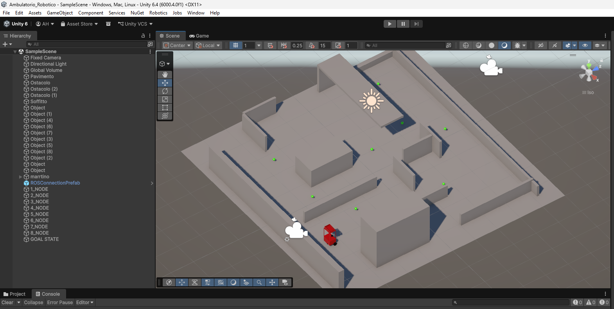
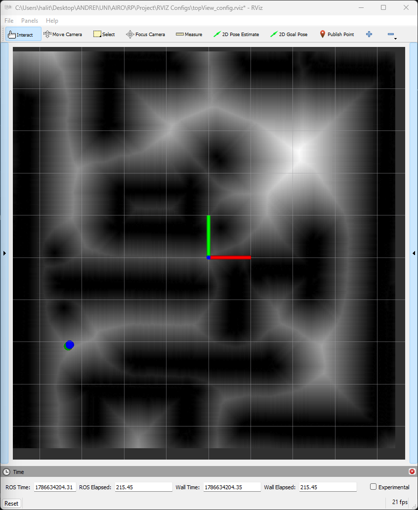
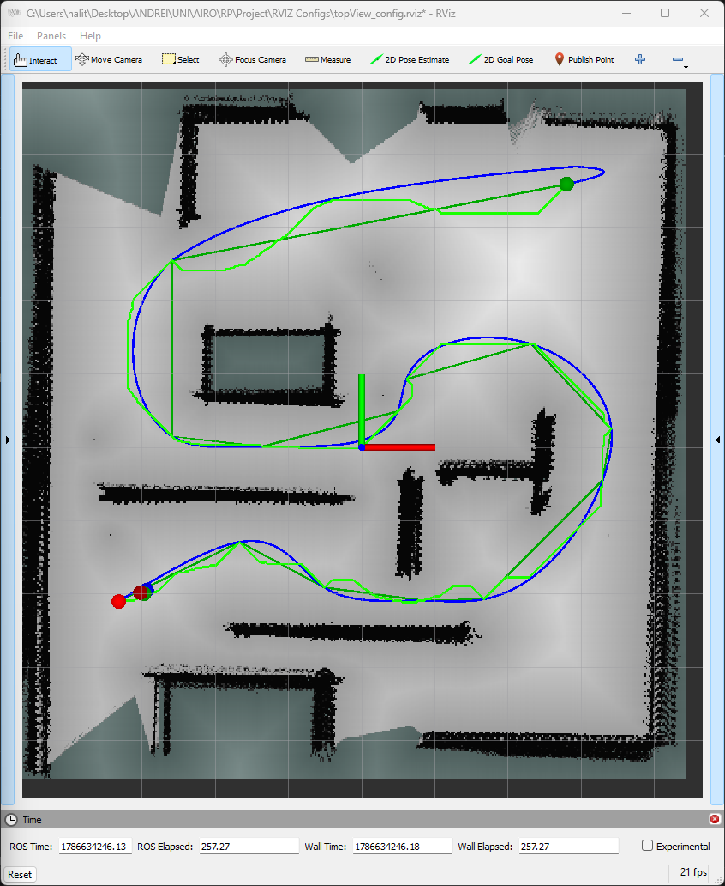
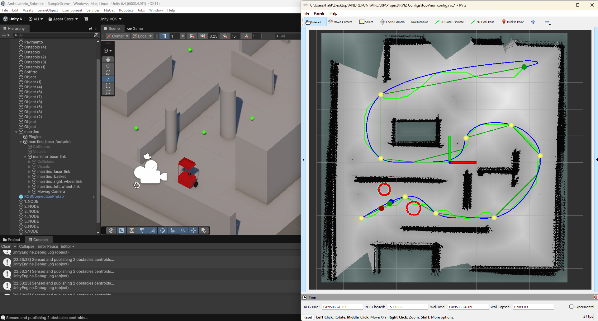
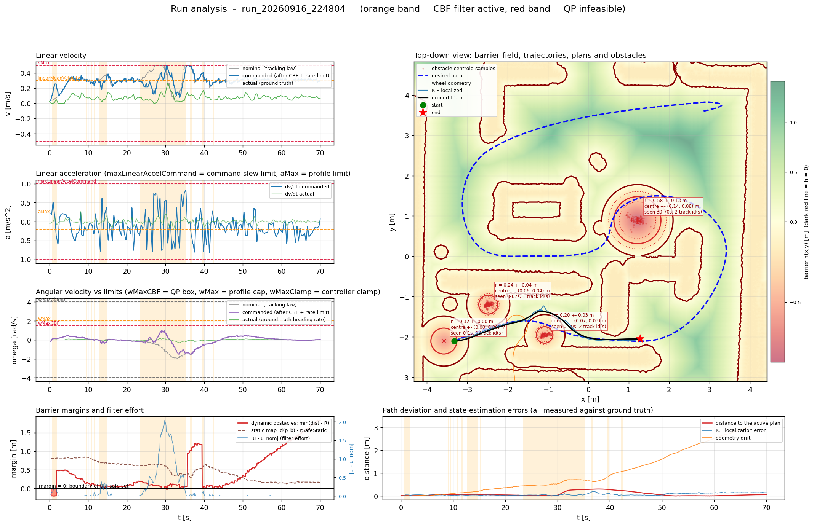

# Autonomous Navigation of a Differential-Drive Robot
## A complete derivation of the MARRtino autonomy stack, from raw LiDAR to replanning

*Lecture notes accompanying the implementation in `Assets/Scripts`.*

---

### About these notes

These notes document, in full mathematical detail, an autonomy stack written from scratch
in C# for Unity: a MARRtino differential-drive robot that maps, localises itself, plans,
tracks a trajectory, detects and tracks dynamic obstacles, filters its own commands through
a control-barrier-function safety layer, and replans when the world stops matching the plan.
No external robotics or numerical library is used for the algorithms themselves — the linear
algebra, the KD-tree, the graph optimiser and the splines are all implemented in the repository.

The notes follow the **order in which the system was built**, because that order is itself an
argument: each layer exists to answer a failure of the layer beneath it. Every component is
presented by answering three questions in turn — *why was it introduced*, *what exactly does it
guarantee*, and *how is it implemented* — and every symbol is bound to the C# identifier that
carries it, so that the mathematics and the source can be read side by side. The binding is
tabulated in [the global notation table](#2-frames-conventions-and-the-global-notation-table)
and, exhaustively, in [Appendix A](#appendix-a--symbol--code-identifier-index).

### How to read them

Parts 0–II establish the platform, the frames and the sensing. Parts III–V build the map.
Parts VI–VIII turn a map into motion. Parts IX–XII make that motion survive a world that
moves. Part XIII covers the instrumentation that made the debugging possible, and Part XIV
reports what has actually been validated — and what has not.

Readers already familiar with the classical material may start at **Part X**, where the
system-specific contributions begin: the detection cascade, the barrier filter, and the
replanning state machine.

### A note on intellectual honesty

Where the implementation uses a heuristic, these notes call it a heuristic. Where a guarantee
is void under the code as written — most importantly, the safety guarantee of the barrier
filter, which the slack variables relax (§30) — the notes say so explicitly rather than quoting
the theorem and moving on. Several discrepancies between the code and the project `README.md`,
and several latent defects found while writing, are recorded in §37–§39; they are reported, not
silently repaired, because the purpose of these notes is to describe the system that exists.

### Verification status

The mathematics in these notes was written against the source and then **independently re-derived
by a second reviewer**, who worked from the code rather than from the text. The audit returned no
error in any derivation it checked: the error dynamics and the identity $\dot V = -k_1k_2e_1^2-k_3e_3^2$
(the $\operatorname{sinc}$ factor makes the cancellation exact for all $e_3$, not merely to first
order); the pole-placement factorisation; the forward-invariance proof and the relative-degree
argument for the look-ahead point; the sign of every inequality row against the solver's
`Ax ≥ b` convention; the $SE(3)$ exponential, logarithm, right-perturbation Jacobian and adjoint;
the gauge-freedom argument; and the A\* admissibility proof, which was singled out for the hardest
scrutiny because clearance-penalised costs so often break a Euclidean heuristic — here the proof
holds, and it holds for the right reason, by discarding a non-negative term rather than by a lucky
choice of units.

The review produced one correction of substance, now incorporated in §30.1: the forward-invariance
theorem of §29.2 and the slack relaxation of §30 were each stated correctly but never joined, so a
reader citing the theorem in isolation would have overstated what the filter guarantees. Four
smaller corrections (the notation table's tracker identifiers, the two overloaded symbols, and the
scope of the velocity profile's optimality at the path endpoints) were applied, and three of the
author's nine `TODO(verify)` markers were settled from the repository and rewritten as resolved
findings.

Two limits of that audit should be stated. `DynamicObstacleService.cs` was not read end to end by
the reviewer, and `Orchestrator.cs` was spot-checked rather than read in full; claims resting
specifically on those two files carry the author's verification but not a second one. And no
experiment was run while writing or reviewing: every quantitative performance figure in Part XIV is
inherited from a single logged run, and is labelled as such where it appears.

---

## Table of contents

- [Part 0 — Foundations](#part-0-foundations)
  - [1. The problem, the platform, and the architecture](#1-the-problem-the-platform-and-the-architecture)
    - [1.1 The mission](#11-the-mission)
    - [1.2 The platform](#12-the-platform)
    - [1.3 Service-oriented architecture and the role of Orchestrator](#13-service-oriented-architecture-and-the-role-of-orchestrator)
    - [1.4 The rate structure](#14-the-rate-structure)
    - [1.5 Chapter summary](#15-chapter-summary)
  - [2. Frames, conventions, and the global notation table](#2-frames-conventions-and-the-global-notation-table)
    - [2.1 Unity versus ROS: two incompatible handednesses](#21-unity-versus-ros-two-incompatible-handednesses)
    - [2.2 The frame tree](#22-the-frame-tree)
    - [2.3 The global notation table](#23-the-global-notation-table)
    - [2.4 Chapter summary](#24-chapter-summary)
- [Part I — Perception](#part-i-perception)
  - [3. The simulated 3-D LiDAR](#3-the-simulated-3-d-lidar)
    - [3.1 Why it was introduced](#31-why-it-was-introduced)
    - [3.2 Purpose and contract](#32-purpose-and-contract)
    - [3.3 The sensor model](#33-the-sensor-model)
    - [3.4 Box–Muller sampling](#34-boxmuller-sampling)
    - [3.5 Complexity and cost](#35-complexity-and-cost)
    - [3.6 LiDARPublisher](#36-lidarpublisher)
    - [3.7 Chapter summary](#37-chapter-summary)
  - [4. Voxel-grid downsampling](#4-voxel-grid-downsampling)
    - [4.1 Why it was introduced](#41-why-it-was-introduced)
    - [4.2 Purpose and contract](#42-purpose-and-contract)
    - [4.3 The algorithm](#43-the-algorithm)
    - [4.4 Parameter choice](#44-parameter-choice)
    - [4.5 VoxelGridPublisher](#45-voxelgridpublisher)
    - [4.6 Chapter summary](#46-chapter-summary)
  - [5. The KD-tree](#5-the-kd-tree)
    - [5.1 Why it was introduced](#51-why-it-was-introduced)
    - [5.2 Purpose and contract](#52-purpose-and-contract)
    - [5.3 Construction](#53-construction)
    - [5.4 Nearest-neighbour query](#54-nearest-neighbour-query)
    - [5.5 $k$-nearest-neighbour query](#55--nearest-neighbour-query)
    - [5.6 Batched correspondence search](#56-batched-correspondence-search)
    - [5.7 Visualisation helpers](#57-visualisation-helpers)
    - [5.8 Chapter summary](#58-chapter-summary)
- [Part II — Locomotion and odometry](#part-ii-locomotion-and-odometry)
  - [6. Unicycle and differential-drive kinematics](#6-unicycle-and-differential-drive-kinematics)
    - [6.1 Why it was introduced](#61-why-it-was-introduced)
    - [6.2 The unicycle model](#62-the-unicycle-model)
    - [6.3 Differential-drive direct and inverse kinematics](#63-differential-drive-direct-and-inverse-kinematics)
    - [6.4 Quaternion / Euler utilities](#64-quaternion-euler-utilities)
    - [6.5 Unity ArticulationBody velocity drives and the degrees-per-second trap](#65-unity-articulationbody-velocity-drives-and-the-degrees-per-second-trap)
    - [6.6 DifferentialDriveController and arbitration](#66-differentialdrivecontroller-and-arbitration)
    - [6.7 Chapter summary](#67-chapter-summary)
  - [7. Wheel odometry](#7-wheel-odometry)
    - [7.1 Why it was introduced](#71-why-it-was-introduced)
    - [7.2 Purpose and contract](#72-purpose-and-contract)
    - [7.3 The integration schemes](#73-the-integration-schemes)
    - [7.4 The dead-band and the real-$\Delta t$ discipline](#74-the-dead-band-and-the-real--discipline)
    - [7.5 The motion gate](#75-the-motion-gate)
    - [7.6 A latent defect: the odometry path queue](#76-a-latent-defect-the-odometry-path-queue)
    - [7.7 Accumulated drift](#77-accumulated-drift)
    - [7.8 Chapter summary](#78-chapter-summary)
  - [8. Completing the hardware interface](#8-completing-the-hardware-interface)
    - [8.1 ArticulationBodyRefs](#81-articulationbodyrefs)
    - [8.2 CmdVelSubscriber](#82-cmdvelsubscriber)
    - [8.3 Chapter summary](#83-chapter-summary)
- [Part III — Rigid registration](#part-iii-rigid-registration)
  - [9. $SE(3)$, homogeneous transforms, and the Lie-group utilities](#9-homogeneous-transforms-and-the-lie-group-utilities)
    - [9.1 Why it was introduced](#91-why-it-was-introduced)
    - [9.2 Definitions and the code's conventions](#92-definitions-and-the-codes-conventions)
    - [9.3 The exponential map](#93-the-exponential-map)
    - [9.4 The logarithm map](#94-the-logarithm-map)
    - [9.5 applyTransformation](#95-applytransformation)
    - [9.6 Right-perturbation calculus](#96-right-perturbation-calculus)
    - [9.7 Chapter summary](#97-chapter-summary)
  - [10. The ICP problem and ICPSolver](#10-the-icp-problem-and-icpsolver)
    - [10.1 Why it was introduced](#101-why-it-was-introduced)
    - [10.2 The problem](#102-the-problem)
    - [10.3 The closed-form point-to-point solution — and what this code does instead](#103-the-closed-form-point-to-point-solution-and-what-this-code-does-instead)
    - [10.4 Point-to-point in ICPSolver](#104-point-to-point-in-icpsolver)
    - [10.5 Point-to-cloud (point-to-plane) in ICPSolver — the default](#105-point-to-cloud-point-to-plane-in-icpsolver-the-default)
    - [10.6 The normal equations and the Gauss–Newton step](#106-the-normal-equations-and-the-gaussnewton-step)
    - [10.7 Chapter summary](#107-chapter-summary)
  - [11. ICPService and ICPUtils](#11-icpservice-and-icputils)
    - [11.1 Why it was introduced](#111-why-it-was-introduced)
    - [11.2 ICPUtils](#112-icputils)
    - [11.3 Scan-to-scan: ScanCompletedRunOneICP](#113-scan-to-scan-scancompletedrunoneicp)
    - [11.4 Scan-to-map: SetLocalizationMap and LocalizeAgainstMap](#114-scan-to-map-setlocalizationmap-and-localizeagainstmap)
    - [11.5 SolveInverseICPProblem](#115-solveinverseicpproblem)
    - [11.6 The coordinate-conversion helpers](#116-the-coordinate-conversion-helpers)
    - [11.7 Chapter summary](#117-chapter-summary)
  - [12. The supporting linear algebra: MatrixVectorUtilities](#12-the-supporting-linear-algebra-matrixvectorutilities)
    - [12.1 Why it was introduced](#121-why-it-was-introduced)
    - [12.2 Inventory](#122-inventory)
    - [12.3 The adjoint and the little adjoint](#123-the-adjoint-and-the-little-adjoint)
    - [12.4 projectPoseToPlane](#124-projectposetoplane)
    - [12.5 Solve6x6](#125-solve6x6)
    - [12.6 Block-assembly helpers](#126-block-assembly-helpers)
    - [12.7 Numerical-precision discussion](#127-numerical-precision-discussion)
    - [12.8 Chapter summary](#128-chapter-summary)
- [Part IV — Graph SLAM](#part-iv-graph-slam)
  - [13. Pose-graph formalism and data structures](#13-pose-graph-formalism-and-data-structures)
    - [13.1 Why it was introduced](#131-why-it-was-introduced)
    - [13.2 The formalism](#132-the-formalism)
    - [13.3 Gauge freedom](#133-gauge-freedom)
    - [13.4 PoseNode](#134-posenode)
    - [13.5 PoseEdge](#135-poseedge)
    - [13.6 PoseGraph](#136-posegraph)
    - [13.7 Chapter summary](#137-chapter-summary)
  - [14. GraphSlamOptimizer: robust Gauss–Newton with sparse conjugate gradients](#14-graphslamoptimizer-robust-gaussnewton-with-sparse-conjugate-gradients)
    - [14.1 Why it was introduced](#141-why-it-was-introduced)
    - [14.2 The linearisation](#142-the-linearisation)
    - [14.3 Derivation of the Jacobians](#143-derivation-of-the-jacobians)
    - [14.4 Assembly](#144-assembly)
    - [14.5 Gauge fixing](#145-gauge-fixing)
    - [14.6 The conjugate-gradient solve](#146-the-conjugate-gradient-solve)
    - [14.7 Robust weighting and damping](#147-robust-weighting-and-damping)
    - [14.8 Retraction](#148-retraction)
    - [14.9 Chapter summary](#149-chapter-summary)
  - [15. LoopClosureFinderService](#15-loopclosurefinderservice)
    - [15.1 Why it was introduced](#151-why-it-was-introduced)
    - [15.2 Two strategies](#152-two-strategies)
    - [15.3 Complexity](#153-complexity)
    - [15.4 Verification (in Orchestrator.TryLoopClosure)](#154-verification-in-orchestratortryloopclosure)
    - [15.5 Chapter summary](#155-chapter-summary)
  - [16. GraphSlamService: orchestration](#16-graphslamservice-orchestration)
    - [16.1 Why it was introduced](#161-why-it-was-introduced)
    - [16.2 Keyframe selection](#162-keyframe-selection)
    - [16.3 Edge measurement: the accumulated transform, not the last step](#163-edge-measurement-the-accumulated-transform-not-the-last-step)
    - [16.4 Bootstrap and the lastNode / newNode pair](#164-bootstrap-and-the-lastnode-newnode-pair)
    - [16.5 Optimisation and re-anchoring](#165-optimisation-and-re-anchoring)
    - [16.6 Navigation mode](#166-navigation-mode)
    - [16.7 Chapter summary](#167-chapter-summary)
- [Part V — Mapping](#part-v-mapping)
  - [17. OccupancyGridService: log-odds occupancy mapping](#17-occupancygridservice-log-odds-occupancy-mapping)
    - [17.1 Why it was introduced](#171-why-it-was-introduced)
    - [17.2 Purpose and contract](#172-purpose-and-contract)
    - [17.3 The inverse sensor model in log-odds](#173-the-inverse-sensor-model-in-log-odds)
    - [17.4 The per-scan update](#174-the-per-scan-update)
    - [17.5 Bresenham free-space marking and its two refinements](#175-bresenham-free-space-marking-and-its-two-refinements)
    - [17.6 Publication](#176-publication)
    - [17.7 Chapter summary](#177-chapter-summary)
  - [18. DistanceMapService: the Euclidean distance transform](#18-distancemapservice-the-euclidean-distance-transform)
    - [18.1 Why it was introduced](#181-why-it-was-introduced)
    - [18.2 Purpose and contract](#182-purpose-and-contract)
    - [18.3 The algorithm: multi-source Dijkstra (brushfire)](#183-the-algorithm-multi-source-dijkstra-brushfire)
    - [18.4 SimplePriorityQueue: the binary min-heap](#184-simplepriorityqueue-the-binary-min-heap)
    - [18.5 Visualisation](#185-visualisation)
    - [18.6 The DistanceMap value object](#186-the-distancemap-value-object)
    - [18.7 Chapter summary](#187-chapter-summary)
- [Part VI — Global path planning](#part-vi-global-path-planning)
  - [19. The multi-waypoint planning framework](#19-the-multi-waypoint-planning-framework)
    - [19.1 Why it was introduced](#191-why-it-was-introduced)
    - [19.2 Reading the mission](#192-reading-the-mission)
    - [19.3 Segment-by-segment planning and the seam problem](#193-segment-by-segment-planning-and-the-seam-problem)
    - [19.4 Waypoint relaxation to the nearest reachable cell](#194-waypoint-relaxation-to-the-nearest-reachable-cell)
    - [19.5 Start escape](#195-start-escape)
    - [19.6 Reset and plan lifecycle](#196-reset-and-plan-lifecycle)
    - [19.7 Chapter summary](#197-chapter-summary)
  - [20. A* on the clearance-penalised grid](#20-a-on-the-clearance-penalised-grid)
    - [20.1 Why it was introduced](#201-why-it-was-introduced)
    - [20.2 The search](#202-the-search)
    - [20.3 The cost function and its admissibility](#203-the-cost-function-and-its-admissibility)
    - [20.4 The Planner enum](#204-the-planner-enum)
    - [20.5 Chapter summary](#205-chapter-summary)
  - [21. Line-of-sight path smoothing and polyline conditioning](#21-line-of-sight-path-smoothing-and-polyline-conditioning)
    - [21.1 Why it was introduced](#211-why-it-was-introduced)
    - [21.2 The safety tunnel test](#212-the-safety-tunnel-test)
    - [21.3 The string-pulling loop](#213-the-string-pulling-loop)
    - [21.4 Near-collinear simplification](#214-near-collinear-simplification)
    - [21.5 Coincident-vertex removal](#215-coincident-vertex-removal)
    - [21.6 What the planner hands downstream](#216-what-the-planner-hands-downstream)
    - [21.7 Chapter summary](#217-chapter-summary)
- [Part VII — Trajectory generation](#part-vii-trajectory-generation)
  - [22. Cubic spline interpolation with virtual knots](#22-cubic-spline-interpolation-with-virtual-knots)
    - [22.1 Why it was introduced](#221-why-it-was-introduced)
    - [22.2 The time law on the knots](#222-the-time-law-on-the-knots)
    - [22.3 The virtual knots](#223-the-virtual-knots)
    - [22.4 The tridiagonal system in the knot accelerations](#224-the-tridiagonal-system-in-the-knot-accelerations)
    - [22.5 The Thomas algorithm](#225-the-thomas-algorithm)
    - [22.6 Per-interval coefficients and evaluation](#226-per-interval-coefficients-and-evaluation)
    - [22.7 Chapter summary](#227-chapter-summary)
  - [23. TOPP-lite: forward–backward velocity profiling](#23-topp-lite-forwardbackward-velocity-profiling)
    - [23.1 Why it was introduced](#231-why-it-was-introduced)
    - [23.2 Stage 1 — extracting reparameterisation-invariant geometry](#232-stage-1-extracting-reparameterisation-invariant-geometry)
    - [23.3 Stage 2 — the velocity profile](#233-stage-2-the-velocity-profile)
    - [23.4 Stage 3 — resampling at the control step](#234-stage-3-resampling-at-the-control-step)
    - [23.5 Parameter summary and tuning](#235-parameter-summary-and-tuning)
    - [23.6 Chapter summary](#236-chapter-summary)
- [Part VIII — Trajectory tracking](#part-viii-trajectory-tracking)
  - [24. The error model, the control law, and the stability argument](#24-the-error-model-the-control-law-and-the-stability-argument)
    - [24.1 Why it was introduced](#241-why-it-was-introduced)
    - [24.2 The error model in the body frame](#242-the-error-model-in-the-body-frame)
    - [24.3 The feed-forward terms](#243-the-feed-forward-terms)
    - [24.4 The control law](#244-the-control-law)
    - [24.5 The Lyapunov function and the stability argument](#245-the-lyapunov-function-and-the-stability-argument)
    - [24.6 Gain assignment](#246-gain-assignment)
    - [24.7 Chapter summary](#247-chapter-summary)
  - [25. ControllerService: implementation](#25-controllerservice-implementation)
    - [25.1 Why these mechanisms exist](#251-why-these-mechanisms-exist)
    - [25.2 The reference clock and the lag gate](#252-the-reference-clock-and-the-lag-gate)
    - [25.3 The command slew-rate limiter](#253-the-command-slew-rate-limiter)
    - [25.4 Arming, disarming, re-arming](#254-arming-disarming-re-arming)
    - [25.5 Actuation and the NaN guards](#255-actuation-and-the-nan-guards)
    - [25.6 Diagnostics exported](#256-diagnostics-exported)
    - [25.7 The control step, end to end](#257-the-control-step-end-to-end)
    - [25.8 Chapter summary](#258-chapter-summary)
- [Part IX — Localization in a known map](#part-ix-localization-in-a-known-map)
  - [26. LocalizationService: scan-to-map ICP with predict, correct and gate](#26-localizationservice-scan-to-map-icp-with-predict-correct-and-gate)
    - [26.1 Why it was introduced](#261-why-it-was-introduced)
    - [26.2 Purpose, state and contract](#262-purpose-state-and-contract)
    - [26.3 Initialisation: the known-initial-pose assumption](#263-initialisation-the-known-initial-pose-assumption)
    - [26.4 Predict](#264-predict)
    - [26.5 Correct](#265-correct)
    - [26.6 Gate](#266-gate)
    - [26.7 The rejection behaviour — the key design decision](#267-the-rejection-behaviour-the-key-design-decision)
    - [26.8 The output conversion](#268-the-output-conversion)
    - [26.9 Scheduling](#269-scheduling)
    - [26.10 Comparison with a Kalman filter](#2610-comparison-with-a-kalman-filter)
    - [26.11 Parameter summary](#2611-parameter-summary)
    - [26.12 Chapter summary](#2612-chapter-summary)
- [Part X — The dynamic obstacle manager](#part-x-the-dynamic-obstacle-manager)
  - [27. DynamicObstacleService: per-scan detection](#27-dynamicobstacleservice-per-scan-detection)
    - [27.1 Why it was introduced and what it must deliver](#271-why-it-was-introduced-and-what-it-must-deliver)
    - [27.2 The cascade at a glance](#272-the-cascade-at-a-glance)
    - [27.3 Stage 0 — downsampling](#273-stage-0-downsampling)
    - [27.4 Stage 1 — re-projection through the *estimated* pose](#274-stage-1-re-projection-through-the-estimated-pose)
    - [27.5 Stages 2–5 — the geometric window](#275-stages-25-the-geometric-window)
    - [27.6 Stage 6 — "explained by the static map"](#276-stage-6-explained-by-the-static-map)
    - [27.7 Stage 7 — the pose-suspicion gate](#277-stage-7-the-pose-suspicion-gate)
    - [27.8 Stage 8 — grid-hash clustering](#278-stage-8-grid-hash-clustering)
    - [27.9 Stages 9–11 — cluster validation and the circle fit](#279-stages-911-cluster-validation-and-the-circle-fit)
    - [27.10 Diagnostics](#2710-diagnostics)
    - [27.11 Remarks / limitations](#2711-remarks-limitations)
    - [27.12 Chapter summary](#2712-chapter-summary)
  - [28. ObstacleTrackerService: association, persistence, and velocity](#28-obstacletrackerservice-association-persistence-and-velocity)
    - [28.1 Why it was introduced](#281-why-it-was-introduced)
    - [28.2 The track](#282-the-track)
    - [28.3 Association](#283-association)
    - [28.4 The update](#284-the-update)
    - [28.5 Coasting in the blind zone](#285-coasting-in-the-blind-zone)
    - [28.6 Death](#286-death)
    - [28.7 Birth and confirmation](#287-birth-and-confirmation)
    - [28.8 The close-range override (in Orchestrator)](#288-the-close-range-override-in-orchestrator)
    - [28.9 Remarks / limitations](#289-remarks-limitations)
    - [28.10 Chapter summary](#2810-chapter-summary)
- [Part XI — The safety filter: Control Barrier Functions](#part-xi-the-safety-filter-control-barrier-functions)
  - [29. CBF theory and the look-ahead construction](#29-cbf-theory-and-the-look-ahead-construction)
    - [29.1 Why it was introduced](#291-why-it-was-introduced)
    - [29.2 Forward invariance and the barrier condition](#292-forward-invariance-and-the-barrier-condition)
    - [29.3 Relative degree, and why the body centre fails](#293-relative-degree-and-why-the-body-centre-fails)
    - [29.4 The look-ahead point and $G(\theta)$](#294-the-look-ahead-point-and)
    - [29.5 The price: what is actually protected](#295-the-price-what-is-actually-protected)
    - [29.6 Chapter summary](#296-chapter-summary)
  - [30. The constraint families and the quadratic program](#30-the-constraint-families-and-the-quadratic-program)
    - [30.1 The filter's specification](#301-the-filters-specification)
    - [30.2 Solver convention](#302-solver-convention)
    - [30.3 The dynamic-obstacle barrier (and the body barrier)](#303-the-dynamic-obstacle-barrier-and-the-body-barrier)
    - [30.4 The static-map barrier](#304-the-static-map-barrier)
    - [30.5 The CLF row, and why it is exact](#305-the-clf-row-and-why-it-is-exact)
    - [30.6 Box constraints and the objective](#306-box-constraints-and-the-objective)
    - [30.7 The identity property in free space](#307-the-identity-property-in-free-space)
    - [30.8 Feasibility and the double-slack design](#308-feasibility-and-the-double-slack-design)
    - [30.9 Chapter summary](#309-chapter-summary)
  - [31. CBFService: implementation](#31-cbfservice-implementation)
    - [31.1 Lifecycle and data flow](#311-lifecycle-and-data-flow)
    - [31.2 FilterControlInput: the assembly order](#312-filtercontrolinput-the-assembly-order)
    - [31.3 The dynamic rows](#313-the-dynamic-rows)
    - [31.4 The static row and the gradient estimate](#314-the-static-row-and-the-gradient-estimate)
    - [31.5 Solve, extract, report](#315-solve-extract-report)
    - [31.6 Complexity](#316-complexity)
    - [31.7 Parameter reference and tuning](#317-parameter-reference-and-tuning)
    - [31.8 Chapter summary](#318-chapter-summary)
- [Part XII — Replanning](#part-xii-replanning)
  - [32. ReplanningService: the decision layer](#32-replanningservice-the-decision-layer)
    - [32.1 Why it was introduced, and the division of labour](#321-why-it-was-introduced-and-the-division-of-labour)
    - [32.2 The state machine](#322-the-state-machine)
    - [32.3 The CBF engagement integrator](#323-the-cbf-engagement-integrator)
    - [32.4 Trigger 1 — persistent obstacle on the remaining reference](#324-trigger-1-persistent-obstacle-on-the-remaining-reference)
    - [32.5 Triggers 2–4](#325-triggers-24)
    - [32.6 Hysteresis: the wait ladder](#326-hysteresis-the-wait-ladder)
    - [32.7 Grid inflation](#327-grid-inflation)
    - [32.8 Chapter summary](#328-chapter-summary)
  - [33. The replanning pipeline in Orchestrator](#33-the-replanning-pipeline-in-orchestrator)
    - [33.1 The trigger loop](#331-the-trigger-loop)
    - [33.2 tryPlanWithInflation](#332-tryplanwithinflation)
    - [33.3 The retry ladder](#333-the-retry-ladder)
    - [33.4 Outcome handling](#334-outcome-handling)
    - [33.5 Waypoint bookkeeping](#335-waypoint-bookkeeping)
    - [33.6 RunPlanningPipeline](#336-runplanningpipeline)
    - [33.7 Remarks / limitations](#337-remarks-limitations)
    - [33.8 Chapter summary](#338-chapter-summary)
- [Part XIII — Infrastructure and experimental method](#part-xiii-infrastructure-and-experimental-method)
  - [34. PublishingService and the ROS 2 interface](#34-publishingservice-and-the-ros-2-interface)
    - [34.1 Why it was introduced](#341-why-it-was-introduced)
    - [34.2 The topic interface](#342-the-topic-interface)
    - [34.3 Message construction and the conversion boundary](#343-message-construction-and-the-conversion-boundary)
    - [34.4 Timestamps — an inconsistency](#344-timestamps-an-inconsistency)
    - [34.5 Circle rendering, and clearing the display](#345-circle-rendering-and-clearing-the-display)
    - [34.6 Throttling](#346-throttling)
    - [34.7 Chapter summary](#347-chapter-summary)
  - [35. IOFileOperationService: persistence](#35-iofileoperationservice-persistence)
    - [35.1 Why it was introduced](#351-why-it-was-introduced)
    - [35.2 The PGM/YAML pair](#352-the-pgmyaml-pair)
    - [35.3 Reading back](#353-reading-back)
    - [35.4 The global point cloud](#354-the-global-point-cloud)
    - [35.5 The run directory and CSV](#355-the-run-directory-and-csv)
    - [35.6 Chapter summary](#356-chapter-summary)
  - [36. PlotDataService and the offline figure](#36-plotdataservice-and-the-offline-figure)
    - [36.1 Why recording and rendering are separated](#361-why-recording-and-rendering-are-separated)
    - [36.2 Formatting discipline](#362-formatting-discipline)
    - [36.3 The seven series](#363-the-seven-series)
    - [36.4 The dump](#364-the-dump)
    - [36.5 tools/plot_run.py — structure](#365-toolsplot_runpy-structure)
    - [36.6 Reading the panels](#366-reading-the-panels)
    - [36.7 The barrier field $h(x,y)$](#367-the-barrier-field)
    - [36.8 Usage and robustness](#368-usage-and-robustness)
    - [36.9 Chapter summary](#369-chapter-summary)
- [Part XIV — Results, parameter reference, and limitations](#part-xiv-results-parameter-reference-and-limitations)
  - [37. What has been validated, and what the evidence is](#37-what-has-been-validated-and-what-the-evidence-is)
    - [37.1 Levels of evidence](#371-levels-of-evidence)
    - [37.2 Functional coverage](#372-functional-coverage)
    - [37.3 The reported run](#373-the-reported-run)
    - [37.4 The sub-zero margin excursions, explained](#374-the-sub-zero-margin-excursions-explained)
    - [37.5 What the figure demonstrates](#375-what-the-figure-demonstrates)
    - [37.6 What has *not* been validated](#376-what-has-not-been-validated)
    - [37.7 A minimal validation protocol](#377-a-minimal-validation-protocol)
    - [37.8 Chapter summary](#378-chapter-summary)
  - [38. Complete parameter reference](#38-complete-parameter-reference)
    - [38.1 Perception, registration, SLAM](#381-perception-registration-slam)
    - [38.2 Odometry, mapping, distance map](#382-odometry-mapping-distance-map)
    - [38.3 Planning and trajectory](#383-planning-and-trajectory)
    - [38.4 Control, localisation, safety, replanning, logging](#384-control-localisation-safety-replanning-logging)
    - [38.5 Discrepancies between the source and the project README](#385-discrepancies-between-the-source-and-the-project-readme)
  - [39. Limitations and future work](#39-limitations-and-future-work)
    - [39.1 Algorithmic limitations, by layer](#391-algorithmic-limitations-by-layer)
    - [39.2 Cross-cutting concerns](#392-cross-cutting-concerns)
    - [39.3 Future work, in priority order](#393-future-work-in-priority-order)
    - [39.4 Closing assessment](#394-closing-assessment)
- [Appendices](#appendices)
  - [Appendix A — Symbol ↔ code identifier index](#appendix-a-symbol-code-identifier-index)
    - [A.1 Geometry, frames, Lie groups](#a1-geometry-frames-lie-groups)
    - [A.2 Kinematics and actuation](#a2-kinematics-and-actuation)
    - [A.3 Perception and registration](#a3-perception-and-registration)
    - [A.4 Graph SLAM](#a4-graph-slam)
    - [A.5 Mapping and distance](#a5-mapping-and-distance)
    - [A.6 Planning and trajectory](#a6-planning-and-trajectory)
    - [A.7 Control](#a7-control)
    - [A.8 Localisation and obstacles](#a8-localisation-and-obstacles)
    - [A.9 Safety filter and replanning](#a9-safety-filter-and-replanning)
  - [Appendix B — Glossary](#appendix-b-glossary)
  - [Appendix C — Bibliography](#appendix-c-bibliography)

---

# Part 0 — Foundations

This part fixes the problem, the frames, the conventions and — most importantly — the notation that the rest of the book will use without further comment. A reader who skips it will find the later chapters ambiguous; a reader who reads it carefully will find them mechanical. Everything in Parts I–XIV is derived from, and checked against, the C# sources under `Assets/Scripts`; wherever the text asserts a formula, the corresponding identifier is named so the claim can be verified against the code.

---

## 1. The problem, the platform, and the architecture



*Figure 1 - The simulated outpatient clinic and the MARRtino platform. The stack described in these notes runs entirely inside this scene; ROS 2 is used as a transport and visualisation layer, never as a source of algorithms.*

### 1.1 The mission

The system is an autonomy stack for a *MARRtino* differential-drive robot operating in a simulated outpatient clinic (corridors, consulting rooms, furniture, and — at run time — obstacles that were not present when the map was made). The simulator is Unity; ROS 2 Humble is attached through the ROS-TCP-Connector and is used exclusively as a **transport and visualisation layer**. No ROS navigation node, no PCL, no g2o, no Ceres, no OMPL is used: KD-trees, ICP, pose-graph optimisation, occupancy mapping, Euclidean distance transforms, graph search, spline interpolation, time-optimal velocity profiling, trajectory tracking, control-barrier-function safety filtering and replanning are all written by hand in C#.

The stack has two mutually exclusive operating modes, selected by the single boolean `calculateAndOverrideOccupancyMapFlag` on the `Orchestrator` component:

| Mode | `calculateAndOverrideOccupancyMapFlag` | Behaviour |
| :--- | :--- | :--- |
| **Mapping** | `true` | The robot is teleoperated (keyboard, or `/cmd_vel`). Each LiDAR scan feeds voxel downsampling → KD-tree → scan-to-scan ICP → pose graph → occupancy grid. On an accepted loop closure the graph is optimised and the map rebuilt. The map (`.pgm` + `.yaml`) and the global cloud (`.bin`) are written to disk. |
| **Navigation** | `false` | The saved map and cloud are loaded, the EDT is computed, a global plan is produced, and the robot drives itself: scan-to-map ICP localisation, trajectory tracking, per-scan dynamic-obstacle detection and tracking, CBF safety filtering, and replanning. |

Formally, the navigation problem is the following. Let the robot configuration be $q = (x, y, \theta) \in SE(2)$, let $\mathcal{W} \subset \mathbb{R}^2$ be the workspace, $\mathcal{O}_{\mathrm{stat}} \subset \mathcal{W}$ the static obstacle set known from the map, and $\mathcal{O}_{\mathrm{dyn}}(t)$ the time-varying set of obstacles not in the map. Given an ordered mission $\mathcal{P} = (p_0, p_1, \dots, p_M)$ of waypoints in $\mathcal{W}$, find a control history $u(\cdot) = (v(\cdot), \omega(\cdot))$ such that the trajectory of

$$
\dot x = v \cos\theta, \qquad \dot y = v \sin\theta, \qquad \dot\theta = \omega
\tag{1.1}
$$

visits the waypoints in order, terminates at $p_M$, respects $|v| \le v_{\max}$, $|\omega| \le \omega_{\max}$, $|\dot v| \le a_{\max}$, and keeps the robot body — a disc of radius $r_{\mathrm{robot}}$ — clear of $\mathcal{O}_{\mathrm{stat}} \cup \mathcal{O}_{\mathrm{dyn}}(t)$ for all $t$.

The last requirement is what makes the problem interesting. $\mathcal{O}_{\mathrm{dyn}}$ is not known at planning time and is only partially observable at run time, so the stack splits the requirement in two: a **planning-time** component that avoids $\mathcal{O}_{\mathrm{stat}}$ with margin, and a **control-time** component (Part XI) that enforces forward invariance of a safe set defined by the obstacles currently believed to exist. When the control-time component is no longer enough — when it keeps the robot safe but pinned — a **replanning** layer (Part XII) rebuilds the plan.

### 1.2 The platform

The robot is imported from URDF as a chain of Unity `ArticulationBody` components. The two wheels are revolute joints driven in *velocity* mode; the laser is a child link. The relevant geometry, read off `ArticulationBodyRefs`:

| Quantity | Symbol | Field | Value |
| :--- | :--- | :--- | :--- |
| Wheel radius | $r_w$ | `wheelRadius` | $0.03$ m |
| Wheel separation (track) | $d_w$ | `wheelSeparation` | $0.42$ m |
| Chassis box (URDF) | — | — | $0.28 \times 0.37$ m |
| Circumscribed body radius | $r_{\mathrm{robot}}$ | `robotBodyRadius` | $0.23$ m |
| Laser offset ahead of base | — | — | $\approx 0.10$ m |
| Laser height | — | — | $0.335$ m (chassis roof at $0.21$ m) |

The number $r_{\mathrm{robot}} = 0.23$ is the half-diagonal of the $0.28 \times 0.37$ box: $\tfrac12\sqrt{0.28^2 + 0.37^2} = 0.232$ m. It is this circumscribed radius, not the half-width, that every clearance test in the stack uses, because the robot is free to rotate in place.

> **Remark (wheel-radius-vs-width trap).** The URDF declares the wheel as `<cylinder radius="0.03" length="0.07"/>`. It is tempting — and wrong — to read $0.07$ as the diameter and set $r_w = 0.035$. The comment on `ArticulationBodyRefs.wheelRadius` records exactly this: *"`0.07` e' la LARGHEZZA"* (0.07 is the *width*). A wrong $r_w$ scales odometry, the direct and inverse kinematics, and therefore every velocity in the stack, by a constant factor; see §7.4.

### 1.3 Service-oriented architecture and the role of `Orchestrator`

The code is organised as a set of **plain C# services** — classes with no Unity base class, constructed with their parameters, holding their own state, and exposing a small verb-like API — plus a single `MonoBehaviour`, `Orchestrator`, that owns them. The services are:

| Service | Responsibility | Part |
| :--- | :--- | :--- |
| `ICPService` | scan-to-scan and scan-to-map registration | III |
| `GraphSlamService`, `GraphSlamOptimizer`, `LoopClosureFinderService` | pose-graph SLAM | IV |
| `OccupancyGridService` | log-odds occupancy mapping | V |
| `DistanceMapService` | brushfire EDT; owns the immutable `DistanceMap` | V |
| `MotionPlannerService` | A*, LOS-PS, splines, velocity profile | VI–VII |
| `ControllerService` | tracking law, reference clock, rate limiting, actuation | VIII |
| `CBFService` | the safety QP | XI |
| `LocalizationService` | scan-to-map predict/correct/gate | IX |
| `DynamicObstacleService`, `ObstacleTrackerService` | obstacle detection and tracking | X |
| `ReplanningService` | the replanning FSM and triggers | XII |
| `PublishingService`, `IOFileOperationService`, `PlotDataService` | ROS 2 I/O, persistence, logging | XIII |
| `OdometryService`, `OdometryModel` | wheel odometry | II |

`Orchestrator` does four things and nothing else:

1. **Parameter ownership.** Every tunable in the system is a `public` field on `Orchestrator`, so it appears in the Unity Inspector and can be changed without recompiling. The services receive these values *by constructor argument*; they never read them back. This is why §38 (Part XIV) can present one table of defaults: there is exactly one place they live.
2. **Wiring.** `Start()` constructs the services in dependency order and connects them. A notable piece of wiring: in navigation mode the *pristine* distance map is captured once,
   ```csharp
   pristineDistanceMap = distanceMapService.getDistanceMapInstance();
   cbfService.SetDistanceMap(pristineDistanceMap);
   ```
   and the CBF keeps that reference forever, while `distanceMapService` is free to be recomputed on an inflated grid by the replanner. The comment in the code states the reason precisely: otherwise a tracked obstacle would be counted twice, once by the static barrier (because it was painted into the grid) and once by its own dynamic barrier.
3. **Scheduling.** There is no thread pool and no coroutine graph; everything is driven by Unity's `Update()` and by the LiDAR's `OnScanComplete` event, with per-subsystem rate gates (§1.4).
4. **The two scan callbacks.** `ScanCompletedLetsWork()` (mapping) and `ScanCompletedNavigation()` (navigation) are subscribed to `lidar.OnScanComplete` exclusively, depending on the mode flag.

### 1.4 The rate structure

A single-threaded game loop forces an explicit decision about *what runs how often*. The stack uses a rate gate of the form `Time.time - last > period` in each subsystem. The resulting rates:

| Subsystem | Gate | Nominal rate |
| :--- | :--- | :--- |
| LiDAR scan | `LiDAR3D.scanFrequenzy` | 10 Hz |
| Odometry integration | `odometryFrequency` | 55 Hz |
| Control step | `secondsControlFrequency` | 20 Hz (nominal) |
| Scan-to-map localisation | `localizationPeriod` | $1/0.35 \approx 2.9$ Hz |
| Replanning trigger check | `replanCheckPeriod` | 5 Hz |
| Plot sampling | `plotSamplePeriod` | 20 Hz |
| Occupancy / distance-map republication | `occupancyRepublishPeriod`, `distanceMapRepublishPeriod` | 0.2 Hz |
| Odometry path republication | `odometryPathPublishPeriod` | 5 Hz |
| Global cloud republication | `globalPointCloudPeriod` | 0.2 Hz |

Two of these deserve comment now because they shape later chapters.

First, **the control rate is nominal, not actual.** `isTimeToControl()` returns true when more than $1/f_c$ seconds have elapsed, but with the LiDAR and ICP running the frame rate can drop well below $f_c = 20$ Hz. Every time-integrating quantity in `ControllerService` therefore uses the *measured* elapsed time `dt = Mathf.Clamp(Time.time - lastControl, 0f, 0.5f)`, never $1/f_c$. The same discipline appears in `OdometryService` (`dt = Mathf.Min(Time.time - lastTimeOdometry, 0.1f)`) and is the reason the reference clock of §25.2 is time-based rather than index-based.

Second, **the republication throttles exist to protect the TCP queue.** The comment on `odometryPathPublishPeriod` records the failure: publishing a 250-pose `Path` at 55 Hz saturates the ROS-TCP connector queue ("Queue full → messages dropped") and allocates garbage every frame.

### 1.5 Chapter summary

The system is a from-scratch, service-oriented autonomy stack for a differential-drive robot in Unity, with two modes (mapping / navigation) selected by one flag, all parameters centralised on `Orchestrator`, and a single-threaded rate-gated schedule in which every integrating subsystem uses measured rather than nominal elapsed time. The next chapter fixes the frames and the symbols.

---

## 2. Frames, conventions, and the global notation table

### 2.1 Unity versus ROS: two incompatible handednesses

Unity uses a **left-handed, Y-up** coordinate system: $+x$ right, $+y$ up, $+z$ forward. ROS (REP 103) uses a **right-handed, Z-up** system: $+x$ forward, $+y$ left, $+z$ up. The conversion is implemented once, in `UnicycleModelUtilities`, and used everywhere:

```csharp
public static (float, float, float) UnityToRosPosition(float xt, float yt, float zt)
{
    return (zt, -xt, yt);
}
public static (float, float, float) RosToUnityPosition(float xt, float yt, float zt)
{
    return (-yt, zt, xt);
}
```

In symbols, writing $p^U = (x^U, y^U, z^U)$ for a Unity point and $p^R = (x^R, y^R, z^R)$ for the ROS point,

$$
\begin{pmatrix} x^R \\ y^R \\ z^R \end{pmatrix}
=
\underbrace{\begin{pmatrix} 0 & 0 & 1 \\ -1 & 0 & 0 \\ 0 & 1 & 0 \end{pmatrix}}_{=: \; C}
\begin{pmatrix} x^U \\ y^U \\ z^U \end{pmatrix},
\qquad
C^{-1} = C^{\mathsf T} = \begin{pmatrix} 0 & -1 & 0 \\ 0 & 0 & 1 \\ 1 & 0 & 0 \end{pmatrix}.
\tag{2.1}
$$

$\det C = +1$ as a matrix, but **this is not a rotation between two right-handed frames**: it is the composition of a rotation with the reflection implied by the change of handedness. The honest statement is that $C$ maps *coordinate triples* correctly, and that it must be applied to positions and to direction vectors, but **not** naively to a quaternion. The code's `UnityToRosRotation(x,y,z,w) = (z, -x, y, w)` applies the same permutation to the vector part while leaving $w$ untouched; this is the usual engineering shortcut and it is *exact only up to the handedness flip*, which is why

> **Resolved (review).** The general case is **not** correct. Re-expressing a rotation under an orientation-reversing coordinate map requires conjugation, $R \mapsto C R C^{-1}$ with the determinant-sign correction — equivalently, negating the rotation angle — and not merely a relabelling of the quaternion's vector components, which is what `UnityToRosRotation` performs. The shortcut is exact only when the rotation axis is mapped to itself up to sign without the mixing that the handedness flip would corrupt. That condition holds at the single call site in use (a laser mount with no roll or pitch), so the published TF is correct today; the function would silently produce a wrong orientation for a tilted mount.

**Yaw.** The planar heading in ROS convention is recovered from the Unity transform's forward vector as

$$
\theta = \operatorname{atan2}\!\big(-f^U_x,\; f^U_z\big),
\tag{2.2}
$$

which is exactly the code in `Orchestrator.getControlPose()` and in `LocalizationService.toRosPose()`:
```csharp
float theta = Mathf.Atan2(-T[0, 2], T[2, 2]);   // third column = forward
```
Equation (2.2) is (2.1) applied to the forward axis followed by $\operatorname{atan2}(y^R, x^R)$. Note the sign: a positive Unity yaw (clockwise seen from above, because Unity is left-handed) is a *negative* ROS yaw. This single sign is responsible for the three separate places where the code writes a negation:

* `Orchestrator.getControlPose()` returns `(xo, -yo, -tho)` when falling back to raw odometry, because `OdometryService` integrates in the "Unity-planar" convention $(x_o, y_o, \theta_o) = (z^U, x^U, \mathrm{yaw}^U)$ seeded by `ArticulationBodyRefs.getTransformCurrentConfiguration()`;
* the same negation appears in the plot recording and in `PublishDebugPoint((currentConfig.x, -currentConfig.y), ...)`;
* `flipControlOmega` (default `true`) negates the commanded $\omega$ *after* the controller and *before* the wheels, converting a ROS-convention angular velocity into the Unity-convention one the drives expect.

> **Remarks / limitations.** The handedness bookkeeping is correct but is distributed across call sites rather than encapsulated in a single `Pose` type. `flipControlOmega` in particular is a global sign switch applied at the actuator; the plotting script's docstring notes that the logged $\omega$ is "BEFORE `flipControlOmega`". Any future refactor should introduce an explicit `RosPose2D` / `UnityPose3D` distinction in the type system.

### 2.2 The frame tree

Four frames matter.

* **`map` (= the grid frame).** The 2-D frame in which the occupancy grid, the EDT, the planner, the controller and the obstacle manager all work. Its origin is the bottom-left corner of the grid bounding box, at `(originX, originY)` metres; axes are ROS-convention $x$ (forward) and $y$ (left). In the published messages this frame is *labelled* `odom` — see the caveat below.
* **`odom`.** The frame of wheel odometry, seeded at start-up from the live laser transform. In mapping mode this coincides with the initial laser pose; in navigation mode it coincides with `map` up to the odometric drift.
* **`base_link`.** The robot chassis frame.
* **`marrtino_laser_link`.** The sensor frame, $\approx 0.10$ m ahead of `base_link` and $0.335$ m above the floor. Unity local axes: $+z$ forward, $+x$ right, $+y$ up.

> **Remarks / limitations.** `PublishingService` stamps *every* topic with `frame_id = "odom"`, including the occupancy grid, the distance map, the planned paths and the debug point clouds, which conceptually live in `map`. The source comment on `getPointCloud2MsgHeader` acknowledges this (*"momentaneo, corretto: marrtino_laser_link"*). The consequence is cosmetic in RViz as long as `odom` and `map` are not separately broadcast — which they are not, since the published TF tree is only `odom → base_link → marrtino_laser_link` — but it is formally wrong and it is one of the items in the "full ROS integration" backlog (§39.3).

**The odometry seed is anchored at the laser, not the base.** `ArticulationBodyRefs.getTransformCurrentConfiguration()` returns
```csharp
float current_xt = marrtionLaserLinkTransform.position.z;
float current_yt = marrtionLaserLinkTransform.position.x;
float current_thetat = marrtionLaserLinkTransform.eulerAngles.y * Mathf.Deg2Rad;
```
The comment explains why: the planner's start, the ground-truth debug pose and the control pose are all taken at the laser, so seeding odometry at the base would inject a constant $0.10$ m offset which *rotates with the robot* and therefore looks exactly like drift. This is a good example of a non-obvious guard; it is cheap, and getting it wrong produces a symptom (apparent heading-dependent odometry drift) that is very hard to diagnose.

### 2.3 The global notation table

The following symbols are used with these meanings **throughout the book**. Where a symbol is bound to a C# identifier, that identifier is the authority; where no identifier is given, the symbol is purely mathematical.

#### Geometry, poses, transforms

| Symbol | Meaning | Domain | C# identifier |
| :--- | :--- | :--- | :--- |
| $q = (x,y,\theta)$ | planar robot configuration (ROS frame) | $\mathbb{R}^2 \times (-\pi,\pi]$ | `currentConfig`, `(float x, float y, float theta)` |
| $p$ | robot reference point $(x,y)$ | $\mathbb{R}^2$ | — |
| $\theta$ | heading | $(-\pi,\pi]$ | `theta` |
| $T$ | homogeneous transform | $SE(3)$, stored `float[4,4]` | `float[,] T` |
| $R$ | rotation | $SO(3)$ | `getRFromT` |
| $t$ | translation part of $T$ | $\mathbb{R}^3$ | `gettFromT` |
| $\xi = (\rho, \omega)$ | twist, **translation first** | $\mathfrak{se}(3) \cong \mathbb{R}^6$ | `float[6] delta` |
| $\operatorname{Exp}, \operatorname{Log}$ | exponential / logarithm maps | — | `ExpMap`, `LogMap` |
| $[\,\cdot\,]_\times$ | skew-symmetric matrix | $\mathbb{R}^3 \to \mathfrak{so}(3)$ | `getSkewSymmetricMatrix` |
| $\operatorname{Adj}(T)$ | SE(3) adjoint | $\mathbb{R}^{6\times6}$ | `AdjointSE3` |
| $\operatorname{ad}_\xi$ | $\mathfrak{se}(3)$ little adjoint | $\mathbb{R}^{6\times6}$ | `littleAdjoint6` |
| $C$ | Unity→ROS coordinate map, eq. (2.1) | $\mathbb{R}^{3\times3}$ | `UnityToRosPosition` |
| $T^{\mathrm{ICP}}_{W}$ | accumulated scan-to-scan ICP pose | $SE(3)$ | `TWorldICP` |
| $T^{\mathrm{ICP}}_{\mathrm{rel}}$ | last relative ICP step | $SE(3)$ | `TRelativeICP` |
| $T_{\mathrm{ml}}$ | map→laser pose from localisation | $SE(3)$ | `T_map_laser`, `GetTMapLaser()` |

#### Kinematics and actuation

| Symbol | Meaning | Unit | C# identifier |
| :--- | :--- | :--- | :--- |
| $v$ | linear velocity command | m/s | `v`, `feedbackControl.v` |
| $\omega$ | angular velocity command | rad/s | `w`, `feedbackControl.w` |
| $\omega_L, \omega_R$ | left/right wheel angular velocities | rad/s | `wL`, `wR` |
| $r_w$ | wheel radius | m | `wheelRadius` |
| $d_w$ | wheel separation | m | `wheelSeparation` |
| $v_{\max}$ | linear velocity clamp | m/s | `vMax` |
| $\omega_{\max}^{\mathrm{clamp}}$ | controller angular clamp | rad/s | `wMaxClamp` |
| $\omega_{\max}$ | curvature cap of the velocity profile | rad/s | `wMax` |
| $\omega_{\max}^{\mathrm{CBF}}$ | angular box of the QP | rad/s | `wMaxCBF` |
| $a_{\max}$ | tangential acceleration of the profile | m/s² | `aMax` |
| $\dot v_{\lim}, \dot\omega_{\lim}$ | command slew-rate limits | m/s², rad/s² | `maxLinearAccelCommand`, `maxAngularAccelCommand` |

#### Perception and registration

| Symbol | Meaning | C# identifier |
| :--- | :--- | :--- |
| $\mathcal{P} = \{p_i\}$ | source (live) point cloud | `sourceLocalTreeListOfPoints` |
| $\mathcal{Q} = \{q_j\}$ | target point cloud | `targetLocalTreeListOfPoints` |
| $\ell_v$ | voxel edge for ICP downsampling | `voxelSize` |
| $\ell_v^{\mathrm{det}}$ | voxel edge for detection downsampling | `detectionVoxelSize` |
| $k_{\mathrm{nn}}$ | neighbours for the PCA plane fit ($=7$) | `KNearestNeighbor(query, k = 7)` |
| $n$ | local surface normal | `nVector` |
| $e$ | ICP residual | `errore`, `erroreScalare` |
| $\delta_H$ | Huber threshold (ICP) | `deltaHuber` |
| $d_{\max}$ | correspondence rejection gate | `maxDistance` |
| $H, b$ | Gauss–Newton normal-equation matrices | `H`, `b` |
| $\Delta p$ | GN increment in $\mathfrak{se}(3)$ | `deltaP` |

#### SLAM

| Symbol | Meaning | C# identifier |
| :--- | :--- | :--- |
| $\mathcal{G} = (\mathcal{V}, \mathcal{E})$ | pose graph | `PoseGraph` |
| $T_i$ | pose of node $i$ | `PoseNode.PoseT()` |
| $z_{ij}$ | measured relative pose of edge $(i,j)$ | `PoseEdge.RelativeT()` |
| $\Omega_{ij}$ | information matrix of edge $(i,j)$ | `PoseEdge.InformationM()` |
| $e_{ij}$ | edge residual, eq. (14.2) | `e_ij` |
| $J_i, J_j$ | edge Jacobians | `J_i`, `J_j` |
| $\lambda$ | Levenberg damping | `dampingLambda` ($10^{-4}$) |
| $\delta_H^{\mathcal{G}}$ | Huber threshold on loop-closure edges | `huberDeltaGraphSlamOptimization` |

#### Mapping

| Symbol | Meaning | C# identifier |
| :--- | :--- | :--- |
| $\varrho$ | grid resolution (m/cell) | `resolution` |
| $\ell(c)$ | log-odds of cell $c$ | value of `hashMapOnlineoccupancyGrid` |
| $\ell_{\mathrm{occ}}, \ell_{\mathrm{free}}$ | inverse-sensor-model increments | `lOcc`, `lFree` |
| $\ell_{\min}, \ell_{\max}$ | log-odds clamps | `lMin` $=-2$, `lMax` $=3.5$ |
| $z_{\min}, z_{\max}$ | mapping height band | `zMin`, `zMax` |
| $D(c)$ | EDT value of cell $c$, **in cells** | `distanceCalculatedMap[i]` |
| $d(p) = \varrho\,D(\lfloor p \rfloor)$ | clearance in metres | `clearence`, `distanceAt` |

#### Planning and trajectory

| Symbol | Meaning | C# identifier |
| :--- | :--- | :--- |
| $g, h, f$ | A* cost-to-come, heuristic, priority | `costMap`, `getHeuristicDistanceFromGoal` |
| $k_{\mathrm{rep}}$ | clearance-penalty gain | `k` |
| $\varepsilon_{\mathrm{reg}}$ | clearance-penalty regulariser | `eps` |
| $\varepsilon_{\mathrm{tun}}$ | LOS-PS tunnel half-width | `epsilonTunnelLoSPS` |
| $\alpha_{\mathrm{col}}$ | near-collinearity tolerance | `collinearToleranceDeg` |
| $\Delta_{\min}$ | minimum vertex spacing | `minVertexSpacing` |
| $q_k, \ddot q_k$ | spline knot value and acceleration | `q`, `q_Acc` |
| $a_k,b_k,c_k,d_k$ | per-interval cubic coefficients | `ak, bk, ck, dk` |
| $s$ | arc length | `sArr`, `s` |
| $\kappa$ | curvature | `kappa`, `kArr` |
| $v_{\mathrm{cr}}$ | cruise speed | `linearMeanVelocity` / `vCruise` |
| $v_{\min}$ | profile floor ($0.05$ m/s) | `vMin` |

#### Tracking control

| Symbol | Meaning | C# identifier |
| :--- | :--- | :--- |
| $e_1, e_2, e_3$ | longitudinal, lateral, heading error | `e1, e2, e3` |
| $v_d, \omega_d, \theta_d$ | reference feed-forward | `v_des`, `w_des`, `theta_des` |
| $k_1, k_2, k_3$ | tracking gains | `k1, k2, k3` |
| $b$ | gain parameter | `b` |
| $\zeta$ | damping parameter | `zeta` |
| $V$ | Lyapunov function, eq. (24.9) | computed inline in `addCLFConstraint` / `RecordControl` |
| $\lambda_{\mathrm{lag}}$ | reference-lag gate | `referenceMaxLag` |

#### Dynamic obstacles

| Symbol | Meaning | C# identifier |
| :--- | :--- | :--- |
| $\tau(d)$ | range-dependent "explained" tolerance | `tolAtRange` |
| $\tau_0$ | tolerance at zero range | `obsTol` |
| $\tau_1$ | tolerance growth per metre | `obsTolPerMeter` |
| $d_{\mathrm{det}}$ | maximum detection range | `maxDetectionRange` |
| $\rho_{\mathrm{cl}}$ | clustering cell size | `clusteringRadius` |
| $r_o$ | obstacle circle radius | `r`, `ObstacleTrack.r` |
| $r_o^{\max}$ | radius high-water mark | `ObstacleTrack.rMax` |
| $\dot p_o = (v_x, v_y)$ | tracked obstacle velocity | `vx`, `vy` |
| $\gamma_{\mathrm{gate}}$ | association gate | `trackGate` (`Orchestrator`) / `gate` (`ObstacleTrackerService`) |
| $\alpha_{\mathrm{lp}}$ | velocity low-pass coefficient | `trackAlphaLowpass` (`Orchestrator`) / `alphaLowpass` (`ObstacleTrackerService`) |
| $N_{\mathrm{hits}}$ | confirmations required | `trackMinHits` (`Orchestrator`) / `minHits` (`ObstacleTrackerService`) |
| $T_{\mathrm{forget}}$ | time-to-death without detection | `trackForgetTime` (`Orchestrator`) / `forgetTime` (`ObstacleTrackerService`) |

#### Safety filter

| Symbol | Meaning | C# identifier |
| :--- | :--- | :--- |
| $b_{\mathrm{la}}$ | look-ahead distance | `bLookAhead` |
| $p_b$ | look-ahead point | `(pbx, pby)` |
| $G(\theta)$ | look-ahead Jacobian, eq. (29.6) | implicit in `av`, `aw` |
| $h$ | barrier function | `h`, `hBody` |
| $\alpha_{\mathrm{dyn}}, \alpha_{\mathrm{stat}}$ | class-$\mathcal{K}$ gains | `alphaDynamic`, `alphaStatic` |
| $r_{\mathrm{safe}}^{\mathrm{dyn}}, r_{\mathrm{safe}}^{\mathrm{stat}}$ | safety radii | `rSafeDynamic`, `rSafeStatic` |
| $\gamma_{\mathrm{CLF}}$ | CLF contraction rate | `gammaCLF` |
| $\delta_{\mathrm{clf}}$ | CLF slack | QP variable index 2 |
| $s_{\mathrm{cbf}}$ | barrier slack | QP variable index 3 |
| $w_v, w_\omega$ | deviation weights | `vDeviationWeight`, `wDeviationWeight` |
| $w_s$ | command-smoothing weight | `commandSmoothingWeight` |
| $p_{\mathrm{clf}}, p_{\mathrm{cbf}}$ | slack penalties | `slackPenalty`, `cbfSlackPenalty` |

#### Replanning

| Symbol | Meaning | C# identifier |
| :--- | :--- | :--- |
| $A_{\mathrm{pers}}$ | persistence age for a track | `persistentObstacleAge` |
| $L_{\mathrm{ahead}}$ | look-ahead arc examined | `replanLookAheadDistance` |
| $T_{\mathrm{eng}}$ | integrated CBF engagement time | `cbfEngagementTime` |
| $T_{\mathrm{eng}}^{\min}$ | engagement threshold | `minCBFEngagement` |
| $m_{\mathrm{inf}}$ | inflation margin | `obstacleInflationMargin` |
| $\Delta_{\mathrm{plan}}$ | deviation from the active plan | `getPlanDeviation` |

### 2.4 Chapter summary

Unity's left-handed Y-up frame is mapped to ROS's right-handed Z-up frame by the single permutation (2.1), implemented in `UnicycleModelUtilities` and applied at every boundary; the heading follows by (2.2), and the resulting sign convention explains the three negations and the `flipControlOmega` switch that appear later. The published frame tree is `odom → base_link → marrtino_laser_link`, and everything is stamped `odom` even when it conceptually lives in `map`. The notation table of §2.3 is binding for the remainder of the book.


# Part I — Perception

Everything downstream — registration, mapping, obstacle detection — consumes points. This part documents how points are produced (a simulated spherical-scanning LiDAR with a calibrated noise model), how their number and density are made tractable (voxel downsampling), and how nearest-neighbour queries over them are made logarithmic (a KD-tree). The three chapters are ordered as the data flows.

---

**A note on two overloaded letters.** The bare symbol $e$ carries three unrelated meanings across
this book — the ICP residual (Part III), the tracking error components $e_1,e_2,e_3$ (Part VIII), and
the pose-graph edge residual $e_{ij}$ (Part IV) — and $h$ carries two: the A\* heuristic (Part VI) and
the barrier function (Part XI). In every instance the subscript and the surrounding Part disambiguate,
and no two meanings ever appear in the same equation, but the convention is worth stating explicitly
rather than leaving a reader who arrives by search to infer it.

## 3. The simulated 3-D LiDAR

### 3.1 Why it was introduced

A SLAM stack validated against *exact* geometry is not validated at all. If the simulator handed the registration layer the true surface points, ICP would converge in one iteration, the Huber kernel would never fire, the occupancy grid's probabilistic update would be pointless, and the localisation gates of Part IX would never reject anything. The requirement was therefore a sensor model that is (a) geometrically faithful to a rotating multi-channel LiDAR, and (b) noisy in a way that is statistically defensible.

### 3.2 Purpose and contract

`LiDAR3D` (a `MonoBehaviour` attached to `marrtino_laser_link`) exposes:

* `List<Vector3> ScannedPoints` — the hit points of the last complete revolution, **in Unity world coordinates**;
* `event Action OnScanComplete` — raised once per revolution, after `ScannedPoints` is fully populated.

The event is the clock of the entire SLAM and obstacle pipeline. Note the contract detail: `ScannedPoints` is a reference to the live list, which `Scan()` clears at the start of the next revolution. Consumers must therefore finish with it inside the callback; both `ICPService` and `DynamicObstacleService` do, because they immediately downsample into fresh lists.

### 3.3 The sensor model

Let $\theta_t$ be the azimuth and $\psi_t$ the elevation of a beam. The scan sweeps

$$
\theta_t \in \{0, \Delta\theta, 2\Delta\theta, \dots\} \cap [0^\circ, 360^\circ), \qquad
\Delta\theta = \frac{360^\circ}{N_{\mathrm{ppc}}},
\tag{3.1}
$$

$$
\psi_t \in \{\psi_{\min}, \psi_{\min} + \Delta\psi, \dots, \psi_{\max}\}, \qquad
\Delta\psi = \frac{\psi_{\max} - \psi_{\min}}{N_{\mathrm{ch}} - 1},
\tag{3.2}
$$

with `pointsPerChannel` $N_{\mathrm{ppc}} = 720$, `channels` $N_{\mathrm{ch}} = 32$, `vAngleMin` $\psi_{\min} = -25^\circ$, `vAngleMax` $\psi_{\max} = +25^\circ$. The unit direction in the **laser-local Unity frame** is

$$
\hat d(\theta_t, \psi_t) = \big(\cos\psi_t \sin\theta_t,\; \sin\psi_t,\; \cos\psi_t \cos\theta_t\big),
\tag{3.3}
$$

i.e. the standard spherical parameterisation with $+y$ as the polar ("up") axis and $+z$ as the $\theta = 0$ reference, matching Unity's Y-up convention (§2.1). This is `getDirectionFromAngles`. Note $\|\hat d\| = 1$ exactly, since $\cos^2\psi(\sin^2\theta + \cos^2\theta) + \sin^2\psi = 1$.

> **A subtlety worth flagging.** `Physics.Raycast(vOrigin, v3Direction, ...)` is called with `v3Direction` built from (3.3) *without* applying `transform.rotation`. Unity's `Raycast` interprets the direction in **world** coordinates. The ray origin, however, is `transform.position` — the laser's world position. The effect is that the scan pattern is **axis-aligned with the world, not with the robot**: rotating the robot does not rotate the beam pattern. For a full $360^\circ$ azimuthal sweep this is observationally almost harmless (the *set* of azimuths is rotation-invariant), but it is not exactly harmless: the discrete sample phases do not rotate with the robot, so the sampled directions are not body-fixed. For scan-to-scan ICP this manifests as a small extra sampling noise rather than a bias.
>
> **Resolved in part (review).** The beam pattern is confirmed **world-aligned, not body-fixed**: the direction is built from the scan angles alone and reaches `Physics.Raycast` without ever being composed with the sensor's current world rotation. Since no physical LiDAR behaves this way, the reading "defect rather than design choice" is the only credible one, and the fix remains `Vector3 v3Direction = transform.TransformDirection(localDir);`. What stays genuinely open is the *magnitude* of the consequence for ICP, which cannot be settled by inspection and requires a run.

The returned range is corrupted by additive Gaussian noise:

$$
\tilde\rho = \rho + \eta, \qquad \eta \sim \mathcal{N}(\mu, \sigma^2),
\tag{3.4}
$$

with `noiseMean` $\mu = 0$ and `noiseStd` $\sigma = 0.02$ m. The hit point stored is

$$
p^U = o^U + \tilde\rho\, \hat d,
\tag{3.5}
$$

where $o^U$ = `transform.position`. Misses (no hit within `maxRange` $= 35$ m) produce **no point at all** — the cloud is sparse, not padded with max-range returns. This is an honest modelling choice but it means the stack never observes "free to infinity" evidence from a miss; the only free-space evidence is the Bresenham ray up to a hit (§17.4).

### 3.4 Box–Muller sampling

`getGaussianNoise` implements the basic (not polar) Box–Muller transform. Given $u_1, u_2 \sim \mathcal{U}(0,1)$ independent,

$$
z_0 = \sigma\sqrt{-2\ln u_1}\,\cos(2\pi u_2) + \mu .
\tag{3.6}
$$

*Derivation.* Let $(Z_1, Z_2)$ be standard bivariate normal. In polar form $Z_1 = \Re\cos\Phi$, $Z_2 = \Re\sin\Phi$ with $\Phi \sim \mathcal{U}(0, 2\pi)$ independent of $\Re$, and $\Re^2 \sim \chi^2_2 = \operatorname{Exp}(1/2)$. Hence $\Pr(\Re^2 > s) = e^{-s/2}$, so if $U_1 \sim \mathcal{U}(0,1)$ then $\Re = \sqrt{-2\ln U_1}$ has the right law, and $\Phi = 2\pi U_2$. Taking only the first component gives (3.6). $\square$

The code guards $u_1 = 0$ with a `do…while`, which is necessary: $\ln 0 = -\infty$ would produce an infinite range and an infinite point coordinate, which would then poison the KD-tree median split, the voxel hash, and the ICP normal equations. This is a one-line guard protecting against a catastrophic, silent failure mode.

The generator is `Unity.Mathematics.Random` seeded from `System.Environment.TickCount`. This is **not** reproducible across runs; for a controlled experiment the seed should be a parameter.

### 3.5 Complexity and cost

Per revolution the sensor casts $N_{\mathrm{ppc}} \times N_{\mathrm{ch}} = 720 \times 32 = 23{,}040$ rays. At `scanFrequenzy` $= 10$ Hz this is $2.3 \times 10^5$ raycasts per second on the main thread, inside `Update()`. This is the dominant cost of the simulation and the reason the effective frame rate drops below the nominal control rate (§1.4) — which in turn is why every time-integrating subsystem uses measured $\Delta t$.

The azimuth loop is written as `for(float a = 0; a < 360; a += deltaChannel)`. Accumulating a `float` 720 times introduces drift; with $\Delta\theta = 0.5^\circ$ the accumulated error after 720 additions is on the order of $10^{-4}$ degrees, negligible here, but an integer loop with `a = i * deltaChannel` would be both faster and exact. Likewise the elevation loop `for(float v = vMin; v <= vMax; v += deltaV)` relies on `<=` with floating-point accumulation to produce exactly $N_{\mathrm{ch}} = 32$ channels; with $\Delta\psi = 50/31$ the final comparison is $25.0 \le 25.0$ and may or may not hold depending on rounding, so the channel count can silently be 31 instead of 32.

> **Remarks / limitations.**
> 1. The range noise is additive and range-independent; a real LiDAR has range-dependent $\sigma$ and intensity-dependent dropouts. Neither is modelled.
> 2. There is no incidence-angle dependence and no beam divergence: a grazing hit on a wall is as accurate as a normal hit.
> 3. There is no motion distortion (rolling-shutter / skew): the whole revolution is sampled at one instant of simulated time, from one origin $o^U$. On a real spinning LiDAR at 10 Hz on a robot moving at $0.3$ m/s, the first and last beam origins differ by $3$ cm. This absence makes scan-to-scan ICP easier than it would be on hardware.
> 4. The vertical FOV of $\pm 25^\circ$ is a *parameter*; the README quotes $\pm 15^\circ$ in the blind-cone discussion. Using the code default $\psi_{\min} = -25^\circ$ and a laser height $h_L = 0.335$ m, an obstacle of height $h_o$ is invisible closer than $d_{\mathrm{blind}} = (h_L - h_o)/\tan 25^\circ$. For $h_o = 0.15$ m this is $0.40$ m. Part X's blind-zone coasting exists precisely to bridge this interval; note that `blindZoneRadius` $= 0.7$ m is a conservative over-estimate of it.

### 3.6 `LiDARPublisher`

A thin `MonoBehaviour` that, when `publishLIDAR` is set, serialises `ScannedPoints` into a `sensor_msgs/PointCloud2` on `/point_cloud`. It constructs the three `FLOAT32` fields at offsets $0, 4, 8$, sets `point_step = 12`, `height = 1`, `is_dense = true`, and writes the ROS-converted coordinates per (2.1):

```csharp
float rosX = point.z;
float rosY = -point.x;
float rosZ = point.y;
```

It is off by default: at 23k points × 12 bytes = 276 kB per scan, 10 Hz, it would consume $2.8$ MB/s on the TCP link, and the same information is available after downsampling on `/icp/map`.

### 3.7 Chapter summary

The LiDAR is a $32 \times 720$ spherical raycast sensor with zero-mean Gaussian range noise generated by Box–Muller, raising `OnScanComplete` at 10 Hz. Its guards (the $u_1 \ne 0$ loop) and its approximations (no motion distortion, no incidence effects, world-aligned beam pattern) are both documented above. It is the clock of the whole stack.

---

## 4. Voxel-grid downsampling

### 4.1 Why it was introduced

Two problems, one solution.

**Problem 1 — size.** 23,040 points per scan is far too many for an ICP whose inner loop performs a KD-tree query per point per iteration, and whose tree must be *rebuilt* each scan. With $|\mathcal{P}| = 23{,}040$ and 20 iterations, the point-to-cloud variant performs $4.6\times10^5$ 7-NN queries per scan at 10 Hz. Downsampling to $\sim 1$–2 k points reduces this by an order of magnitude.

**Problem 2 — density bias, which is the deeper one.** Raw LiDAR density falls as $1/\rho^2$: a wall at $1$ m contributes vastly more points than the same wall at $5$ m. Least squares weights each residual equally, so the *near* geometry dominates the normal equations and the solution is biased toward aligning nearby surfaces at the expense of distant ones. Voxel downsampling makes the sample density approximately uniform *in space* rather than *in solid angle*, which is the correct weighting for a geometric registration problem.

### 4.2 Purpose and contract

`VoxelGrid.Downsample(List<Vector3> cloudPoints, float voxelSize)` returns one representative point per occupied voxel, namely the **centroid** of the points that fell in it. It also caches the buckets and centroids internally (`setLocalBuckets`, `setLocalCentroids`), though no consumer currently reads them back.

### 4.3 The algorithm

For a point $p$ and voxel edge $\ell_v$ (`voxelSize`), the integer key is

$$
\kappa(p) = \Big(\big\lfloor p_x/\ell_v \big\rfloor,\ \big\lfloor p_y/\ell_v \big\rfloor,\ \big\lfloor p_z/\ell_v \big\rfloor\Big) \in \mathbb{Z}^3 .
\tag{4.1}
$$

The implementation accumulates a running sum and count per key, then divides:

$$
\bar p_\kappa = \frac{1}{|\{i : \kappa(p_i) = \kappa\}|}\sum_{i:\,\kappa(p_i)=\kappa} p_i .
\tag{4.2}
$$

**Complexity.** One pass over $N$ points with $O(1)$ expected hash operations, then one pass over the $K \le N$ occupied voxels: $O(N + K)$ expected time, $O(K)$ space. There is no sorting and no spatial structure.

**Why the centroid and not the voxel centre?** Snapping to the voxel centre would quantise every point to a lattice of spacing $\ell_v$, injecting a uniform error of standard deviation $\ell_v/\sqrt{12}$ (for $\ell_v = 0.1$: $2.9$ cm, comparable to the sensor noise) and — worse — a *systematic* error correlated with the surface's position relative to the lattice, which does not average out across iterations. The centroid is the minimum-variance unbiased estimate of the local surface position given the points in the cell, and for a planar surface crossing the cell it lies on the plane. The cost is that the centroid of a cell straddling an edge or corner lies *inside* the solid, slightly rounding convex features — a known and accepted artefact.

**The $\lfloor\cdot\rfloor$ matters.** `Mathf.Floor` (not a C-style cast to `int`) is used, because casting truncates toward zero and would map $[-\ell_v, 0)$ and $[0, \ell_v)$ to the same key $0$, producing a voxel of double width straddling the origin in each axis. Since the clouds are expressed in world coordinates that straddle the origin, this would be a real, visible defect.

### 4.4 Parameter choice

| Parameter | Field | Default | Effect of increasing |
| :--- | :--- | :--- | :--- |
| ICP voxel edge | `voxelSize` | $0.10$ m | fewer points (faster ICP) but coarser geometry; below the sensor noise $\sigma=0.02$ m it stops helping and starts keeping noise |
| Detection voxel edge | `detectionVoxelSize` | $0.05$ m | finer: "quadruples the points on a surface" (code comment). Used by `DynamicObstacleService` because clustering needs enough points on a small obstacle to beat `minClusterPoints` |
| Localisation map voxel | — | $2\ell_v = 0.20$ m | `ICPService.SetLocalizationMap` deliberately downsamples the *global map* at twice the scan resolution: the map is static and huge, and a coarser target keeps the KD-tree build and queries cheap |

The rule of thumb in use is $\ell_v \gtrsim 3\sigma$: with $\sigma = 0.02$ m, $\ell_v = 0.1$ m means that the centroid of a planar patch has standard error $\sigma/\sqrt{m}$ with $m$ the points per voxel, typically $m \sim 5$–$20$, i.e. sub-centimetre.

> **Remarks / limitations.** A fresh `Dictionary` is allocated on every call, on every scan, for every consumer (ICP source, ICP target, detection, localisation). At 10 Hz this is a steady garbage-collection load inside the Unity main loop and is a plausible contributor to frame-time jitter. Reusing a pre-sized dictionary and clearing it would remove the allocation entirely.

### 4.5 `VoxelGridPublisher`

A debug publisher (`publishVoxelGrid`, off by default) that downsamples the raw scan and publishes the centroids on `/voxelgrid_centroids` as a `PointCloud2` in ROS coordinates. Structurally identical to `LiDARPublisher`; it exists to let the operator see, in RViz, exactly what ICP is being fed.

### 4.6 Chapter summary

Voxel downsampling maps points to integer keys by (4.1) and replaces each occupied voxel by the centroid (4.2), in $O(N)$ expected time. It bounds the ICP problem size and, more importantly, removes the $1/\rho^2$ density bias that would otherwise skew the least-squares registration toward near geometry. Three different voxel sizes are used in the stack for three different purposes.

---

## 5. The KD-tree

### 5.1 Why it was introduced

ICP needs, for every source point, its nearest neighbour in the target cloud. Linear scan costs $O(|\mathcal{P}||\mathcal{Q}|)$ per iteration; with $|\mathcal{P}| = |\mathcal{Q}| = 1500$ and 20 iterations that is $4.5\times10^7$ distance evaluations per scan, ten times a second. A 3-d KD-tree reduces the expected query to $O(\log |\mathcal{Q}|)$ for well-distributed data, making ICP real-time. The point-to-plane variant additionally needs the *$k$ nearest* neighbours for a local PCA plane fit, and the localisation fitness statistic needs a *batched, gated* nearest-neighbour association over a whole cloud. All three are implemented in `KDTree`.

### 5.2 Purpose and contract

`KDTree` stores `Vector3` points together with their **original index** in the input list — a detail that matters, because ICP and the fitness computation need to refer back to the caller's array. Its API:

| Method | Returns | Used by |
| :--- | :--- | :--- |
| `BuildTree(List<Vector3>, int depth)` | — | `ICPService`, `PoseNode` |
| `NearestNeighbor(Vector3)` | `(Vector3 point, int originalIndex, float distSq)` | P2P ICP |
| `KNearestNeighbor(Vector3, int k = 7)` | `(List<Vector3>, int[], float[])` | P2C ICP plane fit |
| `FindCorrespondences(List<Vector3>, float maxDistance)` | `List<(queryIdx, targetIdx, distance)>` | localisation fitness |
| `GetEdges(int maxDepth)`, `DrawDebug` | visualisation | `KDTreePublisher`, `KDTreeDebugger` |

**Critical contract detail: `NearestNeighbor` returns the *squared* distance.** `FindCorrespondences` therefore compares against a *squared* gate, and its callers must square the metric threshold. `ICPService.LocalizeAgainstMap` does exactly that — `FindCorrespondences(worldSource, maxDistance * maxDistance)` — and then takes `Mathf.Sqrt(p.distance)` when averaging residuals, with an explicit comment. `ICPSolver` likewise compares `Mathf.Sqrt(distances[0]) > maxDistance`. This is consistent, but it is a trap: the returned tuple field is named `distance`, not `distanceSquared`.

### 5.3 Construction

`BuildTreeRecursive(indexedPoints, depth)` splits on the **cycling axis** $a = \text{depth} \bmod 3$:

1. sort the current point set by coordinate $a$;
2. take the median element as the node;
3. recurse on the strictly-smaller half (left) and the strictly-larger half (right), at `depth+1`.

The resulting tree is **balanced by construction**: each node's subtrees differ in size by at most one, so the depth is $\lceil \log_2 N \rceil$.

**Complexity.** The implementation sorts with LINQ `OrderBy` at every node, giving the recurrence

$$
T(N) = 2\,T(N/2) + \Theta(N \log N) \;\Longrightarrow\; T(N) = \Theta(N \log^2 N).
\tag{5.1}
$$

The textbook construction uses `nth_element`-style selection (median-of-medians or quickselect) to get $\Theta(N)$ per level and $\Theta(N \log N)$ overall. At $N \approx 1500$ the difference is roughly a factor of $\log_2 1500 \approx 11$ in the sorting work, which is real but not fatal. It is, however, the most straightforward available optimisation in the perception layer.

A second cost: `sortedPoints.GetRange(...)` allocates two new lists at every node, so construction allocates $\Theta(N\log N)$ list elements per tree, per scan.

> **Remarks / limitations.** `BuildTree` sets `size = points.Count` but the field is never read. `BuildTree` on an empty list logs and **returns without touching `root`**, leaving the previous (or the default-constructed, all-zero) root in place — a stale-tree hazard if a scan ever comes back empty. In practice a scan in a closed room always returns points.

### 5.4 Nearest-neighbour query

The query is the standard branch-and-bound descent. At a node $n$ with splitting axis $a$ and query $x$, define

$$
\delta = x_a - n_a .
\tag{5.2}
$$

The *near* child is left if $\delta < 0$, right otherwise. After recursing into the near child, the far child is visited **iff**

$$
\delta^2 < \beta^2,
\tag{5.3}
$$

where $\beta$ is the best distance found so far. This is the hypersphere-vs-hyperplane test: $|\delta|$ is exactly the distance from $x$ to the splitting plane, and if the ball $B(x, \beta)$ does not cross the plane, no point on the far side can beat $\beta$. Since both sides are compared squared, no square root is taken anywhere in the descent — a worthwhile micro-optimisation given the call frequency.

**Correctness.** The test (5.3) is conservative (it prunes only when provably safe), and every node is visited at least once on the path, so the algorithm is exact: it returns the true nearest neighbour.

**Complexity.** $O(\log N)$ expected for uniformly distributed data in fixed dimension; $O(N)$ worst case. For $d = 3$ and the clustered-but-not-adversarial distributions of LiDAR returns, the expected bound holds in practice.

An important implementation detail: the code updates `bestDistSq` **before** descending, at *every* node including internal ones. This is correct (internal nodes are real data points in a KD-tree, unlike in a k-d *B*-tree) and it tightens the pruning bound as early as possible.

### 5.5 $k$-nearest-neighbour query

`KNearestNeighborRecursive` maintains `kBestNode`, a list of $(d^2, \text{node})$ pairs kept **sorted in descending distance**, so that `kBestNode[0]` is the current $k$-th best (the worst of the retained set) and `maxBestDistSq` tracks it. Three cases:

* list empty → insert;
* list shorter than $k$ → insert in sorted position;
* list full and $d^2 < \beta_k^2$ → evict `kBestNode[0]` (the worst), insert in sorted position.

Pruning then uses $\delta^2 < \beta_k^2$, which is the correct generalisation of (5.3): the far subtree can only help if it can contain a point closer than the current $k$-th best.

**A subtle defect.** In the "list shorter than $k$" branch, after the insertion the code sets `maxBestDistSq = kBestNode[0].Item1`. While the list is not yet full, $\beta_k$ should be $+\infty$ (we must not prune before we have $k$ candidates), but it is instead set to the worst of the $<k$ candidates found so far. This makes the pruning test **too aggressive during the fill-up phase**, so `KNearestNeighbor` can return a set that is not the true $k$-nearest set.

*Why it is nevertheless tolerable here:* the only consumer is the PCA plane fit (§10.5), which needs a representative local neighbourhood, not the exact $k$-NN set. A slightly suboptimal neighbour changes the estimated normal by a small amount, which the Huber-weighted least squares absorbs. It is still a genuine correctness bug and is recorded as such.

> **TODO(verify):** the magnitude of the induced normal-estimation error has not been measured. A one-line fix (`maxBestDistSq = kBestNode.Count >= k ? kBestNode[0].Item1 : float.MaxValue;`) would remove the issue.

A second inefficiency: the insertion is a linear scan plus `List.Insert`, i.e. $O(k)$ per update with element shifting, giving $O(k \log N)$ per query — fine for $k = 7$.

### 5.6 Batched correspondence search

```csharp
public List<(int queryIdx, int targetIdx, float distance)> FindCorrespondences(
    List<Vector3> queryCloud, float maxDistance = float.MaxValue)
```
runs `NearestNeighbor` on every query point and keeps the pair iff $d^2 \le$ `maxDistance` (which, per §5.2, the caller must pass squared). Complexity $O(|Q| \log N)$. Its output is used for two statistics in `ICPService.LocalizeAgainstMap`:

$$
\text{inlier ratio} = \frac{|\mathcal{C}|}{|\mathcal{P}|}, \qquad
\text{residual} = \frac{1}{|\mathcal{C}|}\sum_{(i,j,d^2)\in\mathcal{C}} \sqrt{d^2}\ \ [\mathrm{m}].
\tag{5.4}
$$

The code's cast `(float)corr.Count / worldSource.Count` carries an explicit comment: without the cast this is **integer division** and the ratio is identically $0$, so every localisation correction would be rejected and the robot would run on pure dead reckoning. That is a textbook example of a one-character bug with a system-level symptom.

### 5.7 Visualisation helpers

`GetEdges(maxDepth)` returns the parent→child segments down to a depth bound; `KDTreePublisher` renders them as a `visualization_msgs/MarkerArray` LINE_LIST on `/kdtree_viz` (converting each endpoint to ROS coordinates inline), and `KDTreeDebugger` draws them with `Debug.DrawLine` in the Unity scene view, shading by depth. Both rebuild the tree from the raw (**not** downsampled) scan on every `OnScanComplete`, which is why both are gated behind `publishKDTree` / `displayKDTree`, default `false`: building a 23k-point tree at 10 Hz with the $\Theta(N\log^2 N)$ construction of §5.3 would dominate the frame budget.

### 5.8 Chapter summary

The KD-tree is a balanced median-split tree on the cycling axis, with exact branch-and-bound nearest-neighbour search using the hypersphere/hyperplane test (5.3), an approximate $k$-NN search (the fill-up pruning bug of §5.5), and a batched gated correspondence search whose output feeds the localisation fitness statistics (5.4). Construction is $\Theta(N\log^2 N)$ because of the per-node LINQ sort — the clearest optimisation target in the perception layer. The squared-distance convention of the return values is a recurring source of subtle bugs and is honoured consistently by the current callers.


# Part II — Locomotion and odometry

Perception tells the robot what the world looks like; locomotion tells it where it has gone. This part derives the unicycle and differential-drive models, documents their two implementations (`UnicycleModelUtilities` and `DifferentialDriveController`), shows how they meet Unity's `ArticulationBody` velocity drives — including the two unit traps that cost the most debugging time — and then develops the dead-reckoning integrator in `OdometryModel` / `OdometryService`. It closes with the two small components that complete the hardware interface, `ArticulationBodyRefs` and `CmdVelSubscriber`.

---

## 6. Unicycle and differential-drive kinematics

### 6.1 Why it was introduced

Everything above the wheels — the planner, the velocity profile, the tracking law, the barrier functions — is expressed in terms of $(v, \omega)$, the unicycle inputs. Everything below the wheels is expressed in terms of $(\omega_L, \omega_R)$, the joint velocities Unity's drives accept. The kinematic map between the two is the only interface, and it has to be exact in both directions because the *same* map is used to actuate (inverse) and to measure (direct). An error in it is therefore invisible in a closed loop on odometry and glaringly visible against ground truth.

### 6.2 The unicycle model

The robot is modelled as a unicycle with configuration $q = (x, y, \theta) \in SE(2)$ and inputs $u = (v, \omega)$:

$$
\dot q =
\begin{pmatrix}\dot x \\ \dot y \\ \dot\theta\end{pmatrix}
=
\begin{pmatrix}\cos\theta & 0\\ \sin\theta & 0\\ 0 & 1\end{pmatrix}
\begin{pmatrix}v\\ \omega\end{pmatrix}
= g_1(q)\,v + g_2(q)\,\omega .
\tag{6.1}
$$

This is a driftless, two-input, three-state system. The nonholonomic constraint is

$$
\dot x \sin\theta - \dot y \cos\theta = 0 ,
\tag{6.2}
$$

i.e. no lateral velocity. The constraint is *non-integrable*: the Lie bracket

$$
[g_1, g_2] = \frac{\partial g_2}{\partial q}g_1 - \frac{\partial g_1}{\partial q}g_2
= \begin{pmatrix}\sin\theta \\ -\cos\theta \\ 0\end{pmatrix}
\tag{6.3}
$$

is independent of $g_1, g_2$, so $\operatorname{span}\{g_1, g_2, [g_1,g_2]\} = \mathbb{R}^3$ and the system satisfies the Lie-algebra rank condition: it is **completely controllable** on $SE(2)$, even though at any instant it can only move in two of three directions. This is the theoretical reason why a path planner may produce an arbitrary $SE(2)$ goal and expect it to be reachable, and the practical reason why a *static* state feedback cannot asymptotically stabilise a fixed point (Brockett's condition fails) — which is why Part VIII stabilises a *trajectory* rather than a point.

### 6.3 Differential-drive direct and inverse kinematics

Let the left and right wheel angular velocities be $\omega_L, \omega_R$, wheel radius $r_w$, track $d_w$. Each wheel's contact point moves at $r_w\omega_L$ and $r_w\omega_R$ respectively. The body velocity is their mean, and the yaw rate is their difference over the track:

$$
v = \frac{r_w}{2}\,(\omega_L + \omega_R), \qquad
\omega = \frac{r_w}{d_w}\,(\omega_L - \omega_R).
\tag{6.4}
$$

Inverting the $2\times2$ system,

$$
\omega_L = \frac{1}{r_w}\Big(v + \omega\,\frac{d_w}{2}\Big), \qquad
\omega_R = \frac{1}{r_w}\Big(v - \omega\,\frac{d_w}{2}\Big).
\tag{6.5}
$$

These are `GetDirectVelocities` and `GetInverseAngularVelocities` in `UnicycleModelUtilities`, verbatim.

**The sign convention is unusual and must be stated.** In the textbook right-handed convention a positive yaw rate (counter-clockwise) corresponds to the *left* wheel turning **slower** than the right, i.e. $\omega = \tfrac{r_w}{d_w}(\omega_R - \omega_L)$. The code uses $(\omega_L - \omega_R)$. This is self-consistent — the same convention appears in both (6.4) and (6.5), so the composition `GetDirectVelocities ∘ GetInverseAngularVelocities` is the identity — and it corresponds to Unity's left-handed yaw. It is also why the stack needs exactly one global sign flip, `flipControlOmega` (default `true`), applied in `Orchestrator.Update()` between the ROS-convention controller output and `applyToWheels`:

```csharp
if (flipControlOmega) feedbackControl.w = -feedbackControl.w;
controllerService.applyToWheels(feedbackControl);
```

The crucial property is that this flip is applied **after** the CBF and after the rate limiter, so every layer above the actuator works consistently in the ROS convention and only the final hardware write is in the Unity convention.

The Jacobian $\partial(v,\omega)/\partial(\omega_L,\omega_R)$ has determinant $-r_w^2/d_w$, so the map is invertible for any $r_w > 0$, $d_w > 0$: there are no kinematic singularities. The *conditioning*, however, degrades as $d_w \to 0$: a narrow track makes $\omega$ hypersensitive to wheel-velocity error. With $d_w = 0.42$ m and $r_w = 0.03$ m the sensitivity is $\partial\omega/\partial\omega_L = r_w/d_w = 0.0714$ rad/s per rad/s of wheel error — comfortably conditioned.

### 6.4 Quaternion / Euler utilities

`UnicycleModelUtilities` also provides `GetQuaternionFromEuler(yaw, pitch, roll)` and `GetEulerFromQuaternion`, used only by `PublishingService` to fill `geometry_msgs/Quaternion` in the odometry and TF messages. The quaternion is built in the $Z$–$Y$–$X$ (yaw–pitch–roll) intrinsic convention:

$$
q_w = c_r c_p c_y + s_r s_p s_y,\quad
q_x = s_r c_p c_y - c_r s_p s_y,\quad
q_y = c_r s_p c_y + s_r c_p s_y,\quad
q_z = c_r c_p s_y - s_r s_p c_y,
\tag{6.6}
$$

with $c_\bullet = \cos(\bullet/2)$, $s_\bullet = \sin(\bullet/2)$. The inverse clamps the $\arcsin$ argument to $[-1,1]$ before calling `asin`, which is the standard guard against the gimbal-lock numerical failure: floating-point round-off can push $2(q_wq_y - q_zq_x)$ marginally outside $[-1,1]$ at $\text{pitch} = \pm 90^\circ$, and `asin` would then return `NaN`. In this stack only yaw is ever non-zero, so the guard is defensive rather than load-bearing — but it is correct.

### 6.5 Unity `ArticulationBody` velocity drives and the degrees-per-second trap

The wheels are driven by writing `ArticulationDrive.targetVelocity`. `DifferentialDriveController.SetWheelDriveConfiguration` configures each wheel once:

```csharp
wheelDrive.driveType = ArticulationDriveType.Velocity;
wheelDrive.stiffness = stiffness;      // 0
wheelDrive.damping   = damping;        // 100
wheelDrive.forceLimit = forceLimit;    // 1000
```

With `stiffness = 0` and `damping = D`, the PhysX articulation drive applies the joint torque

$$
\tau = -D\,(\dot\varphi - \dot\varphi^{\mathrm{target}}),
\tag{6.7}
$$

saturated at `forceLimit`. This is a pure velocity servo with no position term, which is what a wheel needs: there is no desired wheel *angle*. $D = 100$ is high enough that the tracking error $\dot\varphi - \dot\varphi^{\mathrm{target}}$ is small except during saturation, so the kinematic model (6.4) is a good description of the achieved motion — and `OdometryService` can read `jointVelocity[0]` and treat it as the true wheel speed.

**The unit trap.** `ArticulationDrive.targetVelocity` is in **degrees per second**, while (6.5) returns radians per second. Both writers convert:

```csharp
// ControllerService.SetDriveTargetVelocity and DifferentialDriveController.SetDriveTargetVelocity
wheelXDrive.targetVelocity = velocity * Mathf.Rad2Deg;
```

The comments record the symptom of omitting it: the robot moves $180/\pi \approx 57.3$ times slower than commanded. In the autonomous mode this does not merely make the robot slow — it breaks the controller, because the reference clock (§25.2) is time-based: the reference point runs away, the robot never catches up, and the trajectory "completes" with the robot halfway along it. This is a good illustration of how a pure unit error propagates into an apparent *logic* failure several layers up.

Conversely, `ArticulationBody.jointVelocity[0]` is in **radians per second** (Unity's read-back is in SI, unlike the drive target). `OdometryService.GetWheelJointVelocities` therefore reads it with no conversion, and `Orchestrator`'s wheel logging converts the *target* back for comparison:

```csharp
plotDataService.RecordWheels(Time.time, controllerService.getLastWheelCommand(),
    leftWheel.jointVelocity[0], rightWheel.jointVelocity[0],
    leftWheel.xDrive.targetVelocity * Mathf.Deg2Rad, rightWheel.xDrive.targetVelocity * Mathf.Deg2Rad);
```

This logging exists precisely so the asymmetry (deg/s out, rad/s in) can be audited from the CSV: if `wl_cmd` and `wl_target` disagree, something overwrote the drive; if `wl_target` and `wl_act` disagree, the drive is saturating or slipping.

### 6.6 `DifferentialDriveController` and arbitration

`DifferentialDriveController` is the *manual* actuation path. It has three input sources arbitrated as follows:

1. **Autonomous.** If `autonomousControlActive` is `true`, both `Update()` (keyboard) and `SetVelocity()` (`/cmd_vel`) return immediately. The comment is explicit: without this guard the keyboard branch writes `targetVelocity = 0` *every frame* and stomps the autonomous command. `Orchestrator` sets the flag once, after a successful plan:
   ```csharp
   if (motionPlannerService.GeometricTrajectoryDetermined() && boolControlMarrtino)
       differentialDriveController.autonomousControlActive = true;
   ```
2. **ROS.** `SetVelocity(v, w)` stamps `lastROSVelocityCommandTime`.
3. **Keyboard.** The arrow-key branch runs only if no ROS command arrived within `thresholdBeforeKeybordControl` $= 0.5$ s.

This three-way priority (autonomous > ROS > keyboard, with a 0.5 s ROS timeout) is simple and correct. The subtle part is that the *absence* of the first guard is not a race condition but a deterministic override — the keyboard branch writes unconditionally, including zeros — which is exactly the kind of bug that looks like "the robot won't move" and is diagnosed only by logging the drive target, which is why §6.5's wheel CSV exists.

Keyboard defaults: `linearSpeed` $= 0.3$ m/s, `angularSpeed` $= 1.0$ rad/s. These are used for the teleoperated mapping mission.

### 6.7 Chapter summary

The unicycle (6.1) is controllable by (6.3) but not stabilisable to a point by static feedback; the stack therefore tracks trajectories. The differential-drive map (6.4)–(6.5) uses the $(\omega_L - \omega_R)$ sign convention consistently and is reconciled with ROS by the single `flipControlOmega` at the actuator. Unity's velocity drive takes **deg/s** and reports **rad/s**; both conversions are present and both are load-bearing. `DifferentialDriveController` arbitrates autonomous / ROS / keyboard with an explicit priority guard.

---

## 7. Wheel odometry

### 7.1 Why it was introduced

Three consumers need a continuously available pose estimate at a high rate:

1. the TF tree and `/odometry`, so RViz has something to draw;
2. the **predict** step of scan-to-map localisation (§26.3), which needs the *relative* motion between two ICP corrections — ICP runs at $\approx 3$ Hz, odometry at 55 Hz;
3. the **motion gate** `isRobotMoving()`, which tells the SLAM layer whether the robot is actually moving. Without it, scan-to-scan ICP keeps producing small non-zero relative transforms from pure sensor noise while the robot stands still, the accumulated-motion test of §16.4 eventually fires, a spurious node is created, and the occupancy grid grows a *ghost wall* parallel to the real one. The gate is a one-line fix for a visually dramatic mapping artefact.

### 7.2 Purpose and contract

`OdometryModel` is a pure integrator: given $(\omega_L, \omega_R, \Delta t)$ it advances its internal $(x_o, y_o, \theta_o)$. `OdometryService` owns the model, reads the joint velocities, manages the rate gate and the real-elapsed-time measurement, and exposes the configuration.

The convention is the "Unity-planar" one seeded by `ArticulationBodyRefs.getTransformCurrentConfiguration()`:

$$
x_o = z^U, \qquad y_o = x^U, \qquad \theta_o = \mathrm{yaw}^U .
\tag{7.1}
$$

This is **not** the ROS convention; converting to ROS requires $(x_o, -y_o, -\theta_o)$, which is exactly what `Orchestrator.getControlPose()` and the plot recorder do (§2.1).

### 7.3 The integration schemes

Between two odometry ticks the inputs are held constant. Equation (6.1) with constant $(v, \omega)$ has a closed-form solution.

**Exact integration ($\omega \ne 0$).** With $\theta(t) = \theta_k + \omega t$,

$$
x_{k+1} = x_k + \int_0^{\Delta t}\! v\cos(\theta_k + \omega t)\,dt
= x_k + \frac{v}{\omega}\Big[\sin(\theta_k + \omega \Delta t) - \sin\theta_k\Big],
\tag{7.2}
$$
$$
y_{k+1} = y_k + \int_0^{\Delta t}\! v\sin(\theta_k + \omega t)\,dt
= y_k - \frac{v}{\omega}\Big[\cos(\theta_k + \omega\Delta t) - \cos\theta_k\Big],
\tag{7.3}
$$
$$
\theta_{k+1} = \theta_k + \omega\,\Delta t .
\tag{7.4}
$$

These are `GetExactOdometry`. Geometrically the robot travels an arc of radius $R = v/\omega$ about the instantaneous centre of rotation; (7.2)–(7.3) are exact for the model, with **zero** truncation error.

**Second-order Runge–Kutta ($|\omega| \le \omega_{\mathrm{thr}}$).** As $\omega \to 0$ the exact form is $0/0$: the factor $v/\omega$ diverges while the bracket vanishes. Numerically, for small $\omega$ the bracket is the difference of two nearly equal sines, suffering **catastrophic cancellation**, and then multiplied by a large $1/\omega$. The code therefore switches to the midpoint rule,

$$
x_{k+1} = x_k + v\,\Delta t\,\cos\!\Big(\theta_k + \tfrac12\omega\Delta t\Big), \qquad
y_{k+1} = y_k + v\,\Delta t\,\sin\!\Big(\theta_k + \tfrac12\omega\Delta t\Big),
\tag{7.5}
$$

with $\theta_{k+1}$ as in (7.4). This is `GetRungeKuttaOdometry`.

*Error analysis.* Expanding (7.2) in $\omega\Delta t$:
$$
\frac{v}{\omega}\big[\sin(\theta_k + \omega\Delta t) - \sin\theta_k\big]
= v\Delta t\cos\theta_k - \tfrac12 v\omega\Delta t^2 \sin\theta_k - \tfrac16 v\omega^2\Delta t^3\cos\theta_k + O(\Delta t^4),
$$
while (7.5) gives
$$
v\Delta t\cos\!\big(\theta_k + \tfrac12\omega\Delta t\big)
= v\Delta t\cos\theta_k - \tfrac12 v\omega\Delta t^2\sin\theta_k - \tfrac18 v\omega^2\Delta t^3\cos\theta_k + O(\Delta t^4).
$$
The two agree through $O(\Delta t^2)$ and differ at third order by $\tfrac{1}{24}v\omega^2\Delta t^3$. With `angularVelocityThreshold` $\omega_{\mathrm{thr}} = 10^{-3}$ rad/s, $v \le 0.2$ m/s and $\Delta t \le 1/55$ s, the per-step discrepancy is bounded by
$$
\tfrac{1}{24}\cdot 0.2 \cdot (10^{-3})^2 \cdot (1/55)^3 \approx 5\times 10^{-14}\ \mathrm{m}.
$$
The switch is therefore numerically free: in the regime where RK2 is used, it is indistinguishable from exact.

**Choosing $\omega_{\mathrm{thr}}$.** Too small and the exact branch is used where cancellation bites; too large and RK2 is used where it has real truncation error. The relevant quantity is the relative error of $\sin(\theta+\omega\Delta t)-\sin\theta$ in `float` arithmetic: with machine epsilon $\epsilon \approx 1.2\times10^{-7}$, the absolute error of each sine is $\sim\epsilon$, so the difference has relative error $\sim \epsilon/(\omega\Delta t)$. Requiring this below, say, $10^{-3}$ gives $\omega\Delta t \gtrsim 1.2\times10^{-4}$, i.e. $\omega \gtrsim 6.6\times10^{-3}$ rad/s at 55 Hz. The configured $10^{-3}$ is thus *below* the cancellation-safe threshold by roughly an order of magnitude; raising it to $\sim 10^{-2}$ rad/s would be strictly safer and would cost $\sim 10^{-10}$ m per step in truncation. This is a minor, documented over-tightening.

### 7.4 The dead-band and the real-$\Delta t$ discipline

`ComputeOdometryLocalization` returns immediately if **both** $|\omega_L| < \omega_w^{\mathrm{thr}}$ and $|\omega_R| < \omega_w^{\mathrm{thr}}$, with `wheelVelocityThreshold` $\omega_w^{\mathrm{thr}} = 0.05$ rad/s. In linear terms this is a dead-band of $r_w\omega_w^{\mathrm{thr}} = 0.0015$ m/s per wheel. Its purpose is to stop PhysX's residual joint jitter from integrating into a random walk while the robot is parked. The cost is a systematic under-integration whenever the robot genuinely creeps below $1.5$ mm/s, which is negligible against a $v_{\min}$ of $0.05$ m/s in the velocity profile.

`OdometryService.letsLocalizeUsingOdometry` computes

```csharp
float dt = (lastTimeOdometry == 0f) ? 0f : Mathf.Min(Time.time - lastTimeOdometry, 0.1f);
```

Three deliberate choices here:

* **`Time.time - lastTimeOdometry`, not `Time.deltaTime`.** The service runs on its own 55 Hz gate, decoupled from the frame rate. Using `Time.deltaTime` would integrate one frame's worth of time per odometry tick, under-integrating whenever the frame rate exceeds the odometry rate and over-integrating when it is below.
* **$\Delta t = 0$ on the first tick.** There is no previous timestamp, so any value would be fabricated.
* **Clamp at $0.1$ s.** A Unity frame hitch (garbage collection, a graph optimisation, a replanning pipeline) can stall the loop for hundreds of milliseconds. Integrating the *current* wheel velocity over that whole interval would teleport the pose. Clamping under-integrates instead, which is the safe direction: the localisation gate of §26.4 will reject a wildly wrong guess, but it cannot repair one.

### 7.5 The motion gate

```csharp
public bool isRobotMoving()
{
    (float wL, float wR) = GetWheelJointVelocities();
    return Mathf.Abs(wL) > wheelVelocityThreshold || Mathf.Abs(wR) > wheelVelocityThreshold;
}
```

Note the **disjunction**: a pure spin in place ($\omega_L = -\omega_R$) counts as motion, as it must, since the robot's heading is changing even though its position is not. Note also the asymmetry with the dead-band in `ComputeOdometryLocalization`, which uses a **conjunction** (`&&`) to decide *not* to integrate. The two are consistent: integrate unless both wheels are quiet; report motion if either wheel is turning.

Two consumers:
* `Orchestrator.ScanCompletedLetsWork`: `odometryService.isRobotMoving() && graphSlamService.checkIfMoovedSinceLastNode(...)`. The short-circuit `&&` is essential and the comment says so: `checkIfMoovedSinceLastNode` has the **side effect** of accumulating the relative transform (§16.4), so short-circuiting guarantees that ICP drift accumulated while standing still is never added to the accumulator.
* the localisation gate: `if (useICPLocalization && odometryService.isRobotMoving() && ...)`, so the expensive scan-to-map ICP does not run while parked.

### 7.6 A latent defect: the odometry path queue

```csharp
public OdometryService(..., bool publishLastNOdometryPoses, int NOdometryLastPoses = 0)
{
    ...
    if (publishLastNOdometryPoses)
    {
        this.lastNOdometryPoses = new Queue<Vector3>();
        this.nOdometryLastPoses  = NOdometryLastPoses;
    }
}
```

The *parameter* `publishLastNOdometryPoses` is tested, but the *field* `this.publishLastNOdometryPoses` is **never assigned** and therefore remains `false` for the lifetime of the service. Consequently, in `letsLocalizeUsingOdometry`,

```csharp
if (this.publishLastNOdometryPoses) UpdateLastNOdometryPosesQueue(this.currentConfiguration);
```

never fires: `lastNOdometryPoses` is allocated but stays empty, and `PublishOdometryPath` publishes an empty `nav_msgs/Path` on `/odometry/path` forever. This is a genuine bug, cosmetic in effect (the odometry *pose* on `/odometry` and the TF are unaffected; only the trailing path visualisation is lost). The fix is the missing assignment.

It is worth noting *why* it is easy to miss: the C# field and the constructor parameter have the same name, so `publishLastNOdometryPoses` inside the constructor silently resolves to the parameter, and the compiler issues no warning.

### 7.7 Accumulated drift

Wheel odometry is an open-loop integrator: errors in $r_w$, $d_w$, wheel slip and the dead-band all accumulate without bound. For a systematic relative error $\epsilon_r$ in the wheel radius, the integrated position error after a path of length $L$ is $\epsilon_r L$ (a pure scale error); for a relative error $\epsilon_d$ in the track, the heading error after total rotation $\Theta$ is $\epsilon_d\Theta$, and the resulting position error grows as $\epsilon_d \Theta L$ — i.e. **heading errors dominate**, because they are integrated by the subsequent translation. This is the standard argument for why a differential-drive robot must correct its heading with an exteroceptive sensor; the run reported in the project README is consistent with it ($3.3$ m of odometric drift versus $0.07$ m mean ICP-localised error over $70$ s).

### 7.8 Chapter summary

Odometry integrates (6.4) with the exact arc solution (7.2)–(7.4) when turning and the midpoint rule (7.5) when nearly straight, switching at $\omega_{\mathrm{thr}} = 10^{-3}$ rad/s; the two agree to $O(\Delta t^3)$ so the switch costs nothing and buys numerical robustness against cancellation. It integrates over the *measured* elapsed time, clamped at $0.1$ s against frame hitches, and it has a wheel dead-band to stop PhysX jitter integrating into a random walk. `isRobotMoving()` is the gate that prevents ghost SLAM nodes. One latent bug — the unassigned `publishLastNOdometryPoses` field — leaves `/odometry/path` permanently empty.

---

## 8. Completing the hardware interface

### 8.1 `ArticulationBodyRefs`

A small `MonoBehaviour` whose only job is to resolve the URDF link hierarchy once, in `Awake()`, into named references:

```csharp
articulationBodies = this.GetComponentsInChildren<ArticulationBody>();
foreach (ArticulationBody body in articulationBodies) dictArticulationBody[body.name] = body;
leftWheel  = dictArticulationBody[leftWheelName];       // "marrtino_left_wheel_link"
rightWheel = dictArticulationBody[rightWheelName];      // "marrtino_right_wheel_link"
marrtinoLaserLink = dictArticulationBody[marrtinoLaserLinkName];
```

It also carries the two calibration constants $r_w$ and $d_w$ (§1.2) as public fields, so there is a single authority for them: `Orchestrator`, `DifferentialDriveController`, `OdometryService` and `ControllerService` all read them from here.

Its third responsibility is `getTransformCurrentConfiguration()`, the odometry seed of (7.1), anchored at the laser rather than the base for the reason given in §2.2.

**Ordering hazard.** `ArticulationBodyRefs.Awake()` must run before `Orchestrator.Awake()`, which calls `GetComponent<ArticulationBodyRefs>()` and immediately dereferences the wheel references. Unity does not guarantee `Awake()` ordering between components on the same GameObject unless a script execution order is configured.

> **Resolved (review).** `ProjectSettings/ScriptExecutionOrder.asset` **does not exist** in this project, so no execution order is configured for any script, `ArticulationBodyRefs` included. The ordering therefore rests entirely on Unity's default, and the fragility is confirmed rather than merely suspected: `Orchestrator.Awake` dereferencing `wheels.lw` would throw a `NullReferenceException` if the dictionary were not yet populated. Adding an explicit execution-order entry is a one-line hardening.

The dictionary lookup by *string name* also means a rename in the URDF silently becomes a `KeyNotFoundException` at start-up rather than a compile error; the names are exposed as public fields so they can be fixed from the Inspector, which is the pragmatic mitigation.

### 8.2 `CmdVelSubscriber`

Thirty-three lines that subscribe to `geometry_msgs/Twist` on `/cmd_vel` and forward to the drive controller:

```csharp
ROSConnection.GetOrCreateInstance().Subscribe<TwistMsg>("/cmd_vel", OnCmdVel);
...
void OnCmdVel(TwistMsg msg)
{
    float receivedV = (float)msg.linear.x;
    float receivedW = (float)msg.angular.z;
    driveController.SetVelocity(receivedV, receivedW);
}
```

Only $v = $ `linear.x` and $\omega = $ `angular.z` are read, which is the correct projection of a 6-DOF twist onto the unicycle inputs for a planar, non-holonomic robot: `linear.y` is forbidden by the constraint (6.2), and the remaining components are out of plane.

The guard that makes this safe is in `SetVelocity`, not here: `if (autonomousControlActive) return;`. Its comment is precise — *"a ROS node publishing (even zeros) overwrites the drive target in competition with the ControllerService"*. The failure mode being prevented is not a crash but a silent tug-of-war in which the autonomous command is zeroed at whatever rate the external node publishes.

This component is used in the **mapping** mission, where the operator teleoperates the robot (e.g. with `teleop_twist_keyboard`) while the SLAM pipeline runs. It is unused in navigation.

> **Remarks / limitations.** There is no watchdog on the subscriber side: if the ROS publisher dies mid-command, `DifferentialDriveController` keeps the last target until the $0.5$ s `thresholdBeforeKeybordControl` elapses and the keyboard branch resumes (writing zeros when no key is held). So there *is* an effective $0.5$ s dead-man, but only because the keyboard branch happens to write zeros — it is a side effect, not a designed safety feature.

### 8.3 Chapter summary

`ArticulationBodyRefs` is the single authority for the link references and the two calibration constants, and provides the laser-anchored odometry seed; its name-based lookup and its reliance on `Awake()` ordering are its two fragilities. `CmdVelSubscriber` projects a ROS `Twist` onto $(v,\omega)$ and is neutralised by the autonomy guard whenever the stack is driving itself. With these, the locomotion layer is complete: Part III can now treat the robot as a source of registered point clouds and a consumer of $(v,\omega)$.


# Part III — Rigid registration

Scan-to-scan and scan-to-map registration is the measurement layer of the SLAM system and the correction layer of localisation. This part develops the $SE(3)$ machinery the code uses (`PoseMatrix4x4`), states the ICP problem and both of its classical solutions — the closed-form Kabsch/SVD solution and the Gauss–Newton solution — and is explicit about **which one this codebase implements and which it does not**. It then documents `ICPSolver`, `ICPService`, `ICPUtils`, and the hand-written linear algebra in `MatrixVectorUtilities` that supports them.

---

## 9. $SE(3)$, homogeneous transforms, and the Lie-group utilities

### 9.1 Why it was introduced

ICP and pose-graph optimisation both need to take *derivatives with respect to a pose*. A pose is not a vector: $SE(3)$ is a 6-dimensional manifold embedded in $\mathbb{R}^{4\times4}$, and naively parameterising it by the twelve entries of $[R\,|\,t]$ and running unconstrained least squares produces matrices that are not rotations. The standard remedy is to optimise in the **tangent space** $\mathfrak{se}(3) \cong \mathbb{R}^6$ and map back with the exponential. `PoseMatrix4x4` provides exactly that map and its inverse.

### 9.2 Definitions and the code's conventions

$$
SE(3) = \left\{ T = \begin{pmatrix} R & t \\ 0^{\mathsf T} & 1\end{pmatrix} : R \in SO(3),\ t\in\mathbb{R}^3 \right\},
\qquad
T^{-1} = \begin{pmatrix} R^{\mathsf T} & -R^{\mathsf T}t \\ 0^{\mathsf T} & 1\end{pmatrix}.
\tag{9.1}
$$

The inverse is `InverseT`, which decomposes, transposes, negates and recomposes — never a general $4\times4$ inversion, which would be both slower and numerically worse.

The Lie algebra element is written **translation-first**:

$$
\xi = (\rho, \omega) \in \mathbb{R}^6, \qquad \rho = (\xi_0,\xi_1,\xi_2),\quad \omega = (\xi_3,\xi_4,\xi_5),
\tag{9.2}
$$

matching the indexing `delta[0..2]` = translation, `delta[3..5]` = rotation in `ExpMap`, and the return order of `LogMap`. **This ordering is a convention, not a law**, and it must match the adjoint, the little adjoint, and the Jacobians; §12.3 verifies that it does.

The hat operator is

$$
\hat\xi = \begin{pmatrix} [\omega]_\times & \rho \\ 0^{\mathsf T} & 0\end{pmatrix}, \qquad
[\omega]_\times = \begin{pmatrix} 0 & -\omega_3 & \omega_2 \\ \omega_3 & 0 & -\omega_1 \\ -\omega_2 & \omega_1 & 0\end{pmatrix},
\tag{9.3}
$$

with $[\,\cdot\,]_\times$ = `getSkewSymmetricMatrix` (verified entrywise against (9.3)).

### 9.3 The exponential map

With $\vartheta = \|\omega\|$, the closed form is

$$
\operatorname{Exp}(\xi) = \begin{pmatrix} R & Vv \\ 0^{\mathsf T} & 1 \end{pmatrix},
\tag{9.4}
$$

$$
R = I + \frac{\sin\vartheta}{\vartheta}[\omega]_\times + \frac{1-\cos\vartheta}{\vartheta^2}[\omega]_\times^2
\qquad\text{(Rodrigues)},
\tag{9.5}
$$

$$
V = I + \frac{1-\cos\vartheta}{\vartheta^2}[\omega]_\times + \frac{\vartheta - \sin\vartheta}{\vartheta^3}[\omega]_\times^2 .
\tag{9.6}
$$

*Derivation of (9.5).* Writing $K = [\omega]_\times/\vartheta$ (unit axis), $K^3 = -K$, so the series $e^{\vartheta K} = \sum \vartheta^n K^n/n!$ splits into even and odd powers, giving $I + \sin\vartheta\,K + (1-\cos\vartheta)K^2$. Substituting $K = [\omega]_\times/\vartheta$ yields (9.5). $\square$

*Derivation of (9.6).* $\operatorname{Exp}(\hat\xi) = \sum_n \hat\xi^n/n!$; the top-right block collects $\big(\sum_{n\ge1} [\omega]_\times^{\,n-1}/n!\big)\rho = V\rho$, and the same even/odd split applied to $V$ gives (9.6). $\square$

The code implements (9.5)–(9.6) literally. The small-angle branch (`theta < thetaRotationTreshold`, default $10^{-6}$) sets $R = I$, $V = I$, i.e. $\operatorname{Exp}(\xi) \approx (I, \rho)$. This is the correct first-order limit — $\lim_{\vartheta\to0}\sin\vartheta/\vartheta = 1$ but is multiplied by $[\omega]_\times \to 0$ — and it is **necessary**, not merely convenient: at $\vartheta = 10^{-7}$ the term $(\vartheta-\sin\vartheta)/\vartheta^3$ in `float` arithmetic is the difference of two numbers agreeing to $\sim 14$ significant digits divided by $10^{-21}$, i.e. pure round-off amplified by $10^{21}$. Without the branch, a converged ICP iteration (whose $\Delta p \to 0$ by construction) would return garbage on its *last* step.

A minor discrepancy: the small-angle branch drops the rotation entirely rather than using the first-order $R \approx I + [\omega]_\times$. For $\vartheta < 10^{-6}$ this loses at most $10^{-6}$ rad per step, far below any tolerance in the stack.

If `delta.Length != 6` the method logs and returns the identity. This is a *silent* failure: the caller sees a valid transform. It would be better to throw.

### 9.4 The logarithm map

`LogMap(T)` recovers $\xi$ with $\operatorname{Exp}(\xi) = T$ (for $\vartheta < \pi$):

$$
\vartheta = \arccos\!\Big(\operatorname{clamp}\big(\tfrac{\operatorname{tr}R - 1}{2},\,-1,\,1\big)\Big),
\qquad
\omega = \frac{\vartheta}{2\sin\vartheta}\begin{pmatrix} R_{21}-R_{12}\\ R_{02}-R_{20}\\ R_{10}-R_{01}\end{pmatrix},
\tag{9.7}
$$

$$
\rho = V^{-1} t .
\tag{9.8}
$$

The clamp before `acos` is essential: $(\operatorname{tr}R-1)/2$ should lie in $[-1,1]$, but accumulated `float` error in a product of many rotations routinely pushes it to $1 + 10^{-7}$, and `MathF.Acos(1.0000001f)` returns `NaN`. A single `NaN` here propagates into $e_{ij}$, into $H$, into the conjugate-gradient solve, and corrupts the entire pose graph. This is the most important three-line guard in the file.

For $\vartheta < 10^{-6}$ the code takes the first-order form $\omega \approx \tfrac12(R - R^{\mathsf T})^\vee$ and $\rho \approx t$ (i.e. $V^{-1} \approx I$), again because $\vartheta/(2\sin\vartheta)$ is $0/0$.

$V^{-1}$ is computed by **explicitly building $V$ from (9.6) and inverting the $3\times3$ by cofactors**:

```csharp
float det = v00*(v11*v22 - v12*v21) - v01*(v10*v22 - v12*v20) + v02*(v10*v21 - v11*v20);
float invDet = 1.0f / det;
```

There is **no guard on `det ≈ 0`**. For a genuine $V$ this is safe: one can show $\det V = \tfrac{2(1-\cos\vartheta)}{\vartheta^2} \cdot \tfrac{?}{}$ … more usefully, $V$ is non-singular for all $\vartheta \in (0, 2\pi)$, and the code only reaches this branch for $\vartheta \in [10^{-6}, \pi]$ where $V$ is well conditioned (its eigenvalues are $1$ and $\tfrac{\sin\vartheta}{\vartheta} \pm i\tfrac{1-\cos\vartheta}{\vartheta}$, with modulus bounded away from zero on that interval). So the missing guard is *defensible*, but it is undefended against a corrupted input $T$.

**The $\vartheta \to \pi$ singularity is not handled.** At $\vartheta = \pi$, $\sin\vartheta = 0$ and (9.7) divides by zero. A rotation of exactly $180^\circ$ between two consecutive LiDAR scans or two graph nodes does not occur in this application (keyframes are created every $0.1$ m / $0.5$ rad), but the limitation should be stated: `LogMap` is valid on $\vartheta \in [0, \pi)$ only.

### 9.5 `applyTransformation`

```csharp
public static Vector3 applyTransformation(float[,] m, Vector3 point)
```
promotes the point to homogeneous coordinates $[p_x, p_y, p_z, 1]^{\mathsf T}$, multiplies by the $4\times4$, and drops the last component. It checks the matrix dimensions and logs-and-returns-zero otherwise — again a silent failure, and this one is more dangerous, because a zero point would be silently inserted into a cloud.

### 9.6 Right-perturbation calculus

The whole stack uses the **right** (body-frame) perturbation convention:

$$
T \leftarrow T\,\operatorname{Exp}(\Delta p).
\tag{9.9}
$$

This matters for the Jacobians. For a point $p$ transformed by $T$, with $p' = Tp$,

$$
\frac{\partial}{\partial \Delta p}\Big[\,T\operatorname{Exp}(\Delta p)\,p\,\Big]_{\Delta p = 0}
= \frac{\partial}{\partial \Delta p}\Big[\,T(p + \rho + \omega\times p)\,\Big]
= R\,\big[\,I_3 \;\big|\; -[p]_\times\,\big].
\tag{9.10}
$$

In the code's ICP, the Jacobian is written **without the leading $R$** (§10.4). This is a deliberate and common simplification: since $R$ is orthogonal, dropping it replaces the exact Gauss–Newton step by the step for an equivalent reweighted problem; the *fixed points* are unchanged (the gradient vanishes at the same $T$), only the convergence rate is affected. It is documented here so the reader does not mistake it for an error.

### 9.7 Chapter summary

`PoseMatrix4x4` implements $\operatorname{Exp}$ (Rodrigues + the $V$ matrix) and $\operatorname{Log}$ (trace-based angle, explicit $V^{-1}$) with the translation-first twist convention (9.2) and the right-perturbation convention (9.9). Its two load-bearing guards are the small-angle branches and the `acos` clamp; its two documented limitations are the undefended $\det V$ and the $\vartheta \to \pi$ singularity. All of Parts III and IV are built on these two functions.

---

## 10. The ICP problem and `ICPSolver`

### 10.1 Why it was introduced

Wheel odometry drifts without bound (§7.7). The LiDAR, by contrast, measures geometry that is fixed in the world. Registering consecutive scans gives a relative-motion measurement whose error does *not* grow with distance travelled, only with the number of registrations — and registering the live scan against a global map gives an absolute measurement with no accumulation at all. ICP is the algorithm that turns "two clouds of the same scene" into "the rigid transform between them".

### 10.2 The problem

Given a source cloud $\mathcal{P} = \{p_i\}_{i=1}^{n}$ and a target cloud $\mathcal{Q} = \{q_j\}_{j=1}^{m}$, find

$$
T^\star = \arg\min_{T\in SE(3)} \sum_{i} w_i \,\big\| \,\varepsilon_i(T)\, \big\|^2 ,
\tag{10.1}
$$

where the residual $\varepsilon_i$ depends on the chosen metric and $w_i$ is a robust weight. ICP alternates two steps until convergence:

1. **Association.** Given the current $T$, find for each transformed source point $Tp_i$ its corresponding target feature (nearest point, or nearest local plane).
2. **Minimisation.** Hold the associations fixed and solve (10.1) for $T$.

Both steps decrease the objective, so the sequence of objective values is non-increasing and bounded below, hence convergent — but **only to a local minimum**, and only if the associations do not oscillate. This is the standard Besl–McKay convergence statement: ICP converges monotonically to a local minimum, with no guarantee of global optimality and strong dependence on the initial guess. Everything else in this chapter and the next is about managing that dependence.

### 10.3 The closed-form point-to-point solution — and what this code does instead

For the point-to-point metric $\varepsilon_i = Rp_i + t - q_i$ with *known* correspondences and equal weights, (10.1) has a classical closed-form solution (Kabsch; Arun et al.; Umeyama). With centroids $\bar p, \bar q$ and the cross-covariance

$$
W = \sum_i (p_i - \bar p)(q_i - \bar q)^{\mathsf T} = U\Sigma V^{\mathsf T},
\tag{10.2}
$$

the optimum is

$$
R^\star = V\,\operatorname{diag}(1,1,\det(VU^{\mathsf T}))\,U^{\mathsf T}, \qquad t^\star = \bar q - R^\star\bar p .
\tag{10.3}
$$

The $\operatorname{diag}(1,1,\det)$ factor is the reflection guard: without it, a degenerate configuration can yield $\det R = -1$, a reflection rather than a rotation.

> **This codebase does not implement (10.2)–(10.3).** There is **no SVD** anywhere in `MatrixVectorUtilities` and no Kabsch routine. The only decomposition used is an **eigendecomposition** (Math.NET `Evd`) of a $3\times3$ covariance, and it is used for *normal estimation*, not for pose estimation (§10.5). `ICPSolver` solves both metrics by **iterative Gauss–Newton on the manifold**, which is a legitimate and in fact more flexible choice: it accommodates the point-to-plane metric (for which no closed form exists), per-residual robust weights, and Levenberg damping, none of which fit into (10.3). The closed form is presented above only so the reader can see what was *not* chosen and why.

### 10.4 Point-to-point in `ICPSolver`

Residual, for the transformed point $p' = Tp_i$ and its nearest target $q$:

$$
\varepsilon = p' - q \in \mathbb{R}^3 .
\tag{10.4}
$$

The $3\times6$ Jacobian with respect to the right perturbation, per (9.10) with $R$ dropped (§9.6), is

$$
J_{\mathrm{P2P}} = \big[\, I_3 \;\big|\; -[p']_\times \,\big]
=
\begin{pmatrix}
1 & 0 & 0 & 0 & p'_z & -p'_y \\
0 & 1 & 0 & -p'_z & 0 & p'_x \\
0 & 0 & 1 & p'_y & -p'_x & 0
\end{pmatrix},
\tag{10.5}
$$

which is `GetJacobianP2P`, entry for entry. (Check: $-[p]_\times$ has $(0,1) = p_z$, $(0,2) = -p_y$, $(1,0) = -p_z$, $(1,2) = p_x$, $(2,0) = p_y$, $(2,1)=-p_x$ — matching the six assignments in the code at columns $3..5$.)

**Rejection gate.** If $\|p' - q\| > d_{\max}$ (`maxDistance` $= 1.0$ m) the correspondence is discarded entirely:
```csharp
if (Mathf.Sqrt(returnNearestSearch.distSq) > maxDistance)
    return (false, new float[,]{}, new float[]{}, new float[]{});
```
This is the crudest and most important robustification in ICP: it removes points that have no counterpart in the target (occlusion boundaries, newly-seen geometry, moving objects). Note that the rejected sample contributes *nothing* — not even to the error count.

**Distance weight.**
$$
w = \frac{1}{1 + \|p' - q\|^2}
\tag{10.6}
$$
(the code uses `distSq` directly, so this is $1/(1+d^2)$ with $d^2$ the squared distance — dimensionally inconsistent in the sense that it is not scale-invariant, but monotone decreasing in $d$, which is the intent). This is a Cauchy/Lorentzian-type soft weight: it down-weights far correspondences continuously, complementing the hard gate.

### 10.5 Point-to-cloud (point-to-plane) in `ICPSolver` — the default

For planar environments — corridors, walls, the entire clinic — the point-to-point metric converges slowly, because sliding a scan *along* a wall costs nothing in the P2P objective only after many iterations of small corrections. The point-to-plane metric removes that cost entirely by measuring only the component of the residual **normal to the local surface**, so sliding along the wall is free and the optimiser spends its effort on the directions that are actually observable.

The implementation, `computeICPPoint2Cloud`:

1. Query the $k = 7$ nearest target points $\{q^{(1)},\dots,q^{(7)}\}$ of $p'$ (`KNearestNeighbor`, §5.5).
2. Reject if $\|p' - q^{(1)}\| > d_{\max}$ — note the gate uses the **closest** of the seven, `distances[0]`, which per §5.5 is the *largest* in the sorted-descending list…

   > **A real inconsistency.** `KNearestNeighbor` returns `returnDistances` in the order of `kBestNode`, which §5.5 established is sorted in **descending** squared distance, so `distances[0]` is the **farthest** of the $k$, not the nearest. The gate `Mathf.Sqrt(distances[0]) > maxDistance` therefore rejects whenever the *worst* of the seven neighbours exceeds $1.0$ m. This is a **stricter** gate than intended, not a looser one, so it is safe — it discards some usable correspondences near cloud boundaries but never admits a bad one. It should nevertheless be corrected (either index $[k-1]$ or sort ascending).

3. Compute the centroid $\bar q$ (`avgListVector3`) and the scatter matrix
   $$
   C = \sum_{\ell=1}^{7} (q^{(\ell)} - \bar q)(q^{(\ell)} - \bar q)^{\mathsf T} \in \mathbb{R}^{3\times3}
   \tag{10.7}
   $$
   (`getCovarianceMatrix3` — note it is the *scatter*, unnormalised; the normalisation is irrelevant because only the eigenvector direction is used).
4. Take $n$ = the eigenvector of $C$ with the **smallest-magnitude eigenvalue** (`getMinimumEigenvector`, via Math.NET `Evd` and `eigenvalues.AbsoluteMinimumIndex()`).

   *Justification.* $C$ is the second-moment matrix of the local neighbourhood about its centroid. For points lying on a plane with normal $n$, every $q^{(\ell)} - \bar q$ is orthogonal to $n$, hence $Cn = 0$: the plane normal is the null direction. For noisy near-planar points, $C$ has two large eigenvalues (in-plane spread) and one small one ($\sim$ noise variance $\times$ count) whose eigenvector is the least-squares plane normal — this is total-least-squares plane fitting, i.e. PCA.
5. Residual:
   $$
   \varepsilon = n^{\mathsf T}\big(p' - \bar q\big) \in \mathbb{R}
   \tag{10.8}
   $$
   — a **scalar**, the signed distance from $p'$ to the fitted plane.
6. Jacobian (1×6), by differentiating (10.8) with respect to the right perturbation and using (9.10) without $R$:
   $$
   J_{\mathrm{P2C}} = \big[\; n^{\mathsf T} \;\big|\; (p' \times n)^{\mathsf T} \;\big].
   \tag{10.9}
   $$
   *Derivation.* $\varepsilon(\Delta p) = n^{\mathsf T}(p' + \rho + \omega\times p' - \bar q)$, so $\partial\varepsilon/\partial\rho = n^{\mathsf T}$ and $\partial\varepsilon/\partial\omega = n^{\mathsf T}[\,\cdot\,\times p'] = -n^{\mathsf T}[p']_\times = (p'\times n)^{\mathsf T}$, using $n\cdot(\omega\times p') = \omega\cdot(p'\times n)$. $\square$ This is `GetJacobianP2C`, which fills entries $3..5$ with `CrossProductV3(point_new, nVector)`.
7. Huber weight on the scalar residual:
   $$
   w = \begin{cases} 1, & |\varepsilon| \le \delta_H, \\[2pt] \dfrac{\delta_H}{|\varepsilon|}, & |\varepsilon| > \delta_H, \end{cases}
   \qquad \delta_H = \texttt{deltaHuber} = 0.2\ \mathrm{m}.
   \tag{10.10}
   $$

   *Why this is the Huber weight.* The Huber loss is $\varrho(\varepsilon) = \tfrac12\varepsilon^2$ for $|\varepsilon|\le\delta$ and $\delta(|\varepsilon| - \tfrac{\delta}{2})$ otherwise. In IRLS one writes $\varrho(\varepsilon) = \tfrac12 w(\varepsilon)\varepsilon^2$ with $w = \varrho'(\varepsilon)/\varepsilon$; here $\varrho'(\varepsilon) = \delta\operatorname{sgn}\varepsilon$ in the outer region, giving $w = \delta/|\varepsilon|$, exactly (10.10). An outlier therefore contributes a *linear*, bounded-influence term instead of a quadratic one: its influence $w\varepsilon = \delta\operatorname{sgn}\varepsilon$ is capped.

   Note that the P2P branch uses (10.6), not Huber. The asymmetry is deliberate: P2C is the default path and is the one that is robustified properly.

### 10.6 The normal equations and the Gauss–Newton step

Accumulating over all accepted correspondences,

$$
H = \sum_i w_i\, J_i^{\mathsf T} J_i \in \mathbb{R}^{6\times6}, \qquad
b = \sum_i w_i\, J_i^{\mathsf T}\varepsilon_i \in \mathbb{R}^{6},
\tag{10.11}
$$

(`AccumulateHbP2C` uses `productColumnRowVector6(jacobian, jacobian)` = $J^{\mathsf T}J$ for the $1\times6$ case; `AccumulateHbP2P` uses `multiply63by36(J^{\mathsf T}, J)`), then

$$
(H + \lambda I)\,\Delta p = -b, \qquad \lambda = 10^{-5},
\tag{10.12}
$$

solved by `Solve6x6` (§12.5), and

$$
T \leftarrow T\,\operatorname{Exp}(\Delta p).
\tag{10.13}
$$

**The damping $\lambda$.** $H$ is positive *semi*-definite by construction and becomes singular whenever the scene is geometrically degenerate: an infinite corridor leaves translation along its axis unobservable; a single plane leaves two translations and one rotation unobservable. In the P2C metric this is the norm, not the exception, because each residual constrains only one direction. $\lambda I$ makes $H + \lambda I \succ 0$, so `Solve6x6`'s unpivoted Gauss–Jordan (which requires non-zero pivots) does not fail, and the step in unobservable directions is shrunk toward zero rather than exploding. With $\lambda = 10^{-5}$ fixed and no trust-region update, this is **Levenberg-style damping, not a Levenberg–Marquardt algorithm**: there is no $\lambda$ adaptation and no step-acceptance test. The honest description is "Gauss–Newton with a fixed Tikhonov regulariser".

**Termination.** The loop runs at most `maxIteration` $= 20$ times (and `maxIterationLocalization` $= 7$ for the localisation call) and breaks early when $\|\Delta p\| <$ `convergenceThreshold` $= 10^{-5}$. Note `getNorm` on a 6-vector mixes metres and radians in one norm — dimensionally inhomogeneous, but standard practice and harmless given a single threshold.

**Complexity per iteration.** $n$ KD-tree queries ($O(\log m)$ each, or $O(k\log m)$ for P2C), $n$ accumulations of a $6\times6$ outer product ($36$ multiply-adds), one $3\times3$ eigendecomposition per point in P2C, and one $O(1)$ $6\times6$ solve. The eigendecomposition dominates: `DenseMatrix.OfArray` + `Evd()` allocates and runs a general (non-symmetric-specialised) solver per point per iteration. At $n = 1500$, 20 iterations, 10 Hz, that is $3\times10^5$ eigendecompositions per second. This is the single largest cost in the SLAM pipeline and the clearest optimisation target: a closed-form symmetric $3\times3$ eigensolver, or caching normals per target cloud (they do not change across ICP iterations!), would remove it almost entirely.

> **Remarks / limitations.**
> 1. **Normals are recomputed every iteration** for the same target points. They depend only on the target cloud, which is fixed during the solve. Precomputing them once per scan would cut the per-iteration cost by an order of magnitude.
> 2. `cumulativeError` is accumulated and never used (the `Debug.Log` that consumed it is commented out). It costs a `getNormV3` and a `Pow` per point.
> 3. The returned `errore` for P2C is the *vector* $p' - \bar q$, whose norm is **not** the point-to-plane residual; only the scalar projection is. Since `cumulativeError` is unused this is inert, but it would be misleading if re-enabled.
> 4. No outlier *trimming* (as in Trimmed ICP) and no symmetric/bidirectional association; the gate and the Huber kernel are the only robustness.
> 5. The weight $w$ is applied to both $H$ and $b$, which is the correct IRLS form; the weight is *not* recomputed inside a nested loop, i.e. one IRLS update per GN iteration, which is standard.

### 10.7 Chapter summary

`ICPSolver` solves (10.1) by Gauss–Newton on $SE(3)$ with right perturbation, in two selectable metrics: point-to-point with Jacobian (10.5), a hard distance gate and the soft weight (10.6); and point-to-plane (the default) with a 7-NN PCA normal, scalar residual (10.8), Jacobian (10.9) and the Huber weight (10.10). The normal equations (10.11) are damped by a fixed $\lambda = 10^{-5}$ and solved by an unrolled $6\times6$ Gauss–Jordan. The closed-form Kabsch/SVD solution is **not** used anywhere. The dominant cost — and the dominant available optimisation — is the per-point, per-iteration eigendecomposition.

---

## 11. `ICPService` and `ICPUtils`

### 11.1 Why it was introduced

`ICPSolver` is a pure function. Something must own the *state* of registration: the target cloud and its tree, the accumulated world pose, the path history, the first-frame anchor, the planar projection policy, and the separate machinery for scan-to-map localisation. That is `ICPService`.

### 11.2 `ICPUtils`

Fifteen lines, one function:

```csharp
public static List<Vector3> ToLocalFrame(Transform marrtionLaserLinkTransform, List<Vector3> worldPoints)
{
    List<Vector3> local = new List<Vector3>(worldPoints.Count);
    foreach (Vector3 p in worldPoints) local.Add(marrtionLaserLinkTransform.InverseTransformPoint(p));
    return local;
}
```

This is load-bearing. The LiDAR produces **world** points (§3.3). ICP must register **sensor-frame** clouds, otherwise the relative transform it estimates would be the identity by construction (both clouds would already be in a common frame). `ToLocalFrame` undoes the sensor pose, producing what a real LiDAR would actually output.

Caveat: `InverseTransformPoint` applies the full local-to-world inverse **including scale**. If the laser link had a non-unit `localScale` the clouds would be distorted. In the imported URDF the scale is unity.

### 11.3 Scan-to-scan: `ScanCompletedRunOneICP`

**First call (bootstrap).** `kdTargetTree == null`:

```csharp
targetLocalTreeListOfPoints = ToLocalFrame(laser, targetVoxelGrid.Downsample(lidar3d.ScannedPoints, voxelSize));
kdTargetTree.BuildTree(targetLocalTreeListOfPoints, 0);
marrtinoLaserLinkTransform.GetPositionAndRotation(out firstMarrtinoLocation, out firstMarrtinoRotation);
icpEstimatedPos = marrtinoLaserLinkTransform.position;
PoseNode nodo = new PoseNode(Identity4(), targetLocalTreeListOfPoints, kdTargetTree);
graphSlamService.updateLastNode(nodo);
graphSlamService.insertNode(nodo);
```

Three things are established here and never changed:
* the **ICP frame origin** is the first laser pose. $T^{\mathrm{ICP}}_W$ is therefore the pose *relative to the first scan*, not an absolute world pose. The pair `(firstMarrtinoLocation, firstMarrtinoRotation)` is the anchor, used by `ICPToWorldPosition` to map back to Unity world for visualisation:
  $$
  p^{\mathrm{world}} = R_0\,p^{\mathrm{ICP}} + t_0 .
  \tag{11.1}
  $$
* node 0 of the pose graph is created with pose $I_4$ — the gauge-fixing anchor of §14.5;
* no transform is returned on this call (the tuple is empty), so the orchestrator's first scan is a no-op.

**Subsequent calls.**

1. Build the source cloud and its tree (downsample → local frame → `BuildTree`).
2. `deltaT = Solve(TRelativeICP, kdTargetTree, target, source, …)`. Note the **initial guess is the previous relative transform**, a constant-velocity prior: at 10 Hz the motion between scans is nearly the same as the motion in the previous interval, so this halves the number of iterations compared with starting from $I$ and — more importantly — keeps ICP in the correct basin during fast turns.
3. Planar projection and accumulation. If `planarConstraintFlag`:
   ```csharp
   float[,] T_candidate = projectPoseToPlane(productSquareMatrix4(TWorldICP, deltaT));
   deltaT = productSquareMatrix4(InverseT(TWorldICP), T_candidate);
   TWorldICP = T_candidate;  TRelativeICP = deltaT;
   ```
   The subtlety is that the projection is applied to the **accumulated world pose**, and the relative transform is then *recomputed* as $T_{\mathrm{rel}} = T_W^{-1}T_{\mathrm{cand}}$ so that it is consistent with the projected pose. Projecting the relative transform instead would allow vertical drift to accumulate: a sequence of individually-planar relative motions composed from a tilted pose is not planar. The comment in `SolveInverseICPProblem` makes the same point for loop closures.

   `projectPoseToPlane` (in `MatrixVectorUtilities`, §12.4) zeroes the vertical translation and levels the rotation to yaw-only about Unity's $+y$.
4. Path accumulation for visualisation: the translation part of $T_{\mathrm{rel}}$ is rotated into world by `TransformVector` and added to `icpEstimatedPos`, which is enqueued into a bounded queue of `nPosesPath` $= 250$ poses.
5. The source cloud is transformed by $T_W^{\mathrm{ICP}}$ and mapped to world by (11.1) into `transformedWorldPointsList`, published on `/icp/map`.
6. **Target ← source**: the current scan becomes the next scan's target, with its already-built tree reused. This is why the tree is built once per scan and not twice.

> **Remarks / limitations.** `transformedWorldPointsList` is cleared and refilled each scan but is returned *by reference*; the publisher consumes it synchronously, so this is safe, but it is a shared-mutable-state hazard.
>
> Scan-to-scan ICP accumulates error multiplicatively: $T_W = \prod_k T_{\mathrm{rel},k}$, so each registration's error compounds. This is exactly the drift that Part IV's pose graph exists to correct.

### 11.4 Scan-to-map: `SetLocalizationMap` and `LocalizeAgainstMap`

`SetLocalizationMap(mapWorldPoints)` is called once at start-up in navigation mode. It downsamples the stored global cloud at **twice** the scan voxel size (`2*voxelSize` = 0.2 m) and builds one KD-tree. The factor two is a deliberate trade: the map tree is built once and queried $\sim 7n$ times per localisation step, so a coarser tree is cheaper to query and still dense enough (0.2 m spacing versus a $1$ m rejection gate).

`LocalizeAgainstMap(initialGuessWorldPose)`:

1. downsample the live scan and bring it to the laser frame;
2. run `ICPSolver.Solve` against the **map tree**, with `maxIterationLocalization` $= 7$ (not 20): the guess is good, and the call is on the critical path at $\approx 3$ Hz;
3. apply the planar projection **before** computing the fitness, with the explicit comment *"so residual/inlierRatio describe the pose I return"* — a small but genuinely important consistency: gating on the fitness of a pose you then modify is meaningless;
4. transform the scan by the corrected pose into the map frame, run `FindCorrespondences` with the squared gate, and compute (5.4).

The returned triple `(correctedPose, residual, inlierRatio)` is what `LocalizationService` gates on (Part IX).

### 11.5 `SolveInverseICPProblem`

Used by the loop-closure verifier (§15.4). Given a candidate node and the current node's scan, it runs ICP of the current scan against the candidate's **stored** KD-tree, initialised with $T_{\mathrm{cand}}^{-1}T_{\mathrm{new}}$ (computed by `GraphSlamService.GetInitialGuessForCandidate`), and planar-projects the result. The returned $\Delta T$ is the loop-closure measurement $z_{ij}$.

The planar projection here is essential and the comment says why: if odometry edges are planar and closure edges are not, the optimiser is asked to satisfy mutually inconsistent constraints and responds by tilting the whole graph.

### 11.6 The coordinate-conversion helpers

`ICPToWorldPosition`, `ICPToWorldPositionEnumerableNodes`, `ICPToWorldPositionListVectors`, `ICPToWorldPositionPairs` all apply (11.1). They exist because the pose graph, the global cloud and the loop-closure edges all live in the ICP frame, while RViz and the occupancy grid expect Unity world (and then ROS). Centralising the anchor in one place is what keeps the frames consistent across six publishers.

### 11.7 Chapter summary

`ICPService` owns registration state: the rolling target/source pair and their trees, the accumulated $T^{\mathrm{ICP}}_W$ anchored at the first scan, the constant-velocity initial guess, the planar projection applied to the *accumulated* pose with the relative transform recomputed for consistency, and the separate map tree and fitness computation used by localisation. `ICPUtils.ToLocalFrame` is the one-function bridge that makes the world-frame simulated LiDAR behave like a sensor-frame one.

---

## 12. The supporting linear algebra: `MatrixVectorUtilities`

### 12.1 Why it was introduced

The stack needs fixed-size $3\times3$, $4\times4$, $6\times6$ and $3\times6$ linear algebra at high frequency, on `float[,]`, with no allocation-heavy general-purpose library in the inner loop. `MatrixVectorUtilities` is 1190 lines of hand-written, fully unrolled routines. This chapter documents **what is actually implemented**, because the inventory matters: several things a reader might assume are present are not.

### 12.2 Inventory

| Category | Functions |
| :--- | :--- |
| Constructors | `Identity(n)`, `Identity3/4/6`, `Zeros(r,c)`, `Zeros6`, `Zeros33/44/66` |
| Norms | `getNorm` (6-vector), `getNormV3` |
| Products | `productSquareMatrix3/4/6`, `multiply36by63`, `multiply63by36`, `productSquareMatrix3Vector3`, `productSquareMatrix4Vector4`, `productSquareMatrix6Vector6`, `productMatrix63Vector3`, outer products `productColumnRowVector3/6` |
| Scalar products | `productSquareMatrix3/4/6Scalar`, `productVector3/6Scalar` |
| Sums | `sumSquareMatrix3/6`, `sumVector6` |
| Transposes | `transposeSquareMatrix3/6`, `transposeMatrix36` |
| Lie algebra | `getSkewSymmetricMatrix`, `AdjointSE3`, `littleAdjoint6` |
| $SE(3)$ | `decomposeT`, `composeT`, `getRFromT`, `gettFromT`, `composeRByColumnVectors`, `projectPoseToPlane` |
| Statistics | `avgListVector3`, `avgArrayFloats`, `getCovarianceMatrix3`, `getMinimumEigenvector` |
| Vector calculus | `CrossProductV3`, `DottProductV3` |
| Solvers | `Solve6x6` |
| Block assembly | `Assign6x6AtIndex`, `AssignAccumulating6x6AtIndex`, `AssignAccumulating6AtIndex`, `getSub6Vector` |

**What is *not* implemented:** no SVD, no QR, no Cholesky, no general $n\times n$ inverse, no general LU, no eigen-solver of its own. The single eigen-decomposition is delegated to Math.NET:

```csharp
public static float[] getMinimumEigenvector(float[,] matrix)
{
    DenseMatrix m = DenseMatrix.OfArray(matrix);
    var evd = m.Evd();
    ...
    eigenvalues.AbsoluteMinimumIndex()
}
```

This is the only external numerical dependency of the algorithmic core (Accord's `GoldfarbIdnani`, used by the CBF, is the other, in Part XI). It is also, per §10.6, the hot spot.

> A detail: `Evd()` is called on a general matrix, not via the symmetric path. $C$ from (10.7) *is* symmetric, so a symmetric EVD would be both faster and guaranteed to return real eigenvalues; the code must take `AbsoluteMinimumIndex()` on a `Vector<Complex>` precisely because the general solver returns complex values. For a symmetric real matrix the imaginary parts are zero up to round-off, so the result is correct, but the "absolute minimum" of a complex eigenvalue is its modulus — which for a PSD scatter matrix coincides with the smallest eigenvalue, so the selection is correct.

### 12.3 The adjoint and the little adjoint

For $T = (R, t)$, with the translation-first convention (9.2),

$$
\operatorname{Adj}(T) = \begin{pmatrix} R & [t]_\times R \\ 0 & R\end{pmatrix}, \qquad
\operatorname{ad}_\xi = \begin{pmatrix} [\omega]_\times & [\rho]_\times \\ 0 & [\omega]_\times\end{pmatrix}.
\tag{12.1}
$$

Both match the code (`AdjointSE3`, `littleAdjoint6`) block for block, and both are consistent with (9.2): had the convention been rotation-first, the off-diagonal blocks would sit in the lower-left. The defining property is

$$
T\,\operatorname{Exp}(\xi)\,T^{-1} = \operatorname{Exp}\big(\operatorname{Adj}(T)\,\xi\big),
\tag{12.2}
$$

used in §14.4 to derive $J_i$. The adjoint in the code is **exact**; only the inverse right/left Jacobians are truncated.

### 12.4 `projectPoseToPlane`

```csharp
float[] fwd_h = { T[0,2], 0f, T[2,2] };      // forward (3rd column), horizontal projection
...
float[] up    = { 0f, 1f, 0f };
float[] right = normalize(up × fwd_h);
R = composeRByColumnVectors(right, up, fwd_h);
return composeT(R, new float[]{ T[0,3], 0f, T[2,3] });
```

Mathematically: given $T = (R,t)$ in Unity convention ($+y$ up, third column = forward), it returns

$$
\Pi(T) = \left( \big[\, \hat r \;\big|\; \hat u \;\big|\; \hat f \,\big],\ (t_x, 0, t_z) \right), \qquad
\hat f = \frac{(R_{02}, 0, R_{22})}{\|(R_{02},0,R_{22})\|}, \quad \hat u = e_y, \quad \hat r = \hat u \times \hat f .
\tag{12.3}
$$

$\Pi$ is a projection onto the subgroup $SE(2) \hookrightarrow SE(3)$ of yaw-only, zero-height poses. Note $\hat r = \hat u \times \hat f$ with $\hat u \perp \hat f$ and both unit, so $\hat r$ is unit and the triple is orthonormal; $\det = +1$ holds in Unity's left-handed convention with this column order.

**The degenerate guard.** If $\|(R_{02}, 0, R_{22})\| < 10^{-6}$ — the forward axis is (near-)vertical — the normalisation would divide by zero, and worse, `CrossProductV3(up, fwd_h)` would also be near-zero and `right` would be `NaN`. The code detects this and returns the original rotation with only the height zeroed. This cannot occur for a ground vehicle, but it *can* occur transiently if an ICP solve diverges, and a `NaN` rotation entering the pose graph is unrecoverable.

Why planar projection at all: the robot is confined to a plane, so the vertical translation and the roll/pitch of the estimate are **unobservable nuisance parameters** that ICP will nonetheless estimate (and get wrong, especially from floor and ceiling returns). Projecting them out is a hard constraint that removes three of the six degrees of freedom from the drift budget. The alternative — adding them as soft priors — would require information matrices the stack does not maintain.

### 12.5 `Solve6x6`

A fully unrolled Gauss–Jordan elimination on the augmented $6\times7$ system $[H \,|\, -b]$, producing $\Delta p$ with

$$
H\,\Delta p = -b .
\tag{12.4}
$$

(Observe that the right-hand side is negated *inside* the solver — `float a06 = -b[0];` — so `ICPSolver` passes $b$ from (10.11) unnegated and gets the descent direction. This is a convention worth stating explicitly because `GraphSlamOptimizer` negates $b$ *outside* its solver instead.)

Each of the six column stages: check $|a_{kk}| \ge 10^{-10}$, normalise row $k$, eliminate column $k$ from all other rows. **There is no pivoting.** The comment is honest: *"works correctly if $H$ is positive definite (the nominal ICP case)"*.

*Why no pivoting is acceptable here.* For a symmetric positive-definite matrix, Gaussian elimination without pivoting is **backward stable**: all leading principal minors are positive, the pivots $a_{kk}$ are bounded below by $\lambda_{\min}(H)$ in exact arithmetic, and no element growth occurs (the growth factor is $\le 1$ for SPD). $H + \lambda I$ from (10.12) is SPD for $\lambda > 0$ by construction. So the omission is *justified*, not merely tolerated — provided $\lambda$ is actually added, which it is.

*The failure path.* If a pivot is below $10^{-10}$, the routine logs and returns $\mathbf{0}$, i.e. the ICP iteration takes **no step** and then terminates (since $\|\Delta p\| = 0 < $ threshold). Silently returning the previous $T$ is the safe behaviour; silently returning a huge step would not be.

**Cost.** Fully unrolled: $6$ divisions for normalisation plus $5\times7$ multiply-subtract per stage $\times 6$ stages $\approx 250$ flops, zero branches in the inner work, zero allocations. For a $6\times6$ solve called 20 times per scan this is entirely negligible — the unrolling is overkill, but harmless.

### 12.6 Block-assembly helpers

`AssignAccumulating6x6AtIndex(M, B, rs, cs)` adds a $6\times6$ block into a larger matrix at block offset $(rs, cs)$; `AssignAccumulating6AtIndex(v, u, i)` does the same for vectors. Only the vector variant is used by `GraphSlamOptimizer` (which keeps $H$ as an explicit list of blocks rather than a dense matrix, §14.6); the matrix variants are vestigial from an earlier dense implementation.

`getSub6Vector(v, index)` extracts six consecutive entries, used to pull node $i$'s increment out of $\Delta x$. It silently returns zeros if the index is out of range — another silent failure, and here a dangerous one: a node would simply not be updated, and the symptom would be a graph that "almost" converges.

### 12.7 Numerical-precision discussion

Everything is `float` (IEEE-754 single, $\epsilon \approx 1.19\times10^{-7}$). Consequences:

* **Rotation composition.** Repeatedly multiplying rotation matrices accumulates orthogonality error at $O(\epsilon)$ per product. Over a mapping run with thousands of ICP steps, $R^{\mathsf T}R$ drifts from $I$. Nothing in the code re-orthonormalises. The `acos` clamp in `LogMap` (§9.4) is the only defence, and it defends against the *symptom*, not the cause. `projectPoseToPlane` incidentally re-orthonormalises as a side effect (it rebuilds $R$ from one normalised vector and a cross product), which is a quiet and fortunate benefit of the planar constraint.
* **Convergence threshold.** $10^{-5}$ on $\|\Delta p\|$ is $\sim 100\epsilon$, comfortably above the noise floor.
* **The $\mathfrak{se}(3)$ norm** mixes metres and radians (§10.6).
* **`Mathf.Pow(x, 2)`** is used in several places where `x*x` would be both faster and exactly rounded; `Pow` goes through `exp(2 log x)` on some backends, which is neither.

Switching the pose graph to `double` would be the single highest-value numerical change; ICP itself is adequately conditioned in `float` because each solve starts from a good guess and takes small steps.

### 12.8 Chapter summary

`MatrixVectorUtilities` provides unrolled fixed-size linear algebra, the exact $SE(3)$ adjoint and $\mathfrak{se}(3)$ little adjoint in the translation-first convention (12.1), the $SE(2)$ projection (12.3) with its degenerate-forward guard, an unpivoted $6\times6$ Gauss–Jordan solver whose lack of pivoting is justified by the SPD structure guaranteed by the Levenberg damping, and block-assembly helpers. It implements **no SVD and no Kabsch**; the one eigen-decomposition is delegated to Math.NET and is the hot spot of the ICP inner loop. Everything is single precision, with the attendant orthogonality drift partly masked by the planar projection.


# Part IV — Graph SLAM

Scan-to-scan ICP produces a chain of relative measurements whose composition drifts without bound (§11.3). Graph SLAM is the standard remedy: represent the trajectory as a graph of poses connected by relative-pose constraints, add *loop-closure* constraints whenever the robot revisits a place, and solve the resulting nonlinear least-squares problem for the configuration of poses that best explains all constraints simultaneously. This part develops the formalism, the data structures (`PoseNode`, `PoseEdge`, `PoseGraph`), the optimiser (`GraphSlamOptimizer`), the loop-closure search (`LoopClosureFinderService`), and the orchestration (`GraphSlamService`).

---

## 13. Pose-graph formalism and data structures

### 13.1 Why it was introduced

Let $T_1, \dots, T_N \in SE(3)$ be the trajectory and let the sensor provide measurements of *relative* poses. The maximum-likelihood estimate of the trajectory given the measurements is a nonlinear least-squares problem. Crucially, the problem is **sparse**: each measurement couples exactly two poses, so the information matrix has a block structure with one block per edge. Exploiting that sparsity is what makes the problem tractable for hundreds of nodes on a game-loop budget.

The *alternative* — a full SLAM filter (EKF-SLAM) with landmarks — would require a dense covariance of dimension $3 + 2L$ and $O(L^2)$ update cost, and would be inconsistent under the linearisation of large heading errors. The pose-graph (smoothing) formulation relinearises at every iteration and is the current standard.

### 13.2 The formalism

A pose graph is $\mathcal{G} = (\mathcal{V}, \mathcal{E})$ with:

* $\mathcal{V} = \{1,\dots,N\}$, node $i$ carrying a pose $T_i \in SE(3)$;
* $\mathcal{E} \ni (i,j)$, each carrying a measurement $z_{ij} \in SE(3)$ of the relative pose $T_i^{-1}T_j$ and an information matrix $\Omega_{ij} \in \mathbb{R}^{6\times6}$, $\Omega_{ij} \succeq 0$.

Assume each measurement is corrupted by zero-mean Gaussian noise in the tangent space:

$$
z_{ij} = \big(T_i^{-1}T_j\big)\operatorname{Exp}(\nu_{ij}), \qquad \nu_{ij} \sim \mathcal{N}(0, \Omega_{ij}^{-1}).
\tag{13.1}
$$

Then the negative log-likelihood of the trajectory is, up to constants,

$$
F(T_1,\dots,T_N) = \sum_{(i,j)\in\mathcal{E}} e_{ij}^{\mathsf T}\,\Omega_{ij}\,e_{ij},
\qquad
e_{ij} = \operatorname{Log}\!\big(z_{ij}^{-1}\,T_i^{-1}\,T_j\big) \in \mathbb{R}^6,
\tag{13.2}
$$

and the MLE is $\arg\min F$. This is exactly the residual the code computes:

```csharp
float[] e_ij = LogMap(productSquareMatrix4(productSquareMatrix4(InverseT(z_ij), InverseT(T_i)), T_j));
```

The residual is zero iff the estimated relative pose exactly equals the measurement, as required.

### 13.3 Gauge freedom

$F$ is invariant under a global rigid motion: for any $S \in SE(3)$, replacing $T_i \mapsto S T_i$ leaves every $T_i^{-1}T_j$ — and hence every $e_{ij}$ — unchanged. The Hessian of $F$ therefore has a **6-dimensional null space**, the *gauge*, and is singular. Three standard remedies exist: fix one node (anchoring), add a prior on one node, or solve in a gauge-free formulation with a pseudo-inverse. The code anchors node 0 (§14.5).

### 13.4 `PoseNode`

```csharp
private int poseID;
private float[,] poseT;
private List<Vector3> poseScannedPoints;
private KDTree poseScannedPointsKDTree;
```

A node carries not only its pose but **its scan and the KD-tree built from it**. This is what makes loop-closure verification possible: to test whether the current scan matches node $i$, we need node $i$'s cloud *and* a searchable structure over it. The tree is reused from the scan-to-scan pipeline (`icpService.getSourceKDTree()`), so there is no extra construction cost — but the memory cost is real: at $\sim1500$ points per node and a balanced tree of $1500$ nodes each holding a `Vector3` plus two references plus an `int`, a node costs roughly $1500\times(12+8+8+4) = 48$ kB for the tree plus $18$ kB for the list. A thousand-node graph is therefore $\sim 66$ MB. For a clinic-sized map this is acceptable; for a building it would not be, and the standard remedy (store only a descriptor and reload the scan on demand) is not implemented.

`setPoseT` is guarded:
```csharp
if (poseT != null && newT.GetLength(0) == 4 && newT.GetLength(1) == 4) poseT = newT;
```
— a dimension check that silently does nothing on failure. Since `GraphSlamOptimizer` calls it in the update loop, a silent no-op would mean a node that never moves. The condition `poseT != null` tests the *old* value, which is always non-null after construction, so it is inert.

`getPoseTAsV3()` extracts the translation for visualisation.

### 13.5 `PoseEdge`

```csharp
private int fromNodeID, toNodeID;
private float[,] relativeT;      // z_ij
private float[,] informationM;   // Omega_ij
private bool isLoopClosure;
```

The constructor sets `isLoopClosure = false`; `setLoopClosure(true)` marks closures explicitly. The flag is used for exactly one purpose: the Huber robust weight is applied **only to loop-closure edges** (§14.7).

**Information matrices are always $I_6$.** Both edge creations in `GraphSlamService` pass `Identity6()`:

```csharp
newEdge = new PoseEdge(lastNode.PoseID(), newNode.PoseID(), AccumulateedTRelativeForNodeInsertion, Identity6());
...
PoseEdge closureEdge = new PoseEdge(candidate.PoseID(), newNode.PoseID(), deltaTCandidate, Identity6());
```

> **Remarks / limitations.** This is a significant modelling simplification and must be stated plainly. With $\Omega_{ij} = I$ for all edges:
> * translation (metres) and rotation (radians) are weighted equally, so a $1$ rad heading error costs the same as a $1$ m position error. Given keyframe thresholds of $0.1$ m and $0.5$ rad this *happens* to be roughly balanced, but by accident rather than design;
> * an odometry edge accumulated over ten scans is trusted exactly as much as one accumulated over two, although its uncertainty is roughly ten times larger;
> * a loop closure verified by a 2000-point ICP with $0.01$ m residual is trusted exactly as much as one with $0.2$ m residual. The Huber kernel partially compensates (a bad closure gets down-weighted *a posteriori* by its residual), but it is not a substitute for a measurement covariance.
>
> The principled alternative is to approximate $\Omega_{ij}$ by the ICP Hessian $H$ at convergence (10.11), which is exactly the inverse covariance of the estimate under the Gaussian model, and is already computed. The infrastructure (`PoseEdge.InformationM()`, and the general $J^{\mathsf T}\Omega J$ form in the optimiser) is in place; only the population is missing. This is the single largest improvement available to the SLAM layer.

### 13.6 `PoseGraph`

A `Dictionary<int, PoseNode>` plus a `List<PoseEdge>`. The dictionary keyed by ID (rather than a list indexed by position) matters because `GraphSlamOptimizer` looks nodes up by their edge-stored IDs. `getGraphNodesWithIDUpperBound(k)` returns all nodes with $\mathrm{ID} \le k$ and is the first stage of loop-closure candidate selection (§15.2) — it enforces the minimum ID gap.

**Indexing convention.** `GraphSlamService.insertNode` does `nodeCounter++` *before* `setPoseID`, so **IDs start at 1**. The optimiser converts to zero-based block indices with `int i = edge.FromNodeID() - 1;`. This offset must be applied consistently in four places and is; it is nonetheless an avoidable source of off-by-one risk.

### 13.7 Chapter summary

The pose graph is the sparse MLE formulation (13.2) with residual $e_{ij} = \operatorname{Log}(z_{ij}^{-1}T_i^{-1}T_j)$, invariant under global rigid motion (hence the 6-DOF gauge freedom). Nodes carry their scan and tree so closures can be verified; edges carry a measurement, an information matrix that is always the identity (a documented simplification), and a loop-closure flag that selects robust weighting. Node IDs are one-based and the optimiser works in zero-based block indices.

---

## 14. `GraphSlamOptimizer`: robust Gauss–Newton with sparse conjugate gradients

### 14.1 Why it was introduced

$F$ in (13.2) is a sum of squares of a nonlinear function of the poses, with a manifold-valued argument. Gauss–Newton is the natural method: linearise the residuals, solve the resulting normal equations, retract the increment onto the manifold, repeat. The two engineering problems are (a) deriving the Jacobians correctly for a right-perturbation parameterisation, and (b) solving a linear system of dimension $6N$ cheaply. The code addresses (a) with an analytic first-order approximation and (b) with a block-sparse conjugate gradient.

### 14.2 The linearisation

Perturb each pose on the right: $T_i \leftarrow T_i\operatorname{Exp}(\Delta x_i)$. The residual becomes a function of $\Delta x = (\Delta x_1, \dots, \Delta x_N) \in \mathbb{R}^{6N}$,

$$
e_{ij}(\Delta x) \approx e_{ij} + J_i\,\Delta x_i + J_j\,\Delta x_j,
\qquad
J_i = \frac{\partial e_{ij}}{\partial \Delta x_i}, \quad J_j = \frac{\partial e_{ij}}{\partial \Delta x_j}.
\tag{14.1}
$$

Substituting into (13.2) and dropping second-order terms gives the quadratic model

$$
F(\Delta x) \approx F_0 + 2\,b^{\mathsf T}\Delta x + \Delta x^{\mathsf T}H\,\Delta x,
\qquad
H = \sum_{(i,j)} J^{\mathsf T}\Omega J, \quad b = \sum_{(i,j)} J^{\mathsf T}\Omega\,e_{ij},
\tag{14.2}
$$

minimised by

$$
H\,\Delta x = -b .
\tag{14.3}
$$

### 14.3 Derivation of the Jacobians

Write $E = z_{ij}^{-1}T_i^{-1}T_j$, so $e_{ij} = \operatorname{Log}(E)$.

**With respect to $T_j$.** $T_j \leftarrow T_j\operatorname{Exp}(\Delta x_j)$ gives $E \leftarrow E\operatorname{Exp}(\Delta x_j)$, hence

$$
e_{ij}(\Delta x_j) = \operatorname{Log}\!\big(\operatorname{Exp}(e_{ij})\operatorname{Exp}(\Delta x_j)\big)
= e_{ij} + J_r^{-1}(e_{ij})\,\Delta x_j + O(\|\Delta x_j\|^2),
\tag{14.4}
$$

by the definition of the **right Jacobian** $J_r$ of $SE(3)$. So $J_j = J_r^{-1}(e_{ij})$.

**With respect to $T_i$.** $T_i \leftarrow T_i\operatorname{Exp}(\Delta x_i)$ gives $T_i^{-1} \leftarrow \operatorname{Exp}(-\Delta x_i)T_i^{-1}$, so

$$
E \leftarrow z_{ij}^{-1}\operatorname{Exp}(-\Delta x_i)T_i^{-1}T_j
= \underbrace{z_{ij}^{-1}\operatorname{Exp}(-\Delta x_i) z_{ij}}_{=\;\operatorname{Exp}(-\operatorname{Adj}(z_{ij}^{-1})\Delta x_i)}\;E,
\tag{14.5}
$$

using the adjoint identity (12.2). Then, by the definition of the **left Jacobian**,

$$
e_{ij}(\Delta x_i) = \operatorname{Log}\!\big(\operatorname{Exp}(-\operatorname{Adj}(z_{ij}^{-1})\Delta x_i)\operatorname{Exp}(e_{ij})\big)
= e_{ij} - J_\ell^{-1}(e_{ij})\operatorname{Adj}(z_{ij}^{-1})\,\Delta x_i + O(\|\cdot\|^2),
$$

so

$$
J_i = -J_\ell^{-1}(e_{ij})\,\operatorname{Adj}(z_{ij}^{-1}).
\tag{14.6}
$$

**The truncation.** The exact inverse Jacobians have series expansions

$$
J_r^{-1}(\xi) = I + \tfrac12\operatorname{ad}_\xi + \Big(\tfrac{1}{\vartheta^2} - \tfrac{1+\cos\vartheta}{2\vartheta\sin\vartheta}\Big)\operatorname{ad}_\xi^2 + \cdots,
\qquad
J_\ell^{-1}(\xi) = I - \tfrac12\operatorname{ad}_\xi + \cdots .
\tag{14.7}
$$

The code truncates at first order:

```csharp
float[,] adE    = littleAdjoint6(e_ij);
float[,] Jr_inv = sumSquareMatrix6(Identity6(), productSquareMatrix6Scalar(adE,  0.5f));
float[,] Jl_inv = sumSquareMatrix6(Identity6(), productSquareMatrix6Scalar(adE, -0.5f));
float[,] AdjZinv = AdjointSE3(InverseT(z_ij));
float[,] J_j = Jr_inv;
float[,] J_i = productSquareMatrix6Scalar(productSquareMatrix6(Jl_inv, AdjZinv), -1.0f);
```

This matches (14.4)–(14.6) exactly, with the adjoint **exact** and the inverse Jacobians first-order. The truncation error is $O(\|e_{ij}\|^2)$, and since the Jacobians multiply $\Delta x$ in a *descent* method, an approximate Jacobian costs convergence *rate*, not correctness: Gauss–Newton with an inexact Jacobian still converges to a stationary point of $F$ provided the search direction remains a descent direction, which holds as long as the approximation is close enough that $H \succ 0$. For small residuals ($\|e_{ij}\| \ll 1$, which is the regime after ICP verification gates closures at $\|{\cdot}\| < 0.5$) the error is a few percent. The code's own comment says precisely this: *"$J_r^{-1}/J_\ell^{-1}$ are truncated at the first order of the series (→ $I$ when $e \to 0$)"*.

### 14.4 Assembly

Per edge, with $\Omega^{\mathrm{eff}} = w\,\Omega_{ij}$:

$$
H_{ii} \mathrel{+}= J_i^{\mathsf T}\Omega^{\mathrm{eff}} J_i,\quad
H_{jj} \mathrel{+}= J_j^{\mathsf T}\Omega^{\mathrm{eff}} J_j,\quad
H_{ij} \mathrel{+}= J_i^{\mathsf T}\Omega^{\mathrm{eff}} J_j,\quad
H_{ji} \mathrel{+}= J_j^{\mathsf T}\Omega^{\mathrm{eff}} J_i,
\tag{14.8}
$$
$$
b_i \mathrel{+}= J_i^{\mathsf T}\Omega^{\mathrm{eff}} e_{ij}, \qquad
b_j \mathrel{+}= J_j^{\mathsf T}\Omega^{\mathrm{eff}} e_{ij} .
\tag{14.9}
$$

Only four blocks per edge are touched; all other blocks of row $i$ and column $i$ are structurally zero. This is the sparsity that the data structure exploits.

The block set is **pre-registered once** before the iteration loop, by walking the edges and calling `RegisterBlockIfNeeded(i,i), (j,j), (i,j), (j,i)`, plus $(0,0)$ for the anchor. Blocks live in both a `List` (for the CG matrix-vector product, iterated linearly) and a `Dictionary<int, Block>` keyed by `GetBlockID(r,c,N) = r*N + c` (for $O(1)$ accumulation). The dual structure is the right choice: the list gives cache-friendly iteration in the hot loop, the dictionary gives random access in the assembly loop.

Per iteration the blocks are zeroed (`ClearZero`, an `Array.Clear` of 36 floats) rather than reallocated — the correct discipline inside a game loop.

After the edge loop, $b$ is negated in place so the CG solves (14.3) directly. (Contrast with `Solve6x6`, which negates internally; §12.5.)

### 14.5 Gauge fixing

```csharp
foreach (var block in hBlocksList)
{
    if (block.RowBlockIndex == 0 && block.ColBlockIndex == 0)
    { block.ClearZero(); for (int k = 0; k < 6; k++) block.Values[k,k] = 1.0f; }
    else if (block.RowBlockIndex == 0 || block.ColBlockIndex == 0)
    { block.ClearZero(); }
}
System.Array.Clear(b, 0, 6);
```

This replaces the first block row and column of $H$ by $[\,I_6\ 0\ \cdots\ 0\,]$ and the first six entries of $b$ by zero. The resulting system has $\Delta x_0 = 0$ as its first six equations, decoupled from the rest, and the remaining $6(N-1)$ equations are exactly the normal equations of the problem with $T_0$ held fixed. The gauge null space of §13.3 is thereby removed and $H$ becomes positive definite (assuming the graph is connected), which CG requires.

The corresponding update loop skips node 0:

```csharp
if (node.PoseID() - 1 != 0) node.setPoseT(productSquareMatrix4(node.PoseT(), ExpMap(subDelta)));
```

a redundant but harmless belt-and-braces, since $\Delta x_0 = 0$ already.

*Why overwriting rather than adding a large prior?* Both work. A prior $\Omega_0 = \sigma^{-2}I$ with large $\sigma^{-2}$ leaves $H$ ill-conditioned (condition number $\sim \sigma^{-2}/\lambda_{\min}$), which hurts CG badly. Hard anchoring gives a perfectly conditioned unit block. The anchoring choice is strictly better for an iterative solver.

### 14.6 The conjugate-gradient solve

$H$ is symmetric positive definite after damping and anchoring, so CG applies. `SolveGenericLinearSystemUsingCG` is textbook CG with $x_0 = 0$ (hence $r_0 = b$, $p_0 = r_0$):

$$
\alpha_k = \frac{r_k^{\mathsf T}r_k}{p_k^{\mathsf T}Hp_k},\quad
x_{k+1} = x_k + \alpha_k p_k,\quad
r_{k+1} = r_k - \alpha_k Hp_k,\quad
\beta_k = \frac{r_{k+1}^{\mathsf T}r_{k+1}}{r_k^{\mathsf T}r_k},\quad
p_{k+1} = r_{k+1} + \beta_k p_k .
\tag{14.10}
$$

Properties worth stating: CG minimises $\tfrac12 x^{\mathsf T}Hx - b^{\mathsf T}x$ over the Krylov subspace $\mathcal{K}_k(H, b)$, converges in at most $6N$ steps in exact arithmetic, and has the error bound

$$
\|x_k - x^\star\|_H \le 2\left(\frac{\sqrt{\varkappa}-1}{\sqrt{\varkappa}+1}\right)^{\!k}\|x_0 - x^\star\|_H,
\qquad \varkappa = \operatorname{cond}_2(H).
\tag{14.11}
$$

The iteration count is capped at `maxCGIterations` $= 100$ and stops when $\|r\|_2 < $ `CGConvergenceThreshold` $= 10^{-6}$. Note $100 \ll 6N$ for $N > 17$, so for a graph of any size CG is used as a **truncated iterative solver**, not an exact one — which is fine, because its output is a Gauss–Newton *step* that will be recomputed next iteration anyway (inexact Newton).

The guard `if (|pTq| < 1e-12) break;` protects against division by zero if $H$ loses definiteness (which the damping should prevent).

**No preconditioner.** For a pose graph the natural choice is block-Jacobi ($M = \operatorname{blockdiag}(H_{ii})$), which is cheap (six $6\times6$ inversions per iteration, or one factorisation reused) and typically reduces the iteration count by a large factor because it normalises the very different scales of translation and rotation blocks. Its absence is the main performance limitation of the solver.

**The matrix-vector product.** `MultiplySparseBlockMatrix` clears $q$, then for each existing block adds the $6\times6$-times-$6$ product into the right slice, with the inner loop hand-unrolled over the six columns. Cost: $36$ multiply-adds per block, $4|\mathcal{E}| + 1$ blocks, so $O(|\mathcal{E}|)$ per CG iteration — independent of $N$. This is the payoff of the sparse representation: a dense $6N\times6N$ product would be $O(N^2)$.

Total optimisation cost: $O(\text{maxIterations} \times \text{maxCGIterations} \times |\mathcal{E}|)$, i.e. $50 \times 100 \times 4|\mathcal{E}| \times 36$ flops worst case. For $|\mathcal{E}| = 500$ that is $3.6\times10^8$ flops — a noticeable hitch in the Unity main loop, which is precisely why optimisation runs only when a closure is accepted (§16.5) and why the odometry $\Delta t$ is clamped at $0.1$ s (§7.4).

### 14.7 Robust weighting and damping

```csharp
float chi = getNorm(e_ij);
float wHuber = huberDeltaGraphSlamOptimization / chi;
if (chi <= huberDeltaGraphSlamOptimization) wHuber = 1.0f;
float w = edge.IsLoopClosure() ? wHuber : 1.0f;
```

The Huber weight (10.10) applied **only to loop-closure edges**, with $\delta_H^{\mathcal{G}} = $ `huberDeltaGraphSlamOptimization` $= 0.5$. The rationale: a wrong loop closure — a perceptual aliasing match between two similar corridors — is a gross outlier that can fold the entire trajectory. An odometry edge, by contrast, is always approximately right; down-weighting it would only slacken the chain.

Note the order of operations: `wHuber` is computed by division *before* the `chi <= delta` test, so for $\chi = 0$ it is $+\infty$ — but the test then overwrites it with $1$. Correct, if fragile.

Levenberg damping:

```csharp
float dampingLambda = 1e-4f;
foreach (var block in hBlocksList)
    if (block.RowBlockIndex == block.ColBlockIndex)
        for (int k = 0; k < 6; k++) block.Values[k,k] += dampingLambda;
```

Again a **fixed** $\lambda$, not an adaptive LM trust region: there is no $\rho = (F_{\mathrm{old}} - F_{\mathrm{new}})/(\text{predicted reduction})$ test, no step rejection, and no $\lambda$ schedule. The honest name is "Gauss–Newton with Tikhonov regularisation". Its function here is to keep $H \succ 0$ for CG, especially for weakly-constrained nodes (a node with a single edge has a rank-deficient diagonal block in several directions).

A consequence worth stating: because there is no step-acceptance test, **$F$ is not guaranteed to decrease monotonically**. With a bad linearisation (large $\|e_{ij}\|$, where the first-order $J_r^{-1}$ is poor) the step can overshoot. The outer convergence test is on $\|\Delta x\| < 10^{-6}$ only, so a diverging iteration would run all 50 iterations and return a worse graph. No objective value is ever evaluated. This is the most significant algorithmic gap in the optimiser.

### 14.8 Retraction

$$
T_i \leftarrow T_i \operatorname{Exp}(\Delta x_i)
\tag{14.12}
$$

matching the right-perturbation convention used to derive the Jacobians. Mixing conventions here (e.g. left-multiplying) is a classic and very confusing bug; the code is consistent.

### 14.9 Chapter summary

The optimiser minimises (13.2) by Gauss–Newton with analytic right-perturbation Jacobians $J_j = J_r^{-1}(e)$ and $J_i = -J_\ell^{-1}(e)\operatorname{Adj}(z^{-1})$, truncated at first order with an exact adjoint; assembles $H$ as a dictionary-plus-list of $6\times6$ blocks exploiting the four-blocks-per-edge sparsity; fixes the gauge by overwriting node 0's block row/column with the identity; damps with a fixed $\lambda = 10^{-4}$; applies Huber weights to loop closures only; and solves with an unpreconditioned, truncated conjugate gradient whose cost is $O(|\mathcal{E}|)$ per iteration. The documented gaps are: identity information matrices, no block-Jacobi preconditioner, and no step-acceptance test (hence no monotonicity guarantee).

---

## 15. `LoopClosureFinderService`

### 15.1 Why it was introduced

Without loop closures a pose graph is a chain, the optimisation is trivially satisfied by the chain itself, and nothing is corrected: drift is only *removed* when a constraint connects two non-adjacent nodes. Finding those constraints is the *data-association* problem of SLAM, and it is the step at which SLAM systems most often fail catastrophically: a single false closure, accepted with high confidence, destroys the map.

The service implements **candidate selection** (cheap, geometric); verification is done separately by ICP (§15.4).

### 15.2 Two strategies

Selected by `loopClosureMode` (`LoopClosureFinder.KNodeGapBased` or `TimeAndConeBased`, the default).

Both receive a pre-filtered list: `Orchestrator` passes `graphSlamService.getGraphNodesWithIDUpperBound(nodeCounter - k_midDeltaIDBetweenCandidates)`, enforcing an **ID gap** of at least `k_midDeltaIDBetweenCandidates` $= 15$ nodes. This prevents the degenerate "closure" with the immediately preceding nodes, which would simply duplicate the odometry edge and add no information while being trivially accepted by ICP.

**(a) K-node-gap based.** Among those candidates, keep those within a Euclidean radius:

$$
\big\| t_{\mathrm{cur}} - t_i \big\| \le R_{\mathrm{lc}}, \qquad R_{\mathrm{lc}} = \texttt{maxRadiusLoopClosureFinder} = 0.5\ \mathrm{m}.
\tag{15.1}
$$

The code carries an explicit `// BUGFIX` comment: the comparison used to be against `thresholdLoopClosure`, the *ICP acceptance* threshold, rather than the spatial radius. Reusing one constant for two unrelated roles is a recurring source of this class of bug.

**(b) Time-and-cone based (default).** Triggered periodically by `itsTimeToFindLoopClosure()`:

```csharp
if (Time.time - lastScan > secondsFrequency)
{ lastScan = Time.time;   // BUGFIX: without the reset it returns true forever
  return true; }
```

The missing reset would have made the trigger fire on *every* scan after the first `secondsFrequencyLoopClosureFinder` $= 15$ s — turning a periodic, bounded cost into a per-scan one.

The geometric test projects to the horizontal plane and intersects a disc with a frontal cone. With the robot at $p_r$ (live Unity transform, **not** the estimated pose) and forward $\hat f$, both projected to the $xz$-plane and normalised, a node at world position $w$ is a candidate iff

$$
0 < \|\Delta\| \le R_{\mathrm{lc}}
\qquad\text{and}\qquad
\frac{\hat f \cdot \Delta}{\|\Delta\|} \ge \cos\phi,
\qquad \Delta = \big(w_x - p_{r,x},\, 0,\, w_z - p_{r,z}\big),
\tag{15.2}
$$

with $\phi = $ `halfConeAngleLoopClosureFinder` $= 30^\circ$.

Three design points, each justified in the source comments:

* **The live transform, not the estimate.** Using ground truth for *candidate selection* is defensible in a simulation and avoids the chicken-and-egg problem that a drifted estimate points the cone in the wrong direction. It is, however, information the robot would not have on hardware.
  > **Remarks / limitations.** This makes the mapping mission partially dependent on simulator ground truth. The *verification* (§15.4) and the optimisation are ground-truth-free, so the resulting map is not "cheating" in its geometry — but the *recall* of the loop-closure detector is optimistic relative to a real deployment, where an appearance-based place-recognition front end (bag-of-words, scan context) would be required.
* **2-D projection.** Vertical drift (which the planar constraint of §11.3 largely suppresses but does not eliminate in the node poses used by `nodeToWorld`) must not disqualify an otherwise-good candidate. Projecting to the plane makes the test robust to it.
* **The cone rather than a disc.** A frontal cone selects nodes the robot is *driving toward*, i.e. places about to be re-observed with substantial scan overlap. A full disc would include nodes behind the robot, whose scans overlap the current one much less (the LiDAR is $360^\circ$, so overlap is not zero, but the geometry the robot is currently approaching is the better-conditioned match).

`fwd.sqrMagnitude < 1e-12` guards a degenerate (vertical) forward vector before normalising.

### 15.3 Complexity

Both strategies are $O(|\mathcal{V}|)$ per trigger, with a handful of flops per node. At one trigger per 15 s this is free. No spatial index is needed or used.

### 15.4 Verification (in `Orchestrator.TryLoopClosure`)

For each candidate:

1. initial guess $T_{\mathrm{cand}}^{-1}T_{\mathrm{new}}$ (`GetInitialGuessForCandidate`);
2. `deltaTCandidate = icpService.SolveInverseICPProblem(initialGuess, candidate, sourceScannedPoints)` — full-iteration ICP of the current scan against the candidate's stored tree, planar-projected;
3. accept iff
   $$
   \big\|\operatorname{Log}(\Delta T)\big\| < \texttt{thresholdLoopClosure} = 0.5 .
   \tag{15.3}
   $$

**This test is weaker than it looks, and the weakness should be understood.** $\operatorname{Log}(\Delta T)$ is the *estimated relative pose*, not a residual. The test therefore asks "did ICP conclude that the two nodes are close?", which — since the initial guess was $T_{\mathrm{cand}}^{-1}T_{\mathrm{new}}$, already small by the candidate-selection radius $R_{\mathrm{lc}} = 0.5$ m — is nearly guaranteed. It does **not** ask "do the two scans actually agree?", which would require the ICP *fitness* (inlier ratio and mean residual) that `ICPService.LocalizeAgainstMap` already computes for localisation but `SolveInverseICPProblem` does not return.

> **Remarks / limitations.** The verification gate (15.3) is a *displacement* test, not a *fitness* test, and it is the weakest link in the SLAM front end. Two structurally similar corridors $0.4$ m apart in the drifted estimate would pass it. The available mitigations, in increasing order of effort: (i) return and gate on the inlier ratio / residual from `SolveInverseICPProblem`, exactly as `LocalizationService` does; (ii) a $\chi^2$ consistency test using a real information matrix; (iii) a pairwise-consistent-measurement-set check across simultaneous candidates. The Huber weighting of §14.7 is a *downstream* mitigation that limits the damage but cannot prevent a confident false closure from biasing the solution.

**Duplicate suppression.** `GraphSlamService.updateGraphSLAMWithClosureEdge` uses `HashSet<(int,int)>.Add`, which returns `false` if the pair is already present, and only then inserts the edge. The return value propagates to the orchestrator so that a repeated trigger on a stationary robot does not re-optimise an unchanged graph — a real cost saving given §14.6's flop count.

### 15.5 Chapter summary

Candidate selection is geometric and cheap: an ID gap of 15, then either a spatial radius (K-node-gap) or a 2-D frontal cone of half-angle $30^\circ$ and radius $0.5$ m around the *live* robot heading (time-and-cone, default, triggered every 15 s). Two historical bugs are recorded in the source as fixed: the missing timer reset and the radius/threshold confusion. Verification is a full ICP against the candidate's stored tree, gated on the magnitude of the resulting displacement — a displacement test rather than a fitness test, which is the documented weak point.

---

## 16. `GraphSlamService`: orchestration

### 16.1 Why it was introduced

Somebody must decide *when* a node is created, *what* measurement its edge carries, *when* to optimise, and *how* to repair the running ICP estimate after the graph has moved underneath it. That is this service; it is thin on mathematics and thick on bookkeeping, and every piece of the bookkeeping fixes a specific observed failure.

### 16.2 Keyframe selection

A new node is created only when the robot has moved enough since the last one. `checkIfMoovedSinceLastNode(relativeICP)` does two things at once:

```csharp
AccumulateedTRelativeForNodeInsertion = productSquareMatrix4(AccumulateedTRelativeForNodeInsertion, relativeICP);
float[] se3Vector = LogMap(AccumulateedTRelativeForNodeInsertion);
bool hasMooved = getNormV3(translation) > minDeltaTranslation || getNormV3(rotation) > minDeltaRotation;
```

i.e. it **accumulates** $A \leftarrow A\,T_{\mathrm{rel}}$ and then tests

$$
\big\|\rho(\operatorname{Log}A)\big\| > \Delta_t^{\min} \quad\text{or}\quad \big\|\omega(\operatorname{Log}A)\big\| > \Delta_\theta^{\min},
\tag{16.1}
$$

with `minDeltaTranslation` $\Delta_t^{\min} = 0.1$ m and `minDeltaRotation` $\Delta_\theta^{\min} = 0.5$ rad.

Splitting the test into separate translation and rotation norms (rather than one norm of the 6-vector) is correct: the two have different units and different information content. A pure rotation in place produces no translation but completely changes the scan, so it must trigger a keyframe.

The *side effect* of accumulation inside a predicate named `check…` is the reason the motion gate of §7.5 must short-circuit in front of it:

```csharp
bool hasMoovedSinceLastNode = odometryService.isRobotMoving() && graphSlamService.checkIfMoovedSinceLastNode(TRelativeICP);
```

If the robot is stationary, `isRobotMoving()` is false, `&&` short-circuits, and the ICP-noise relative transform is **never accumulated**. Were the order reversed, the accumulator would random-walk while parked, eventually cross $\Delta_t^{\min}$, and emit the ghost nodes described in §7.1.

### 16.3 Edge measurement: the accumulated transform, not the last step

```csharp
newEdge = new PoseEdge(lastNode.PoseID(), newNode.PoseID(), AccumulateedTRelativeForNodeInsertion, Identity6());
...
AccumulateedTRelativeForNodeInsertion = Identity4();
```

The measurement is $A = \prod_{k} T_{\mathrm{rel},k}$ over all scans since the previous node — not the single last $T_{\mathrm{rel}}$. The comment states the failure precisely: with $N$ scans between keyframes, using only the last step would tell the optimiser that consecutive nodes are $1/N$ of the true distance apart, and the optimiser would faithfully **contract the trajectory by a factor of $N$**. The accumulator is reset to $I$ immediately after the edge is built.

### 16.4 Bootstrap and the `lastNode` / `newNode` pair

Node 1 is created by `ICPService` on the first scan with pose $I_4$, and both `lastNode` and the graph receive it. Thereafter `updateGraphSLAMWithNewNode` sets `newNode` and inserts the edge from `lastNode`, and the orchestrator calls `updateLastNode()` (the no-argument overload, `lastNode = newNode`) afterwards. The ordering matters: the edge must be built while `lastNode` still points at the previous node.

`getNewNode()` returns `null` until the second node exists, which is why the orchestrator guards the time-and-cone trigger:

```csharp
if (loopClosureMode == LoopClosureFinder.TimeAndConeBased
    && graphSlamService.getNewNode() != null
    && loopClosureFinderService.itsTimeToFindLoopClosure()) { TryLoopClosure(); }
```

The ordering of the conjuncts is itself a deliberate guard, and the comment says so: putting the null check *before* the timer means that when no action is possible, the timer is **not consumed** — so the first real opportunity is not silently skipped.

### 16.5 Optimisation and re-anchoring

When at least one closure edge was actually added, `Orchestrator.TryLoopClosure` calls `OptimizeGraph()` (which constructs a fresh `GraphSlamOptimizer` over the current graph and runs it) and then performs the most subtle operation in the SLAM layer:

```csharp
icpService.setTWorldICP(productSquareMatrix4(
    graphSlamService.getNewNode().PoseT(),
    graphSlamService.getAccumulatedRelativeSinceLastNode()));
```

*Why.* The optimiser has moved every node, including the most recent one. But `ICPService` holds its own running estimate $T^{\mathrm{ICP}}_W$, which was *not* moved and now contradicts the graph. If it were left alone, the next scan's registration would be anchored to a stale pose and the correction would be immediately undone. Setting $T^{\mathrm{ICP}}_W \leftarrow T_{\mathrm{newNode}}^{\mathrm{opt}}$ would be correct *only if the robot were still exactly at the last node*. Under the time-and-cone trigger it generally is not: the robot has moved by $A$ since. Hence

$$
T^{\mathrm{ICP}}_W \;\leftarrow\; T^{\mathrm{opt}}_{\mathrm{newNode}}\; A ,
\tag{16.2}
$$

which is exactly the code. Under the K-node-gap trigger the closure attempt coincides with node creation, so $A = I$ and (16.2) reduces to the simple case — the comment notes this.

Then the map is rebuilt from the optimised poses:

* `updateGlobalScannedPointsAfterOptimization()` recomputes $\bigcup_i T_i \mathcal{P}_i$;
* `occupancyGridService.clear()` followed by a full replay of `updateGridMap(node.PoseT(), node.PoseScannedPoints(), …)` over all nodes. A *full rebuild*, not an incremental patch — which is the only correct choice, because log-odds are not invertible: you cannot "un-see" the rays cast from the old poses.

In mapping mode the result is persisted (`WriteOccupancyGrid`, `WriteGlobalPointCloud`), so the map on disk always reflects the latest optimisation.

**Cost.** The rebuild is $O(|\mathcal{V}| \cdot n \cdot \ell)$ where $n$ is points per node and $\ell$ the average Bresenham ray length in cells. At $|\mathcal{V}| = 300$, $n = 1500$, $\ell = 100$ that is $4.5\times10^7$ cell updates on the main thread — a visible freeze. This is acceptable because closures are rare (15 s trigger, and only on actual revisits), but it is why the whole pipeline is gated behind `closureEdges > 0`.

### 16.6 Navigation mode

In navigation `GraphSlamService` is used only as a container: `setUpdatedGlobalMapPointCloud` receives the cloud read from disk, and `getUpdatedGlobalMapPointCloud` feeds the publisher. No nodes, no edges, no optimisation.

### 16.7 Chapter summary

`GraphSlamService` selects keyframes by the accumulated-motion test (16.1) on separate translation and rotation norms, carries the **accumulated** relative transform as the edge measurement (preventing an $N$-fold contraction of the trajectory), suppresses duplicate closures with a hash set, and after each optimisation re-anchors the running ICP estimate by (16.2) and rebuilds both the global cloud and the occupancy grid from scratch. The interaction with `isRobotMoving()` — a short-circuit in front of a predicate with a side effect — is the mechanism that keeps stationary ICP noise out of the graph.


# Part V — Mapping

The pose graph gives a consistent trajectory and a registered point cloud. Neither is a usable representation for planning: a planner needs to answer "is this cell traversable?" and "how far is this cell from the nearest obstacle?" in constant time. This part documents the two grids that answer those questions — the log-odds occupancy grid and the Euclidean distance transform — together with the binary min-heap that makes the latter efficient.

---

## 17. `OccupancyGridService`: log-odds occupancy mapping


*Figure 2 - The occupancy grid built online from the accumulated scans. Free space is carved by Bresenham ray casting between the sensor origin and each endpoint; cells are held in log-odds and thresholded only for export (section 17).*

### 17.1 Why it was introduced

A point cloud records *where surfaces were seen*. It says nothing about where they were **not** seen, and it has no mechanism for accumulating evidence or discounting spurious returns. A planner needs the complement: an explicit, dense partition of the plane into free, occupied and unknown, built from many noisy observations. The occupancy grid is the classical answer, and the log-odds formulation is what makes multi-observation fusion a simple addition.

### 17.2 Purpose and contract

`OccupancyGridService` maintains a sparse map

$$
\mathcal{M} : \mathbb{Z}^2 \to [\ell_{\min}, \ell_{\max}], \qquad c \mapsto \ell(c),
\tag{17.1}
$$

stored as `Dictionary<(int,int), float> hashMapOnlineoccupancyGrid`, together with the bounding box $[c_x^{\min}, c_x^{\max}]\times[c_y^{\min}, c_y^{\max}]$ of the cells ever touched. `updateGridMap` integrates one scan; `updateDataForPublisher` renders the sparse map into a dense `sbyte[]` in ROS `nav_msgs/OccupancyGrid` convention; `clear()` empties it for the post-optimisation rebuild (§16.5).

**Sparse, not dense.** The choice is forced by the resolution: at $\varrho = 0.02$ m a $40\times40$ m clinic is $2000\times2000 = 4\times10^6$ cells, of which the robot ever observes a small fraction. The dictionary pays an $O(1)$-expected hash per access instead of an array index, in exchange for allocating only what is used and — importantly — allowing the map to **grow in any direction** without reallocation. The dense array is materialised only at publication time.

### 17.3 The inverse sensor model in log-odds

Let $m_c \in \{0,1\}$ be the occupancy of cell $c$ and $z_{1:t}$ the observations. Define the log-odds

$$
\ell(c) = \log\frac{P(m_c = 1 \mid z_{1:t})}{P(m_c = 0 \mid z_{1:t})}.
\tag{17.2}
$$

Under the standard assumptions of independent cells and an independent inverse sensor model $P(m_c \mid z_t)$, Bayes' rule gives the celebrated **additive** recursion

$$
\ell_t(c) = \ell_{t-1}(c) + \underbrace{\log\frac{P(m_c=1\mid z_t)}{P(m_c=0\mid z_t)}}_{\text{inverse sensor model}} - \underbrace{\log\frac{P(m_c=1)}{P(m_c=0)}}_{\text{prior, } = 0 \text{ for } P=\tfrac12} .
\tag{17.3}
$$

*Derivation.* By Bayes, $P(m_c\mid z_{1:t}) \propto P(z_t \mid m_c)P(m_c\mid z_{1:t-1})$. Taking the ratio of the two hypotheses and applying Bayes again to turn $P(z_t\mid m_c)$ into $P(m_c\mid z_t)P(z_t)/P(m_c)$, the $P(z_t)$ cancels in the ratio and one obtains (17.3). $\square$

With a uniform prior $P(m_c) = \tfrac12$ the prior term vanishes, and (17.3) becomes pure accumulation of constants. The code precomputes the two constants in the constructor:

$$
\ell_{\mathrm{occ}} = \log\frac{p_{\mathrm{occ}}}{1-p_{\mathrm{occ}}} = \log\frac{0.75}{0.25} = 1.0986,
\qquad
\ell_{\mathrm{free}} = \log\frac{p_{\mathrm{free}}}{1-p_{\mathrm{free}}} = \log\frac{0.35}{0.65} = -0.6190 .
\tag{17.4}
$$

(`probOcc` $=0.75$, `probFree` $=0.35$.) Note $|\ell_{\mathrm{occ}}| > |\ell_{\mathrm{free}}|$: a hit is stronger evidence than a miss, which is the right asymmetry — a beam that passes through a cell is weak evidence of freeness (the cell could be occupied by something thin), while a return is strong evidence of occupancy.

**Clamping.**

```csharp
hashMapOnlineoccupancyGrid[cell] = Mathf.Clamp(v + delta, lMin, lMax);
```

with $\ell_{\min} = -2.0$, $\ell_{\max} = 3.5$, i.e. $p \in [0.119, 0.971]$. Without the clamp, a wall observed a thousand times would reach $\ell = 1099$ and could never be revised: it would take a thousand contradicting observations to bring it back. The clamp bounds the "inertia" of a cell to $(\ell_{\max}-\ell_{\min})/|\ell_{\mathrm{free}}| \approx 9$ free observations to flip a saturated occupied cell to the free boundary. This is the standard device for keeping an occupancy map *responsive* in a changing world, and it is essential here because the post-optimisation rebuild (§16.5) replays the whole history: without clamping, the replay would saturate every cell.

The asymmetry $|\ell_{\min}| < \ell_{\max}$ biases the map toward remembering obstacles — the conservative direction for a navigation map.

### 17.4 The per-scan update

```csharp
public void updateGridMap(float[,] currentT, List<Vector3> scannedPoints, Func<Vector3,Vector3> toWorld)
```

For each scan point $v$ in the node's local frame:

1. **To the map frame.** $p_{\mathrm{map}} = \Phi(T v)$ where $T$ is the node pose and $\Phi$ = `toWorld` = `ICPToWorldPosition` (11.1), then ROS conversion (2.1). The sensor origin is the translation of $T$ similarly mapped.
2. **Height band.** `if (vRos.z <= zMin || vRos.z >= zMax) continue;` with `zMin` $= 0.2$, `zMax` $= 1.0$ m. This is the 3-D→2-D projection: floor returns (below $0.2$ m) and ceiling returns (above $1.0$ m) are discarded, and only the slab a robot can collide with is kept. The band is *absolute* height in the map frame, not height relative to the sensor, which is the correct choice — obstacle height is a property of the world.
3. **Self-hit rejection.** `if (dxh² + dyh² < bodyRadius²) continue;` with `bodyRadius` $= 0.45$ m. Beams that terminate on the robot's own chassis would otherwise paint a permanent obstacle disc that travels with the robot. $0.45$ m is generous relative to $r_{\mathrm{robot}} = 0.23$ m; the cost is a $0.45$ m blind annulus in the map, which is immaterial because the robot drives through those cells and the Bresenham rays mark them free anyway.
4. **Mark the endpoint occupied.** `updateCell(eCell, lOcc)`.
5. **Mark the ray free, conditionally** (see §17.5).

The cell index is

$$
c(p) = \big(\lfloor p_x/\varrho\rfloor,\ \lfloor p_y/\varrho\rfloor\big),
\tag{17.5}
$$

`fromPointToCell`. Note there is **no origin offset**: the grid is indexed in absolute world coordinates divided by the resolution, with negative indices allowed. The origin is recovered at publication time as $(\varrho\, c_x^{\min},\ \varrho\, c_y^{\min})$.

### 17.5 Bresenham free-space marking and its two refinements

`bresenhamAlgorithm(p0, p1)` is the classical integer line algorithm:

```csharp
int dx = |x1-x0|, dy = |y1-y0|;
int sx = (x0<x1)?1:-1, sy = (y0<y1)?1:-1;
int err = dx - dy;
while (true) {
    if (x0==x1 && y0==y1) break;
    ...
    int e2 = 2*err;
    if (e2 > -dy) { err -= dy; x0 += sx; }
    if (e2 <  dx) { err += dx; y0 += sy; }
}
```

This is the *integer* form: no division, no floating point, one or two increments per step, exact. The error variable $\mathrm{err}$ tracks $2(\text{accumulated } y\text{-error})\cdot dx$ and the two conditional updates implement the diagonal case. Complexity $O(\max(dx,dy))$ cells per ray.

The loop terminates **before** updating the endpoint cell (`if (x0==x1 && y0==y1) break;` is first), so the endpoint receives $\ell_{\mathrm{occ}}$ from step 4 and is not immediately contradicted by $\ell_{\mathrm{free}}$ from its own ray. This ordering is essential and easy to get wrong.

Two refinements, each fixing an observed artefact:

**(a) Early stop at a believed-occupied cell.**
```csharp
if (hashMapOnlineoccupancyGrid.TryGetValue((x0,y0), out float l) && l > occBlockThreshold) break;
```
with `occBlockThreshold` $= 1.8$ (i.e. $p > 0.858$). *Failure prevented:* a beam that in reality grazes past a wall — or whose endpoint is mislocalised by a few centimetres — would otherwise cast free-space evidence *through* the wall and erase it. With the clamp at $\ell_{\max}=3.5$, a handful of such beams can push a wall cell from $3.5$ down below the occupancy threshold and punch a hole. The early stop makes strongly-believed walls opaque to free-space marking. The cost: a *genuinely removed* obstacle (a door that opens) can no longer be cleared from behind, only from in front — an acceptable asymmetry for a static-world mapping mission.

**(b) Elevation gate.**
```csharp
float dh = sqrt((vRos.x-tRos.x)² + (vRos.y-tRos.y)²);   // horizontal distance
float dz = vRos.z - tRos.z;                              // height difference
float elev = Mathf.Atan2(dz, dh);
if (Mathf.Abs(elev) < elevThrehsold) bresenhamAlgorithm(sCell, eCell);
```
*Failure prevented:* a steeply-inclined beam that hits the floor $3$ m away projects, in 2-D, to a long ray crossing cells that the beam never actually cleared at robot height. Marking them free carves fictitious corridors through furniture. The gate restricts free-space marking to near-horizontal beams, whose 2-D projection is faithful.

> **A unit bug.** `elevThrehsold` has default value $6$ and `elev` is in **radians** (`Mathf.Atan2` returns radians). Since $|\mathrm{elev}| \le \pi/2 < 6$ always, the condition is **always true** and the gate never fires. The source comment reads `// es. ~5-10°`, confirming the intent was degrees. The correct comparison is `Mathf.Abs(elev) * Mathf.Rad2Deg < elevThrehsold`, or equivalently a default of $6\cdot\pi/180 = 0.105$ rad.
>
> *Consequence.* Refinement (b) is currently inert, and the protection against floor-carving rests entirely on the height band of step 2 (which removes the floor *endpoints*, hence removes those rays altogether) and on refinement (a). Because the floor returns are already excluded by `zMin = 0.2`, the practical impact is small — but beams that hit a *low* obstacle (between $0.2$ and $1.0$ m) at close range still have a large $|\mathrm{elev}|$ and are still allowed to mark free space along their whole 2-D projection. This is a real, if second-order, source of over-clearing near the robot.

### 17.6 Publication

`updateDataForPublisher` materialises the dense array:

$$
W = c_x^{\max} - c_x^{\min} + 1, \quad H = c_y^{\max} - c_y^{\min} + 1,
\quad \text{origin} = (\varrho\,c_x^{\min},\ \varrho\,c_y^{\min}),
\tag{17.6}
$$

fills with $-1$ (unknown), and for each present cell writes

$$
\mathrm{data}[\,(c_y - c_y^{\min})W + (c_x - c_x^{\min})\,] = \big\lfloor 100\,\sigma(\ell(c)) \big\rfloor,
\qquad \sigma(\ell) = \frac{1}{1+e^{-\ell}} .
\tag{17.7}
$$

$\sigma$ is the logistic, the inverse of (17.2). The row-major layout with $y$ increasing upward from the bottom-left origin is the ROS `OccupancyGrid` convention; `PublishingService` sets `msg.info.origin.position = (originX, originY, 0)` with identity orientation, so RViz places it correctly.

With the clamps, the published range is $\lfloor 100\sigma(-2)\rfloor = 11$ to $\lfloor 100\sigma(3.5)\rfloor = 97$. **No cell is ever published as $0$ or $100$.** This matters downstream: `DistanceMapService` seeds obstacles with `occupancyGridMap[i] >= obstacleThreshold` and `obstacleThreshold = 50` — which corresponds to $\ell > 0$, i.e. "more likely occupied than not". That is the correct test given the clamped range; a threshold of, say, $95$ would seed almost nothing.

Note also that unknown cells ($-1$) are **below** the threshold and are therefore treated as *free* by the EDT. §27.6 relies on this explicitly: returns from never-mapped regions have large clearance and are correctly flagged as unexplained.

### 17.7 Chapter summary

The occupancy grid is a sparse hash map of clamped log-odds, updated additively by the inverse sensor model (17.3)–(17.4), with a height band projecting 3-D to 2-D, a self-hit radius, integer Bresenham free-space marking that stops at strongly-occupied cells, and an elevation gate that is currently inert because of a radians/degrees unit mismatch. It is materialised into a dense ROS grid on demand, with the logistic map (17.7) and the convention that unknown is $-1$ and therefore *free* for the EDT.

---

## 18. `DistanceMapService`: the Euclidean distance transform



*Figure 3 - The distance map $d(\mathbf{c})$ obtained from the occupancy grid by brushfire propagation. The same field serves three distinct consumers: the clearance penalty in the A* cost (section 20), the static barrier of the safety filter (section 30), and the "explained by the map" test of the obstacle detector (section 27).*

### 18.1 Why it was introduced

Three consumers need, for every free cell, the distance to the nearest obstacle:

1. **The planner** (§20.3), whose cost function penalises low clearance, so that paths run down the middle of corridors instead of scraping the walls;
2. **The path smoother** (§21.2), whose line-of-sight test needs clearance at sample points along a candidate segment;
3. **The CBF static barrier** (§31.4), whose barrier function is literally $h = d(p_b) - r_{\mathrm{safe}}$ and which needs $\nabla d$ as well.

Computing the nearest obstacle by search, per query, is hopeless. The distance field is precomputed once per map.

### 18.2 Purpose and contract

`DistanceMapService` owns the computation; the immutable-by-convention `DistanceMap` class owns the *result* plus all grid↔world conversions. The split matters: `Orchestrator` captures one `DistanceMap` instance as the **pristine** field for the CBF and lets the service recompute for the replanner (§1.3).

**The stored value is in cells, not metres.** Every consumer multiplies by `getResolution()`:

```csharp
float clearanceMeters = dmap[idx] * res;
```

This is uniform across `MotionPlannerService.lineOfSightClear`, `findNearestReachableIndex`, `DynamicObstacleService`, and `CBFService.distanceAt`. The one place it is *not* multiplied is the A* cost (§20.3), deliberately.

### 18.3 The algorithm: multi-source Dijkstra (brushfire)

Seed every occupied cell with distance $0$ and run Dijkstra on the 8-connected grid:

$$
D(c) = \min_{o \in \mathcal{O}} \ \min_{\text{paths } c \to o} \sum_{\text{steps}} w_{\text{step}},
\qquad
w_{\text{step}} = \begin{cases} 1 & \text{orthogonal} \\ \sqrt2 & \text{diagonal.}\end{cases}
\tag{18.1}
$$

```csharp
for (int i = 0; i < totalCells; i++)
    if (occupancyGridMap[i] >= obstacleThreshold) { distanceMap[i] = 0f; pq.Enqueue(i, 0f); }
```

**Correctness.** Multi-source Dijkstra with all sources at distance $0$ computes, for every node, the shortest path to the *nearest* source. This is the standard reduction: add a virtual super-source connected to every obstacle cell with zero-weight edges; Dijkstra from the super-source is exactly the loop above. Since all weights are positive, Dijkstra's invariant holds and the extracted distances are final.

**This is a chamfer distance, not the exact Euclidean distance.** The 8-connected metric with weights $(1,\sqrt2)$ is the $(a,b) = (1,\sqrt2)$ chamfer approximation. Its relative error against the true Euclidean distance is bounded by

$$
0 \le \frac{D_{\mathrm{chamfer}} - D_{\mathrm{euclid}}}{D_{\mathrm{euclid}}} \le \sec(\pi/8) - 1 \approx 8.24\%,
\tag{18.2}
$$

attained at $22.5^\circ$ to the axes. The chamfer distance always **over**-estimates (every path is a sum of real step lengths, so it is an upper bound on the straight-line distance). Over-estimation of clearance is the *unsafe* direction: the planner and the barrier believe there is up to $8\%$ more room than there is. At a typical corridor half-width of $1$ m this is $8$ cm, which is not negligible against $r_{\mathrm{safe}}^{\mathrm{stat}} = 0.18$ m. It is partly why the detection tolerance of §27.6 grows with range (the comment cites "the chamfer over-estimate" explicitly as one of its three reasons).

The exact alternative is the Felzenszwalb–Huttenlocher two-pass algorithm, which computes the exact squared Euclidean transform in $O(WH)$ — *faster* than Dijkstra and exact. Its absence is a documented limitation.

**Complexity.** With a binary heap and lazy deletion, $O(N\log N)$ where $N = WH$, with up to $8N$ heap insertions. For a $2000\times2000$ grid this is $4\times10^6$ cells and up to $3.2\times10^7$ heap operations — a multi-second computation, run once at start-up and again on each replan (§33.2), which is precisely why replanning is expensive and rate-limited.

**Lazy deletion.** The implementation has no decrease-key; instead it pushes a duplicate entry with the improved priority and skips stale pops:

```csharp
pq.TryDequeue(out int currIndex, out float currDist);
if (currDist > distanceMap[currIndex]) continue;
```

This is the standard trade: the heap grows to $O(E) = O(8N)$ entries instead of $O(N)$, but every operation is $O(\log)$ and no indexed heap is needed. For a grid it is the right choice.

> **A minor defect.** `maxDistanceCalculatedInMap` is updated inside the neighbour loop *before* the acceptance test:
> ```csharp
> float newDist = currDist + dir.cost;
> if (newDist > maxDistanceCalculatedInMap) maxDistanceCalculatedInMap = newDist;
> if (newDist < distanceMap[neighborIndex]) { ... }
> ```
> so it tracks the maximum *tentative* distance ever generated, which can exceed the maximum accepted distance by up to one step cost. It is used only to normalise the visualisation (§18.5), so the effect is a slightly compressed colour scale. It also means the quantity is not the true $\max_c D(c)$ that a reader of the field name would expect.
>
> A second: cells enclosed by obstacles but unreachable from any seed — impossible here, since every cell is reachable from some obstacle in a connected grid — would retain `float.MaxValue`. If the map contained *no* occupied cell at all, the entire array would be `float.MaxValue` and every downstream multiplication by `resolution` would overflow to infinity. There is no guard for the empty-obstacle case.

### 18.4 `SimplePriorityQueue`: the binary min-heap

A textbook array-backed binary min-heap over `List<(TElement, TPriority)>` with `TPriority : IComparable<TPriority>`.

**The heap invariant:** for every index $i$ with children $2i+1, 2i+2$,

$$
\mathrm{priority}[i] \le \mathrm{priority}[2i+1], \qquad \mathrm{priority}[i] \le \mathrm{priority}[2i+2].
\tag{18.3}
$$

`Enqueue` appends and sifts up; `TryDequeue` returns the root, moves the last element to the root, shrinks, and sifts down. Both are $O(\log n)$; the array layout gives perfect cache behaviour for the parent/child arithmetic.

Two implementation details worth noting as good practice:

* **Hole-based sifting.** Neither `HeapifyUp` nor `HeapifyDown` swaps. They cache `item`, move parents/children into the hole, and write `item` once at the end. This halves the memory traffic relative to a swap-based implementation — three writes per level become one.
* **The comparison directions are correct.** `HeapifyUp` stops when `item.Priority.CompareTo(parent.Priority) >= 0`, i.e. when the item is **not smaller** than its parent — the min-heap condition. `HeapifyDown` picks the smaller child and stops when the item is `<=` it. Both are strict enough to terminate on equal priorities without cycling.

What it does **not** have: `decrease-key`, `Peek`, a capacity hint, or a comparer parameter. The first is substituted by lazy deletion (§18.3); the absence of a capacity hint means the backing `List` grows by doubling, with $O(\log N)$ reallocations and copies over a run — for $3.2\times10^7$ inserts this is a real but amortised-small cost.

The same queue is reused by A* (§20.2), which is why it is generic rather than specialised to `(int, float)`.

### 18.5 Visualisation

`getDistanceMapForPublisher` renders the field as an `OccupancyGrid` on `/distanceMap`:

$$
\mathrm{data}[i] = \begin{cases}
100, & D_i = 0 \ \text{(obstacle)},\\[4pt]
\operatorname{clamp}\!\Big(\big\lfloor 100 - \tfrac{100}{D_{\max}}D_i \big\rceil,\ 1,\ 99\Big), & \text{otherwise.}
\end{cases}
\tag{18.8}
$$

So obstacles are black ($100$), and the value decreases with clearance — the inverse of an occupancy map's semantics, which is why the display is labelled a *normalised* field rather than an occupancy grid. The guard `if (maxDistanceCalculatedInMap == 0f) maxDistanceCalculated = 1f;` prevents a division by zero in a degenerate all-obstacle map.

The ridges of the field (local maxima of $D$) are the **Generalized Voronoi Diagram** of the environment — the set of points equidistant from two or more obstacles. This is relevant twice later: it is where a clearance-maximising planner would naturally travel, and it is where $d$ is **non-differentiable**, which is why the CBF's static constraint is deactivated away from walls (§31.4).

### 18.6 The `DistanceMap` value object

`DistanceMap` bundles the field with its metadata and provides:

| Method | Formula | Note |
| :--- | :--- | :--- |
| `getCellFromWorldPosition((X,Y))` | $\big(\lfloor (X-o_x)/\varrho\rfloor,\ \lfloor (Y-o_y)/\varrho\rfloor\big)$ | **with** origin offset, unlike (17.5) |
| `getIndexFromCell((cx,cy))` | $c_y W + c_x$ | row-major |
| `getWorldFromIndex(i)` | $\big(o_x + (c_x+\tfrac12)\varrho,\ o_y+(c_y+\tfrac12)\varrho\big)$ | **cell centre** |
| `getCellFromIndex(i)` | $(i \bmod W,\ \lfloor i/W\rfloor)$ | |
| `cellInMap` | bounds test | |
| `getNeighborsOfWordPosition(i)` | the eight neighbours with costs $1/\sqrt2$ | bounds-checked |
| `getHeuristicDistanceFromGoal(i,g)` | $\sqrt{(g_x-c_x)^2 + (g_y-c_y)^2}$ | **in cells** |
| `ReconstructPath(parent, goal, start)` | walk parents backwards, reverse | returns both indices and world points |

The "+½" in `getWorldFromIndex` is the difference between a cell's *corner* and its *centre*; getting it wrong introduces a systematic half-cell ($1$ cm) bias into every planned path. It is applied consistently here and in `ReconstructPath`.

`getIndexFromCell` performs **no bounds check**: a negative $c_x$ yields a valid-looking index into a different row. Every caller in `MotionPlannerService` and `CBFService` guards with `cellInMap` first; the one place worth auditing is `getIndexFromWorldPosition`, which chains the two without checking — and `DynamicObstacleService` guards it explicitly:

```csharp
if (!(dMapInstance.cellInMap(dMapInstance.getCellFromWorldPosition(p2)))) continue;
int pidx = dMapInstance.getIndexFromWorldPosition(p2);
```

`ReconstructPath` terminates on `current_index == startIndex` *or* on `parentMap[current] == -1`. The second condition is the safety net: if the parent chain is broken the loop exits rather than spinning. It then reverses both lists, so the output runs start→goal.

### 18.7 Chapter summary

The distance map is a multi-source Dijkstra (brushfire) on the 8-connected grid with $(1,\sqrt2)$ weights, implemented over a hand-written binary min-heap with lazy deletion, costing $O(N\log N)$. The result is a chamfer approximation that **over-estimates** the true Euclidean distance by up to $8.24\%$ — the unsafe direction, partially compensated downstream by range-dependent tolerances and safety radii. Values are stored in *cells*; every consumer multiplies by the resolution. The immutable `DistanceMap` object carries the field plus all grid↔world conversions, including the half-cell centring that every planned path depends on. Its ridges are the GVD, where $d$ is non-differentiable — a fact the CBF must respect.


# Part VI — Global path planning

With a map and a distance field in hand, the planner answers the question "which sequence of free cells leads from here to there, with margin?" This part covers the multi-waypoint framework and its two robustness devices (waypoint relaxation and start escape), the A* search over a clearance-penalised cost, and the line-of-sight path smoothing that turns a cell-by-cell staircase into a small set of meaningful vertices. All of it lives in `MotionPlannerService`.

---

## 19. The multi-waypoint planning framework

### 19.1 Why it was introduced

The mission is not "go to a point". It is "visit these rooms in this order" — a sequence read from the Unity scene hierarchy. Planning the whole sequence as one search would require either a state space augmented with "which waypoints have been visited" (exponential) or an ordering heuristic. Since the order is *given*, the correct decomposition is to plan each consecutive pair independently and concatenate.

The non-obvious part is everything that can go wrong at the seams, and most of §19 is about that.

### 19.2 Reading the mission

`Orchestrator.readWaypointNodes()` builds

$$
\mathcal{P} = \big(p_0, p_1, \dots, p_{M-1}, p_M\big)
\tag{19.1}
$$

with:

* $p_0$ = the **current laser pose**, converted to ROS;
* $p_1, \dots, p_{M-1}$ = the Unity GameObjects named `"1_NODE"`, `"2_NODE"`, …, found by `GameObject.Find` in a loop that stops at the first missing index. The numbering must therefore be **contiguous**; a gap silently truncates the mission.
* $p_M$ = the GameObject named by `goalStateObjectName` (default `"GOAL STATE"`), or, if absent, the hard-coded fallback `UnityToRosPosition(goalXUnity, 0, goalZUnity)`.

`GameObject.Find` is an $O(\text{scene size})$ string search and is called once at start-up, so the cost is irrelevant; the fragility (a renamed object silently drops a waypoint) is not, but it is visible immediately in the `/debug/waypoints` topic.

### 19.3 Segment-by-segment planning and the seam problem

`DetermineGeometricTrajectoryFromWaypoints(dmap, waypoints, plannerMode)`:

```csharp
(float, float) segmentStart = waypoints[0];
for (int i = 0; i + 1 < waypoints.Count; i++)
{
    seg = planSegmentWithA(distanceMap, segmentStart, waypoints[i + 1]);
    segmentStart = lastGoalWorld;
    effectiveWaypoints.Add(lastGoalWorld);
    if (seg.pathWorld.Count == 0) return false;
    int startIdx = (i == 0) ? 0 : 1;      // don't duplicate the shared node
    for (int j = startIdx; j < seg.pathWorld.Count; j++) { fullPath.Add(...); fullPathWorld.Add(...); }
    if (i + 1 < waypoints.Count - 1 && !lastGoalWasRelaxed) forcedWaypointIndices.Add(fullPathWorld.Count - 1);
}
```

Four distinct pieces of bookkeeping, each fixing a specific defect:

**(a) `startIdx = (i == 0) ? 0 : 1`.** The first point of segment $i+1$ *is* the last point of segment $i$. Appending both would create a zero-length edge in the polyline, which propagates into a zero-length spline interval $\Delta t_k = 0$ and a division by zero in the spline coefficients (§22.5). Skipping it is the cheapest fix.

**(b) `segmentStart = lastGoalWorld`, not `waypoints[i+1]`.** If the waypoint had to be *relaxed* (§19.4), the point the previous segment actually reached differs from the nominal waypoint. Restarting the next segment from the nominal point — which is inside an obstacle — produced, in the author's words, "a polyline broken by a jump, then splined into an absurd curve". The next segment must start where the previous one ended. This is an invariant of concatenation and it is easy to violate.

**(c) `effectiveWaypoints`.** The list of waypoints the *current plan actually pursues*, which after relaxation is not the mission list. It is published separately on `/debug/active_waypoints` so the operator can see the difference. This is good diagnostic hygiene: two topics, one for intent and one for reality.

**(d) `forcedWaypointIndices`.** Intermediate waypoints are recorded by **index into the concatenated path**, so the smoother cannot delete them (§21.3). Two guards:
* `i + 1 < waypoints.Count - 1` — the final goal is excluded, because the smoother always keeps the last vertex anyway;
* `!lastGoalWasRelaxed` — a *relaxed* waypoint is no longer a point the mission asked to pass through; it is an arbitrary nearby free cell. Forcing it as a vertex would create an artificial elbow in a path that should run smoothly past it. The comment states exactly this.

Tracking the **index** rather than the coordinates is also deliberate: after `simplifyNearCollinearVertices` and `removeTooCloseConsecutivePoints` run, coordinate matching would be unreliable.

Finally:
```csharp
return getGeometricTrajectoryToBeUsed().Count >= 3;
```
A cubic spline through $N$ knots needs $N \ge 3$ (the tridiagonal system of §22.4 is built for $N-2$ unknowns with modified first and last rows; below three knots the index arithmetic is undefined). Declaring failure is better than throwing — and it propagates cleanly into the replanner's retry ladder (§33.3).

### 19.4 Waypoint relaxation to the nearest reachable cell

*The failure.* On a replan, the occupancy grid has been inflated with tracked obstacles (§32.6). A mission waypoint can now fall **inside** an inflated disc. A* then never expands the goal cell (it is hard-rejected, §20.3) and reports "no path" — even though the corridor is perfectly traversable and the robot only needed to pass *near* the waypoint.

*The fix.* `findNearestReachableIndex(distanceMap, index, minClearance)` searches outward in square rings (Chebyshev shells) for the nearest cell with enough clearance:

```csharp
if (dmap[index] * res >= minClearance) return index;      // already fine
int maxRing = Mathf.CeilToInt(waypointRelaxRadius / res);
for (int ring = 1; ring <= maxRing; ring++)
{
    for (int dy = -ring; dy <= ring; dy++)
      for (int dx = -ring; dx <= ring; dx++)
      {
        if (Mathf.Max(|dx|, |dy|) != ring) continue;      // the shell only
        ... keep the cell on this shell with the LARGEST clearance ...
      }
    if (best >= 0) return best;                            // first usable shell wins
}
return -1;
```

Formally, with $\mathcal{S}_k = \{c : \|c - c_0\|_\infty = k\}$ and the admissible set $\mathcal{A} = \{c : \varrho D(c) \ge \varepsilon_{\mathrm{rel}}\}$ (`waypointRelaxClearance` $\varepsilon_{\mathrm{rel}} = 0.20$ m), the returned cell is

$$
c^\star = \arg\max_{c \,\in\, \mathcal{S}_{k^\star} \cap\, \mathcal{A}} \varrho D(c),
\qquad k^\star = \min\{k \le K : \mathcal{S}_k \cap \mathcal{A} \ne \emptyset\},
\tag{19.2}
$$

with $K = \lceil \texttt{waypointRelaxRadius}/\varrho \rceil = \lceil 1.2/0.02\rceil = 60$.

Two properties:
* **Minimal displacement in the $\infty$-norm.** Expanding shell by shell and stopping at the first non-empty intersection guarantees the Chebyshev-nearest admissible cell. It is *not* the Euclidean-nearest — a cell at $(k,k)$ and one at $(k,0)$ are on the same shell but at distances $k\sqrt2\varrho$ and $k\varrho$. Within a shell the tie is broken by **maximum clearance**, not minimum distance, which pushes the relaxed waypoint toward the middle of the free space. For $\varrho = 0.02$ m the worst-case excess is $(\sqrt2 - 1)\cdot k\varrho \le 0.5$ m at the outer ring, in practice far less.
* **Bounded search.** $O(K^2) = 3600$ cell tests worst case per waypoint — negligible.

Returning $-1$ (no admissible cell within $1.2$ m) causes `planSegmentWithA` to return an empty path immediately, which propagates to `DetermineGeometricTrajectoryFromWaypoints` returning `false`, which triggers the retry ladder.

`lastGoalWasRelaxed` and `lastGoalWorld` record the outcome for the seam bookkeeping of §19.3(b) and (d).

### 19.5 Start escape

*The failure.* The complement of relaxation: the **robot itself** is inside an inflated disc. This happens routinely — an obstacle is detected at $0.5$ m, its disc plus `obstacleInflationMargin` $= 0.25$ m plus the measured radius easily covers the robot's cell. A* starts at a cell whose neighbours are all hard-rejected, so no expansion is possible and the search dies at the first pop.

*The fix.* The hard rejection is suspended inside a disc around the start:

```csharp
if (distanceMapArr[v_index] == 0 && !isWithinEscapeRadius(distanceMap, startIndex, v_index)) continue;
```

with

$$
\texttt{isWithinEscapeRadius}(s, c) \iff \|c - s\|_2 \le \frac{R_{\mathrm{esc}}}{\varrho},
\qquad R_{\mathrm{esc}} = \texttt{startEscapeRadius} = 0.5\ \mathrm{m}.
\tag{19.3}
$$

(implemented in squared cell units, no square root).

So within $0.5$ m of the start the planner may traverse occupied cells; beyond it, never. Note that the clearance **penalty** $k/(D+\varepsilon)$ still applies and is enormous there ($D = 0$ gives $k/\varepsilon = 50/0.01 = 5000$ per step), so the search is strongly motivated to leave the disc by the shortest route and never to re-enter one. The escape is therefore permissive in feasibility but punitive in cost — exactly the right shape.

*Safety.* Allowing the plan to pass through "occupied" cells sounds alarming. Three mitigations: (i) those cells are occupied in the **inflated** grid, which includes a margin that does not exist physically; (ii) the CBF uses the **pristine** EDT and is unaffected by the inflation, so the real static obstacles are still enforced at control time; (iii) the LOS-PS smoother re-checks clearance against $\varepsilon_{\mathrm{tun}}$ and will refuse to shortcut through them (§21.2).

> **Remarks / limitations.** If the robot is genuinely inside a *real* static obstacle (a localisation failure), the escape radius lets the planner route through a wall. There is no distinction between "inflated-occupied" and "map-occupied" in this test. Making `isWithinEscapeRadius` consult the pristine grid rather than the active one would close that hole.

### 19.6 `Reset` and plan lifecycle

`Reset()` reallocates every list and clears every flag. Its comment records the failure: the lists are only ever `Add`ed to, so without a reset the second plan would be **appended** to the first, and the stale `…Determined` flags would make the getters return the previous table. Every entry point into the pipeline (`Orchestrator.RunPlanningPipeline`) begins with `motionPlannerService.Reset()`.

`ControllerTrajectoryIsFinite()` is the last line of defence before arming:

```csharp
if (geometricTrajectoryTableForController.Count < 2) return false;
foreach (row in table) if (IsNaN(row.x) || IsInfinity(row.x) || ... ) return false;
```

A `NaN` reaching the controller would propagate into the CBF's QP, whose solver would fail or return `NaN`, which would reach the drives. `getMinConsecutiveSpacing()` exists purely to *diagnose* that case: the spline diverges when two consecutive vertices coincide ($\Delta t_k \to 0$), so the warning message prints the minimum spacing alongside the A*, LOS-PS and table sizes.

### 19.7 Chapter summary

The mission is an ordered waypoint list read from the scene; it is planned pairwise and concatenated without duplicating shared nodes, restarting each segment from where the previous one actually ended. Two robustness devices handle the degenerate cases introduced by obstacle inflation: waypoint relaxation (19.2), which projects an unreachable waypoint to the nearest high-clearance cell by expanding Chebyshev shells, and start escape (19.3), which lets the search leave an occupied disc it is already inside. Relaxed waypoints are deliberately *not* forced as smoothing vertices. `Reset()` and the finiteness check bracket the pipeline.

---

## 20. A* on the clearance-penalised grid

### 20.1 Why it was introduced

Dijkstra over $4\times10^6$ cells is affordable once but not on every replan. A* with an admissible heuristic explores a strict subset of what Dijkstra explores while returning the same optimal path, and the subset is dramatically smaller when the heuristic is informative. The second requirement is that the path be *safe*, not merely short: a shortest path on a grid hugs every wall, which for a robot of radius $0.23$ m with imperfect localisation is a collision. The cost function is where that requirement is expressed.

### 20.2 The search

`planSegmentWithA` is textbook A* over the `SimplePriorityQueue` of §18.4:

```csharp
costMap[startIndex] = 0f;
Q.Enqueue(startIndex, costMap[startIndex] + h(start, goal));
while (Q.Count > 0) {
    Q.TryDequeue(out u_index, out u_priority);
    if (u_index == goalIndex) return ReconstructPath(parentMap, goalIndex, startIndex);
    foreach (neighbor in getNeighborsOfWordPosition(u_index)) {
        if (D[v] == 0 && !isWithinEscapeRadius(...)) continue;
        float transitionCost = neighbor.dist + k / (D[v] + eps);
        float tentative = costMap[u_index] + transitionCost;
        if (tentative < costMap[v_index]) {
            costMap[v_index] = tentative; parentMap[v_index] = u_index;
            Q.Enqueue(v_index, costMap[v_index] + h(v, goal));
        }
    }
}
return (empty, empty);
```

`costMap` doubles as the $g$-array and the visited set (initialised to `float.MaxValue`); `parentMap` initialised to $-1$ terminates `ReconstructPath`. There is no closed set: a node can be re-expanded if a cheaper path to it is found later. With a *consistent* heuristic this never happens; with a merely *admissible* one it can, and the lazy re-insertion handles it correctly at the cost of extra heap entries. Both arrays are $O(WH)$ allocations **per segment** — at $4\times10^6$ cells that is $16$ MB per array, allocated and discarded for each of the $M$ segments. This is the planner's dominant memory cost and an obvious candidate for reuse.

Complexity: $O(E\log V) = O(8WH\log WH)$ worst case, far less in practice.

### 20.3 The cost function and its admissibility

The transition cost from $u$ to a neighbour $v$ is

$$
c(u \to v) \;=\; \underbrace{w_{uv}}_{\in\{1,\sqrt2\}} \;+\; \underbrace{\frac{k_{\mathrm{rep}}}{D(v) + \varepsilon_{\mathrm{reg}}}}_{\text{clearance penalty}},
\qquad k_{\mathrm{rep}} = 50,\ \ \varepsilon_{\mathrm{reg}} = 0.01 .
\tag{20.1}
$$

Both terms are **in cell units**: $w_{uv}$ is $1$ or $\sqrt2$ cells, and $D(v)$ is the EDT in cells (§18.2). This is dimensionally consistent and is why the EDT is *not* multiplied by $\varrho$ here.

The heuristic is Euclidean in cells:

$$
h(v) = \big\|c(v) - c(\text{goal})\big\|_2 \quad\text{[cells]}.
\tag{20.2}
$$

**Admissibility.** $h$ is admissible with respect to the *metric part* of the cost: any path from $v$ to the goal has metric length at least the straight-line distance, because the $(1,\sqrt2)$ chamfer metric dominates the Euclidean one (§18.3). Since the clearance penalty is non-negative, we have

$$
h(v) \;\le\; \sum_{\text{path}} w \;\le\; \sum_{\text{path}} \Big(w + \tfrac{k_{\mathrm{rep}}}{D+\varepsilon_{\mathrm{reg}}}\Big) \;=\; g^\star(v \to \text{goal}),
\tag{20.3}
$$

so $h$ is admissible for the full cost and **A\* returns the optimal path with respect to (20.1)**. It is also consistent: for neighbours $u,v$, $|h(u)-h(v)| \le \|c(u)-c(v)\|_2 = w_{uv} \le c(u\to v)$ by the triangle inequality.

**But the heuristic is badly uninformative.** The penalty term dominates: in open space with $D = 50$ cells ($1$ m clearance), the penalty is $50/50 = 1$, comparable to $w$; at $D = 5$ cells ($10$ cm) it is $10$, ten times $w$. So $g^\star$ is typically several times $h$, and A* degenerates toward Dijkstra — the heuristic prunes little. This is the exact issue flagged in the project's own backlog: *"replace the Euclidean heuristic with the exact cost-to-go from a Dijkstra expansion on an empty map"*. That would still be admissible (the empty map has no penalty, so its cost-to-go lower-bounds the real one only if the penalty is excluded — one must be careful) and much tighter.

> **Remarks / limitations.** An exactly tight and still admissible heuristic for (20.1) would be a backward Dijkstra over the *same* cost on the *same* map, which is the whole problem. The practical compromise is a backward Dijkstra on the metric-only cost, which is admissible by (20.3) and strictly dominates (20.2); it costs one full Dijkstra per goal, amortised over all segments sharing that goal. For a single-shot plan this is break-even; for repeated replanning to the same goal it is a clear win.

**Tuning $k_{\mathrm{rep}}$ and $\varepsilon_{\mathrm{reg}}$.** The trade-off is explicit. Consider two parallel routes of equal length $L$ cells, one at clearance $D_1$ and one at $D_2 > D_1$. The planner prefers the safer one iff

$$
L\Big(\frac{k_{\mathrm{rep}}}{D_1+\varepsilon_{\mathrm{reg}}} - \frac{k_{\mathrm{rep}}}{D_2+\varepsilon_{\mathrm{reg}}}\Big) > \Delta L_{\text{metric}},
\tag{20.4}
$$

i.e. the clearance gain must outweigh the extra length. With $k_{\mathrm{rep}} = 50$, moving from $10$ cm to $40$ cm clearance ($D: 5\to20$) saves $10 - 2.5 = 7.5$ per cell, which "pays for" a detour of $7.5$ cells per cell travelled — a very strong preference for clearance. Raising $k_{\mathrm{rep}}$ further pushes the path onto the GVD ridge (§18.5) and lengthens it; lowering it toward zero recovers the shortest path and the wall-hugging behaviour. $\varepsilon_{\mathrm{reg}} = 0.01$ only matters at $D = 0$, which is hard-rejected except inside the escape radius, where it caps the penalty at $5000$ per step — large enough to be prohibitive, small enough not to overflow.

**Hard rejection.** `if (D[v] == 0 && !isWithinEscapeRadius(...)) continue;` — note it tests $D = 0$ exactly, i.e. *the cell is an obstacle seed*, not "the cell is close to an obstacle". The margin for the robot's body is supplied entirely by the penalty term and, decisively, by the LOS-PS tunnel of §21.2. A path produced by A* alone can therefore pass within one cell ($2$ cm) of a wall; it is the smoother that enforces $\varepsilon_{\mathrm{tun}} = 0.25$ m.

> This is worth stating as a limitation: **the A\* stage does not guarantee a collision-free path for a robot of finite size.** The guarantee comes from the combination of the penalty (soft), the smoother's tunnel check (hard, but only along the *smoothed* segments), and the CBF (hard, at control time). If `smoothTrajWithLoSPS` were disabled, the raw A* path would be followed directly and the clearance guarantee would be lost.

### 20.4 The `Planner` enum

```csharp
public enum Planner { A, Dijkstra }
```
and
```csharp
if (plannerMode == Planner.A) seg = planSegmentWithA(...);
```
`Planner.Dijkstra` is declared but **not implemented**: selecting it leaves `seg` as the empty tuple, `DetermineGeometricTrajectoryFromWaypoints` returns `false`, and planning fails with "A* failed on segment 0". The default is `Planner.A`. This should be stated plainly rather than left as an apparent feature.

(Setting $h \equiv 0$ in `planSegmentWithA` would make it Dijkstra exactly; the omission is one line.)

### 20.5 Chapter summary

A* runs over the 8-connected grid with the cost (20.1) — a metric term plus a hyperbolic clearance penalty — and the Euclidean-in-cells heuristic (20.2), which is admissible and consistent by (20.3) and therefore yields the optimal path for that cost, but is weakly informative because the penalty dominates. Obstacles are hard-rejected except within the start-escape disc. The resulting path is *short and central* but not, by itself, guaranteed clear of the robot's footprint; that guarantee is produced in the next chapter. `Planner.Dijkstra` is declared and unimplemented.

---

## 21. Line-of-sight path smoothing and polyline conditioning



*Figure 4 - String pulling applied to the raw A* path. The grid-constrained staircase is replaced by the shortest polyline that preserves line of sight inside the safety tunnel; the conditioning passes that follow remove near-collinear and coincident vertices (section 21).*

### 21.1 Why it was introduced

A* returns one vertex per cell: for a $20$ m path at $\varrho = 0.02$ m that is a thousand vertices, arranged in a staircase because the 8-connected grid can only move in $45^\circ$ increments. Feeding that to a cubic spline is a disaster — a thousand knots, each a tiny direction change, produces an oscillating curve with large spurious curvature, which the velocity profile then reads as "slow down everywhere" (§23.3) and the controller reads as a rapidly varying $\omega_d$.

What the spline stage needs is a small number of *meaningful* vertices: the corners genuinely imposed by the geometry, and nothing else. String pulling (LOS-PS) produces exactly that.

### 21.2 The safety tunnel test

The primitive is `lineOfSightClear(a, b)`: is the straight segment $a \to b$ traversable by a disc of radius $\varepsilon_{\mathrm{tun}}$?

$$
\mathrm{LOS}(a,b) \iff \forall \sigma \in \{0, \tfrac1n, \dots, 1\}:\quad
\varrho\,D\big(c(a + \sigma(b-a))\big) \;\ge\; \varepsilon_{\mathrm{tun}}
\ \ \wedge\ \ c(\cdot) \in \text{grid},
\tag{21.1}
$$

with the sample count

$$
n = \max\Big(1,\ \Big\lceil \frac{\|b-a\|}{\varrho/2} \Big\rceil\Big).
\tag{21.2}
$$

**The half-cell step is a Nyquist argument.** A segment sampled at spacing $\Delta$ can step over a feature of width $< \Delta$. The smallest feature in the grid is one cell, of width $\varrho$; sampling at $\varrho/2$ guarantees that every cell the segment crosses contains at least one sample — more precisely, that no cell is traversed by a chord longer than $\varrho/2$ without being sampled. (Strictly, a segment can clip a corner cell with a chord shorter than $\varrho/2$ and be missed. The rigorous alternative is a supercover line rasterisation, which visits every cell the segment touches. The half-cell sampling is the standard engineering approximation and errs only on cells barely clipped — which, since the test is on *clearance* rather than occupancy and clearance varies continuously, is further mitigated: a barely-clipped obstacle cell has neighbours with small clearance that *are* sampled.)

**Why clearance, not occupancy.** Testing `occupied(cell)` would check whether the robot's *centre* can pass; testing $\varrho D \ge \varepsilon_{\mathrm{tun}}$ checks whether a disc of radius $\varepsilon_{\mathrm{tun}}$ can pass. Since the EDT is already computed, the stronger test is free. This is the step that converts a point-robot plan into a disc-robot plan.

**Choosing $\varepsilon_{\mathrm{tun}}$.** The source comment derives it: *"URDF base box $0.28\times0.37$ m → circumscribed radius $\approx 0.23$ m; $0.25$ m adds a small margin"*. So

$$
\varepsilon_{\mathrm{tun}} = r_{\mathrm{robot}} + \text{margin} = 0.23 + 0.02 = 0.25\ \mathrm{m}.
\tag{21.3}
$$

The margin of $2$ cm is thin, which is deliberate: this tunnel must be **wider** than the CBF's static safety radius $r_{\mathrm{safe}}^{\mathrm{stat}} = 0.18$ m, or the barrier would be violated along the nominal path itself and the filter would fight the planner in every corridor (§30.4). The ordering

$$
r_{\mathrm{safe}}^{\mathrm{stat}} \;<\; r_{\mathrm{robot}} \;<\; \varepsilon_{\mathrm{tun}}
\qquad (0.18 < 0.23 < 0.25)
\tag{21.4}
$$

is a design constraint that couples Part VI to Part XI and must be preserved under retuning.

Out-of-map samples return `false` (not traversable), which correctly prevents the smoother from shortcutting across unmapped space.

Complexity: $O(\|b-a\|/\varrho)$ per call, i.e. $O(1)$ per metre $\times$ 50 samples.

### 21.3 The string-pulling loop

```csharp
smoothed.Add(path[0]);
int anchor = 0;
for (int i = 2; i < n; i++)
{
    if (!lineOfSightClear(path[anchor], path[i]))
    {
        smoothed.Add(path[i - 1]);   // the last visible vertex is a real elbow
        anchor = i - 1;
    }
    if (forcedWaypointIndices.Contains(i))
    {
        smoothed.Add(path[i]);
        anchor = i;
    }
}
smoothed.Add(path[n - 1]);
```

The invariant: *`anchor` is the last committed vertex, and every path vertex between `anchor` and $i-1$ is visible from it inside the tunnel.* When visibility to $i$ breaks, $i-1$ is the farthest vertex still reachable in a straight line, so it must be kept; it becomes the new anchor and the scan continues.

**Greedy, not optimal.** This produces a locally-maximal-step polyline, not the polyline with the fewest vertices (which would require, e.g., a shortest-path search in the visibility graph of the path vertices — $O(n^2)$ LOS tests plus a search, versus the $O(n)$ tests here). The comment calls it "a greedy simplification", correctly. The practical consequence is the near-collinear residue that §21.4 cleans up.

**Forced waypoints.** An index in `forcedWaypointIndices` is appended unconditionally and becomes the new anchor, so the smoother cannot pull the string past a mission waypoint. Note the two `Add`s can both fire on the same iteration (visibility breaks *at* a forced waypoint): then $i-1$ and $i$ are both added, two adjacent vertices $\le \sqrt2\varrho$ apart — exactly the coincident-vertex case that §21.5 removes.

**Complexity.** $O(n)$ LOS calls, each $O(L/\varrho)$ samples where $L$ is the anchor-to-$i$ distance, which grows until visibility breaks. Worst case $O(n^2)$ samples on a long straight corridor; in practice the corridor is where $L$ is largest and the test is cheapest to pass, so it is the dominant cost of the smoothing stage. On a $20$ m path at $\varrho = 0.02$ this is on the order of $10^5$–$10^6$ clearance lookups — a few milliseconds, once.

**Edge cases.** $n = 0$ returns empty; $n \le 2$ copies the input. The loop starts at $i = 2$ because $i = 1$ is trivially visible from $i = 0$ (adjacent cells).

### 21.4 Near-collinear simplification

Greedy string pulling leaves vertices whose turn angle is tiny — the staircase residue. `simplifyNearCollinearVertices` removes them:

$$
\text{drop } p_i \iff
\big|\,\mathrm{wrap}(\alpha_2 - \alpha_1)\,\big| < \alpha_{\mathrm{col}}
\ \ \wedge\ \
\mathrm{LOS}(p_{i-1}^{\mathrm{kept}},\, p_{i+1}),
\tag{21.5}
$$

with $\alpha_1 = \operatorname{atan2}(p_i - p^{\mathrm{kept}}_{i-1})$, $\alpha_2 = \operatorname{atan2}(p_{i+1} - p_i)$, and `collinearToleranceDeg` $\alpha_{\mathrm{col}} = 10^\circ$. The wrap is done the robust way, $\operatorname{atan2}(\sin\Delta, \cos\Delta)$, so a turn across $\pm\pi$ is measured correctly.

Two details:

* **The reference is `kept[kept.Count-1]`, not `points[i-1]`.** Measuring against the last *retained* vertex prevents a long chain of individually-small turns from accumulating into a large deviation: each removal is judged against the accumulated chord, not the local one. This is the difference between a correct simplification and a slow drift away from the original path.
* **The LOS re-check is mandatory.** Without it, cutting a corner of $9^\circ$ toward a wall would shorten the path *into* the obstacle. With it, the simplification can never reduce clearance below $\varepsilon_{\mathrm{tun}}$. The comment says exactly this.

The first and last points are always kept.

Raising $\alpha_{\mathrm{col}}$ removes more vertices (smoother spline, fewer knots) at the cost of a path that deviates further from the A* optimum; lowering it toward $0$ disables the stage.

### 21.5 Coincident-vertex removal

$$
\text{drop } p_i \iff \big\|p_i - p^{\mathrm{kept}}_{\mathrm{last}}\big\| < \Delta_{\min},
\qquad \Delta_{\min} = \max\big(\texttt{minVertexSpacing},\ \tfrac12\varrho\big) = \max(0.12,\ 0.01) = 0.12\ \mathrm{m}.
\tag{21.6}
$$

*The failure prevented.* The spline time law (§22.2) assigns $\Delta t_k = \|p_{k+1}-p_k\|/v_{\mathrm{cr}}$. Two coincident vertices give $\Delta t_k = 0$, and the coefficient formulas (22.9) divide by $\Delta t_k$ — producing `Inf`, then `NaN` after the subsequent subtractions, then a `NaN` trajectory table, then a `NaN` command, then "non-finite values" on the `ArticulationDrive`. The comment is terse and exact: *"Two coincident vertices annul a time interval and make the spline diverge (1/dt)."*

The final guard is subtle and worth quoting:

```csharp
if (points.Count > 0 && cleaned.Count > 0 && cleaned[cleaned.Count-1] != points[points.Count-1])
    cleaned[cleaned.Count-1] = points[points.Count-1];
```

If the **goal** was dropped because it was within $\Delta_{\min}$ of the previous vertex, the path would end $12$ cm short. Rather than re-adding it (which would recreate the short interval), the last kept vertex is *replaced* by the goal. The path still ends exactly at the goal, and the interval length changes by at most $\Delta_{\min}$. This is the right trade and it is the kind of detail that only appears after someone has watched a robot stop short of its target.

### 21.6 What the planner hands downstream

`getGeometricTrajectoryToBeUsed()` returns, in priority order: the splined path if it exists, else the LOS-PS path if smoothing is enabled, else the raw A* path. The three are also published separately for inspection on `/planned_path`, `/smoothed_path`, `/splined_path`.

Typical cardinalities on a $20$ m clinic path: A* $\sim1000$ vertices → LOS-PS $\sim15$ → near-collinear $\sim10$ → spline sub-sampling at `subSamplesPerSpline` $= 30$ per interval $\to \sim300$ points → controller table at $20$ Hz over $\sim70$ s $\to \sim1400$ rows.

### 21.7 Chapter summary

LOS-PS replaces the A* staircase with the minimal greedy set of vertices that see each other inside a tunnel of half-width $\varepsilon_{\mathrm{tun}} = 0.25$ m, sampled at half-cell spacing by a Nyquist argument, with mission waypoints forced to survive. Two conditioning passes follow: near-collinear vertices are removed when the turn is under $10^\circ$ **and** the shortcut still clears the tunnel, and vertices closer than $12$ cm are merged to prevent the $1/\Delta t$ divergence in the spline — with a special case that preserves the goal exactly. The ordering $r_{\mathrm{safe}}^{\mathrm{stat}} < r_{\mathrm{robot}} < \varepsilon_{\mathrm{tun}}$ (21.4) is a cross-part design constraint linking the smoother to the safety filter.


# Part VII — Trajectory generation

A polyline is a *path*, not a *trajectory*: it has no time law, no velocity, no curvature, and corners at which a nonholonomic vehicle would have to stop and turn. This part turns the smoothed polyline into a time-stamped reference table $\{(t_n, x_n, y_n, \dot x_n, \dot y_n, \ddot x_n, \ddot y_n)\}$ that the tracking controller of Part VIII consumes directly. It does so in two stages that are deliberately decoupled: a **geometric** stage (interpolating cubic splines with assigned boundary conditions, §22) and a **timing** stage (forward–backward velocity profiling under velocity, acceleration and curvature limits, §23).

---

## 22. Cubic spline interpolation with virtual knots

### 22.1 Why it was introduced

The LOS-PS polyline has $C^0$ continuity only. Driving it directly would demand an instantaneous heading change at each vertex, i.e. infinite $\omega$. The unicycle needs at least a $C^1$ path (continuous tangent, so $\theta_d$ is continuous) and, because the controller feeds forward $\omega_d = \kappa v$, a path whose curvature is well defined — i.e. $C^2$. Interpolating cubic splines give exactly $C^2$ with the minimum polynomial degree, and they do so by solving a *linear*, *tridiagonal*, and therefore $O(N)$ system.

The second requirement is **boundary conditions**. The robot starts and ends at rest: $\dot q = 0$ and ideally $\ddot q = 0$ at both ends. A natural or clamped cubic spline through $N$ knots has $4(N-1)$ coefficients and $4N-6$ interpolation/continuity conditions, leaving two free — enough for *two* boundary conditions, not four. The classical remedy is to insert **two virtual knots** whose positions are chosen to absorb the extra conditions. That is what the code does.

### 22.2 The time law on the knots

`getXYTFromGeometricTrajectory(points, v)` assigns

$$
t_1 = 0, \qquad t_{i+1} = t_i + \frac{\|p_{i+1} - p_i\|_2}{v_{\mathrm{cr}}},
\qquad v_{\mathrm{cr}} = \texttt{linearMeanVelocity},
\tag{22.1}
$$

i.e. **chord-length parameterisation** scaled to a nominal cruise speed. This is a provisional time law: §23 discards it and re-times the geometry. Its only purpose here is to give the spline a sensible parameter spacing — chord-length parameterisation is the standard choice because it approximates arc length and avoids the wild oscillations that uniform parameterisation produces on unevenly spaced knots.

It is also the reason §21.5 must remove coincident vertices: $\|p_{i+1}-p_i\| = 0$ gives $\Delta t_i = 0$.

### 22.3 The virtual knots

Given the $N$ real knots at times $t_1 < \dots < t_N$, two virtual knots are inserted at the **midpoints of the first and last intervals**:

$$
t_2^{\mathrm{v}} = \tfrac12(t_1 + t_2), \qquad t_{N+1}^{\mathrm{v}} = \tfrac12(t_{N-1} + t_N),
\tag{22.2}
$$

```csharp
double tN1 = (t[N-1] + t[N-2]) / 2.0;
double t2  = (t[1]   + t[0])   / 2.0;
t.Insert(N - 1, tN1);
t.Insert(1, t2);
```

(The order matters: inserting the last one first keeps the index `N-1` valid.) The augmented knot sequence has $N+2$ entries and $N+1$ intervals $\Delta t_k$, $k = 0..N$. Note that by construction

$$
\Delta t_0 = \Delta t_1 = \tfrac12(t_2 - t_1), \qquad
\Delta t_{N-1} = \Delta t_N = \tfrac12(t_N - t_{N-1}),
\tag{22.3}
$$

i.e. the first and last original intervals are each split in half.

The *positions* of the virtual knots are not free: they are determined by the assigned boundary conditions. Consider the first interval $[t_1, t_2^{\mathrm{v}}]$ of duration $h_1 = \Delta t_0$. A cubic with linearly varying second derivative satisfies the standard relation

$$
\dot q(t_1) = \frac{q_2^{\mathrm{v}} - q_1}{h_1} - \frac{h_1}{6}\big(2\ddot q_1 + \ddot q_2^{\mathrm{v}}\big).
\tag{22.4}
$$

Imposing $\dot q(t_1) = v_i$ and $\ddot q(t_1) = a_i$ and solving for $q_2^{\mathrm{v}}$:

$$
\boxed{\;q_2^{\mathrm{v}} = q_1 + h_1 v_i + \frac{h_1^2}{3}a_i + \frac{h_1^2}{6}\ddot q_2^{\mathrm{v}}\;}
\tag{22.5}
$$

The last term involves an **unknown** (the acceleration at the virtual knot, which the tridiagonal system will produce). The implementation therefore builds $q_2^{\mathrm{v}}$ in two stages: the known part first,

```csharp
double qVirtualStartX0 = qxi + dt[0]*vel_qxi + (dt[0]*dt[0])/3 * acc_qxi;
```

then, after the solve, the completion

```csharp
qx = completeQVectorTerms(qx, (dt[0]*dt[0]/6.0)*qx_Acc[1], ...);   // qNew[1] += term
```

which adds $\tfrac{h_1^2}{6}\ddot q_2^{\mathrm{v}}$ with $\ddot q_2^{\mathrm{v}} = $ `q_Acc[1]`. This is **exactly (22.5)**, and the start boundary is handled correctly.

The symmetric relation at the end, with $h_N = \Delta t_N$ the duration of the last augmented interval, is

$$
q_{N+1}^{\mathrm{v}} = q_N - h_N v_f + \frac{h_N^2}{3}a_f + \frac{h_N^2}{6}\ddot q_{N+1}^{\mathrm{v}} .
\tag{22.6}
$$

> **A probable index defect.** The code writes
> ```csharp
> double qVirtualFinalX0 = qxf - dt[N-2]*vel_qxf + (dt[N-2]*dt[N-2])/3 * acc_qxf;
> ...
> qx = completeQVectorTerms(qx, ..., (dt[N-3]*dt[N-3]/6.0) * qx_Acc[N-2]);
> ```
> with `N` = the number of *original* knots. By (22.3) the last augmented interval is `dt[N]` (equal to `dt[N-1]`), and the acceleration at the virtual final knot is `q_Acc[N]` — the mirror of `q_Acc[1]`. The code uses `dt[N-2]`, `dt[N-3]` and `q_Acc[N-2]`, which are the *last full original interval* and an interior acceleration. The correct expression is $\tfrac{\Delta t_N^2}{6}\,\ddot q_{N}$ at slot $N$ (the slot index *is* correct: `completeQVectorTerms` computes `N = q.Length` internally, so `qNew[N-2]` is index $N_{\mathrm{orig}}$, the virtual-final slot).
>
> *Consequences.* With the configured defaults `qiCouple = qfCouple = (0, 0)` the terms $h_N v_f$ and $\tfrac{h_N^2}{3}a_f$ vanish, so the first line is inert; only the completion term is wrong, perturbing the final virtual knot by $\tfrac16\big(\Delta t_{N-2}^2 \ddot q_{N-2} - \Delta t_N^2 \ddot q_N\big)$. Since the velocity profile of §23 **re-times the geometry from scratch** and forces $v \to v_{\min}$ at the end, and since the controller's final table row is hard-coded to rest (§23.4), the practical effect is a small geometric distortion of the last spline interval, not a dynamic one.
>
> **TODO(verify):** the magnitude of the end-of-path geometric distortion caused by this index mismatch has not been measured; it should be quantified by comparing the splined endpoint tangent against the polyline's last chord.

### 22.4 The tridiagonal system in the knot accelerations

With the augmented knot values $q_0, \dots, q_{N+1}$ (where $q_1$ and $q_N$ are the virtual ones) and the $C^2$ continuity conditions at the $N$ interior knots, the unknowns are the interior accelerations $\ddot q_1, \dots, \ddot q_{N}$. The classical continuity condition at interior knot $k$ is

$$
\Delta t_{k-1}\,\ddot q_{k-1} + 2(\Delta t_{k-1} + \Delta t_k)\,\ddot q_k + \Delta t_k\,\ddot q_{k+1}
= 6\left(\frac{q_{k+1} - q_k}{\Delta t_k} - \frac{q_k - q_{k-1}}{\Delta t_{k-1}}\right),
\tag{22.7}
$$

which is exactly the interior rows produced by `getABCVectors` and `getDVectorForDesiredCoordinate`:

```csharp
for (int k = 2; k <= N-3; k++) { a[k] = dt[k];  b[k] = 2.0*(dt[k]+dt[k+1]);  c[k] = dt[k+1]; }
...
dx[k] = 6.0*(q[k]-q[k+1])/dt[k] + 6.0*(q[k+2]-q[k+1])/dt[k+1];
```

(the right-hand side is (22.7) with the index shift induced by the two inserted knots, and with the sign convention $6[(q_{k+2}-q_{k+1})/\Delta t_{k+1} - (q_{k+1}-q_k)/\Delta t_k]$ written as a sum of two terms).

The **first and last rows are modified** to account for the virtual knots, whose positions depend linearly on the unknown accelerations through (22.5)–(22.6). Substituting (22.5) into the first continuity equation eliminates $q_2^{\mathrm{v}}$ and produces

$$
b_0 = (\Delta t_0 + \Delta t_1)\Big(2 + \frac{\Delta t_0}{\Delta t_1}\Big),
\qquad c_0 = \Delta t_1,
\tag{22.8a}
$$
$$
a_1 = \Delta t_1 - \frac{\Delta t_0^2}{\Delta t_1},
\qquad b_1 = 2(\Delta t_1 + \Delta t_2),
\qquad c_1 = \Delta t_2,
\tag{22.8b}
$$

and symmetrically at the other end

$$
a_{N-2} = \Delta t_{N-2}, \quad b_{N-2} = 2(\Delta t_{N-2}+\Delta t_{N-1}), \quad
c_{N-2} = \Delta t_{N-1} - \frac{\Delta t_N^2}{\Delta t_{N-1}},
\tag{22.8c}
$$
$$
a_{N-1} = \Delta t_{N-1}, \qquad b_{N-1} = (\Delta t_{N-1} + \Delta t_N)\Big(2 + \frac{\Delta t_N}{\Delta t_{N-1}}\Big),
\tag{22.8d}
$$

with the corresponding right-hand sides carrying the assigned $a_i$, $a_f$:

$$
d_0 = \frac{6q_0}{\Delta t_0} + \frac{6q_2}{\Delta t_1} - \frac{6q_1(\Delta t_0+\Delta t_1)}{\Delta t_0\Delta t_1} - \Delta t_0\,a_i,
\qquad
d_{N-1} = \frac{6q_{N-1}}{\Delta t_{N-1}} + \frac{6q_{N+1}}{\Delta t_N} - \frac{6q_N(\Delta t_{N-1}+\Delta t_N)}{\Delta t_{N-1}\Delta t_N} - \Delta t_N\,a_f .
\tag{22.8e}
$$

All of (22.8a–e) match the code line for line. Note that $d_{N-1}$ correctly uses `dt[N]` — further evidence that the `dt[N-2]` in the virtual-knot position is a typo rather than a different convention.

**Diagonal dominance.** For interior rows, $|b_k| = 2(\Delta t_{k-1}+\Delta t_k) > \Delta t_{k-1} + \Delta t_k = |a_k| + |c_k|$: strictly diagonally dominant, hence non-singular, hence the Thomas algorithm is stable without pivoting. The modified rows are *not* automatically dominant — e.g. $a_1 = \Delta t_1 - \Delta t_0^2/\Delta t_1$ can be negative — but by (22.3) $\Delta t_0 = \Delta t_1$, so $a_1 = 0$ exactly and $b_0 = 3\Delta t_1\cdot 2/... $ remains large. The midpoint placement of the virtual knots is therefore not an arbitrary choice: it makes the modified rows well conditioned.

`augmentAccelerationsWithExtremas(solution, a_i, a_f)` prepends $a_i$ and appends $a_f$, giving the full $\ddot q_0,\dots,\ddot q_{N+1}$ array aligned with the $q$ array.

### 22.5 The Thomas algorithm

`TridiagonalSolver.SolveTridiagonalMatrix(a, b, c, d)` solves $M x = d$ with $M$ tridiagonal, by the standard two-sweep elimination:

**Forward sweep.**
$$
c'_0 = \frac{c_0}{b_0},\quad d'_0 = \frac{d_0}{b_0};
\qquad
c'_i = \frac{c_i}{b_i - a_i c'_{i-1}},\quad
d'_i = \frac{d_i - a_i d'_{i-1}}{b_i - a_i c'_{i-1}}.
\tag{22.9}
$$

**Back substitution.**
$$
x_{n-1} = d'_{n-1}, \qquad x_i = d'_i - c'_i\,x_{i+1}.
\tag{22.10}
$$

This is Gaussian elimination specialised to the tridiagonal sparsity pattern: $O(n)$ time, $O(n)$ space, no pivoting. It is numerically stable precisely when $M$ is diagonally dominant (or symmetric positive definite), which §22.4 established for the interior and the midpoint construction secures at the ends.

The implementation guards both the first pivot and every subsequent one:

```csharp
pivot = b[i] - a[i]*cp[i-1];
if (Math.Abs(pivot) < 1e-12)
    throw new InvalidOperationException($"Pivot nullo alla riga {i}: perdita di dominanza diagonale?");
```

Throwing rather than returning a sentinel is the right decision here: a silently-wrong spline produces a `NaN` trajectory, which §19.6's finiteness check would catch only later and with a much less informative message. The exception propagates out of `LetsSplineGeometricTrajectory`.

> **Remarks / limitations.** The exception is **not caught** anywhere in `Orchestrator.RunPlanningPipeline`. A degenerate polyline that survives §21.5 would therefore throw out of `Start()` or out of `ExecuteReplanning`, aborting the pipeline rather than failing gracefully into the retry ladder. Wrapping the spline call in a `try/catch` that sets `lastPlanningFailure = "spline"` and returns `false` would close this gap. The length check `d.Length != n` throws `ArgumentException` for the same reason.
>
> Everything in the spline stage is `double`, unlike the rest of the stack. This is appropriate: the system (22.8) involves ratios of interval lengths that can span orders of magnitude, and the $1/\Delta t$ terms amplify round-off.

### 22.6 Per-interval coefficients and evaluation

With the knot values $q_k$ and accelerations $\ddot q_k$ known, each interval $k$ of duration $\Delta t_k$ carries the cubic $q(\tau) = a_k\tau^3 + b_k\tau^2 + c_k\tau + d_k$ for $\tau \in [0, \Delta t_k]$, with

$$
d_k = q_k, \qquad
b_k = \frac{\ddot q_k}{2}, \qquad
a_k = \frac{\ddot q_{k+1} - \ddot q_k}{6\,\Delta t_k}, \qquad
c_k = \frac{q_{k+1}-q_k}{\Delta t_k} - \frac{\Delta t_k}{6}\big(\Delta\ddot q_k + 3\ddot q_k\big),
\tag{22.11}
$$

with $\Delta\ddot q_k = \ddot q_{k+1} - \ddot q_k$. This is `getSplineCoefficients` exactly.

*Verification.* $q(0) = d_k = q_k$ ✓. $\ddot q(\tau) = 6a_k\tau + 2b_k$, so $\ddot q(0) = \ddot q_k$ ✓ and $\ddot q(\Delta t_k) = \Delta\ddot q_k + \ddot q_k = \ddot q_{k+1}$ ✓ — the second derivative is linear and matches at both ends, which is what makes the spline $C^2$. Finally
$$
q(\Delta t_k) = \tfrac{\Delta\ddot q_k}{6}\Delta t_k^2 + \tfrac{\ddot q_k}{2}\Delta t_k^2 + \Delta q_k - \tfrac{\Delta t_k^2}{6}(\Delta\ddot q_k + 3\ddot q_k) + q_k = q_k + \Delta q_k = q_{k+1} \ ✓.
$$
So (22.11) interpolates and is $C^2$ by construction. $\square$

$x$ and $y$ are splined **independently** over the same knot times — the standard componentwise construction. The resulting planar curve is $C^2$ as a map $t \mapsto (x(t), y(t))$.

`DetermineGeomtricTrajectoryFromSplines` sub-samples each interval:

```csharp
for (int s = 0; s < subSamplesPerSpline; s++) {
    double tau = ((double)s / subSamplesPerSpline) * dtk;   // cast: avoid integer division
    ...
}
```

The `(double)` cast carries a comment; without it `s / subSamplesPerSpline` is integer division and is $0$ for every $s < $ `subSamplesPerSpline`, collapsing every interval to its starting knot. With `subSamplesPerSpline` $= 30$ and $\sim10$ intervals the output is $\sim300$ points — this is the `/splined_path` visualisation, **not** the controller reference.

Note that $\tau$ ranges over $[0, \Delta t_k)$, excluding the right endpoint, so adjacent intervals do not duplicate their shared knot.

### 22.7 Chapter summary

The polyline is time-stamped by chord length over a nominal cruise speed (22.1), two virtual knots are inserted at the midpoints of the first and last intervals (22.2) with positions given by (22.5)–(22.6) in terms of the assigned $(v_i, a_i)$, $(v_f, a_f)$ and the yet-unknown knot accelerations, the $C^2$ continuity conditions (22.7) with the modified boundary rows (22.8) form a diagonally dominant tridiagonal system solved in $O(N)$ by Thomas (22.9)–(22.10) with explicit pivot guards, and the per-interval coefficients (22.11) follow in closed form. The start boundary is implemented correctly; the end boundary carries a probable index error that is inert in the velocity/acceleration terms under the default rest-to-rest conditions but not in the acceleration-completion term.

---

## 23. TOPP-lite: forward–backward velocity profiling

### 23.1 Why it was introduced

The spline of §22 was parameterised by a *fictitious* time law — chord length over a constant nominal speed — which respects nothing. It allows arbitrarily large speed through a tight curve (hence arbitrarily large $\omega = \kappa v$), it starts and ends at full speed, and it ignores the acceleration limit entirely.

The fix is the central idea of time-optimal path parameterisation: **decouple geometry from timing**. A trajectory is a path $p(s)$ plus a time law $s(t)$. The geometry is fixed by the spline; the timing is then chosen to be as fast as the constraints allow. The full TOPP problem (Bobrow; Pfeiffer–Johanni; Verscheure et al.) solves this exactly with switching points between maximum acceleration and maximum deceleration arcs. The implementation here is the standard simplified version — a static velocity cap followed by a forward and a backward integration pass — which is why the source calls it *TOPP-lite*.

There is a second, equally important motivation, stated in the project notes: with a time law derived from the *actual* profile, the reference position and the reference time advance at the same rate $\mathrm{d}s/\mathrm{d}t = v$, which **structurally eliminates** the "reference running away from the robot" failure mode. Under the fictitious time law of §22.2 the reference moved at $v_{\mathrm{cr}}$ regardless of what the robot could achieve.

### 23.2 Stage 1 — extracting reparameterisation-invariant geometry

`DetermineGeometricTrajectoryTableForController` first samples the spline densely and computes, at each sample, three quantities that **do not depend on the parameterisation**:

$$
s_i = \sum_{j\le i}\big\|p_j - p_{j-1}\big\| \quad\text{(cumulative chord-length arc)},
\tag{23.1}
$$
$$
\theta_i = \operatorname{atan2}(y'_i,\, x'_i) \quad\text{(tangent heading)},
\tag{23.2}
$$
$$
\kappa_i = \frac{x'_i y''_i - y'_i x''_i}{\big(x_i'^2 + y_i'^2\big)^{3/2}} \quad\text{(signed curvature)} .
\tag{23.3}
$$

*Why (23.3) is reparameterisation-invariant.* Under $t \mapsto \sigma(t)$, $x' \mapsto x'\sigma'$ and $x'' \mapsto x''\sigma'^2 + x'\sigma''$. The numerator picks up $\sigma'^3$ (the $\sigma''$ terms cancel: $x'\sigma'(y''\sigma'^2 + y'\sigma'') - y'\sigma'(x''\sigma'^2+x'\sigma'') = \sigma'^3(x'y''-y'x'')$), and the denominator picks up $|\sigma'|^3$. Hence $\kappa$ is invariant up to the sign of $\sigma'$. $\square$ This is precisely why the fictitious time law of §22.2 does no harm: the geometry it produces is the geometry, whatever clock was used to produce it.

The guard
```csharp
double kappa = sp2 > 1e-9 ? (dx*ddy - dy*ddx) / (sp2 * Math.Sqrt(sp2)) : 0.0;
```
prevents $0/0$ at a stationary point of the parameterisation ($\|p'\| = 0$), where curvature is genuinely undefined. Setting $\kappa = 0$ there is the permissive choice (it imposes no speed limit); the conservative choice would be to inherit the previous sample's curvature. Since $\|p'\| \approx v_{\mathrm{cr}} > 0$ everywhere under chord-length parameterisation, the branch is defensive.

The inner loop skips `sub = 0` on every interval except the first (`for (int sub = first ? 0 : 1; ...)`), because $\tau = 0$ of interval $k$ is the same point as $\tau = \Delta t_{k-1}$ of interval $k-1$. Duplicating it would give $\Delta s = 0$ in (23.1), which would make the forward/backward passes no-ops at that index and the resampling interpolation divide by zero (guarded by `seg > 1e-9`).

Here the loop samples $\mathtt{subSamplesPerSpline} + 1$ points per interval *inclusive*, so the geometry array is denser than the visualisation path of §22.6.

### 23.3 Stage 2 — the velocity profile

Three constraints are imposed, in order.

**(a) Static cap: cruise and curvature.**

$$
v_i^{(0)} = \begin{cases}
\min\!\big(v_{\mathrm{cr}},\ \omega_{\max}/|\kappa_i|\big), & |\kappa_i| > 10^{-4},\\[4pt]
v_{\mathrm{cr}}, & \text{otherwise,}
\end{cases}
\qquad v_{\mathrm{cr}} = \min(\texttt{linearMeanVelocity},\ \texttt{vMax}).
\tag{23.4}
$$

The curvature term is the unicycle's own kinematics: following a path of curvature $\kappa$ at speed $v$ requires

$$
\omega = \kappa v,
\tag{23.5}
$$

so $|\omega| \le \omega_{\max}$ forces $v \le \omega_{\max}/|\kappa|$. With `wMax` $= 0.8$ rad/s and a curvature of $2$ m$^{-1}$ (a $0.5$ m radius turn), the cap is $0.4$ m/s — above the cruise of $0.08$ m/s, so in the default configuration the curvature cap rarely binds. It becomes the active constraint on tight corners or if the cruise speed is raised.

The clamp $v_{\mathrm{cr}} = \min($`linearMeanVelocity`, `vMax`$)$ is a cross-check between two independently-tunable parameters: the profile must never ask for more than the controller's own saturation, or the controller would clip the feed-forward and the reference would systematically outrun the robot.

**(b) Forward pass — acceleration from rest.**

$$
v_0 \leftarrow 0; \qquad
v_i \leftarrow \min\!\Big(v_i,\ \sqrt{v_{i-1}^2 + 2a_{\max}\,\Delta s_i}\Big), \quad i = 1, \dots, n-1 .
\tag{23.6}
$$

*Derivation.* Under constant tangential acceleration $a$ over arc $\Delta s$, $v^2 = v_0^2 + 2a\Delta s$ (the energy form of $\dot v = a$, obtained from $v\,\mathrm{d}v = a\,\mathrm{d}s$). Requiring $\dot v \le a_{\max}$ gives the bound. $\square$

**(c) Backward pass — deceleration to rest and pre-braking.**

$$
v_{n-1} \leftarrow 0; \qquad
v_i \leftarrow \min\!\Big(v_i,\ \sqrt{v_{i+1}^2 + 2a_{\max}\,\Delta s_{i+1}}\Big), \quad i = n-2, \dots, 0 .
\tag{23.7}
$$

**This is the pass that matters.** The forward pass alone produces a profile that accelerates into every curve and then discovers, at the curve, that it must be slower — which is physically impossible. The backward pass propagates each curvature-induced speed limit *upstream*, so the robot begins braking before the curve, and guarantees a stop at the goal rather than a cliff.

**Why forward-then-backward is correct (and why it is not exactly optimal).** The set of admissible profiles is $\{v(\cdot) : v \le v^{(0)},\ |v\,\mathrm{d}v/\mathrm{d}s| \le a_{\max}\}$. The forward pass computes the pointwise-maximal profile satisfying the cap and the *forward* differential constraint; the backward pass then intersects it with the *backward* one. The composition is the pointwise maximum of the intersection **provided the backward pass does not create new forward violations** — which it cannot, because lowering $v_i$ can only relax the forward constraint at $i+1$. Hence the two-pass result is the pointwise-maximal admissible profile under these constraints, and (since travel time is $\int \mathrm{d}s/v$, monotone decreasing in $v$) it is **time-optimal for this constraint set**. $\square$

What makes it "lite" rather than full TOPP: the constraint set is a *decoupled* bound on $v$ and on tangential $\dot v$. Real TOPP admits state-dependent, coupled bounds — e.g. wheel-torque limits, which couple $v$ and $\dot v$ through $\kappa$, or a *centripetal* acceleration limit $|\kappa| v^2 \le a_\perp$ — and then the admissible region in the $(s, \dot s)$ plane is not a simple box and the maximum-velocity curve can have singular points requiring switching-point analysis. None of that is implemented, and none is needed for a slow indoor differential-drive robot. **No centripetal/lateral acceleration limit is imposed**, which is the one physically meaningful omission: on a real robot, taking a $0.5$ m radius curve at $0.4$ m/s gives $v^2\kappa = 0.32$ m/s² of lateral acceleration, which could cause slip. At the configured $0.08$ m/s cruise it is $0.013$ m/s², irrelevant.

**(d) The floor.**

```csharp
for (int i = 0; i < n; i++) vprof[i] = Math.Max(vprof[i], vMin);   // vMin = 0.05
```

> **This overrides the zero endpoints set in (23.6)–(23.7).** After the floor, $v_0 = v_{n-1} = 0.05$ m/s, not $0$. The comment explains the purpose — "floor: avoids $\mathrm{d}s = 0$ (stall) where the profile $\to 0$" — and it is a real need: the resampling loop of §23.4 advances $s \mathrel{+}= v\,\Delta t$, so $v = 0$ at the first sample means $s$ never increases and the loop never terminates.
>
> But the honest statement is that **the generated profile does not start or end at rest**: it starts at $0.05$ m/s and ends at $0.05$ m/s. The rest condition is restored only by the hard-coded final row (§23.4). At the start, the robot is commanded $0.05$ m/s from the first control step — a step discontinuity of $0.05$ m/s, which the command slew-rate limiter (§25.3, $\dot v_{\lim} = 0.3$ m/s²) spreads over $0.17$ s. The effect is benign but it is a departure from the stated $(v_i, a_i) = (0,0)$ boundary condition, and it is the second place (after §22.3) where the assigned boundary conditions do not survive to the executed trajectory.
>
> A cleaner formulation applies the floor only to the *stepping* increment, e.g. `s += Math.Max(v, vMin) * dt`, leaving the published $\dot x, \dot y$ at their true profile values.

### 23.4 Stage 3 — resampling at the control step

$$
\Delta t = \frac{1}{f_c}, \qquad f_c = \texttt{secondsControlFrequency} = 20\ \mathrm{Hz}.
\tag{23.8}
$$

The loop advances the arc and emits one table row per control period:

```csharp
while (s < L)
{
    while (j < n-2 && sArr[j+1] < s) j++;              // locate the geometry segment
    double seg = sArr[j+1] - sArr[j];
    double a   = seg > 1e-9 ? (s - sArr[j]) / seg : 0.0;
    double x = xArr[j] + a*(xArr[j+1]-xArr[j]);        // interpolate POSITION by arc length
    double y = yArr[j] + a*(yArr[j+1]-yArr[j]);
    double theta = thArr[j], kappa = kArr[j];          // nearest sample (they vary slowly)
    double v = vprof[j] + a*(vprof[j+1]-vprof[j]);
    double xd  =  v*Math.Cos(theta),  yd = v*Math.Sin(theta);
    double xdd = -v*v*kappa*Math.Sin(theta), ydd = v*v*kappa*Math.Cos(theta);
    table.Add((t, x, y, xd, yd, xdd, ydd));
    s += v*dt;  t += dt;
}
table.Add((t, xArr[last], yArr[last], 0f, 0f, 0f, 0f));   // goal at rest
```

Three points.

**Interpolation by arc length, not by index.** Position and velocity are linearly interpolated with the fraction $\alpha = (s - s_j)/(s_{j+1}-s_j)$. Interpolating by index would make the reference advance in geometry-sample units rather than metres, decoupling it from the profile. $\theta$ and $\kappa$ are *not* interpolated, taken from sample $j$ — a zeroth-order hold justified by the comment "they vary slowly". With $\sim300$ geometry samples over $20$ m, consecutive samples are $\sim6$ cm apart; the heading change over $6$ cm at curvature $2$ m$^{-1}$ is $0.12$ rad $= 7^\circ$, which is *not* negligible. Interpolating $\theta$ (with angle wrapping) would be a cheap improvement.

**The derivative reconstruction is the key design decision.** The table stores $(\dot x, \dot y, \ddot x, \ddot y)$, and the controller recovers its feed-forward from them (§24.3):

$$
v_d = \sqrt{\dot x^2 + \dot y^2}, \qquad
\theta_d = \operatorname{atan2}(\dot y, \dot x), \qquad
\omega_d = \frac{\dot x\ddot y - \dot y\ddot x}{\dot x^2 + \dot y^2}.
\tag{23.9}
$$

Substituting the reconstruction $\dot x = v\cos\theta$, $\dot y = v\sin\theta$, $\ddot x = -v^2\kappa\sin\theta$, $\ddot y = v^2\kappa\cos\theta$ into (23.9):

$$
v_d = \sqrt{v^2\cos^2\theta + v^2\sin^2\theta} = v \ \checkmark
$$
$$
\theta_d = \operatorname{atan2}(v\sin\theta,\, v\cos\theta) = \theta \ \checkmark \quad (v>0)
$$
$$
\omega_d = \frac{(v\cos\theta)(v^2\kappa\cos\theta) - (v\sin\theta)(-v^2\kappa\sin\theta)}{v^2}
= \frac{v^3\kappa(\cos^2\theta+\sin^2\theta)}{v^2} = \kappa v \ \checkmark
\tag{23.10}
$$

exactly (23.5). **The controller therefore needs no modification whatsoever.** The code comment "$\dot v \approx 0$ ($\omega_d = \kappa v$ stays exact)" refers to the fact that the true second derivative of a curve traversed with varying speed is

$$
\ddot p = \dot v\,\hat T + v^2\kappa\,\hat N,
\tag{23.11}
$$

and the tangential term $\dot v\hat T$ is **omitted**. The omission is harmless for $\omega_d$ — as (23.10) shows, the $\hat T$ component lies along $(\cos\theta,\sin\theta)$ and cancels identically in the numerator of (23.9) — but it means the stored $(\ddot x, \ddot y)$ is *not* the true acceleration of the reference. Nothing in the stack reads it except through (23.9), so this is a documented and deliberate simplification rather than an error. It should not be relied on by any future consumer.

**The final row.** Appended unconditionally with $(\dot x, \dot y, \ddot x, \ddot y) = 0$, placing the reference exactly at the last geometry sample at rest. This is what restores the $v_f = 0$ boundary condition the floor of §23.3(d) removed, and it is why `getDesiredW` needs its $0/0$ guard (§24.3): at this row, $\dot x^2 + \dot y^2 = 0$.

**Termination and length.** The loop runs while $s < L$ with $s$ increasing by at least $v_{\min}\Delta t = 2.5$ mm per iteration, so it terminates in at most $L/(v_{\min}\Delta t) = 20/0.0025 = 8000$ iterations. Typical count at $v_{\mathrm{cr}} = 0.08$ m/s over $20$ m: $250$ s $\times\ 20$ Hz $= 5000$ rows.

**Caching.** `getGeometricTrajectoryForController()` computes the table lazily on first call and caches it behind `controllerGeometricTrajectoryDetermined`. `Reset()` clears both the table and the flag — without which a replan would return the previous plan's table (§19.6).

### 23.5 Parameter summary and tuning

| Parameter | Field | Default | Raising it… |
| :--- | :--- | :--- | :--- |
| Cruise speed | `linearMeanVelocity` | $0.08$ m/s | faster traversal; more curvature cap activity; larger tracking error; more CBF intervention |
| Velocity ceiling | `vMax` | $0.2$ m/s | raises the clamp in both the profile and the controller |
| Curvature cap | `wMax` | $0.8$ rad/s | allows faster cornering, up to the point where $\omega_d$ approaches `wMaxClamp` and the controller has no feedback authority left |
| Tangential acceleration | `aMax` | $0.08$ m/s² | shorter accel/brake ramps; more demanding on the drive and on the slew limiter |
| Profile floor | `vMin` (const) | $0.05$ m/s | prevents stepping stall; see §23.3(d) |
| Control rate | `secondsControlFrequency` | $20$ Hz | denser table (memory), finer reference resolution |
| Geometry density | `subSamplesPerSpline` | $30$ | finer $s$, $\theta$, $\kappa$ sampling; reduces the zeroth-order-hold error on $\theta$ |

The relation that must be preserved is the chain

$$
v_{\mathrm{cr}} \;\le\; v_{\max}, \qquad
\omega_{\max} \;<\; \omega_{\max}^{\mathrm{clamp}}, \qquad
a_{\max} \;\ll\; \dot v_{\lim},
\tag{23.12}
$$

i.e. the profile must always ask for strictly less than the controller's saturation (so the feedback has authority) and strictly less than the command slew limit (so the rate limiter never shapes a nominal manoeuvre). With the defaults: $0.08 \le 0.2$, $0.8 < 1.2$, $0.08 \ll 0.3$ ✓.

### 23.6 Chapter summary

The velocity profiler extracts the reparameterisation-invariant geometry $(s, \theta, \kappa)$ from the spline, imposes a static cap combining cruise speed and the curvature limit $\omega = \kappa v \le \omega_{\max}$, and then runs a forward and a backward pass under $|\dot v|\le a_{\max}$ — the backward pass being what delivers genuine pre-braking before curves and a stop at the goal. The result is the pointwise-maximal, hence time-optimal, profile for this (decoupled) constraint set *on the interior of the path* — the $v_{\min}$ floor applied afterwards overwrites the zero endpoints produced by the two passes, so at the two extremities the profile is an engineering override rather than a consequence of the construction. The geometry is then resampled at the control period by advancing the arc with $s \mathrel{+}= v\Delta t$ and the derivatives are reconstructed from $(\theta, \kappa, v)$ so that the controller's feed-forward evaluates exactly to $v_d = v$, $\theta_d = \theta$, $\omega_d = \kappa v$ (23.10) with no modification. Two honest caveats: the $v_{\min}$ floor means the profile does not actually start at rest, and the stored $(\ddot x, \ddot y)$ omits the tangential term and is therefore not the true reference acceleration.


# Part VIII — Trajectory tracking

The planner has produced a table of reference states; the robot must follow it. This part derives the body-frame error model, the nonlinear (Kanayama-type) feedback law the code implements, and the Lyapunov argument that justifies it — including the exact expression for $\dot V$, which Part XI will reuse verbatim as a control-Lyapunov constraint. It then documents the implementation in `ControllerService`: the time-based reference clock, the reference-lag gate, the command slew-rate limiter, the arming state machine, and the actuation path with its NaN guards.

---

## 24. The error model, the control law, and the stability argument

### 24.1 Why it was introduced

Brockett's necessary condition rules out smooth static state feedback that asymptotically stabilises the unicycle to a *point* (§6.2). Trajectory tracking is different: along a persistently-exciting reference ($v_d \ne 0$) the linearised error dynamics are controllable, and a smooth time-varying feedback *does* exist. The nonlinear law below is the classical one; it is chosen over approximate linearisation because it is valid for arbitrarily large heading error $e_3$, and over input–output linearisation because the latter controls a point *off* the wheel axis and leaves the orientation uncontrolled.

The `ControlStrategy` enum declares three options; only `NonlinearControl` is implemented.

```csharp
public enum ControlStrategy { ApproximateLinearization, NonlinearControl, IOLinearization };
```
`ApproximateLinearization` and `IOLinearization` fall through to a `//TODO` and return $(0,0)$ — selecting either silently parks the robot. This should be stated as a fact, not advertised as architecture.

### 24.2 The error model in the body frame

Let $q = (x,y,\theta)$ be the measured configuration and $q_d = (x_d, y_d, \theta_d)$ the reference. Define the **Cartesian error rotated into the robot frame**

$$
e =
\begin{pmatrix}e_1\\ e_2\\ e_3\end{pmatrix}
=
\begin{pmatrix}
\cos\theta & \sin\theta & 0\\
-\sin\theta & \cos\theta & 0\\
0 & 0 & 1
\end{pmatrix}
\begin{pmatrix}x_d - x\\ y_d - y\\ \theta_d - \theta\end{pmatrix},
\tag{24.1}
$$

with $e_3$ wrapped to $(-\pi,\pi]$. This is `getErrorVector`:

```csharp
float ex = desConfig.x_des - currentConfig.x;
float ey = desConfig.y_des - currentConfig.y;
float e1 = cos(theta)*ex + sin(theta)*ey;      // longitudinal
float e2 = -sin(theta)*ex + cos(theta)*ey;     // lateral
float e3 = wrapToPi(desConfig.theta_des - currentConfig.theta);
```

$e_1$ is the **longitudinal** error (ahead positive), $e_2$ the **lateral** error (left positive), $e_3$ the heading error. The rotation is what makes the subsequent dynamics autonomous in $e$ rather than in the world frame; it is the standard change of coordinates for unicycle tracking.

`wrapToPi` is implemented as $\operatorname{atan2}(\sin\vartheta, \cos\vartheta)$ — the robust form, correct for any input magnitude, unlike `fmod`-based variants which fail for large negative angles. The comment marks it "ESSENZIALE": without it, a reference heading of $+179^\circ$ against a robot heading of $-179^\circ$ gives $e_3 = 358^\circ$ instead of $-2^\circ$, and the controller spins the robot the long way round at maximum $\omega$.

**Error dynamics.** Write $p = (x,y)^{\mathsf T}$, $e_p = (e_1,e_2)^{\mathsf T} = R(\theta)^{\mathsf T}(p_d - p)$ with $R(\theta)$ the planar rotation. Using $\dot R = \omega R S$ with $S = \big(\begin{smallmatrix}0&-1\\1&0\end{smallmatrix}\big)$, hence $\dot R^{\mathsf T} = -\omega S R^{\mathsf T}$:

$$
\dot e_p = -\omega S e_p + R^{\mathsf T}(\dot p_d - \dot p).
$$

With $\dot p = v(\cos\theta,\sin\theta)^{\mathsf T}$ so $R^{\mathsf T}\dot p = (v, 0)^{\mathsf T}$, and $\dot p_d = v_d(\cos\theta_d,\sin\theta_d)^{\mathsf T}$ so $R^{\mathsf T}\dot p_d = v_d(\cos e_3, \sin e_3)^{\mathsf T}$, and $-\omega S e_p = (\omega e_2, -\omega e_1)^{\mathsf T}$, we obtain the exact nonlinear error dynamics

$$
\boxed{
\begin{aligned}
\dot e_1 &= \omega\,e_2 + v_d\cos e_3 - v,\\
\dot e_2 &= -\omega\,e_1 + v_d\sin e_3,\\
\dot e_3 &= \omega_d - \omega .
\end{aligned}}
\tag{24.2}
$$

No approximation has been made.

### 24.3 The feed-forward terms

The reference row supplies $(\dot x, \dot y, \ddot x, \ddot y)$; the controller recovers

$$
v_d = \sqrt{\dot x^2 + \dot y^2}, \qquad
\theta_d = \operatorname{atan2}(\dot y, \dot x), \qquad
\omega_d = \frac{\dot x\ddot y - \dot y\ddot x}{\dot x^2 + \dot y^2},
\tag{24.3}
$$

implemented as `getDesiredV`, `getDesiredTheta`, `getDesiredW`. Section 23.4 proved that under the table's derivative reconstruction these evaluate exactly to $v$, $\theta$, $\kappa v$ from the profile.

The guard

```csharp
double den = dx*dx + dy*dy;
if (den < 1e-9) return 0.0;      // v_des ~ 0 (final row = goal at rest): avoids 0/0 -> NaN
```

protects the **final table row**, which is hard-coded to $(\dot x,\dot y,\ddot x,\ddot y)=0$ (§23.4). Without it, $\omega_d = 0/0 = $ `NaN`, which would propagate into $u_2$, into $\omega$, through `Math.Clamp` (which passes `NaN` silently, since all comparisons with `NaN` are false), into the QP, and finally onto the drives. The three layers of NaN defence in this stack (here, in `applyRateLimit`, and in `applyToWheels`) all exist because of this one row.

Note that `getDesiredTheta` has **no** such guard: at the final row it returns $\operatorname{atan2}(0,0) = 0$, i.e. heading east. Since $v_d = 0$ there, the law reduces to $v = k_1e_1$, $\omega = k_3e_3$ with $e_3 = -\theta$: the robot would slowly rotate to face east at the goal. In practice the controller disarms on the step after reaching this row (§25.2), so at most one control period is affected.

### 24.4 The control law

$$
\boxed{
\begin{aligned}
u_1 &= -k_1 e_1,\\
u_2 &= -k_2\,v_d\,\operatorname{sinc}(e_3)\,e_2 - k_3 e_3,
\qquad \operatorname{sinc}(e_3) := \frac{\sin e_3}{e_3},\\
v &= v_d\cos e_3 - u_1,\\
\omega &= \omega_d - u_2 .
\end{aligned}}
\tag{24.4}
$$

This is `getU1FeedbackComponent`, `getU2FeedbackComponent` and `getNonLinearFeedbackControl` verbatim. Expanded,

$$
v = v_d\cos e_3 + k_1 e_1, \qquad
\omega = \omega_d + k_2 v_d\operatorname{sinc}(e_3)\,e_2 + k_3 e_3 .
\tag{24.5}
$$

Interpretation: $v$ is the reference speed projected onto the robot's current heading, plus a proportional term closing the longitudinal gap. $\omega$ is the reference turn rate, plus a term that steers *toward* the reference line (proportional to the lateral error, weighted by how fast the reference is moving), plus a term that aligns the heading.

The $\operatorname{sinc}$ is evaluated with its limit handled explicitly:
```csharp
double sinc = (Math.Abs(e3) < 1e-4) ? 1.0 : Math.Sin(e3) / e3;
```
At $|e_3| = 10^{-4}$, $\sin(e_3)/e_3 = 1 - e_3^2/6 \approx 1 - 1.7\times10^{-9}$, far below `double` resolution of the difference — so the branch point is well chosen (not too early, not so late that cancellation bites).

**Why $\operatorname{sinc}$ and not $\sin e_3$ or $1$?** Three candidate laws differ in this factor. $\operatorname{sinc}(e_3)e_2$ is the choice that makes $\dot V$ cancel *exactly*, as §24.5 shows. Replacing it by $1$ gives the simpler Kanayama form, for which the cancellation is only approximate and $\dot V$ retains a term $k_2v_de_2(\sin e_3 - e_3)$ of order $e_3^3$; replacing it by $\sin e_3/e_3 \cdot e_2 \to \sin e_3$ (dropping $e_2$) changes the structure entirely.

### 24.5 The Lyapunov function and the stability argument

**Candidate.**

$$
V(e) = \frac{k_2}{2}\big(e_1^2 + e_2^2\big) + \frac{1}{2}e_3^2 .
\tag{24.6}
$$

$V$ is positive definite and radially unbounded on $\mathbb{R}^2\times(-\pi,\pi]$ for $k_2 = b > 0$.

**Derivative along (24.2).**

$$
\dot V = k_2(e_1\dot e_1 + e_2\dot e_2) + e_3\dot e_3 .
$$

Substituting (24.2):

$$
\dot V = k_2\Big(e_1\big[\omega e_2 + v_d\cos e_3 - v\big] + e_2\big[-\omega e_1 + v_d\sin e_3\big]\Big) + e_3(\omega_d - \omega).
$$

The two $\omega e_1 e_2$ terms **cancel identically** — this is the structural reason the body-frame error coordinates are the right ones — leaving

$$
\dot V = k_2\big[e_1(v_d\cos e_3 - v) + e_2 v_d\sin e_3\big] + e_3(\omega_d - \omega).
\tag{24.7}
$$

Now substitute the law (24.4), i.e. $v_d\cos e_3 - v = u_1 = -k_1e_1$ and $\omega_d - \omega = u_2$:

$$
\dot V = -k_1k_2e_1^2 + k_2v_de_2\sin e_3 + e_3\Big(-k_2v_d\frac{\sin e_3}{e_3}e_2 - k_3e_3\Big)
= -k_1k_2e_1^2 + \underbrace{k_2v_de_2\sin e_3 - k_2v_de_2\sin e_3}_{=\,0} - k_3e_3^2 ,
$$

$$
\boxed{\ \dot V = -k_1k_2\,e_1^2 - k_3\,e_3^2 \;\le\; 0 \quad\text{for } k_1,k_2,k_3 > 0. \ }
\tag{24.8}
$$

The $\operatorname{sinc}$ in $u_2$ is exactly what makes the middle cancellation exact for all $e_3$, not just small ones. $\square$

**What (24.8) does and does not prove.** $\dot V$ is negative *semi*-definite: it vanishes on the whole set $\{e_1 = 0, e_3 = 0, e_2 \text{ arbitrary}\}$. Therefore:

* $V$ is non-increasing, so $e$ is bounded and the origin is **Lyapunov stable**;
* $V(t)$ converges (monotone and bounded below), so $\int_0^\infty(k_1k_2e_1^2 + k_3e_3^2)\,\mathrm{d}t < \infty$; with $\dot e$ bounded, Barbalat's lemma gives $e_1\to0$ and $e_3\to0$;
* **$e_2 \to 0$ does not follow from (24.8) alone.** It follows from LaSalle-type reasoning on the invariant set: on $\{e_1\equiv0, e_3\equiv0\}$, $\dot e_3 = 0$ forces $\omega = \omega_d$, and the law gives $\omega - \omega_d = k_2v_d\operatorname{sinc}(0)e_2 = k_2v_de_2$, so $k_2v_de_2 \equiv 0$. If $v_d$ is **persistently exciting** (bounded away from zero on intervals of fixed length), then $e_2 \equiv 0$, and the largest invariant set is the origin: asymptotic stability.

**This is where the $v_{\min} = 0.05$ m/s floor of §23.3(d) earns its keep.** It guarantees $v_d \ge v_{\min} > 0$ along the whole trajectory, so the persistency-of-excitation condition holds everywhere except at the single final at-rest row. Conversely it explains the known structural limitation: **the lateral error is not controllable at rest**, which is Brockett's obstruction reappearing as a corollary of the Lyapunov analysis.

### 24.6 Gain assignment

$$
k_1 = k_3 = 2\zeta\sqrt{b\,v_d^2 + \omega_d^2}, \qquad k_2 = b,
\tag{24.9}
$$

`getKsControllerComponents`, with `b` $= 4.0$ and `zeta` $= 0.9$.

**Derivation of why this is the right assignment.** Linearise (24.2) about $e = 0$ with the law (24.4), treating $v_d, \omega_d$ as frozen. To first order $\operatorname{sinc}(e_3)\to1$, $\cos e_3\to1$, $\sin e_3 \to e_3$, and $\omega \to \omega_d$ in the bilinear terms:

$$
\dot e = A e, \qquad
A = \begin{pmatrix} -k_1 & \omega_d & 0\\ -\omega_d & 0 & v_d\\ 0 & -k_2v_d & -k_3\end{pmatrix}.
\tag{24.10}
$$

The characteristic polynomial is

$$
\det(\lambda I - A) = (\lambda + k_1)\big(\lambda^2 + k_3\lambda + k_2v_d^2\big) + \omega_d^2(\lambda + k_3).
$$

Substituting $k_1 = k_3 = 2\zeta a$, $k_2 = b$ and defining

$$
a := \sqrt{b\,v_d^2 + \omega_d^2}
\tag{24.11}
$$

the polynomial factors:

$$
(\lambda + 2\zeta a)\big(\lambda^2 + 2\zeta a\lambda + bv_d^2\big) + \omega_d^2(\lambda + 2\zeta a)
= (\lambda + 2\zeta a)\big(\lambda^2 + 2\zeta a\lambda + a^2\big).
\tag{24.12}
$$

So the closed loop has **one real pole at $-2\zeta a$ and a complex pair with natural frequency $a$ and damping ratio $\zeta$** — *independently of the reference speed*, because $a$ absorbs it. That is the whole point of (24.9): without it, the closed-loop bandwidth would scale with $v_d$ and the robot would be sluggish when slow and oscillatory when fast.

**Numerically, with the defaults.** On a straight segment at cruise, $v_d = 0.08$ m/s, $\omega_d = 0$:

$$
a = \sqrt{4\cdot0.08^2} = 2\cdot 0.08 = 0.16\ \mathrm{s^{-1}},
\qquad k_1 = k_3 = 2(0.9)(0.16) = 0.288,\qquad k_2 = 4 .
$$

The dominant time constant is $1/(\zeta a) \approx 6.9$ s. **This is a very slow loop.** The practical consequence is a large steady-state lag behind the reference, which is precisely why the reference-lag gate of §25.2 exists and why `referenceMaxLag` is set at a generous $0.20$ m. Raising $b$ increases $a$ as $\sqrt b$ and tightens the loop; raising `linearMeanVelocity` does the same, which is a somewhat counter-intuitive but correct property of (24.11).

**On "critical damping".** $\zeta = 0.9 < 1$: the complex pair is **underdamped**, with $\approx 0.15\%$ overshoot and a damped frequency $a\sqrt{1-\zeta^2} = 0.44a$. The project README describes the assignment as making the loop "critically damped"; that is true only at $\zeta = 1$. The chosen $0.9$ is a deliberate, slightly faster-rising compromise, and the honest description is "near-critically damped".

**Tuning table.**

| Parameter | Field | Default | Effect |
| :--- | :--- | :--- | :--- |
| $b$ | `b` | $4.0$ | sets $k_2$ directly (lateral authority) and enters $a$ as $\sqrt b$ (bandwidth). Large $b$ → aggressive lateral correction, larger $\omega$, more risk of saturating `wMaxClamp` |
| $\zeta$ | `zeta` | $0.9$ | damping of the complex pair and the real-pole location. $<1$ overshoot, $>1$ sluggish |

### 24.7 Chapter summary

The error is rotated into the body frame (24.1), giving the exact dynamics (24.2) in which the $\omega e_1e_2$ cross-terms cancel. The law (24.4) with the $\operatorname{sinc}$ factor makes the Lyapunov derivative collapse exactly to (24.8), $\dot V = -k_1k_2e_1^2 - k_3e_3^2 \le 0$, which gives Lyapunov stability and, via Barbalat, $e_1,e_3\to0$; $e_2\to0$ requires persistent excitation $v_d \ne 0$, which the velocity floor of §23.3(d) supplies. The gain assignment (24.9) with $a$ from (24.11) places the closed-loop poles at a speed-independent $(-2\zeta a, \text{pair at } a, \zeta)$, proved by the factorisation (24.12). With the defaults the loop is slow ($a = 0.16$ s$^{-1}$) and slightly underdamped. Equation (24.7) — the *pre-substitution* form of $\dot V$ — is the expression Part XI turns into a CLF constraint.

---

## 25. `ControllerService`: implementation

### 25.1 Why these mechanisms exist

The law of §24 is a continuous-time, perfectly-clocked, unconstrained idealisation. Five realities break it, and `ControllerService` has one mechanism per reality:

| Reality | Mechanism |
| :--- | :--- |
| The loop runs at an unpredictable rate, not at $f_c$ | measured $\Delta t$ everywhere; time-based reference clock (§25.2) |
| The loop is slow (24.6), so the robot lags | reference-lag gate (§25.2) |
| The QP's solution jumps when the active set changes | command slew-rate limiter (§25.3) |
| Plans are replaced mid-flight | Arm / Disarm / ReArm (§25.4) |
| `NaN` passes silently through `Math.Clamp` | three NaN guards (§25.5) |

### 25.2 The reference clock and the lag gate

The table is indexed by `iter`; the reference *time* is the separate accumulator `referenceTime`.

```csharp
private void advanceReference(float dt)
{
    referenceTime += dt;
    while (iter + 1 < table.Count && table[iter+1].tl <= referenceTime) iter += 1;
    if (iter == table.Count - 1 && referenceTime > table[iter].tl) iter = table.Count;
}
```

**Why time-based and not one-row-per-call.** The table is sampled at $1/f_c = 50$ ms (§23.4). If the control loop actually runs at $8$ Hz (which it does, with the LiDAR and ICP competing for the frame), advancing one row per call makes the reference progress at $8/20 = 40\%$ of its intended speed. The robot — which is tracking a reference moving at $0.4v_{\mathrm{cr}}$ — would overtake it, $e_1$ would go negative, the law would command $v < 0$, and the robot would stop part-way along the path, apparently "finished". The comment records exactly this symptom. With `referenceTime += dt` and the `while` loop, the reference advances in wall-clock time regardless of the call rate, skipping as many rows as needed.

The terminal condition sets `iter = table.Count`, which `ControlStep` detects on the *next* call:

```csharp
if (iter >= geometricTrajectoryTable.Count)
{ trajectoryCompleted = true; controllerActive = false; return (0,0); }
```

Note `trajectoryCompleted` is set **only** here — never by `Disarm()`. The distinction matters: `Disarm` is a pause for replanning, not a conclusion, and `Orchestrator` dumps the plot data on `isTrajectoryCompleted()`.

**The lag gate.**

```csharp
if (getReferenceLag(iter, currentConfig) < referenceMaxLag) advanceReference(dt);
```

with

$$
\lambda(\mathrm{iter}) = \big\|\,(x_{\mathrm{iter}}, y_{\mathrm{iter}}) - (x, y)\,\big\|_2 ,
\qquad \text{advance iff } \lambda < \lambda_{\mathrm{lag}} = \texttt{referenceMaxLag} = 0.20\ \mathrm{m}.
\tag{25.1}
$$

*The failure prevented.* During an avoidance manoeuvre the CBF takes the robot off the nominal path; the reference, which knows nothing about the obstacle, keeps running. By the time the robot is clear, the reference is metres ahead, $e_1$ is huge, and the controller commands maximum speed to catch a point it will never reach — straight through whatever made it deviate.

*Why a gate rather than a freeze.* Freezing the reference whenever the CBF is active would deadlock: the robot waits for the reference, the reference waits for the robot. Gating on the *distance* is self-releasing — as soon as the robot closes to within $0.20$ m the clock resumes. The comment says precisely this: "the reference waits only beyond this gap".

*Choosing $\lambda_{\mathrm{lag}}$.* It must exceed the **steady-state tracking lag** of the nominal loop, or the reference would stall during normal operation. With the slow gains of §24.6 the steady-state $e_1$ under a constant-speed reference is non-negligible, which is why $0.20$ m — about $2.5$ s of travel at cruise — is appropriate. Too small: the robot crawls, the reference stalling and resuming. Too large: the gate never fires and the runaway-reference failure returns.

> **Remarks / limitations.** The gate uses Euclidean distance, so it does not distinguish "behind the reference" from "beside it". A large *lateral* excursion with zero longitudinal lag also freezes the clock. Using $e_1$ (signed longitudinal error) rather than $\|e_p\|$ would be more precise; the current form is conservative in the safe direction.

### 25.3 The command slew-rate limiter

```csharp
private (double v, double w) applyRateLimit((double v, double w) u, float elapsed)
{
    if (double.IsNaN(u.v) || double.IsInfinity(u.v)) u.v = 0.0;
    if (double.IsNaN(u.w) || double.IsInfinity(u.w)) u.w = 0.0;
    double dt = elapsed > 1e-4f ? elapsed : 1.0 / secondsControlFrequency;
    double maxDeltaV = maxLinearAccelCommand  * dt;
    double maxDeltaW = maxAngularAccelCommand * dt;
    lastCommandedV += Math.Clamp(u.v - lastCommandedV, -maxDeltaV, maxDeltaV);
    lastCommandedW += Math.Clamp(u.w - lastCommandedW, -maxDeltaW, maxDeltaW);
    return (lastCommandedV, lastCommandedW);
}
```

Mathematically, with $u^\star$ the desired command and $u^-$ the previous issued one,

$$
u^+ = u^- + \operatorname{clamp}\big(u^\star - u^-,\ -\dot u_{\lim}\Delta t,\ +\dot u_{\lim}\Delta t\big),
\tag{25.2}
$$

$\dot v_{\lim} = $ `maxLinearAccelCommand` $= 0.3$ m/s², $\dot\omega_{\lim} = $ `maxAngularAccelCommand` $= 1.5$ rad/s².

*Why.* A QP's solution is a piecewise-affine function of its data with **discontinuities where the active set changes** (§30.6). When an obstacle enters or leaves the activation range, or when two barrier constraints swap which is binding, $\omega$ can jump by its full range in one step. The stated consequence is severe and specific: a discontinuous $\omega$ makes the robot snap, the scan-to-map ICP of Part IX starts from a bad guess, the localisation gate rejects, the pose estimate degrades, and the whole loop destabilises. The rate limiter is therefore not comfort tuning — it protects the state estimator.

*Why the limits are deliberately loose.* $\dot v_{\lim} = 0.3 \gg a_{\max} = 0.08$: the nominal trajectory's own acceleration is a factor of $\sim4$ below the limiter, so the limiter is **transparent during normal operation** and shapes only genuine jumps. The same for $\dot\omega$. This is the relation (23.12) from §23.5. If the limiter were tightened to $a_{\max}$ it would interfere with planned accelerations and, worse, with emergency braking.

*The NaN guard here is the first of three* and is placed before the clamp deliberately: the comment notes that `Math.Clamp` propagates `NaN` (all comparisons false ⇒ returns the value unchanged), so a single `NaN` would latch `lastCommandedV` permanently and the robot would never move again. Converting to zero is recoverable.

*The $\Delta t$ fallback.* `elapsed > 1e-4 ? elapsed : 1/f_c` handles the first call (where `elapsed` may be zero), avoiding `maxDelta = 0`, which would freeze the command at its initial value forever.

The limiter is stateful; `Arm` and `Disarm` both reset `lastCommandedV/W` to zero.

### 25.4 Arming, disarming, re-arming

| Method | Effect |
| :--- | :--- |
| `Arm(table)` | install a **new** table; `iter = 0`, `referenceTime = 0`, `trajectoryCompleted = false`, `controllerActive = true`, `lastControl = Time.time`, rate-limiter state zeroed |
| `Disarm()` | `controllerActive = false`, rate-limiter state zeroed, CBF-active flags cleared. **Does not touch the table or `iter`.** |
| `ReArm()` | `controllerActive = true` iff a table exists and `iter` is still within it |

The asymmetry is the point. `Orchestrator.ExecuteReplanning` calls `Disarm()` and commands zero wheels before attempting a replan; if the replan **succeeds**, `Arm(newTable)` installs the new plan from its beginning; if it **fails** and the state is not `Blocked`, `ReArm()` resumes the old plan *from where it was*. Had `Disarm` reset `iter`, a failed replan would restart the robot at the beginning of its trajectory — driving it backwards along a path it had already covered.

`ControlStep` short-circuits when not active:
```csharp
if (!controllerActive) return (0, 0);
```
Note it returns $(0,0)$ but does **not** write the wheels; the caller does. During `Blocked` the orchestrator calls `applyToWheels((0,0))` explicitly.

`isTimeToControl()` is the rate gate: `(Time.time - lastControl) > 1/secondsControlFrequency`. Since `lastControl` is updated at the end of `ControlStep`, and `ControlStep` returns early when disarmed *without* updating it, a disarmed controller has `Time.time - lastControl` growing without bound — so on re-arm the first `dt` would be huge. `ReArm()` does **not** reset `lastControl`.

> **A latent defect.** After a `Disarm` → (failed replan) → `ReArm` cycle lasting $\Delta$ seconds, the first `ControlStep` computes `dt = Mathf.Clamp(Time.time - lastControl, 0f, 0.5f)`. The clamp at $0.5$ s caps the damage: the reference advances by at most $0.5$ s of trajectory (10 rows) and the rate limiter allows at most $0.15$ m/s of velocity change. So the clamp contains it, but the reference does jump. Resetting `lastControl = Time.time` inside `ReArm()` would be the clean fix.

### 25.5 Actuation and the NaN guards

```csharp
internal void applyToWheels((double v, double w) feedbackControl)
{
    if (double.IsNaN(...) || double.IsInfinity(...)) return;     // guard 3
    (float wl, float wr) = GetInverseAngularVelocities(wheelSeparation, wheelRadius,
                                                       (float)feedbackControl.v, (float)feedbackControl.w);
    lastWheelCommand = (wl, wr);
    SetDriveTargetVelocity(wheelBodies.leftWheel,  wl);
    SetDriveTargetVelocity(wheelBodies.rightWheel, wr);
}
```

Inverse differential kinematics (6.5), then the rad/s → deg/s conversion of §6.5. Note the guard here **returns without acting**, leaving the drives at their previous target — the right choice, since writing zero on a transient `NaN` would brake abruptly, and the next step will almost certainly be finite.

Three guards in total — in `getDesiredW` (prevent), in `applyRateLimit` (sanitise), in `applyToWheels` (refuse) — defending the same failure at three depths. This is defence in depth done correctly: each layer handles the failure in the way appropriate to its position.

**Saturation.** `getNonLinearFeedbackControl` clamps before returning:

$$
v \leftarrow \operatorname{clamp}(v, -v_{\max}, v_{\max}), \qquad
\omega \leftarrow \operatorname{clamp}(\omega, -\omega_{\max}^{\mathrm{clamp}}, \omega_{\max}^{\mathrm{clamp}}),
\tag{25.3}
$$

`vMax` $= 0.2$ m/s, `wMaxClamp` $= 1.2$ rad/s. Both are *above* the profile's own limits (§23.5), so the clamp is a safety net, not a shaping element — it binds only when the feedback term is large, i.e. during recovery from a large error. Note the clamp is applied to the **nominal** command, before the CBF, and the CBF imposes its own, tighter box $\omega_{\max}^{\mathrm{CBF}} = 0.9$ rad/s (§30.5).

> **Remarks / limitations.** Saturation breaks the Lyapunov argument of §24.5: with $v$ or $\omega$ clipped, (24.8) no longer holds and no formal guarantee survives. In practice the clamps bind only transiently. A rigorous treatment would require an anti-windup or a saturated-control Lyapunov design; neither is present, and none is needed for a system whose nominal commands sit at $40\%$ of saturation.

### 25.6 Diagnostics exported

`ControllerService` exposes a deliberately rich set of observables, all consumed by `PlotDataService` or `ReplanningService`:

| Getter | Used by | Purpose |
| :--- | :--- | :--- |
| `getLastNominalControl()` | plots | the pre-CBF command, to visualise filter effort |
| `isCBFActive()`, `isLastCBFFeasible()` | plots, replanning | filter engagement and QP feasibility |
| `getLastCBFDeviation()` | replanning | **how much** the filter corrects, not merely whether — the comment notes `cbfActive` trips at $10^{-3}$, far too sensitive to be a trigger |
| `getLastTrackingTerms()` | CBF, plots | $(e_1,e_2,e_3,k_2,v_d,\omega_d)$, i.e. everything the CLF row needs |
| `getCBFActiveTime()` | — | uninterrupted engagement duration (the replanner integrates its own instead, §32.3) |
| `getReferenceIndex()`, `getReferencePoint()`, `getTrajectoryTable()` | replanning | progress and the active plan |
| `getLastWheelCommand()` | plots | wheel-level audit against `jointVelocity` (§6.5) |

`getTrackingTerms` is computed **separately** from `getNonLinearFeedbackControl`, duplicating the error and gain computation each step. It is cheap, but it means the two could in principle diverge if one were edited and not the other; they share no code path.

### 25.7 The control step, end to end

```csharp
public (double v, double w) ControlStep((float x, float y, float theta) currentConfig)
{
    if (!controllerActive) return (0, 0);
    if (iter >= table.Count) { trajectoryCompleted = true; controllerActive = false; return (0,0); }
    float dt = Mathf.Clamp(Time.time - lastControl, 0f, 0.5f);
    (double v, double w) controlInput = applyRateLimit(getControlInput(iter, currentConfig), dt);
    if (getReferenceLag(iter, currentConfig) < referenceMaxLag) advanceReference(dt);
    updateCBFActiveTime();
    lastControl = Time.time;
    return controlInput;
}
```

and inside `getControlInput`, the nominal law is computed, the tracking terms are cached, and — if enabled — the CBF filter is applied:

```csharp
cbfActive = false; lastCBFFeasible = true; lastNominalControl = returnControlInput;
if (iter < table.Count) lastTrackingTerms = getTrackingTerms(iter, currentConfig);
if (cbfEnabled && cbfService != null && iter < table.Count)
{
    var filtered = cbfService.FilterControlInput(returnControlInput, currentConfig, lastTrackingTerms, vMax);
    lastCBFFeasible = filtered.feasible;
    if (!filtered.feasible) Debug.LogWarning("CBF QP infeasible: robot fermo in questo step");
    cbfActive = filtered.modified;
    returnControlInput = (filtered.v, filtered.w);
}
```

The ordering is important: **CBF first, rate limiter second**. The filter sees the unsmoothed nominal command and produces the mathematically correct safe command; the limiter then ensures it is physically issuable. Reversing them would feed the filter an already-lagged command and the barrier condition would be evaluated for an input the robot is not about to apply.

Note also that the rate limiter is applied **before** the lag gate is evaluated, so the gate uses the current pose against the current reference row — correct, since the gate decides whether to advance *after* this step's command is fixed.

### 25.8 Chapter summary

`ControllerService` implements (24.4) with the speed-adaptive gains (24.9) and wraps it in five mechanisms, each answering a concrete failure: a time-based reference clock that advances by measured wall-clock time (defeating the slow-loop reference-overtaking failure), a self-releasing lag gate at $0.20$ m (defeating the runaway reference during avoidance), a slew-rate limiter deliberately set four times looser than the trajectory's own acceleration (defeating QP active-set discontinuities that destabilise ICP), an Arm/Disarm/ReArm triple that preserves `iter` across failed replans, and three layered NaN guards. The CBF is applied between the nominal law and the rate limiter. The documented residual defects are the unreset `lastControl` on `ReArm` (contained by the $0.5$ s clamp) and the loss of the Lyapunov guarantee under saturation.


# Part IX — Localization in a known map

In navigation mode the map is fixed and the question is no longer "what does the world look like?" but "where am I in it?". Wheel odometry answers at high rate and drifts; scan-to-map ICP answers without drift but slowly and occasionally catastrophically wrongly. `LocalizationService` is the three-stage filter that combines them. It is a single 105-line file, but it contains the complete predict–correct–gate structure of a recursive estimator, and every one of its design choices has a counterpart in classical filtering theory.

---

## 26. `LocalizationService`: scan-to-map ICP with predict, correct and gate

### 26.1 Why it was introduced

The controller of Part VIII closes its loop on a pose. Three candidates are available, selected by two flags on `Orchestrator`:

```csharp
private (float x, float y, float theta) getControlPose()
{
    if (controlOnGroundTruth) { ... Unity transform ... }     // debugging only
    if (useICPLocalization) return icpLocalizedConfig;        // default
    (float xo, float yo, float tho) = odometryService.getUpdatedConfiguration();
    return (xo, -yo, -tho);                                   // raw odometry
}
```

* **Ground truth** (`controlOnGroundTruth = true`) is a debugging aid: it lets one test the controller and the CBF in isolation from the estimator. It must be `false` for any claim about the system.
* **Raw odometry** drifts. The project's own measurement over a $70$ s run: $3.3$ m of accumulated error. At a corridor half-width of $1$ m, that is a collision long before the goal.
* **ICP-localised** is the default (`useICPLocalization = true`), with a measured mean error of $0.07$ m over the same run.

But scan-to-map ICP cannot simply replace odometry, for three reasons:

1. **Cost.** A full ICP against the map tree is expensive; running it at the odometry rate (55 Hz) is impossible. It runs at `localizationPeriod` $= 0.35$ s ($\approx 2.9$ Hz). Between corrections the pose must still advance, or the controller would be steering on a stale estimate up to $0.35$ s old — $2.8$ cm at cruise, more during a manoeuvre.
2. **Initialisation.** ICP is a local method (§10.2). It needs a guess in the correct basin of attraction. The guess must therefore track the robot between corrections.
3. **Failure.** ICP in a corridor is weakly constrained along the corridor axis; in a symmetric environment it can converge to a wrong basin and report a confident but wrong pose, metres away. That failure must be *detected and rejected*, not averaged in.

The predict–correct–gate structure answers all three.

### 26.2 Purpose, state and contract

The service holds a single state variable:

$$
T_{\mathrm{ml}} \in SE(3) \quad \text{— the pose of the laser in the (Unity) world/map frame,}
\tag{26.1}
$$

field `T_map_laser`, stored as a `float[4,4]`. Note it is a **full $SE(3)$ pose**, not an $SE(2)$ triple, because `ICPService.LocalizeAgainstMap` consumes and returns $4\times4$ transforms. The planar constraint is applied inside ICP (§11.4).

API:

| Method | Contract |
| :--- | :--- |
| `Initialize()` | set $T_{\mathrm{ml}}$ from the live laser transform (known initial pose) |
| `Step(currentOdo)` | one predict–correct–gate cycle; returns $(x,y,\theta,\text{accepted})$ in ROS convention |
| `GetRosPose()` | current estimate as $(x,y,\theta)$, ROS |
| `GetTMapLaser()` | the raw $4\times4$, consumed by `DynamicObstacleService` |

There is **no covariance**. The estimator is a deterministic gated filter, not a Bayes filter; §26.7 discusses the consequences.

### 26.3 Initialisation: the known-initial-pose assumption

```csharp
public void Initialize()
{
    Vector3 p = laserTransform.position, r = laserTransform.right, u = laserTransform.up, f = laserTransform.forward;
    float[,] R = composeRByColumnVectors({r}, {u}, {f});
    T_map_laser = composeT(R, {p.x, p.y, p.z});
    initialized = true;
}
```

The rotation is assembled from the Unity transform's three basis vectors as **columns** — right, up, forward — which is exactly the local-to-world rotation in Unity's convention, consistent with `projectPoseToPlane`'s column ordering (§12.4) and with `toRosPose`'s reading of column 3 as forward.

> **Remarks / limitations.** This is the **known-initial-pose** assumption: the robot is told exactly where it starts, from simulator ground truth. It is standard for a localisation (as opposed to a global-localisation / kidnapped-robot) problem, and the ROS stack makes the same assumption by requiring an initial pose estimate in RViz. But it must be stated: the system cannot localise itself from scratch. There is no particle filter, no global scan matching, no place recognition. If the gate rejects long enough for the dead-reckoning guess to leave the ICP basin, the estimate is lost permanently — there is no recovery mechanism.

`Orchestrator` calls `Initialize()` once at start-up and immediately reads `GetRosPose()` into `icpLocalizedConfig`, so the planner's start point and the first control pose are correct before any `Step` has run.

### 26.4 Predict

$$
\check T_{\mathrm{ml}} \;=\; \hat T_{\mathrm{ml}}^{\,-}\;\cdot\;\Delta T_{\mathrm{odo}},
\qquad
\Delta T_{\mathrm{odo}} = \Theta(q_o^-)^{-1}\,\Theta(q_o),
\tag{26.2}
$$

where $q_o = (x_o,y_o,\theta_o)$ is the wheel-odometry configuration (§7.2) and $\Theta$ maps it to a Unity-world $4\times4$:

```csharp
private float[,] odoToWorldT((float x, float y, float theta) odo)
{
    Quaternion rot = Quaternion.Euler(0f, odo.theta * Mathf.Rad2Deg, 0f);
    Vector3 r = rot*Vector3.right, u = rot*Vector3.up, f = rot*Vector3.forward;
    float[,] R = composeRByColumnVectors({r}, {u}, {f});
    return composeT(R, new float[]{ odo.y, 0f, odo.x });   // pos.x = y_o, pos.z = x_o
}
```

The translation mapping $(x^U, y^U, z^U) = (y_o, \cdot, x_o)$ inverts the odometry seed (7.1), and the rotation is a pure yaw about Unity's $+y$.

**Two subtleties, both resolved by the use of the *relative* transform.**

* **The arbitrary height.** $\Theta$ sets $y^U = 0$, which is not the laser's height. This is harmless *because only the relative transform is used*: $\Theta(q_o^-)^{-1}\Theta(q_o)$ has the same (zero) height in both factors, so the vertical component cancels identically. The code comment says exactly this.
* **The arbitrary origin.** Likewise, odometry's origin offset relative to the map cancels in the difference.

So the predict step uses odometry **only as an incremental motion sensor**, never as an absolute pose. This is the correct way to fuse a drifting dead-reckoning source with an absolute one: the drift *rate* over $0.35$ s is small even when the accumulated drift is metres.

On the first call `hasPrevOdo` is false and $\check T = \hat T^-$, i.e. $\Delta T = I$.

### 26.5 Correct

$$
\big(\hat T^{\mathrm{icp}},\ \bar\rho,\ \iota\big) = \texttt{icpService.LocalizeAgainstMap}\big(\check T_{\mathrm{ml}}\big),
\tag{26.3}
$$

returning the corrected pose, the mean residual $\bar\rho$ and the inlier ratio $\iota$ of (5.4). As documented in §11.4 the pose is planar-projected **before** the fitness statistics are computed, so the two describe the same pose, and the solve uses `maxIterationLocalization` $= 7$ iterations rather than 20 — justified by the quality of the predicted guess.

### 26.6 Gate

$$
\text{accept} \iff
\underbrace{\iota \ge \iota_{\min}}_{\text{enough of the scan explained}}
\ \wedge\
\underbrace{\bar\rho \le \bar\rho_{\max}}_{\text{explained well}}
\ \wedge\
\underbrace{\big\|t(\hat T^{\mathrm{icp}}) - t(\check T)\big\|_2 \le J_{\max}}_{\text{plausible correction}} ,
\tag{26.4}
$$

with `minInlierRatio` $\iota_{\min} = 0.6$, `maxResidual` $\bar\rho_{\max} = 0.25$ m, `maxLocalizationJump` $J_{\max} = 0.4$ m.

The three tests are genuinely independent and catch different failures:

| Test | Catches | Why the others miss it |
| :--- | :--- | :--- |
| $\iota \ge 0.6$ | the robot is somewhere the map does not describe (unmapped room, a crowd occluding the walls) | a wrong pose can still have small residual on the few points that *do* match |
| $\bar\rho \le 0.25$ m | the scan matches the map loosely everywhere — a systematically shifted or scaled estimate | the inlier ratio can be high if the gate $d_{\max} = 1$ m is generous |
| $\|\Delta t\| \le 0.4$ m | ICP converged to the **wrong basin** — a different corridor, a symmetric room | a wrong basin can have *excellent* inlier ratio and residual: that is exactly what makes it dangerous |

The third is the one that matters most and the only one that uses the predict step as a prior. It is, in effect, a crude innovation test: in a Kalman filter one would gate on the Mahalanobis distance $\nu^{\mathsf T}S^{-1}\nu$; here, with no covariance, it degenerates to a fixed Euclidean threshold on the innovation. The threshold must be larger than the genuine correction (the accumulated odometry drift over one period, $\approx 0.35\,\mathrm{s} \times$ drift rate, a few millimetres to a centimetre) and smaller than the environment's smallest ambiguity scale (the corridor spacing). $0.4$ m sits comfortably between.

Note the jump is measured in **3-D** (`translationDistance` includes $\mathrm{d}z$), although both poses have been planar-projected so $\mathrm{d}z \approx 0$.

### 26.7 The rejection behaviour — the key design decision

```csharp
T_map_laser = accepted ? icp.correctedPose : guess;
```

On rejection the state becomes the **prediction**, not the previous estimate. This single line is the most consequential in the file, and the comment flags it.

*Why.* If a rejection kept the old pose $\hat T^-$, then:
1. the estimate would stop moving while the robot kept driving, so the controller would steer on an increasingly stale pose;
2. worse, the *next* prediction $\hat T^-\Delta T_{\mathrm{odo}}$ would be built on a pose that is already one period behind, so the guess handed to ICP would be progressively worse — and ICP, starting from a worse guess, is *more* likely to fail the gate again. The filter would enter a positive-feedback failure: each rejection makes the next rejection more likely.

Falling back on the prediction breaks the feedback: the estimate keeps moving with the robot at the odometry's accuracy, the guess stays fresh, and a single bad scan (someone walking past the laser) costs only $0.35$ s of dead reckoning. The estimator degrades gracefully to pure odometry and recovers as soon as one scan passes the gate.

*The residual risk.* Under *sustained* rejection — a genuinely unmapped region — the estimate is pure dead reckoning and drifts at odometry's rate. Nothing detects or reports this: `Step` returns `accepted` but `Orchestrator` discards it:

```csharp
(float lx, float ly, float lth, bool accepted) = localizationService.Step(...);
icpLocalizedConfig = (lx, ly, lth);
```

> **Remarks / limitations.** The `accepted` flag is computed and thrown away. A consecutive-rejection counter would be a cheap and valuable addition: it is exactly the signal "my pose is no longer trustworthy", and three downstream consumers would want it — the obstacle detector (whose "explained by the map" test is meaningless under a wrong pose, §27.7), the replanner (which should not replan from a bad pose), and the operator. The detector currently infers pose suspicion *indirectly*, from the spatial spread of unexplained points, which is a clever but roundabout substitute for the signal the localiser already has.

### 26.8 The output conversion

```csharp
private (float x, float y, float theta) toRosPose(float[,] T)
{
    float x =  T[2,3];
    float y = -T[0,3];
    float theta = Mathf.Atan2(-T[0,2], T[2,2]);
    return (x, y, theta);
}
```

This is (2.1) applied to the translation and (2.2) applied to the forward column, exactly as derived in §2.1. The same convention is replicated — not shared — in `DynamicObstacleService`:

```csharp
(float x, float y, float z) laserROS = (T_Map_laser[2,3], -T_Map_laser[0,3], T_Map_laser[1,3]);
```

with an explicit comment that it follows `LocalizationService.toRosPose`. Duplicating a convention in two files is a maintenance hazard; a shared static helper would be better.

### 26.9 Scheduling

```csharp
if (useICPLocalization && odometryService.isRobotMoving() && Time.time - lastLocalization > localizationPeriod)
{
    (float lx, float ly, float lth, bool accepted) = localizationService.Step(odometryService.getUpdatedConfiguration());
    icpLocalizedConfig = (lx, ly, lth);
    publisherService.PublishDebugPoint((lx, ly), icpPoseLocalizationDebugRosTopic);
    lastLocalization = Time.time;
}
```

Two gates: the motion gate (§7.5) and the period. The motion gate saves a full ICP whenever the robot is parked — which during `Blocked` or a long replan can be many seconds — and is harmless because a stationary robot's pose does not change.

> **A subtlety worth noting.** `Step` is only called when the robot is moving, so `prevOdo` is only updated then. If the robot stops for $10$ s and then starts, the first `Step` after restarting computes $\Delta T_{\mathrm{odo}}$ across the entire stop. That is *correct* — odometry integrated nothing while the wheels were below threshold, so the delta is genuinely the motion since the last `Step`. The design is consistent because both the odometry dead-band and the localisation gate use the same `isRobotMoving()` predicate.

**Note that the whole filter runs at $\approx 2.9$ Hz while the controller runs at up to $20$ Hz.** So the control loop uses the same `icpLocalizedConfig` for up to seven consecutive control steps. The pose is therefore piecewise constant and jumps at each accepted correction — a staircase, not a smooth signal. The jumps are bounded by $J_{\max} = 0.4$ m, and the slew-rate limiter of §25.3 absorbs the resulting command transient. A smoother design would propagate the odometry increment into `icpLocalizedConfig` at the odometry rate and reset it at each correction; that is a one-line addition (`icpLocalizedConfig` composed with the odometry delta each tick) and would remove the staircase entirely.

### 26.10 Comparison with a Kalman filter

It is worth stating precisely what this filter is and is not.

| Element | Kalman/EKF | This implementation |
| :--- | :--- | :--- |
| Predict | $\check x = f(\hat x, u)$, $\check P = F\hat PF^{\mathsf T} + Q$ | (26.2); **no covariance** |
| Correct | $\hat x = \check x + K\nu$, $K = \check PH^{\mathsf T}S^{-1}$ | **full replacement** by the ICP pose, $K \equiv I$ |
| Innovation gate | $\nu^{\mathsf T}S^{-1}\nu < \chi^2_{\alpha}$ | fixed Euclidean threshold (26.4) |
| On rejection | keep $\check x, \check P$ | keep $\check x$ (same behaviour) |

The essential difference is $K \equiv I$: an accepted measurement **completely overwrites** the prediction rather than being blended with it. This is the right choice given what is available — ICP against a dense map is far more accurate than $0.35$ s of odometry, so the optimal gain is close to $I$ anyway — but it means the filter cannot smooth measurement noise, and the pose inherits ICP's full per-scan variability. The $0.07$ m mean error reported in the run analysis is therefore an ICP-accuracy figure, not a fusion-accuracy figure.

Adding a covariance would require: a process noise model for odometry (available in closed form for differential drive), a measurement covariance for ICP (available as $H^{-1}$ from (10.11), already computed and discarded), and the standard update. The payoff would be a principled Mahalanobis gate replacing the three hand-tuned thresholds, and a confidence signal for the consumers of §26.7. This is the natural next step for the estimation layer.

### 26.11 Parameter summary

| Parameter | Field | Default | Raising it… |
| :--- | :--- | :--- | :--- |
| Correction period | `localizationPeriod` | $0.35$ s | cheaper, but longer dead-reckoning stretches and a coarser pose staircase |
| ICP iterations | `maxIterationLocalization` | $7$ | more accurate but slower; the good initial guess makes 7 adequate |
| Inlier ratio floor | `minInlierRatio` | $0.6$ | stricter; too high rejects valid scans in partially-occluded or cluttered scenes |
| Residual ceiling | `maxResidual` | $0.25$ m | looser; should be $\sim2$–$3\times$ `voxelSize` $= 0.1$ m, which it is |
| Jump ceiling | `maxLocalizationJump` | $0.4$ m | looser; must stay below the smallest spatial ambiguity of the environment |
| Map voxel | $2\times$`voxelSize` | $0.2$ m | coarser map tree: faster queries, less accurate correspondences |

The three gate thresholds should be tuned together, and the right instrument is the `detection.csv` / `poses.csv` pair from Part XIII: plotting the ICP error against ground truth alongside the acceptance flag shows directly whether the gate is rejecting good corrections (too strict) or admitting wrong ones (too loose).

### 26.12 Chapter summary

Localisation is a predict–correct–gate filter over a single $SE(3)$ state $T_{\mathrm{ml}}$. The predict step composes the previous estimate with the *relative* odometry motion (26.2), which makes the arbitrary height and origin of the odometry frame cancel identically and reduces odometry to an incremental motion sensor. The correct step is a 7-iteration scan-to-map ICP initialised at the prediction and planar-projected before its fitness is measured. The gate (26.4) combines an inlier-ratio test, a residual test and — most importantly — an innovation-magnitude test that catches wrong-basin convergence, which the other two cannot. On rejection the state falls back on the **prediction**, not the stale estimate, which is what prevents the positive-feedback failure in which each rejection makes the next more likely. The filter has no covariance and no recovery from sustained failure, and it discards the `accepted` flag that would be the natural confidence signal for its consumers.


# Part X — The dynamic obstacle manager

The map is static. The clinic is not: people walk, carts are pushed, doors that were closed during mapping are open. The planner cannot know about any of it, so something must turn the live LiDAR stream into a short list of obstacle circles that the safety filter (Part XI) and the replanner (Part XII) can consume.

The principle is simple and powerful: **anything the sensor sees that the map does not explain is, by definition, a new obstacle.** The implementation is not simple, because that principle is exquisitely sensitive to localisation error, sensor geometry, and the difference between "I see nothing there" and "I cannot see there". `DynamicObstacleService` is a cascade of filters, each added in response to an observed failure; `ObstacleTrackerService` then converts flickering per-scan detections into persistent tracks with velocity. This part documents every guard and the failure it prevents, because that is where the engineering content lies.

---

## 27. `DynamicObstacleService`: per-scan detection



*Figure 5 - Detection and tracking of obstacles absent from the static map. Points not explained by the distance map survive the filter cascade, are clustered, and are fitted with enclosing circles that the tracker then associates across scans (sections 27-28).*

### 27.1 Why it was introduced and what it must deliver

The CBF needs, at every control step, a list of circles $(c_x, c_y, r)$ with velocities. The detector must produce them from $\sim23{,}000$ raw points at $10$ Hz on the main thread, in the **same frame and from the same pose estimate** the rest of the stack uses — not from ground truth, because a detector that is more accurate than the localiser would hide localisation errors rather than expose them, and the barrier would then be enforced in a frame the controller does not live in.

The contract:

```csharp
public List<(float cx, float cy, float r, int n)> getROSObstacleCentroids(
    List<Vector3> scannedPoints, float[,] T_Map_laser, DistanceMap distanceMap)
```

Inputs: the raw world-frame scan (§3.2), the **localised** pose $T_{\mathrm{ml}}$ from Part IX, and the **pristine** EDT (§1.3). Output: circles with their supporting point count $n$, in the 2-D ROS map frame. Side outputs: `getLastUnexplainedPoints3D()` (for RViz) and `getLastDetectionDiagnostics()` (for the CSV).

### 27.2 The cascade at a glance

| # | Stage | Removes | §
| :-- | :--- | :--- | :-- |
| 0 | voxel downsample at `detectionVoxelSize` $=0.05$ m | $\sim95\%$ of the points | 27.3 |
| 1 | re-projection through $T_{\mathrm{ml}}$, conversion to ROS 2-D | — | 27.4 |
| 2 | absolute height band $[0.15, 1.00]$ m | floor, ceiling, high fixtures | 27.5 |
| 3 | chassis-footprint self-hit rejection | the robot's own body | 27.5 |
| 4 | range window $\le 3.5$ m | unreliable far returns | 27.5 |
| 5 | **asymmetric** elevation gate $\le +12^\circ$ | ceiling rays; **keeps** low obstacles | 27.5 |
| 6 | "explained by the static map" EDT test with range-dependent tolerance | everything already on the map | 27.6 |
| 7 | pose-suspicion gate (fraction × spread) | whole scans taken from a wrong pose | 27.7 |
| 8 | grid-hash + BFS clustering | — | 27.8 |
| 9 | self-enclosing-circle rejection | clusters centred on the robot | 27.9 |
| 10 | distance-dependent minimum cluster size | sparse noise, **keeping** near obstacles | 27.9 |
| 11 | bounding-circle fit + margin | — | 27.9 |

### 27.3 Stage 0 — downsampling

A **fresh** `VoxelGrid` per scan, at `detectionVoxelSize` $\ell_v^{\mathrm{det}} = 0.05$ m — four times finer in volume than the ICP grid's $0.1$ m. The comment justifies it: *"finer than voxelSize (ICP): quadruples the points on a surface"*. The reason is downstream: `minClusterPoints` is an absolute count, and a small obstacle seen from $2$ m subtends few voxels. Halving the voxel edge quadruples the surface sample count and makes the threshold discriminate noise from objects rather than near from far.

$23{,}000 \to \sim1{,}000$–$2{,}000$ points. Everything after this stage is $O(10^3)$, which is what makes the cascade affordable at $10$ Hz.

### 27.4 Stage 1 — re-projection through the *estimated* pose

```csharp
List<Vector3> local_pts = ToLocalFrame(laserTransform, downsampledPoints);
...
Vector3 pMap = applyTransformation(T_Map_laser, p);
(float x, float y, float z) pMap_ROS = UnityToRosPosition(pMap.x, pMap.y, pMap.z);
```

The points are taken back to the laser frame with the **ground-truth** Unity transform (which is what produced them, §3.3 — this is an exact inverse, not an estimate) and then re-projected with the **estimated** $T_{\mathrm{ml}}$. The composition is

$$
p^{\mathrm{map}} = T_{\mathrm{ml}}\;{}^{\mathrm{gt}}T_{\mathrm{wl}}^{-1}\;p^{\mathrm{world}} ,
\tag{27.1}
$$

so any localisation error enters exactly once, as the discrepancy between $T_{\mathrm{ml}}$ and the true pose. That is deliberate: the detector sees the world as the rest of the stack believes it to be. If instead the ground-truth transform were used throughout, a $10$ cm localisation error would place real walls $10$ cm away from where the map says they are — and the detector would faithfully report the entire wall as a new obstacle. §27.6 and §27.7 exist to manage the residual of this error; using a *different*, better pose would simply move the inconsistency somewhere the system cannot see it.

The laser position in the ROS map frame is extracted from the same matrix, by the same convention as §26.8:
```csharp
(float x, float y, float z) laserROS = (T_Map_laser[2,3], -T_Map_laser[0,3], T_Map_laser[1,3]);
```

### 27.5 Stages 2–5 — the geometric window

```csharp
if (pMap_ROS.z <= obstacleZMin || pMap_ROS.z >= obstacleZMax) continue;        // 2
float range = hypot(pMap_ROS.x - laserROS.x, pMap_ROS.y - laserROS.y);
if (useChassisFootprint ? isChassisHit(p) : range < selfHitRadius) continue;   // 3
if (range > maxDetectionRange) continue;                                       // 4
if (Mathf.Atan2(pMap_ROS.z - laserROS.z, range) > maxElevationRad) continue;   // 5
```

**(2) Absolute height band**, `obstacleZMin` $= 0.15$ m, `obstacleZMax` $= 1.00$ m. Deliberately *different* from the mapping band $[0.2, 1.0]$ (§17.4): the lower bound is $5$ cm lower, because an obstacle $17$ cm tall is a real collision hazard for this robot even though it was below the mapping threshold. The band is in **absolute map height**, not height above the laser — obstacle height is a property of the world.

**(3) Chassis self-hit rejection — the footprint, not a disc.** This is the clearest example in the codebase of a guard replacing an earlier, simpler guard that failed.

```csharp
private bool isChassisHit(Vector3 localPoint)
{
    return Mathf.Abs(localPoint.x) <= chassisHalfWidth + chassisMargin
        && localPoint.z <=   chassisFront + chassisMargin
        && localPoint.z >= -(chassisRear  + chassisMargin)
        && localPoint.y <=  chassisTopRelLaser + chassisMargin;
}
```

The test is in the **laser-local Unity frame** ($+z$ forward, $+x$ right, $+y$ up), against the true rectangular footprint: `chassisFront` $= 0.04$, `chassisRear` $= 0.24$, `chassisHalfWidth` $= 0.19$, `chassisTopRelLaser` $= -0.125$, `chassisMargin` $= 0.04$ m.

*The failure of the old guard.* The laser sits $0.10$ m **ahead** of the chassis centre. A circular rejection of radius `selfHitRadius` $= 0.28$ m centred on the laser therefore discards everything within $0.28$ m **in front** of the laser too — which is precisely the region where a collision is about to happen. The robot would be blind exactly where it most needed to see. The asymmetric box fixes this: only $0.08$ m ahead of the laser is discarded (`chassisFront + chassisMargin`), against $0.28$ m behind.

The numbers follow from the URDF: a $0.28 \times 0.37$ m base with the laser at $+0.10$ m leaves $0.37/2 - 0.10 - \ldots \approx 0.04$ m of body ahead and $\approx 0.24$ m behind; the half-width is $0.28/2 = 0.14$ m, raised to $0.19$ m to cover the wheels. The roof test (`localPoint.y <= -0.125`) means *only points below the chassis roof* can be self-hits — a point at laser height $0.30$ m away cannot be the robot's own body.

`useChassisFootprint` defaults to `true`; `selfHitRadius` survives as the fallback.

**(4) Range window.** `maxDetectionRange` $= 3.5$ m. Far returns are unreliable (localisation heading error displaces them proportionally to range, §27.6) and useless: the CBF's activation range is $3.0$ m, so an obstacle at $5$ m contributes nothing but false positives.

**(5) The asymmetric elevation gate.** This is the subtlest of the four and the comment is emphatic:

$$
\text{reject iff}\quad \arctan\frac{z_p - z_L}{\text{range}} \;>\; \epsilon_{\mathrm{el}},
\qquad \epsilon_{\mathrm{el}} = \texttt{maxElevationDeg} = 12^\circ .
\tag{27.2}
$$

Note the **one-sided** inequality. A symmetric gate $|\cdot| > \epsilon_{\mathrm{el}}$ would be a disaster: a short obstacle is, by geometry, seen with *negative* elevation. An object $0.20$ m tall at $1$ m range is at elevation $\arctan((0.20-0.335)/1) = -7.7^\circ$; at $0.5$ m it is $-15.1^\circ$ and a symmetric gate would delete it — at exactly the range where it matters. Upward rays, by contrast, can only be ceiling or high fixtures, which the height band may not catch if the room is low. Hence: reject upward only, and let `obstacleZMin` handle the downward side.

Contrast with the mapping-stage elevation gate of §17.5, which *is* symmetric — and which is inert because of a unit bug. Here the conversion is done correctly:
```csharp
float maxElevationRad = maxElevationDeg * Mathf.Deg2Rad;
```

### 27.6 Stage 6 — "explained by the static map"

The core test. For each surviving candidate $p$ at horizontal range $d$ from the laser:

$$
\text{unexplained}(p) \iff
\underbrace{\varrho\,D\big(c(p)\big)}_{\text{clearance } d_{\mathrm{map}}(p)\ [\mathrm m]} \;>\; \tau(d),
\qquad
\tau(d) = \tau_0 + \tau_1 d,
\tag{27.3}
$$

with `obsTol` $\tau_0 = 0.12$ m and `obsTolPerMeter` $\tau_1 = 0.02$ m/m.

```csharp
if (!(dMap.cellInMap(dMap.getCellFromWorldPosition(p2)))) continue;
int pidx = dMap.getIndexFromWorldPosition(p2);
float clearence = dMap.getDistanceMap()[pidx] * dMap.getResolution();
float tolAtRange = tol + tolPerMeter * p.range;
if (clearence > tolAtRange) { unexplained.Add(p2); lastUnexplainedPoints.Add(...); }
```

**Why the EDT and not the occupancy grid.** The naive test is "is the cell containing $p$ occupied?". It fails immediately: a wall seen with a $5$ cm localisation error lands in the *adjacent* free cell and the entire wall is reported as a new obstacle. The EDT gives a *graded* answer — "how far is $p$ from the nearest mapped obstacle?" — so a $5$ cm error gives $d_{\mathrm{map}} = 0.05$ m, well under $\tau$, and the wall is correctly explained. The EDT is already computed, so the better test is free.

**Why the tolerance grows with range.** Three error sources scale with $d$:

1. **Heading error of the localiser.** A heading error $\delta\theta$ displaces a point at range $d$ by $d\,\delta\theta$ laterally. At $\delta\theta = 1^\circ = 0.0175$ rad that is $1.75$ cm per metre — essentially the whole of $\tau_1 = 0.02$.
2. **Range noise.** $\sigma = 0.02$ m, nominally range-independent here, but a real sensor's is not.
3. **The chamfer over-estimate**, up to $8.24\%$ of $d_{\mathrm{map}}$ (§18.3), which near a wall is small but grows away from it.

The linear model $\tau(d) = \tau_0 + \tau_1 d$ captures the dominant term. At $d = 3.5$ m, $\tau = 0.19$ m.

**The tension in choosing $\tau_0$.** The source comment names it exactly: *"an obstacle pressed against a wall has little clearance: if the tolerance is high its points look as if they are already in the map"*. Raising $\tau_0$ suppresses false positives from localisation error; it also blinds the detector to anything within $\tau_0$ of a mapped surface — a person standing against a wall, a cart parked in a doorway. $\tau_0 = 0.12$ m is the compromise, and it is *smaller* than the $0.2$ m quoted in the project README, reflecting a later retune toward sensitivity.

**Unknown cells are free.** `occupancyGridMap[i] >= obstacleThreshold` with unknown $= -1$ means unknown cells are not EDT seeds, so they have large clearance and any return from a never-mapped region is correctly flagged unexplained. The code comment states this and it is the right semantics: "I never mapped there" is not "there is nothing there".

Out-of-map points are `continue`d — neither explained nor unexplained, simply dropped. They also do not count toward the suspicion fraction of §27.7 (because they never reach `candidates`… in fact they *do* reach `candidates`, since the bounds test happens in the second loop; so an out-of-map point inflates the denominator without ever being able to inflate the numerator, slightly *reducing* the suspicion fraction. A minor conservatism.)

### 27.7 Stage 7 — the pose-suspicion gate

$$
\text{discard the whole scan} \iff
\frac{|\mathcal{U}|}{|\mathcal{C}|} > \phi_{\max}
\ \ \wedge\ \
\operatorname{spread}(\mathcal{U}) > \varsigma_{\min},
\tag{27.4}
$$

with $\mathcal{C}$ the candidates, $\mathcal{U}$ the unexplained subset, `maxUnexplainedFraction` $\phi_{\max} = 0.5$, `minSuspiciousSpread` $\varsigma_{\min} = 2.0$ m, and

$$
\operatorname{spread}(\mathcal{U}) = \max\big(\max_x - \min_x,\ \max_y - \min_y\big)
\tag{27.5}
$$

(the longer side of the axis-aligned bounding box, `getSpread`).

**The conjunction is the whole idea, and it took a failure to find it.** A high unexplained fraction has two completely different causes:

* **a wrong pose** — the scan is misaligned with the map, so points fail to match *on every wall in every direction*. They are **spread out** over the whole room;
* **a large nearby obstacle** — a person at $1$ m blocks a large solid angle, so a large fraction of the (range-windowed, downsampled) points belong to them. They are **concentrated**.

Testing the fraction alone conflates the two, and the comment records the symptom: *"without the dispersion test, approaching a large obstacle discarded the good scan"* — i.e. the detector switched itself off exactly when an obstacle got close. Adding the spread test separates the cases with one cheap statistic.

With $\varsigma_{\min} = 2.0$ m: an obstacle up to $2$ m across can occupy any fraction of the scan without triggering the gate; a pose error that smears points across more than $2$ m of the room triggers it as soon as half the points fail.

On trigger the method returns an **empty list**, which means the tracker receives no detections this scan — all tracks coast (§28.5). This is the correct degradation: a scan from a suspect pose should contribute nothing, not garbage.

> **Remarks / limitations.** As noted in §26.7, this gate reconstructs, from the detector's own data, a signal the localiser already has (its `accepted` flag). It is a well-designed proxy, but it is a proxy. It also cannot distinguish a wrong pose from a genuinely unmapped *region* (walking into an un-surveyed corridor), in which case discarding every scan is exactly wrong — the whole corridor is a new obstacle.

### 27.8 Stage 8 — grid-hash clustering

Unexplained points are bucketed by

$$
\beta(p) = \Big(\big\lfloor p_x/\rho_{\mathrm{cl}}\big\rfloor,\ \big\lfloor p_y/\rho_{\mathrm{cl}}\big\rfloor\Big),
\qquad \rho_{\mathrm{cl}} = \texttt{clusteringRadius} = 0.3\ \mathrm{m},
\tag{27.6}
$$

and connected components over the **8-neighbourhood of occupied buckets** are extracted by breadth-first search:

```csharp
foreach (seed in buckets.Keys) {
    if (visited.Contains(seed)) continue;
    frontier.Enqueue(seed); visited.Add(seed);
    while (frontier.Count > 0) {
        cell = frontier.Dequeue();
        cluster.AddRange(buckets[cell]);
        for (dx = -1..1) for (dy = -1..1) {
            if (dx==0 && dy==0) continue;
            neighbor = (cell.cx+dx, cell.cy+dy);
            if (buckets.ContainsKey(neighbor) && !visited.Contains(neighbor)) { visited.Add(neighbor); frontier.Enqueue(neighbor); }
        }
    }
    ...
}
```

**Complexity $O(n)$.** Each point is bucketed once; each occupied bucket is dequeued once and examines 8 neighbours. There is no KD-tree, no pairwise distance computation, no $O(n\log n)$ sort. This is the key to running the detector on the main thread at $10$ Hz.

**Semantics.** This is *not* Euclidean clustering with radius $\rho_{\mathrm{cl}}$: two points in diagonally-adjacent buckets can be up to $2\sqrt2\rho_{\mathrm{cl}} = 0.85$ m apart and are still merged, while two points $0.31$ m apart in non-adjacent buckets would not be — except that non-adjacent buckets cannot be $0.31$ m apart, so the clustering is *conservative* (it merges more than Euclidean clustering with radius $\rho_{\mathrm{cl}}$ would, never less). Over-merging produces one large circle instead of two small ones, which is safe but imprecise.

**Marking visited on enqueue, not on dequeue**, is the standard BFS correctness detail: without it a bucket reachable from two frontier cells is enqueued twice and its points are added to the cluster twice, inflating `cluster.Count` and biasing the centroid.

Choosing $\rho_{\mathrm{cl}}$: too small and one person splits into torso and legs (two tracks, each failing `minClusterPoints`); too large and a person next to a wall merges with the wall's unexplained residue. $0.3$ m is about the width of a human torso.

### 27.9 Stages 9–11 — cluster validation and the circle fit

**(9) Self-enclosing rejection.**

$$
\text{reject iff}\quad \big\|(c_x,c_y) - p_L\big\|^2 < r^2,
\tag{27.7}
$$

i.e. the fitted circle **contains the laser**. The comment explains: BFS can chain points taken from opposite directions (the wall behind plus something to the side), producing a circle centred on the robot. It cannot be a real obstacle — the robot is standing there — and feeding it to the QP gives $h \ll 0$, a violently infeasible-looking constraint, and an emergency stop. One comparison removes the whole failure mode. Counted in `rejectedSelf`.

**(10) Distance-dependent minimum cluster size.**

$$
n_{\min}(d) = \begin{cases}
\texttt{minClusterPointsNear} = 2, & d < \texttt{nearClusterRange} = 1.5\ \mathrm{m},\\
\texttt{minClusterPoints} = 4, & \text{otherwise.}
\end{cases}
\tag{27.8}
$$

The reasoning, again from the comment: *as you approach, the usable height window narrows (vertical FOV + elevation gate) and the available voxels drop — a fixed threshold deletes exactly the most dangerous obstacles.* Quantitatively: at range $d$ the visible height span of an object is bounded by the FOV, $\Delta z \approx d(\tan\psi_{\max} - \tan\psi_{\min})$ intersected with the height band, so the number of occupied $5$ cm voxels on the object *decreases* as the robot closes in. A threshold calibrated at $3$ m is far too strict at $0.8$ m. Lowering it near the robot inverts the usual sensitivity/specificity trade in the direction safety requires. Counted in `rejectedSmall`.

**(11) The bounding circle.**

$$
c = \frac{1}{|\mathcal{K}|}\sum_{p\in\mathcal{K}} p,
\qquad
r = \max_{p\in\mathcal{K}}\|p - c\| + \texttt{clusterMargin},
\qquad \texttt{clusterMargin} = 0.03\ \mathrm{m}.
\tag{27.9}
$$

`clusterToCircle`. This is the centroid-and-max-radius fit, not the minimum enclosing circle (Welzl's algorithm would give a smaller, tighter circle in $O(n)$ expected time). The centroid fit is simpler and **larger** — conservative in the safe direction — but it is also *biased*: the LiDAR sees only the near face of an object, so the centroid sits on the surface rather than at the centre, and the circle is offset toward the robot by roughly the object's half-depth. §28.6's radius high-water mark partially compensates by remembering the largest radius ever measured.

The output tuple carries $n = |\mathcal{K}|$, the supporting count, which the tracker uses to decide whether an observation is good enough to move the track (§28.6).

### 27.10 Diagnostics

```csharp
(int candidates, int unexplained, float spread, bool discarded,
 int clusters, int rejectedSmall, int rejectedSelf, int biggestCluster)
```

logged per scan into `detection.csv`. The comment states the purpose: *"it is the only way to distinguish 'no candidate points' from 'rejected by the tolerance' from 'cluster too small'."* Without it, a missed obstacle is a single observation ("nothing published") with at least five possible causes. With it, the cause is read directly off the CSV. This is a small amount of code that converts a debugging session into a table lookup, and it is the right instinct for a system with an eleven-stage cascade.

### 27.11 Remarks / limitations

1. **The vertical blind cone is physical, not algorithmic.** With $\psi_{\min} = -25^\circ$ and a laser at $h_L = 0.335$ m, an obstacle of height $h_o$ disappears closer than $d_{\mathrm{blind}} = (h_L - h_o)/\tan 25^\circ$ — $0.40$ m for $h_o = 0.15$ m. No amount of filtering recovers it; §28.5's coasting is the only answer.
2. **No temporal filtering within the detector.** Every scan is processed independently; all persistence lives in the tracker.
3. **No distinction between static-unmapped and moving.** A newly-placed chair and a walking person produce identical detections; only the tracker's velocity estimate separates them, and only after several frames.
4. **The circle model.** A corridor-blocking barrier or a long wall segment is badly represented by a circle: either the circle is huge (over-conservative, blocking the corridor in the replanner's inflated grid) or the cluster splits into several circles with gaps between them. There is no segment or convex-polygon alternative.
5. **Allocation churn.** A `VoxelGrid`, several `List`s, a `Dictionary`, a `HashSet` and a `Queue` are allocated per scan, at $10$ Hz.

### 27.12 Chapter summary

The detector reprojects a $0.05$ m-downsampled scan through the **estimated** pose, applies a geometric window (absolute height band, true-footprint self-hit rejection replacing a disc that blinded the robot forward, a $3.5$ m range cap, and a deliberately **one-sided** elevation gate that keeps low obstacles), then tests each point against the static EDT with a range-dependent tolerance $\tau(d) = 0.12 + 0.02d$ whose slope is dominated by the heading-error term. A scan is discarded only if the unexplained points are both numerous **and** spread over more than $2$ m — the conjunction that distinguishes a wrong pose from a large nearby obstacle. Survivors are clustered in $O(n)$ by grid-hash BFS, validated by a self-enclosing test and a distance-dependent minimum size that becomes *more* permissive close in, and fitted with a conservative centroid-plus-max-radius circle.

---

## 28. `ObstacleTrackerService`: association, persistence, and velocity

### 28.1 Why it was introduced

Per-scan detections have no identity. The same person produces a circle at slightly different centres and radii on consecutive scans, disappears for a frame when a cluster falls below threshold, and re-appears. Three consumers need more than that:

* the **CBF** needs $\dot p_o$, the obstacle velocity, which is a temporal quantity and cannot be computed from one scan (§30.3);
* the **CBF** also needs stability: a detection that flickers on and off makes a constraint appear and disappear, which changes the QP's active set and produces exactly the command discontinuity §25.3 was built to suppress;
* the **replanner** needs *age*: a transient detection must not trigger a global replan, only a persistent one (§32.4).

The tracker supplies identity, velocity, confirmation and forgetting.

### 28.2 The track

```csharp
public class ObstacleTrack
{
    public int id; public float cx, cy, r, vx, vy;
    public float rMax;                       // highest radius ever OBSERVED
    public float firstSeen, lastSeen, lastCoast;
    public int hits;
    public float age(float now) => now - firstSeen;
}
```

The state is $(c_x, c_y, r, v_x, v_y)$ plus the bookkeeping. There is **no covariance and no motion model in the predict sense**: the tracker does not propagate the track forward by $\dot p_o\Delta t$ between scans. It is a nearest-neighbour tracker with a low-pass velocity estimate, not a Kalman filter. §28.9 discusses what that costs.

### 28.3 Association

```csharp
tracks.Sort((a, b) => a.firstSeen.CompareTo(b.firstSeen));   // oldest first
foreach (ObstacleTrack t in tracks)
{
    float trackGateEffective = Mathf.Min(gate, t.r + 0.15f);
    float bestSqDist = trackGateEffective * trackGateEffective;
    for (i in detections) if (!assigned[i] && sq < bestSqDist) { bestSqDist = sq; best = i; }
    if (best == -1) continue;
    updateTrack(t, detections[best], now); assigned.Add(best); assignedTracks.Add(t.id);
}
for (i in detections) if (!assigned[i]) tracks.Add(new ObstacleTrack(nextId++, detections[i], now));
```

**Greedy, oldest-first.** Tracks are sorted by `firstSeen` and each claims its nearest unassigned detection. This is not the optimal assignment (which would be the Hungarian algorithm on the cost matrix, $O(n^3)$) but it is $O(|T||D|)$ with tiny constants, and the priority rule is principled: an older track has more evidence behind it, so when two tracks compete for one detection the better-established one should win. Greedy nearest-neighbour association is known to fail when tracks cross; at these densities (a handful of obstacles, $0.3$ m apart at minimum by the clustering) crossings are rare.

**The adaptive gate.**

$$
\gamma_{\mathrm{eff}}(t) = \min\big(\gamma_{\mathrm{gate}},\ r_t + 0.15\big),
\qquad \gamma_{\mathrm{gate}} = \texttt{trackGate} = 0.5\ \mathrm{m}.
\tag{28.1}
$$

The comment: *"$0.5$ m is too much for an object of $0.25$"*. A fixed gate scaled for a large obstacle lets a small track capture a detection belonging to a different object half a metre away, producing a spurious $5$ m/s velocity and — through the CBF's $\dot p_o$ term — a badly wrong constraint. Scaling the gate with the track's own size makes the association as tight as the object is small. The $+0.15$ m allowance covers one scan period of genuine motion: at $10$ Hz, $0.15$ m corresponds to $1.5$ m/s, faster than a walking person.

Unassigned detections spawn new tracks with `hits = 1` — not yet confirmed.

### 28.4 The update

```csharp
private void updateTrack(ObstacleTrack t, (float cx, float cy, float r, int n) d, float now)
{
    float dt = now - t.lastSeen;
    bool poorObservation = d.n < minPointsForUpdate;
    if (dt > 1e-3f) {
        float vxRaw = (d.cx - t.cx)/dt, vyRaw = (d.cy - t.cy)/dt;
        t.vx = (1-alphaLowpass)*t.vx + alphaLowpass*vxRaw;
        t.vy = (1-alphaLowpass)*t.vy + alphaLowpass*vyRaw;
        if (t.vx*t.vx + t.vy*t.vy < vDeadzone*vDeadzone) { t.vx = 0f; t.vy = 0f; }
    }
    if (!poorObservation) {
        t.cx = d.cx; t.cy = d.cy;
        t.rMax = Mathf.Max(d.r, t.rMax * radiusDecayPerUpdate);
        t.r = t.rMax;
    } else {
        t.r = Mathf.Max(t.r, t.rMax);
    }
    t.lastSeen = now; t.lastCoast = now; t.hits += 1;
}
```

**Velocity by finite differences over the *actual* elapsed time.**

$$
\dot p_o^{\mathrm{raw}} = \frac{c^{\mathrm{det}} - c^{\mathrm{track}}}{t - t_{\mathrm{lastSeen}}} .
\tag{28.2}
$$

Using $t - t_{\mathrm{lastSeen}}$ rather than the nominal scan period is essential: if the track was missed for two scans, dividing a $0.3$ s displacement by $0.1$ s would triple the velocity. The $\mathrm{d}t > 10^{-3}$ guard prevents division by zero when two updates land in the same frame.

**First-order low-pass.**

$$
\dot p_o \leftarrow (1-\alpha_{\mathrm{lp}})\,\dot p_o + \alpha_{\mathrm{lp}}\,\dot p_o^{\mathrm{raw}},
\qquad \alpha_{\mathrm{lp}} = \texttt{trackAlphaLowpass} = 0.3 .
\tag{28.3}
$$

This is an exponential moving average with time constant $\tau_{\mathrm{lp}} = -\Delta t/\ln(1-\alpha) \approx \Delta t/\alpha = 0.33$ s at $10$ Hz — about three scans. Finite differencing a noisy centroid amplifies noise by $1/\Delta t = 10$, so the filter is not optional: with a centroid jitter of $\pm3$ cm, the raw velocity has $\pm0.3$ m/s of noise, and the filter reduces its standard deviation by $\sqrt{\alpha/(2-\alpha)} = 0.42$.

Note the filter uses a *fixed* $\alpha$ regardless of the actual $\mathrm{d}t$, so its effective time constant varies when scans are missed. A $\mathrm{d}t$-aware form $\alpha_{\mathrm{eff}} = 1 - e^{-\mathrm{d}t/\tau}$ would be more consistent.

**Dead-zone.**

$$
\|\dot p_o\| < v_{\mathrm{dz}} = \texttt{trackVDeadzone} = 0.05\ \mathrm{m/s} \;\Longrightarrow\; \dot p_o \leftarrow 0 .
\tag{28.4}
$$

A *stationary* obstacle whose centroid jitters by $\pm1$ cm at $10$ Hz produces a residual velocity of $\sim0.1$ m/s even after filtering. That matters because the CBF's dynamic term is $-2(p_b-p_o)^{\mathsf T}\dot p_o$ (§30.3): a spurious velocity *pointing away* from the robot **relaxes** the constraint, letting the robot approach a stationary obstacle it believes is retreating. The dead-zone sets such velocities to exactly zero, so a stationary obstacle contributes no relaxation. The threshold is chosen just above the jitter floor and well below a walking pace ($1.2$ m/s).

**The poor-observation guard.**

$$
n_{\mathrm{det}} < \texttt{minPointsForUpdate} = 4 \;\Longrightarrow\; \text{do not move the centre, do not shrink the radius.}
\tag{28.5}
$$

The comment: *"with 2 points the centroid lands wherever and the radius is an invented half-width"*. Note the interaction with §27.9's relaxed near-range threshold: a cluster of 2 or 3 points *is accepted as a detection* when close (so the obstacle is not lost) but is *not allowed to move the track* (so the track's geometry stays anchored to the last good observation). The two thresholds — 2 to be seen, 4 to be believed — are deliberately different, and together they give the right behaviour: a marginal close-range observation keeps the track alive and keeps its `lastSeen` fresh without corrupting it.

**The radius high-water mark with slow decay.**

$$
r^{\max} \leftarrow \max\big(r^{\mathrm{det}},\ \chi\,r^{\max}\big), \qquad r \leftarrow r^{\max},
\qquad \chi = \texttt{radiusDecayPerUpdate} = 0.98 .
\tag{28.6}
$$

A LiDAR sees one face of an object; the apparent radius therefore varies strongly with viewing angle. Taking the instantaneous $r^{\mathrm{det}}$ would let the safety circle collapse on a single partial view — the moment before a collision. Taking the plain maximum would let one spurious over-estimate persist forever. The decaying high-water mark does both: it rises instantly to any new maximum and forgets an isolated over-estimate at $2\%$ per *good* observation, i.e. a half-life of $\ln2/\ln(1/0.98) \approx 34$ updates $\approx 3.4$ s of continuous observation.

Crucially the decay is applied **only on good observations** (`!poorObservation`), so a sequence of marginal detections cannot erode the radius.

### 28.5 Coasting in the blind zone

Tracks that received no detection this scan are handled separately:

```csharp
foreach (ObstacleTrack t in tracks)
{
    if (assignedTracks.Contains(t.id)) continue;
    t.vx = 0f; t.vy = 0f;
    if (!isInBlindZone(t, robotPose)) continue;
    t.r = Mathf.Min(t.r + blindZoneGrowthRate * Mathf.Max(now - t.lastCoast, 0f), t.rMax + maxBlindGrowth);
    t.lastCoast = now;
}
```

**Zeroing the velocity is the first and most important action.** The comment is exact: *"without observations the velocity is a fiction, and a fiction that in the CBF constraint RELAXES the barrier if it 'seems' to be moving away."* An unobserved track whose last estimate said "receding" would keep relaxing the constraint indefinitely. Setting $\dot p_o = 0$ makes the barrier revert to its conservative, static form.

**Inflating the radius while coasting.**

$$
r \leftarrow \min\Big(r + g_{\mathrm{bz}}\,(t - t_{\mathrm{lastCoast}}),\ r^{\max} + \Delta r_{\max}\Big),
\tag{28.7}
$$

with `blindZoneGrowthRate` $g_{\mathrm{bz}} = 0.05$ m/s and `maxBlindGrowth` $\Delta r_{\max} = 0.20$ m. The justification given is epistemic and correct: *"a non-updated track is not a valid frozen track: the uncertainty grows. Inflating the radius during coasting is the only honest way to represent it, otherwise the circle stays where it was while the pose estimate drifts and ends up no longer covering the obstacle."* Growing the radius is a crude substitute for growing a covariance; it has the right monotonicity and feeds directly into the one thing the CBF consumes.

Two conditions bound it, and the comment records the failure that made them necessary: *"without these two conditions every intermittent detection made the radius grow ratchet-like, because a good observation reabsorbed it by only 2%."*

* **Only in the blind zone.**
  $$
  \texttt{isInBlindZone}(t) \iff \big\|(c_x,c_y) - p_{\mathrm{robot}}\big\| < r_t + R_{\mathrm{bz}},
  \qquad R_{\mathrm{bz}} = \texttt{blindZoneRadius} = 0.7\ \mathrm{m}.
  \tag{28.8}
  $$
  Outside this radius the sensor *can* see the obstacle, so a missed detection is evidence of absence and inflating would be dishonest in the other direction. $R_{\mathrm{bz}} = 0.7$ m is a conservative over-estimate of the geometric blind distance ($0.40$ m for a $0.15$ m obstacle, §27.11).
* **Capped at $r^{\max} + 0.20$ m.** Beyond that, the comment says, "the track is just noise".

A good observation immediately restores $r = r^{\max}$ (§28.4), discarding the coasting inflation in one step — the asymmetry is right: inflate slowly on ignorance, deflate instantly on evidence.

### 28.6 Death

$$
\text{remove } t \iff
t - t_{\mathrm{lastSeen}} \;>\; T_{\mathrm{forget}}\cdot
\begin{cases}
F_{\mathrm{bz}} = 6, & \text{in the blind zone},\\
1, & \text{otherwise,}
\end{cases}
\qquad T_{\mathrm{forget}} = 1.0\ \mathrm{s}.
\tag{28.9}
$$

So a track visible in principle is forgotten after $1$ s without a detection; a track inside the blind zone survives $6$ s. The asymmetry restates (28.8)'s logic in the time domain: *"an obstacle that disappears because I am too close to see it must be kept longer: it is exactly the case where forgetting it leads to hitting it."*

$T_{\mathrm{forget}} = 1$ s at $10$ Hz tolerates up to nine consecutive missed scans — generous, deliberately, because `minClusterPoints` makes misses common at range.

### 28.7 Birth and confirmation

$$
\text{confirmed}(t) \iff \texttt{hits} \ge N_{\mathrm{hits}} = \texttt{trackMinHits} = 3 .
\tag{28.10}
$$

`GetConfirmedTracks()` filters on this; `GetConfirmedCircles()` and `GetConfirmedCirclesWithVelocity()` project it to the tuples the publisher and the CBF want. A single-frame false positive — a sensor glitch, a transient reflection — never reaches the controller.

The cost is a **confirmation latency** of (at least) $3$ scans $= 0.3$ s, during which a genuine obstacle is invisible to the CBF. At a closing speed of $0.3$ m/s that is $9$ cm of lost margin, and it is precisely the mechanism behind the observation recorded in the project's run analysis: the dynamic margin dips slightly below zero *at the instant a track is confirmed*, because the obstacle was already inside $R$ by the time the filter learned about it. A CBF can only render a set forward-invariant; it cannot undo an incursion that happened before the constraint existed. §28.8 is the mitigation.

### 28.8 The close-range override (in `Orchestrator`)

```csharp
private List<(float cx,float cy,float r,float vx,float vy)> mergeCloseRangeDetections(
    List<(...)> tracked, List<(float cx,float cy,float r,int n)> detections, (float x,float y,float theta) pose)
{
    foreach (detection in detections)
    {
        if (dist(detection, pose) > closeRangeOverride) continue;          // 1.3 m
        bool alreadyTracked = false;
        foreach (t in tracked)
            if (sqDist(t, detection) < closeRangeMergeGate * closeRangeMergeGate) { alreadyTracked = true; break; }
        if (!alreadyTracked) tracked.Add((detection.cx, detection.cy, detection.r, 0f, 0f));
    }
    return tracked;
}
```

Called in `ScanCompletedNavigation` on the way into `cbfService.SetObstacles(...)`. **Raw, unconfirmed detections within `closeRangeOverride` $= 1.3$ m are injected directly into the QP**, bypassing confirmation and tracking entirely. Velocity zero, because one scan cannot estimate it.

The comment: *"a marginal obstacle (few points, intermittent confirmations) may never become a track: close up losing it is unacceptable, so close raw detections enter the QP anyway: last safety net."*

The suppression gate is deliberately **tight**:

$$
\text{suppress a detection iff } \exists\, t:\ \|c_t - c_{\mathrm{det}}\| < g_{\mathrm{merge}},
\qquad g_{\mathrm{merge}} = \texttt{closeRangeMergeGate} = 0.15\ \mathrm{m},
\tag{28.11}
$$

and the comment records why it was tightened: *"with $0.5$ m a wrong track suppressed the fresh detection that should have overridden it, disabling exactly the safety net."* A loose gate makes the override useless in the one case it exists for — a track that has drifted away from the real obstacle.

This is a layered-defence design: tracking for stability at range, raw detections for reaction up close, with a narrow merge window so the two do not cancel each other.

### 28.9 Remarks / limitations

1. **No motion model in the predict step.** The track's centre is not advanced by $\dot p_o\Delta t$ between observations, so a fast-moving obstacle is always associated from its *previous* position. With the adaptive gate (28.1) this limits the trackable speed to roughly $\gamma_{\mathrm{eff}}/\Delta t \approx 0.4/0.1 = 4$ m/s — adequate for pedestrians, not for a running person or a vehicle. Adding a constant-velocity prediction before association is a four-line change and would both widen the trackable speed range and tighten the gate.
2. **No covariance.** The radius plays the role of a (scalar, isotropic) uncertainty, inflated during coasting. This is a reasonable engineering proxy but it conflates *size* with *uncertainty*: a well-observed large obstacle and a poorly-observed small one are represented identically.
3. **Greedy association.** Fails on crossing tracks; a global assignment would be $O(n^3)$ on $n \le 5$, i.e. free.
4. **No track merging or splitting.** Two tracks on one physical object (born from a cluster that split) persist independently; the offline analysis script `plot_run.py` performs exactly this merge *post hoc* with a union-find over centres closer than $0.6$ m (§36.5), which is an admission that the online tracker does not do it.
5. **`GetConfirmedTracks()` allocates a new list on every call**, and it is called several times per scan and per control step (by the publisher, the CBF path, the plotter and the replanner).

### 28.10 Chapter summary

The tracker converts flickering detections into persistent circles by greedy oldest-first nearest-neighbour association with a size-adaptive gate (28.1), a finite-difference velocity over the true elapsed time, low-passed (28.3) and dead-zoned (28.4) so that a jittering stationary obstacle cannot relax the barrier, a decaying radius high-water mark (28.6) that cannot collapse on a partial view, and a poor-observation guard that lets a two-point close-range cluster keep a track alive without corrupting its geometry. Unobserved tracks have their velocity zeroed immediately and, **only inside the blind zone and only up to a cap**, their radius inflated to represent growing uncertainty (28.7); they survive six times longer there before being forgotten (28.9). Confirmation at three hits suppresses single-frame noise at the cost of a $0.3$ s latency, which the close-range raw-detection override (§28.8) — with its deliberately narrow $0.15$ m merge gate — exists to cover.


# Part XI — The safety filter: Control Barrier Functions

The tracking controller of Part VIII follows a trajectory planned on a map that no longer describes the world. Rather than replace it, the stack inserts a **safety filter** between the controller and the wheels: at every control step it takes the nominal command $u_{\mathrm{nom}} = (v_{\mathrm{nom}}, \omega_{\mathrm{nom}})$ and returns the *closest admissible* command, where admissibility is a set of linear inequalities derived from Control Barrier Functions. In free space the filter is the identity; it acts only when safety requires it.

This part develops the theory (forward invariance, extended class-$\mathcal{K}$, relative degree, and why the look-ahead point is unavoidable for a unicycle), derives each constraint family and the complete quadratic program, and then documents `CBFService` line by line — including a quantitative statement of where the implementation's default parameters fall short of the theoretical guarantee and what compensates.

---

## 29. CBF theory and the look-ahead construction

### 29.1 Why it was introduced

Three alternatives were available and each fails for a specific reason.

* **Replan on every scan.** Too slow: the pipeline of Part XII costs a full EDT plus A* plus spline plus profile, hundreds of milliseconds. It cannot run at the control rate, and an obstacle at $1$ m closing at $0.5$ m/s leaves two seconds.
* **A potential field added to the command.** Easy to implement, but it has no guarantee: the repulsive term is a heuristic, and when it fights the attractive term the result can be a local minimum, a limit cycle, or a collision. There is no theorem.
* **Model-predictive control with collision constraints.** Correct and strictly more powerful, but it requires solving a nonlinear program over a horizon at every step, which is far beyond the budget of a Unity main-loop.

The CBF-QP occupies the sweet spot: it is a **single small convex QP per step**, and it carries a genuine theorem — if the state starts in the safe set and the QP is solved exactly, the state *remains* in the safe set for all time.

### 29.2 Forward invariance and the barrier condition

Let the system be control-affine,

$$
\dot x = f(x) + g(x)\,u, \qquad x\in\mathcal{X}\subseteq\mathbb{R}^n,\ u\in\mathcal{U}\subseteq\mathbb{R}^m,
\tag{29.1}
$$

and let $h:\mathcal{X}\to\mathbb{R}$ be continuously differentiable. Define the **safe set**

$$
\mathcal{C} = \{x : h(x) \ge 0\}, \qquad
\partial\mathcal{C} = \{x : h(x) = 0\}, \qquad
\operatorname{Int}\mathcal{C} = \{x: h(x) > 0\}.
\tag{29.2}
$$

**Definition (extended class-$\mathcal{K}$).** $\alpha:\mathbb{R}\to\mathbb{R}$ is of extended class $\mathcal{K}$ if it is continuous, strictly increasing and $\alpha(0)=0$. The implementation uses the linear member $\alpha(h) = \alpha h$ with $\alpha > 0$.

**Definition (CBF).** $h$ is a *control barrier function* for (29.1) on $\mathcal{C}$ if there exists an extended class-$\mathcal{K}$ function $\alpha$ such that

$$
\sup_{u\in\mathcal{U}} \Big[\,\underbrace{L_fh(x)}_{\nabla h^{\mathsf T}f} + \underbrace{L_gh(x)\,u}_{\nabla h^{\mathsf T}g\,u}\,\Big] \;\ge\; -\alpha\big(h(x)\big)
\qquad \forall x\in\mathcal{C}.
\tag{29.3}
$$

**Theorem (Ames et al.).** If $h$ is a CBF on $\mathcal{C}$ and $u(x)$ is any locally Lipschitz feedback satisfying $\dot h \ge -\alpha(h)$, then $\mathcal{C}$ is **forward invariant**: $x(0)\in\mathcal{C} \Rightarrow x(t)\in\mathcal{C}$ for all $t \ge 0$.

*Proof sketch.* Along the closed loop, $\dot h \ge -\alpha(h)$. Consider the scalar comparison system $\dot y = -\alpha(y)$, $y(0)=h(x(0))\ge0$. Since $\alpha(0)=0$, $y\equiv0$ is an equilibrium, so by uniqueness $y(t)\ge0$ for all $t$. The comparison lemma gives $h(x(t)) \ge y(t) \ge 0$. $\square$

Two consequences are worth stating because they are routinely misread.

1. **The condition is a *rate* condition, not a position condition.** It does not say "stay far away"; it says "do not approach faster than $\alpha h$". Deep inside the safe set ($h$ large) the constraint is nearly vacuous; near the boundary it becomes binding. This is exactly the behaviour one wants from a filter that must be inactive in free space.
2. **The theorem assumes $x(0)\in\mathcal{C}$.** If the state starts *outside* — $h<0$ — the condition $\dot h \ge -\alpha h > 0$ forces $h$ to *increase*, so the state is driven back toward $\mathcal{C}$ asymptotically. But the incursion itself is not undone. This is the precise reason for the behaviour observed in the run analysis (§37.4): when a track is confirmed later than the obstacle actually arrived (§28.7), $h$ is already negative at the moment the constraint first exists, and the filter can only recover, not prevent.

### 29.3 Relative degree, and why the body centre fails

Take the unicycle (6.1) with state $x = (p_x, p_y, \theta)$ and the natural barrier on the body centre,

$$
h_0(x) = \|p - p_o\|^2 - R^2 .
\tag{29.4}
$$

Then

$$
\dot h_0 = 2(p-p_o)^{\mathsf T}\dot p = 2(p-p_o)^{\mathsf T}\begin{pmatrix}\cos\theta\\ \sin\theta\end{pmatrix} v .
\tag{29.5}
$$

**$\omega$ does not appear.** $L_gh_0 = \big[2(p-p_o)^{\mathsf T}(\cos\theta,\sin\theta)^{\mathsf T},\ 0\big]$: the barrier has relative degree one in $v$ and relative degree **two** in $\omega$ (steering affects the position only through the subsequent heading change). Consequently:

* the QP can only choose $v$ to satisfy the constraint — i.e. it can only **brake**, never steer around;
* worse, when the obstacle is directly ahead, braking to $v = 0$ gives $\dot h_0 = 0$, which satisfies $\dot h_0 \ge -\alpha h_0$ for any $h_0 \ge 0$. The robot stops dead and stays stopped. Safety is preserved and progress is zero.

This is the standard relative-degree obstruction for nonholonomic vehicles. The remedies in the literature are (i) higher-order / exponential CBFs, which construct $\psi_1 = \dot h_0 + \alpha_1 h_0$ and impose $\dot\psi_1 \ge -\alpha_2\psi_1$, requiring the acceleration-level model; (ii) the **look-ahead point**, which changes the protected point so that both inputs appear at first order. The code uses (ii).

### 29.4 The look-ahead point and $G(\theta)$

Define

$$
p_b = p + b_{\mathrm{la}}\begin{pmatrix}\cos\theta\\ \sin\theta\end{pmatrix},
\qquad b_{\mathrm{la}} = \texttt{bLookAhead} > 0 .
\tag{29.6}
$$

Differentiating and substituting (6.1):

$$
\dot p_b = \begin{pmatrix}\cos\theta\\ \sin\theta\end{pmatrix}v
+ b_{\mathrm{la}}\begin{pmatrix}-\sin\theta\\ \cos\theta\end{pmatrix}\omega
= \underbrace{\begin{pmatrix}\cos\theta & -b_{\mathrm{la}}\sin\theta\\[2pt] \sin\theta & \ \ b_{\mathrm{la}}\cos\theta\end{pmatrix}}_{=:\,G(\theta)}
\begin{pmatrix}v\\ \omega\end{pmatrix}.
\tag{29.7}
$$

$$
\det G(\theta) = b_{\mathrm{la}}\big(\cos^2\theta + \sin^2\theta\big) = b_{\mathrm{la}} > 0 ,
\tag{29.8}
$$

so **$G$ is invertible for every $\theta$ whenever $b_{\mathrm{la}}>0$**: the look-ahead point is *fully actuated* in the plane. This is the celebrated near-identity diffeomorphism used for input–output linearisation of the unicycle, here repurposed. Any barrier written as a function of $p_b$ alone therefore has

$$
L_g h = \nabla_{p_b}h^{\mathsf T}\,G(\theta) \in \mathbb{R}^{1\times2},
\tag{29.9}
$$

generically non-zero in **both** components: relative degree one in $v$ *and* in $\omega$. The filter can now steer.

The singular values of $G$ are $1$ and $b_{\mathrm{la}}$, so the conditioning is $\max(b_{\mathrm{la}},1/b_{\mathrm{la}})$. With $b_{\mathrm{la}} = 0.15$ m, $\operatorname{cond}(G) = 6.7$: the steering channel is $6.7$ times *weaker* than the braking channel, meaning a unit of $\omega$ moves $p_b$ only $0.15$ times as far as a unit of $v$. The filter must therefore spend more $\omega$ than $v$ for the same effect — which is exactly why the cost weights are set with $w_\omega < w_v$ (§30.5).

### 29.5 The price: what is actually protected

The barrier protects $p_b$, which is $b_{\mathrm{la}}$ ahead of the body centre. The guarantee transfers to the body as follows. For the dynamic barrier with $\|p_b - p_o\| \ge R$,

$$
\|p - p_o\| \;\ge\; \|p_b - p_o\| - \|p_b - p\| \;\ge\; R - b_{\mathrm{la}} .
\tag{29.10}
$$

For the body of radius $r_{\mathrm{robot}}$ to clear an obstacle of radius $r_o$ we need $\|p-p_o\| \ge r_o + r_{\mathrm{robot}}$. With $R = r_o + r_{\mathrm{safe}}^{\mathrm{dyn}}$, (29.10) gives the **design relation**

$$
\boxed{\;r_{\mathrm{safe}}^{\mathrm{dyn}} \;\ge\; r_{\mathrm{robot}} + b_{\mathrm{la}}\;}
\tag{29.11}
$$

For the static barrier the same argument uses the fact that the clearance field $d(\cdot)$ is **1-Lipschitz** ($\|\nabla d\| = 1$ a.e. — the eikonal property of a distance function), so $d(p) \ge d(p_b) - b_{\mathrm{la}} \ge r_{\mathrm{safe}}^{\mathrm{stat}} - b_{\mathrm{la}}$, and the analogous relation is $r_{\mathrm{safe}}^{\mathrm{stat}} \ge r_{\mathrm{robot}} + b_{\mathrm{la}}$.

> **The configured defaults do not satisfy (29.11), and this is the single most important honest statement in Part XI.**
> $$
> r_{\mathrm{safe}}^{\mathrm{dyn}} = 0.20 \quad\text{vs}\quad r_{\mathrm{robot}} + b_{\mathrm{la}} = 0.23 + 0.15 = 0.38\ \mathrm{m},
> $$
> a deficit of $0.18$ m; and
> $$
> r_{\mathrm{safe}}^{\mathrm{stat}} = 0.18 \quad\text{vs}\quad 0.38\ \mathrm{m},
> $$
> a deficit of $0.20$ m. The Inspector comment on `rSafeDynamic` even states the requirement — *">= raggio robot + bLookAhead"* — and the configured value violates it.
>
> *Why the system nevertheless works.* Three reasons, in decreasing order of importance.
> 1. **The body barrier** (§30.3) is a *second* constraint written directly on $p$, with $R_{\mathrm{body}} = r_o + r_{\mathrm{robot}}$. It enforces the body clearance exactly, with no look-ahead offset and therefore no deficit. It has relative degree one in $v$ only, so it is a braking constraint — a last-resort stop rather than an avoidance manoeuvre — but it closes the gap in (29.11) for dynamic obstacles.
> 2. (29.10) is a **worst-case** bound, attained only when $p_b$ lies exactly on the segment from $p$ to $p_o$, i.e. the obstacle is dead ahead. In that configuration the robot is braking anyway.
> 3. For the static barrier there is **no** body-level counterpart; the deficit is covered instead by the planner, which keeps the nominal path inside a tunnel of half-width $\varepsilon_{\mathrm{tun}} = 0.25$ m (§21.2), i.e. $0.02$ m of body clearance, and by the fact that walls do not move.
>
> *The correct fix*, if (29.11) is to hold by construction, is either to raise $r_{\mathrm{safe}}^{\mathrm{dyn}}$ to $0.38$ m (at the cost of a far more conservative filter in narrow corridors) or to reduce $b_{\mathrm{la}}$ (at the cost of steering authority, §29.4). The present configuration trades the formal guarantee for manoeuvrability and buys it back, partially, with the body barrier. That trade should be made explicitly, not inherited.

### 29.6 Chapter summary

A barrier function certifies forward invariance of $\{h\ge0\}$ provided $\dot h \ge -\alpha(h)$ (29.3) — a *rate* condition that is vacuous far from the boundary and binding at it, and which can recover from, but not prevent, an incursion that predates the constraint. On the unicycle a barrier on the body centre has relative degree two in $\omega$ (29.5), so the filter could only brake; writing the barrier on the look-ahead point $p_b$ (29.6) makes $\dot p_b = G(\theta)u$ with $\det G = b_{\mathrm{la}} > 0$ (29.8), restoring relative degree one in both inputs at the cost of $\operatorname{cond}(G) = 1/b_{\mathrm{la}}$ and of the offset bound (29.10), which yields the design relation (29.11). The configured defaults violate (29.11) by $0.18$–$0.20$ m; the second barrier on the robot body is what compensates for dynamic obstacles.

---

## 30. The constraint families and the quadratic program

### 30.1 The filter's specification

$$
u^\star = \arg\min_{u\in\mathbb{R}^2,\ \delta_{\mathrm{clf}}\ge0,\ s_{\mathrm{cbf}}\ge0}
\ \tfrac12\big\|u - u_{\mathrm{nom}}\big\|_W^2 + \tfrac12 w_s\big\|u - u^-\big\|^2
+ \tfrac12 p_{\mathrm{clf}}\delta_{\mathrm{clf}}^2 + \tfrac12 p_{\mathrm{cbf}}s_{\mathrm{cbf}}^2
\tag{30.1}
$$

subject to box limits, one CLF row, one static row and one or two rows per nearby tracked obstacle.

> **Consequence for the Theorem of §29.2 — read this before citing it.** Forward invariance was
> proved under the *exact* barrier condition $\dot h \ge -\alpha(h)$. Whenever $s_{\mathrm{cbf}}>0$
> in the realised solution, the actual $\dot h$ may fall below $-\alpha(h)$ by as much as
> $s_{\mathrm{cbf}}$, and the guarantee does **not** hold over that control step. The theorem
> therefore certifies safety only on the event that every realised slack is zero — an event which,
> as noted in §31.8, is **not verifiable from the logs**, because $s_{\mathrm{cbf}}$ is computed and
> then discarded. This is the single most important caveat in Part XI: the filter is a *soft* filter,
> and what it buys is a strong incentive to stay safe, not a proof that it did.

The decision vector is

$$
x = \big(v,\ \omega,\ \delta_{\mathrm{clf}},\ s_{\mathrm{cbf}}\big) \in \mathbb{R}^4 .
\tag{30.2}
$$

### 30.2 Solver convention

The code uses `Accord.Math.Optimization.GoldfarbIdnani`, whose convention is

$$
\min_x\ \tfrac12 x^{\mathsf T}Qx + d^{\mathsf T}x
\quad\text{s.t.}\quad
A x \ \ge\ b ,
\tag{30.3}
$$

with $Q \succ 0$, and the constructor's last argument being the number of **equality** rows (here `0`, so all rows are inequalities). **Every constraint in `CBFService` is therefore written in the "$\ge$" form**, including the box limits, which is why the upper bound $v \le v_{\max}$ appears as the row $-v \ge -v_{\max}$.

Goldfarb–Idnani is a **dual active-set** method: it starts from the unconstrained minimiser $x_0 = -Q^{-1}d$ (which is dual feasible and primal infeasible) and adds violated constraints to the active set one at a time, maintaining dual feasibility throughout. Two properties matter here:

* it terminates in a **finite** number of steps (no iteration limit to tune), with the number of steps bounded by the number of constraints that end up active — in practice $0$–$3$;
* when the unconstrained minimiser is already feasible, it returns it **immediately and exactly**. This is what makes the "identity filter in free space" property (§30.7) exact rather than approximate.

Requirement: $Q \succ 0$. §30.5 verifies it.

### 30.3 The dynamic-obstacle barrier (and the body barrier)

For each tracked circle $(c_o, r_o, \dot p_o)$ within the activation range:

$$
h = \|p_b - p_o\|^2 - R^2, \qquad R = r_o + r_{\mathrm{safe}}^{\mathrm{dyn}} .
\tag{30.4}
$$

Writing $\Delta = p_b - p_o = (\Delta_x, \Delta_y)$ and using (29.7),

$$
\dot h = 2\Delta^{\mathsf T}\big(\dot p_b - \dot p_o\big) = 2\Delta^{\mathsf T}G(\theta)u - 2\Delta^{\mathsf T}\dot p_o ,
\tag{30.5}
$$

so $\dot h \ge -\alpha_{\mathrm{dyn}}h$ becomes the linear row

$$
\boxed{\;
\underbrace{2\big(\Delta_x\cos\theta + \Delta_y\sin\theta\big)}_{a_v}\,v
+ \underbrace{2b_{\mathrm{la}}\big(-\Delta_x\sin\theta + \Delta_y\cos\theta\big)}_{a_\omega}\,\omega
+ s_{\mathrm{cbf}}
\;\ge\;
-\alpha_{\mathrm{dyn}}h + 2\big(\Delta_x\dot p_{o,x} + \Delta_y\dot p_{o,y}\big) \;}
\tag{30.6}
$$

which is the code exactly:

```csharp
double av = 2.0 * (dx*cosT + dy*sinT);
double aw = 2.0 * bLookAhead * (-dx*sinT + dy*cosT);
rows.Add(new double[4] { av, aw, 0.0, 1.0 });
values.Add(-alphaDynamic * h + 2.0 * (dx*o.vx + dy*o.vy));
```

**Interpretation of the three terms.** $a_v$ is $2\|\Delta\|$ times the cosine of the angle between the obstacle-to-$p_b$ direction and the heading: positive when the robot is pointing *away*, so driving forward relaxes the constraint. $a_\omega$ is the same projected on the lateral direction: turning moves $p_b$ sideways. The right-hand side's second term is the obstacle's own motion: an **approaching** obstacle ($\Delta^{\mathsf T}\dot p_o < 0$) *lowers* the right-hand side… no — it *raises* it in the sense that $2\Delta^{\mathsf T}\dot p_o$ with $\dot p_o$ pointing *toward* $p_b$ means $\Delta^{\mathsf T}\dot p_o < 0$, hence the RHS decreases, hence the constraint is *easier*. Let us be careful: $\Delta = p_b - p_o$ points from the obstacle to the robot. If the obstacle moves toward the robot, $\dot p_o$ is parallel to $\Delta$, so $\Delta^{\mathsf T}\dot p_o > 0$, the RHS **increases**, and the robot must generate more positive $\dot h$ to compensate — i.e. the constraint **tightens**. Conversely a receding obstacle relaxes it. This is the correct and intended behaviour, and it is the whole reason the tracker must estimate $\dot p_o$ and must zero it when uncertain (§28.5).

**The body barrier.** Immediately after, when `robotBodyRadius > 0`:

$$
h_{\mathrm{body}} = \|p - p_o\|^2 - R_{\mathrm{body}}^2, \qquad R_{\mathrm{body}} = r_o + r_{\mathrm{robot}},
\tag{30.7}
$$
$$
\underbrace{2\big(b_x\cos\theta + b_y\sin\theta\big)}_{a_v}\,v
+ 0\cdot\omega + s_{\mathrm{cbf}}
\;\ge\;
-\alpha_{\mathrm{dyn}}h_{\mathrm{body}} + 2\big(b_x\dot p_{o,x} + b_y\dot p_{o,y}\big),
\qquad b = p - p_o .
\tag{30.8}
$$

The $\omega$ coefficient is **identically zero** — this is (29.5), the relative-degree obstruction, and the code's comment names it: *"this second row is written on the CENTRE of the robot, where $h$ does not depend on $\theta$: it acts only on $v$, so it is a last-instant braking."* It is the compensation for the violated design relation (29.11) discussed in §29.5.

**Activation.** A track contributes rows only if

$$
\|p_b - p_o\| - R \;\le\; \texttt{obstacleActivationRange} = 3.0\ \mathrm{m}.
\tag{30.9}
$$

Beyond that the constraint is vacuous ($h$ is large, $-\alpha h$ is very negative) and only costs a QP row. Note the activation test uses the *margin*, not the raw distance — correct, because a large obstacle must activate earlier.

### 30.4 The static-map barrier

$$
h = d(p_b) - r_{\mathrm{safe}}^{\mathrm{stat}},
\qquad
\dot h = \nabla d(p_b)^{\mathsf T}\dot p_b = \nabla d^{\mathsf T}G(\theta)\,u,
\tag{30.10}
$$

giving

$$
\boxed{\;
\big(g_x\cos\theta + g_y\sin\theta\big)v + b_{\mathrm{la}}\big(-g_x\sin\theta + g_y\cos\theta\big)\omega + s_{\mathrm{cbf}}
\;\ge\; -\alpha_{\mathrm{stat}}\,h \;}
\qquad (g_x,g_y) = \nabla d(p_b).
\tag{30.11}
$$

Three implementation decisions are embedded here.

**(a) The row is added only near walls.**
```csharp
if (h > staticActivationDistance) return;   // 0.6 m
```
The justification is mathematical, not merely economic: $d$ is **not differentiable on the ridges** of the distance field — the Generalized Voronoi Diagram (§18.5) — where two or more obstacles are equidistant and $\nabla d$ jumps. In the middle of a corridor the robot sits exactly on the ridge, the central-difference gradient returns an essentially arbitrary direction, and the resulting constraint is both useless and ill-conditioned. Deactivating beyond $0.6$ m of margin confines the constraint to the region where $d$ is smooth (near a single nearest obstacle) and where it is needed.

**(b) The eikonal sanity check.** For a true distance function $\|\nabla d\| = 1$ almost everywhere. This is a free diagnostic — if the computed gradient has norm far from $1$, either the sample straddles a ridge or the chamfer staircase is dominating. The code does not currently *test* it (see §31.4), but it is the reason the gradient step is two cells rather than one.

**(c) $r_{\mathrm{safe}}^{\mathrm{stat}}$ must stay below the planner's tunnel.** This is the cross-part constraint (21.4):

$$
r_{\mathrm{safe}}^{\mathrm{stat}} \;<\; \varepsilon_{\mathrm{tun}}
\qquad (0.18 < 0.25).
\tag{30.12}
$$

If it were violated, the nominal path — which is guaranteed only to have clearance $\varepsilon_{\mathrm{tun}}$ — would have $h < 0$ along its whole length in every corridor, the static row would be active permanently, and the filter would fight the planner continuously. The configured margin is $0.07$ m.

### 30.5 The CLF row, and why it is exact

Part VIII derived, *before* substituting the control law, the exact expression (24.7). Rewriting it with $V = \tfrac{k_2}{2}(e_1^2+e_2^2) + \tfrac12 e_3^2$:

$$
\dot V = \underbrace{k_2v_d\big(e_1\cos e_3 + e_2\sin e_3\big) + e_3\omega_d}_{=:\ a_0}
\;-\; k_2e_1 v \;-\; e_3\omega .
\tag{30.13}
$$

*Verification against (24.7).* (24.7) reads $\dot V = k_2[e_1(v_d\cos e_3 - v) + e_2v_d\sin e_3] + e_3(\omega_d-\omega)$. Expanding: $k_2v_de_1\cos e_3 + k_2v_de_2\sin e_3 + e_3\omega_d - k_2e_1v - e_3\omega$, which is exactly (30.13). $\square$

**This is an identity, not an approximation**, and it is the elegant part of the design: the CLF the filter uses is the *same* Lyapunov function the nominal controller was designed with, and $\dot V$ is **affine in $u$** with no residual. Imposing exponential convergence with a slack,

$$
\dot V \;\le\; -\gamma_{\mathrm{CLF}}V + \delta_{\mathrm{clf}},
$$

and rearranging into the solver's $\ge$ form:

$$
\boxed{\;k_2e_1\,v \;+\; e_3\,\omega \;+\; \delta_{\mathrm{clf}} \;\ge\; \gamma_{\mathrm{CLF}}V + a_0 \;}
\tag{30.14}
$$

matching the code's row `{k2*e1, e3, 1.0, 0.0}`.

**The relaxed right-hand side.** The code does not use $\gamma V + a_0$ directly:

```csharp
double nominalDecay = terms.k2 * terms.e1 * uNom.v + terms.e3 * uNom.w;
values.Add(Math.Min(gammaCLF * V + a0, nominalDecay));
```

i.e.

$$
\text{rhs} = \min\big(\gamma_{\mathrm{CLF}}V + a_0,\ \ k_2e_1v_{\mathrm{nom}} + e_3\omega_{\mathrm{nom}}\big).
\tag{30.15}
$$

*Why this matters, and it matters a great deal.* The second argument is precisely the value the left-hand side takes at $u = u_{\mathrm{nom}}$, $\delta_{\mathrm{clf}} = 0$. Hence:

**Proposition.** With the right-hand side (30.15), $u_{\mathrm{nom}}$ with $\delta_{\mathrm{clf}} = 0$ always satisfies the CLF row.

*Proof.* $\text{rhs} \le k_2e_1v_{\mathrm{nom}} + e_3\omega_{\mathrm{nom}} = \text{lhs}(u_{\mathrm{nom}},0)$. $\square$

Without the $\min$, the plain requirement $\dot V \le -\gamma V$ would ask for **more contraction than the nominal law delivers**. Recall (24.8): the nominal law achieves $\dot V = -k_1k_2e_1^2 - k_3e_3^2$, which has **no $e_2$ term**, whereas $-\gamma V$ includes $-\tfrac{\gamma k_2}{2}e_2^2$. Whenever the lateral error is non-zero — i.e. essentially always — the plain CLF row would be violated at $u_{\mathrm{nom}}$, the filter would perturb the command *with no obstacle in sight*, and the "identity in free space" property would be lost. The $\min$ restores it. The source comment states this verbatim.

**The slack.** $\delta_{\mathrm{clf}}$ enters with coefficient $+1$ and is only lower-bounded at zero, so for *any* $u$ there is a $\delta_{\mathrm{clf}}$ satisfying (30.14): **the CLF row can never make the QP infeasible.** Safety is hard; convergence is soft. This is the standard CLF-CBF-QP arrangement and it is the correct priority ordering.

### 30.6 Box constraints and the objective

```csharp
rows.Add({ 1, 0,0,0}); values.Add(-vMax);      //  v  >= -vMax
rows.Add({-1, 0,0,0}); values.Add(-vMax);      // -v  >= -vMax   <=>  v <= vMax
rows.Add({ 0, 1,0,0}); values.Add(-wMax);      //  w  >= -wMaxCBF
rows.Add({ 0,-1,0,0}); values.Add(-wMax);      //  w  <= wMaxCBF
rows.Add({ 0,0, 1,0}); values.Add(0.0);        // delta_clf >= 0
rows.Add({ 0,0,0, 1}); values.Add(0.0);        // s_cbf     >= 0
```

$v_{\max}$ is passed in from `ControllerService` ($= 0.2$ m/s); the angular box is the filter's **own**

$$
\omega_{\max}^{\mathrm{CBF}} = \texttt{wMaxCBF} = 0.9\ \mathrm{rad/s} \;<\; \omega_{\max}^{\mathrm{clamp}} = 1.2\ \mathrm{rad/s}.
\tag{30.16}
$$

The comment explains: *"limit of omega OF THE QP: well below wMaxClamp, otherwise it jerks."* The filter is allowed less authority than the nominal controller precisely because its output changes discontinuously (§30.8); capping it bounds the size of the discontinuity the rate limiter then has to absorb.

The objective matrix and linear term:

```csharp
double smoothing = rows.Count > rowsBeforeBarriers ? commandSmoothingWeight : 0.0;
Q = diag( vDeviationWeight + smoothing,  wDeviationWeight + smoothing,  slackPenalty,  cbfSlackPenalty );
d = ( -(vDeviationWeight*uNom.v + smoothing*lastSolution.v),
      -(wDeviationWeight*uNom.w + smoothing*lastSolution.w),  0, 0 );
```

Expanding $\tfrac12x^{\mathsf T}Qx + d^{\mathsf T}x$ and completing the square gives, up to an additive constant,

$$
J(x) = \tfrac12 w_v(v-v_{\mathrm{nom}})^2 + \tfrac12 w_\omega(\omega-\omega_{\mathrm{nom}})^2
+ \tfrac12 w_s\big[(v-v^-)^2 + (\omega-\omega^-)^2\big]
+ \tfrac12 p_{\mathrm{clf}}\delta_{\mathrm{clf}}^2 + \tfrac12 p_{\mathrm{cbf}}s_{\mathrm{cbf}}^2 ,
\tag{30.17}
$$

which is (30.1). The defaults: $w_v = 1.0$, $w_\omega = 0.2$, $w_s = 0.5$, $p_{\mathrm{clf}} = 100$, $p_{\mathrm{cbf}} = 10^4$.

**Positive definiteness.** $Q = \operatorname{diag}(w_v + w_s,\ w_\omega + w_s,\ p_{\mathrm{clf}},\ p_{\mathrm{cbf}})$, all entries strictly positive in both the smoothing-on ($1.5, 0.7, 100, 10^4$) and smoothing-off ($1.0, 0.2, 100, 10^4$) cases. So $Q \succ 0$ and Goldfarb–Idnani's hypothesis holds, the QP is strictly convex, and the solution is unique. $\square$

**$w_\omega < w_v$: steer rather than brake.** The filter pays $5\times$ less to change $\omega$ than $v$, so when both can restore the barrier condition it prefers turning. This is the desired behaviour (a robot that only brakes never gets anywhere) and it partially compensates the $1/b_{\mathrm{la}} = 6.7$ conditioning penalty of §29.4: the effective "cost per unit of $p_b$ displacement" is $w_v$ for $v$ and $w_\omega/b_{\mathrm{la}}^2 = 0.2/0.0225 = 8.9$ for $\omega$ — so in fact, once the geometry is accounted for, steering is still **more** expensive than braking by a factor of $8.9$. Lowering $w_\omega$ further, or raising $b_{\mathrm{la}}$, would make the filter genuinely prefer to go around.

**The command-smoothing regulariser.** With two obstacles the QP can alternate "steer left" / "steer right" between consecutive steps, because the two active sets give near-equal cost. Penalising the deviation from the **previous solution** $u^-$ breaks the tie in favour of continuity and damps the chattering at its source. Two properties make it safe:

* it is enabled **only when a barrier row was actually added** (`rows.Count > rowsBeforeBarriers`), so in free space $w_s = 0$ and the "identity filter" property is preserved exactly;
* at steady state $u^- = u^\star$, so the term contributes zero cost and **introduces no bias**. It is a regulariser on the *change*, not on the value.

### 30.7 The identity property in free space

**Proposition.** If no barrier row is added (no obstacle within range, and $h_{\mathrm{stat}} > 0.6$ m), then $u^\star = u_{\mathrm{nom}}$ exactly, provided $u_{\mathrm{nom}}$ lies in the box.

*Proof.* With no barrier rows, $w_s = 0$, so $J$ separates and the unconstrained minimiser is $v = v_{\mathrm{nom}}$, $\omega = \omega_{\mathrm{nom}}$, $\delta_{\mathrm{clf}} = 0$, $s_{\mathrm{cbf}} = 0$. The box rows are satisfied by hypothesis (note $|\omega_{\mathrm{nom}}| \le \omega_{\max}^{\mathrm{clamp}} = 1.2 > \omega_{\max}^{\mathrm{CBF}} = 0.9$, so this does require $|\omega_{\mathrm{nom}}| \le 0.9$ — see the caveat below); $\delta_{\mathrm{clf}} \ge 0$ and $s_{\mathrm{cbf}} \ge 0$ hold with equality; and the CLF row holds by the Proposition of §30.5. Hence the unconstrained minimiser is feasible, and a dual active-set method returns it immediately. $\square$

> **Caveat.** The box $|\omega| \le 0.9$ is **tighter** than the controller's own clamp $1.2$. On a tight curve where the nominal law legitimately asks for $\omega_{\mathrm{nom}} = 1.1$ rad/s, the filter clips it to $0.9$ even with no obstacle present — and reports `cbfActive = true`. This is a deliberate conservatism (the comment: "otherwise it jerks") but it means the identity property holds only inside the filter's own, smaller box. The honest statement: *the filter is the identity in free space whenever the nominal command respects the QP's box.* With the default velocity profile capped at $\omega_{\max} = 0.8$ rad/s (§23.5), this is almost always true.

### 30.8 Feasibility and the double-slack design

Barrier rows carry the coefficient $+1$ on $s_{\mathrm{cbf}}$, so for any $u$ a large enough $s_{\mathrm{cbf}}$ satisfies all of them. Combined with §30.5's CLF slack:

**Proposition.** The QP (30.1) is **always feasible**.

*Proof.* Take $v = \omega = 0$ (in the box), $\delta_{\mathrm{clf}} = \max(0, \text{rhs}_{\mathrm{clf}})$, $s_{\mathrm{cbf}} = \max(0, \max_i \text{rhs}_i)$. Every row is satisfied. $\square$

The penalty $p_{\mathrm{cbf}} = 10^4$ is two orders of magnitude above $p_{\mathrm{clf}} = 100$ and four above $w_v$, encoding the priority

$$
\text{safety} \;\gg\; \text{convergence} \;>\; \text{fidelity to the nominal command}.
\tag{30.18}
$$

Relaxing a barrier by $s$ costs $\tfrac12\cdot10^4 s^2$; deviating from the nominal $v$ by the same amount costs $\tfrac12\cdot1.0\cdot s^2$. So the solver will exhaust all of its command authority before conceding a millimetre of barrier — but if the constraints are genuinely incompatible (two obstacles forming a gate narrower than $2R$), it concedes gracefully rather than failing. The comment on `cbfSlackPenalty` says exactly this: *"soft barriers at very high cost: the QP is never infeasible."*

> **A limitation of the single shared slack.** There is **one** $s_{\mathrm{cbf}}$ shared by *all* barrier rows. Relaxing it to satisfy one impossible constraint relaxes **every** barrier by the same amount, including ones that were comfortably satisfiable. A per-row slack $s_i$ with its own penalty would relax only what must be relaxed, at the cost of a larger QP ($2 + 1 + m$ variables instead of $4$). For $m \le 5$ this is still trivial, and it would be a strict improvement.
>
> Note also that `getLastCBFSlack()` reads `solver.Solution[3]`, the realised $s_{\mathrm{cbf}}$ — "0 = safety guarantee intact" per the comment — but **this quantity is not logged** to `control.csv` (§36.3), so a run cannot be audited for silent barrier relaxation. That is a gap worth closing.

Despite the above, the code retains two hard failure paths:

```csharp
if (!solver.Minimize()) { lastCBFSlack = double.MaxValue; return (0.0, 0.0, true, false); }
...
if (double.IsNaN(vSolution) || ... ) return (0.0, 0.0, true, false);
```

Both command a full stop and report `feasible = false`, which `ControllerService` logs and `ReplanningService` counts (§32.5). The comment acknowledges they "should no longer happen". They are nonetheless the right behaviour for a numerical failure of unknown cause.

### 30.9 Chapter summary

The filter is a strictly convex four-variable QP in $(v,\omega,\delta_{\mathrm{clf}},s_{\mathrm{cbf}})$, written entirely in Goldfarb–Idnani's $Ax\ge b$ convention. Three constraint families: the dynamic barrier (30.6) on the look-ahead point, with the obstacle-velocity term that correctly tightens for an approaching obstacle, plus a $v$-only body barrier (30.8) that compensates the violated design relation (29.11); the static barrier (30.11) on the EDT, active only within $0.6$ m of a wall where $d$ is differentiable, with $r_{\mathrm{safe}}^{\mathrm{stat}} < \varepsilon_{\mathrm{tun}}$ so the filter does not fight the planner; and the CLF row (30.14) built on the *exact* identity (30.13) for $\dot V$, with the right-hand side relaxed by (30.15) to the lesser of the classical requirement and the decay the nominal law already delivers — which is what makes the filter the exact identity in free space (§30.7). Both slacks are penalised, so the QP is always feasible (§30.8), with the priority ordering (30.18); the single shared barrier slack is a documented simplification.

---

## 31. `CBFService`: implementation

### 31.1 Lifecycle and data flow

`CBFService` is constructed once by `Orchestrator` with seventeen parameters, and then fed by two setters:

| Setter | Called from | Frequency |
| :--- | :--- | :--- |
| `SetDistanceMap(pristineDistanceMap)` | `Orchestrator.Start()` | **once** |
| `SetObstacles(circlesWithVelocity)` | `Orchestrator.ScanCompletedNavigation()` | per scan, $10$ Hz |

and consumed once per control step by `FilterControlInput`, at up to $20$ Hz. The asymmetry matters: the obstacle list is refreshed at $10$ Hz and the QP is solved at $20$ Hz, so each obstacle set is used for one or two control steps. The command-smoothing term (§30.6) is what keeps the two consecutive solutions from diverging.

`SetObstacles` is null-safe (`obstacles = obstacles ?? new List<...>()`), which matters because `mergeCloseRangeDetections` can in principle return `null` if `tracked` were null.

**The pristine-map decision** (§1.3) is the most important wiring choice in the file. `CBFService` holds the EDT of the *unmodified* map forever. The replanner recomputes `distanceMapService`'s EDT over an **inflated** grid, but that instance never reaches the filter. If it did, a tracked obstacle would appear twice — once painted into the static field, once as its own dynamic barrier — and the filter would be roughly twice as conservative around it, in a way that would change whenever a replan happened.

### 31.2 `FilterControlInput`: the assembly order

```csharp
float cosT = Mathf.Cos(theta), sinT = Mathf.Sin(theta);
float pbx = x + bLookAhead*cosT, pby = y + bLookAhead*sinT;

lastMinBarrier = lastMinMargin = lastStaticMargin = float.MaxValue;

addBoxConstraints(rows, values, vMax, wMaxCBF);
addCLFConstraint(rows, values, terms, uNom);
int rowsBeforeBarriers = rows.Count;
addDynamicConstraints(rows, values, pbx, pby, x, y, cosT, sinT);
addStaticConstraint(rows, values, pbx, pby, cosT, sinT);
double smoothing = rows.Count > rowsBeforeBarriers ? commandSmoothingWeight : 0.0;
```

The ordering is functional, not cosmetic: `rowsBeforeBarriers` is recorded **after** the box and CLF rows and **before** the barriers, so that `rows.Count > rowsBeforeBarriers` is precisely the predicate *"at least one barrier is in play"*. That predicate gates the smoothing weight, which is what preserves the identity property of §30.7.

The trigonometry is computed once and threaded through every constraint builder — a small but correct optimisation given that $\cos$ and $\sin$ appear in six places.

The three diagnostics are reset to `float.MaxValue` (the sentinel for "no obstacle in range", rendered as `nan` by the CSV writer, §36.3) and lowered by each barrier that is actually added.

### 31.3 The dynamic rows

```csharp
foreach ((float cx, float cy, float r, float vx, float vy) o in obstacles)
{
    float dx = pbx - o.cx, dy = pby - o.cy;
    float R = o.r + rSafeDynamic;
    float margin = Mathf.Sqrt(dx*dx + dy*dy) - R;
    if (margin > obstacleActivationRange) continue;
    float h = dx*dx + dy*dy - R*R;
    if (h < lastMinBarrier)  lastMinBarrier = h;
    if (margin < lastMinMargin) lastMinMargin = margin;
    ... row (30.6) ...
    if (robotBodyRadius <= 0f) continue;
    ... row (30.8) ...
}
```

Two diagnostics are kept because they answer different questions:

$$
h = \|\Delta\|^2 - R^2 \ \ [\mathrm{m^2}], \qquad
\text{margin} = \|\Delta\| - R \ \ [\mathrm{m}] .
\tag{31.1}
$$

$h$ is what the constraint uses; the margin is what a human reads. They have the same sign (since $h = (\|\Delta\|-R)(\|\Delta\|+R)$ and $\|\Delta\|+R > 0$) so either serves as a violation indicator, but only the margin is in metres. Both are logged.

Note `lastMinBarrier` is also lowered by $h_{\mathrm{body}}$, while `lastMinMargin` is **not** — so the two diagnostics are not consistently derived from the same set of constraints. For plotting purposes `min_margin` is the look-ahead margin only. This is a small inconsistency worth knowing when reading the figure.

The use of $h$ (squared) rather than the margin in the barrier itself is deliberate: $h = \|\Delta\|^2 - R^2$ is a **polynomial** in the state and therefore smooth everywhere, including at $\Delta = 0$, whereas $\|\Delta\| - R$ has a gradient singularity at the obstacle centre. The squared form also makes $\nabla h = 2\Delta$ exact and cheap.

### 31.4 The static row and the gradient estimate

```csharp
(float d, float gx, float gy, bool valid) field = sampleDistanceField(pbx, pby);
if (!field.valid) return;
float h = field.d - rSafeStatic;
lastStaticMargin = h;
if (h > staticActivationDistance) return;
double av = field.gx*cosT + field.gy*sinT;
double aw = bLookAhead * (-field.gx*sinT + field.gy*cosT);
rows.Add(new double[4] { av, aw, 0.0, 1.0 });
values.Add(-alphaStatic * h);
```

and

```csharp
private (float d, float gx, float gy, bool valid) sampleDistanceField(float x, float y)
{
    float step = gradientStepCells * distanceMap.getResolution();     // 2 * 0.02 = 0.04 m
    center = distanceAt(x, y);
    xPlus  = distanceAt(x + step, y);  xMinus = distanceAt(x - step, y);
    yPlus  = distanceAt(x, y + step);  yMinus = distanceAt(x, y - step);
    if (!center.valid || !xPlus.valid || !xMinus.valid || !yPlus.valid || !yMinus.valid) return (0,0,0,false);
    float gx = (xPlus.d - xMinus.d) / (2f*step);
    float gy = (yPlus.d - yMinus.d) / (2f*step);
    return (center.d, gx, gy, true);
}
```

**Central differences, two-cell stencil.** The estimate is

$$
g_x = \frac{d(x+\eta, y) - d(x-\eta, y)}{2\eta}, \qquad \eta = n_{\mathrm{cells}}\varrho = 2\times0.02 = 0.04\ \mathrm{m}.
\tag{31.2}
$$

Central differences have truncation error $O(\eta^2)$ versus $O(\eta)$ for forward differences, for the same number of evaluations if the centre is needed anyway — and here it is, for $h$ itself.

**Why two cells and not one.** The stored field is a *chamfer* distance on a discrete grid (§18.3): consecutive cells differ by $1$ or $1.4142$ cells, so a one-cell stencil measures the local staircase rather than the underlying gradient, returning values quantised to $\{0, \pm1, \pm1.4142\}/1 = $ a very coarse set. Over two cells the staircase partially averages out. The trade-off is the usual one: larger $\eta$ reduces quantisation noise but increases truncation error and, more seriously here, **blurs across the ridge** of the field where $\nabla d$ is discontinuous. $n_{\mathrm{cells}} = 2$ (`gradientStepCells`) is exposed as a parameter for exactly this reason.

**The eikonal check is available but unused.** For a true distance field $\|\nabla d\| = 1$. The computed $(g_x,g_y)$ could be tested against this and the row dropped (or the gradient normalised) when $\|\nabla d\|$ departs far from $1$ — which is precisely the signature of a ridge sample. The code mentions the property in the project notes but does not test it.
> **TODO(verify):** whether normalising $\nabla d$ to unit length, or gating on $\big|\|\nabla d\|-1\big| < \epsilon$, would measurably improve behaviour in corridors. This has not been evaluated.

**The validity guard.** `distanceAt` returns `valid = false` when the sample falls outside the grid; `sampleDistanceField` requires **all five** samples valid and otherwise drops the row entirely. Near the map boundary the filter therefore has no static constraint — conservative in the wrong direction, but the alternative (a one-sided difference at the edge) would produce a gradient pointing into the map regardless of geometry.

```csharp
private (float d, bool valid) distanceAt(float x, float y)
{
    (int cx, int cy) cell = distanceMap.getCellFromWorldPosition((x, y));
    if (!distanceMap.cellInMap(cell)) return (0f, false);
    return (distanceMap.getDistanceMap()[distanceMap.getIndexFromCell(cell)] * distanceMap.getResolution(), true);
}
```

Note the multiplication by the resolution: the field is in cells (§18.2), $h$ must be in metres.

**Nearest-cell sampling, not bilinear.** $d$ is read from the cell containing the sample, so the field the filter sees is piecewise constant at $2$ cm. Combined with the central difference over $4$ cm, the gradient is computed from three quantised values. Bilinear interpolation of $d$ would give a continuous field and a smoother gradient at negligible cost, and is the most promising small improvement to the static barrier.

### 31.5 Solve, extract, report

```csharp
GoldfarbIdnani solver = new GoldfarbIdnani(Q, d, A, bVector, 0);
if (!solver.Minimize()) { lastCBFSlack = double.MaxValue; return (0.0, 0.0, true, false); }
double vSolution = solver.Solution[0];
double wSolution = solver.Solution[1];
lastCBFSlack = solver.Solution[3];
if (IsNaN/IsInfinity) return (0.0, 0.0, true, false);
lastSolution = (vSolution, wSolution);
double deviation = hypot(vSolution - uNom.v, wSolution - uNom.w);
lastDeviation = deviation;
return (vSolution, wSolution, deviation > activationTolerance, true);
```

**The `modified` flag** is `deviation > cbfActivationTolerance` with the tolerance at $10^{-3}$ — essentially "the solution differs from the nominal at all". It is used only for the orange shading in the run figure and for `ControllerService.cbfActive`. Because it is so sensitive, the replanner deliberately does **not** use it as a trigger; it uses `getLastDeviation()` against a much larger threshold (§32.3). The comment on `getLastCBFDeviation` in `ControllerService` makes this explicit.

**`lastSolution` is updated only on success**, so a failed solve leaves the smoothing reference at the last good command — correct, since the next step should be smooth relative to what was actually issued.

**A fresh `GoldfarbIdnani` object, a fresh `double[4,4]` $Q$, a fresh `double[4]` $d$, a fresh `double[m,4]` $A$ and a `List<double[]>` of rows are allocated on every call**, at up to $20$ Hz. Each row is its own four-element array. This is perhaps $20$ small allocations per step, $400$ per second — not catastrophic, but it is garbage-collector pressure in the control loop, which is the one place in a Unity application where a GC pause is most damaging. Pre-allocating the matrices at their maximum size and reusing them would eliminate it.

### 31.6 Complexity

Per control step: $O(m)$ to build $6 + 1 + 1 + 2m$ rows where $m$ is the number of activated obstacles; five EDT lookups; and one QP in $4$ variables with $\le 8 + 2m$ constraints. Goldfarb–Idnani on a $4$-variable problem performs at most a handful of $4\times4$ factorisation updates. The whole filter is microseconds; it is not a performance concern and never was. The expensive parts of the safety pipeline are upstream, in the detector (§27) and the EDT (§18).

### 31.7 Parameter reference and tuning

| Parameter | Field | Default | Raising it… |
| :--- | :--- | :--- | :--- |
| Look-ahead distance | `bLookAhead` | $0.15$ m | more steering authority ($\det G = b_{\mathrm{la}}$), **worse** body-coverage bound (29.10), larger required $r_{\mathrm{safe}}$ |
| Dynamic safety radius | `rSafeDynamic` | $0.20$ m | safer, but blocks narrow passages; should be $\ge 0.38$ by (29.11) |
| Static safety radius | `rSafeStatic` | $0.18$ m | safer, but **must stay below** $\varepsilon_{\mathrm{tun}} = 0.25$ (30.12) |
| Dynamic class-$\mathcal{K}$ gain | `alphaDynamic` | $0.8$ | **less** conservative: permits faster approach to the boundary. Too high → the robot dives at the obstacle and relies on late braking; too low → it is repelled from far away |
| Static class-$\mathcal{K}$ gain | `alphaStatic` | $0.8$ | as above, against walls |
| CLF rate | `gammaCLF` | $0.5$ | demands faster convergence; largely inert because of the $\min$ in (30.15) |
| CLF slack penalty | `slackPenalty` | $100$ | makes the CLF harder to relax, i.e. tracking fidelity competes more with safety |
| Barrier slack penalty | `cbfSlackPenalty` | $10^4$ | makes barriers harder to relax; should remain $\gg$ everything else |
| Command smoothing | `commandSmoothingWeight` | $0.5$ | damps left/right chattering; $0$ disables |
| $v$ deviation weight | `vDeviationWeight` | $1.0$ | reference |
| $\omega$ deviation weight | `wDeviationWeight` | $0.2$ | lowering makes the filter steer rather than brake (see the conditioning discussion in §30.6) |
| Static activation margin | `staticActivationDistance` | $0.6$ m | the row is added within this margin of a wall; too large → ridge samples pollute the gradient |
| Dynamic activation range | `obstacleActivationRange` | $3.0$ m | more rows, earlier (and gentler) reaction |
| Gradient stencil | `gradientStepCells` | $2$ | smoother gradient, more ridge blurring |
| Activation tolerance | `cbfActivationTolerance` | $10^{-3}$ | diagnostic only |
| QP angular box | `wMaxCBF` | $0.9$ rad/s | more authority but larger discontinuities; must stay below `wMaxClamp` |
| Body radius | `robotBodyRadius` | $0.23$ m | enables and sizes the second, braking-only barrier; $0$ disables it |

The three relations that must hold under any retune:

$$
r_{\mathrm{safe}}^{\mathrm{stat}} < \varepsilon_{\mathrm{tun}},
\qquad
\omega_{\max}^{\mathrm{CBF}} < \omega_{\max}^{\mathrm{clamp}},
\qquad
p_{\mathrm{cbf}} \gg p_{\mathrm{clf}} \gg w_v, w_\omega .
\tag{31.3}
$$

and the one that *should* hold but currently does not, (29.11).

### 31.8 Chapter summary

`CBFService` assembles, per control step, a four-variable QP in Goldfarb–Idnani form: six box rows, one CLF row built on the exact $\dot V$ identity with the relaxed right-hand side, up to two rows per activated track (look-ahead plus body), and at most one static row computed from a two-cell central difference of the pristine EDT, dropped entirely outside the $0.6$ m wall band where the field is non-differentiable. It holds the pristine distance map forever so that replanning cannot double-count obstacles, enables the command-smoothing regulariser only when a barrier is in play so the free-space identity property is exact, and reports a rich diagnostic set of which one element — the realised barrier slack — is computed but never logged. The implementation is microseconds per step; its costs are allocation churn and the nearest-cell quantisation of the static field, and its documented shortfall is the violated design relation (29.11), compensated by the body barrier.


# Part XII — Replanning

The safety filter of Part XI keeps the robot safe. It does not keep the robot *moving*. The project's own run analysis records the consequence precisely: with persistent obstacles the filter held the margin near zero and the robot covered $5$ m of a $25$ m plan in $70$ s. A control barrier function is a local, reactive device; when an obstacle is not going to move, the global plan itself is wrong and must be rebuilt.

This part documents the decision layer (`ReplanningService` — a finite-state machine with four triggers, hysteresis and a failure counter) and the execution layer (the pipeline in `Orchestrator` — grid inflation, EDT recomputation, the retry ladder, and the waypoint bookkeeping that makes a mid-mission replan resume correctly).

---

## 32. `ReplanningService`: the decision layer

### 32.1 Why it was introduced, and the division of labour

The service answers exactly one question — **when** — and holds exactly the state needed to answer it. It does not own the planner, the grid, the controller or the tracker; the comment states the design: *"decides WHEN to replan: the CBF covers the transient, here we handle the persistent. The actual pipeline is executed by the Orchestrator, which holds all the services."*

This separation is what makes the triggers testable in isolation and keeps the service free of Unity dependencies apart from `Mathf`.

The hard part is not detecting that something is wrong. It is **not replanning too often**. A new plan destabilises tracking: the controller is disarmed, the reference index resets to zero, the spline geometry changes, and the robot must re-converge. The comment is blunt: *"a new plan every few seconds destabilises tracking more than the obstacle it avoids: better to stay on the current plan, or at worst stop, than to replan continuously."* Every mechanism below is a brake on replanning, not an accelerator.

### 32.2 The state machine

```csharp
public enum ReplanState  { Following, Replanning, Blocked };
public enum ReplanTrigger{ None, PersistentObstacle, Stall, Deviation, Infeasible, Retry };
```

| State | Meaning | Entered when | Left when |
| :--- | :--- | :--- | :--- |
| `Following` | normal operation, triggers armed | start; a replan succeeded; a replan failed with `failureCount < maxReplanFailures` | a replan is attempted |
| `Replanning` | declared in the enum | — | — |
| `Blocked` | repeated failure; the robot holds position but triggers keep running | `failureCount >= maxReplanFailures = 3` | a later replan succeeds |

> **Honest note.** `ReplanState.Replanning` is **never assigned**. `NotifyReplanResult` sets only `Following` or `Blocked`, and nothing else writes `state`. The pipeline is synchronous — `ExecuteReplanning` runs to completion inside one `Update()` — so there is no interval during which the system is "replanning" and observable. The enum member is vestigial. The effective machine is two-state.

The transition rule:

```csharp
public void NotifyReplanResult(bool success, float now)
{
    lastReplanTime = now;
    failureCount = success ? 0 : failureCount + 1;
    state = success ? ReplanState.Following
                    : (failureCount >= maxFailures ? ReplanState.Blocked : ReplanState.Following);
    infeasibleCounter = 0; cbfEngagementTime = 0f; deviationSince = -1f; stallWindowStart = -1f;
}
```

Note that **every window is reset** after an attempt, successful or not. Without this, the stall timer and the deviation timer would still be expired immediately after a replan and would fire again on the next check, producing a replan storm. Resetting them gives each trigger a clean start against the new plan.

**`Blocked` is deliberately not terminal.** The comment: *"Blocked is no longer terminal: staying still forever is the worst scenario. After maxFailures we keep retrying, just far less often (conditions change: obstacles expire)."* The only effect of `Blocked` is a longer wait (§32.7) and the orchestrator's decision to hold the wheels at zero rather than re-arm the old plan (§33.4).

### 32.3 The CBF engagement integrator

This is the most carefully constructed signal in the service.

```csharp
public void NotifyControlStep(bool cbfFeasible, double deviation, float dynamicMargin, float now)
{
    infeasibleCounter = cbfFeasible ? 0 : infeasibleCounter + 1;
    bool engagedByObstacle = deviation > engagementDeviationThreshold && dynamicMargin < engagementMarginThreshold;
    float dt = lastControlStepTime < 0f ? 0f : Mathf.Max(now - lastControlStepTime, 0f);
    lastControlStepTime = now;
    cbfEngagementTime = Mathf.Clamp(cbfEngagementTime + (engagedByObstacle ? dt : -dt),
                                    0f, 2f*minCBFEngagement + 1f);
}
```

Formally, $T_{\mathrm{eng}}$ is a **leaky integrator with a dead-band and symmetric slew**:

$$
T_{\mathrm{eng}} \leftarrow \operatorname{clamp}\Big(T_{\mathrm{eng}} + \sigma\,\Delta t,\ 0,\ 2T_{\mathrm{eng}}^{\min}+1\Big),
\qquad
\sigma = \begin{cases}+1, & \|u-u_{\mathrm{nom}}\| > \epsilon_{\mathrm{dev}} \ \wedge\ \mu_{\mathrm{dyn}} < \epsilon_\mu,\\ -1, & \text{otherwise},\end{cases}
\tag{32.1}
$$

with `engagementDeviationThreshold` $\epsilon_{\mathrm{dev}} = 0.04$, `engagementMarginThreshold` $\epsilon_\mu = 0.4$ m, `minCBFEngagement` $T_{\mathrm{eng}}^{\min} = 1.5$ s.

Four design decisions, each with a stated failure:

1. **Integrate rather than sample.** *"Integrating instead of looking at the current instant makes the measure insensitive to detection flicker."* A boolean "is the CBF active right now" would toggle at $10$ Hz as detections appear and disappear. The integral is a low-pass with a hard memory: it takes $1.5$ s of *net* engagement to arm the trigger, and $1.5$ s of net disengagement to disarm it.
2. **Require significant deviation, not mere activity.** `cbfActive` trips at $10^{-3}$ (§31.5). Using it would mean the trigger is armed essentially always. $\epsilon_{\mathrm{dev}} = 0.04$ — in the mixed norm $\sqrt{\Delta v^2 + \Delta\omega^2}$, roughly $4$ cm/s or $0.04$ rad/s — selects corrections the robot can actually feel.
3. **Require a *dynamic* obstacle to be close.** `dynamicMargin` is `cbfService.getLastDiagnostics().minMargin`, which is `float.MaxValue` when no track is within range. The comment: *"only engagement due to a NEARBY obstacle counts: in a narrow corridor the static barrier is almost always active and would trigger a replan even with perfect tracking."* Without this conjunct the robot would replan every time it drove down a corridor. This is the same class of error as §27.7's spread test — a symptom with two causes, separated by adding a second, orthogonal condition.
4. **Decrement symmetrically and clamp.** The integrator decays at the same rate it charges, so a brief engagement does not accumulate across minutes; and the clamp at $2T_{\mathrm{eng}}^{\min}+1 = 4$ s bounds how much "credit" a long engagement can bank, so that when the obstacle clears, the trigger disarms within $4$ s rather than remaining armed indefinitely.

The $\Delta t$ is the measured inter-control-step interval, consistent with the discipline of §1.4; `Mathf.Max(…, 0f)` guards against a non-monotonic `Time.time`.

### 32.4 Trigger 1 — persistent obstacle on the remaining reference

The primary trigger. It is a **conjunction of two independent conditions**:

$$
\boxed{\;T_{\mathrm{eng}} \ge T_{\mathrm{eng}}^{\min}
\quad\wedge\quad
\texttt{isReferenceBlocked}\;}
\tag{32.2}
$$

```csharp
if (cbfEngagementTime >= minCBFEngagement && isReferenceBlocked(tracks, table, iter, now))
    lastTrigger = ReplanTrigger.PersistentObstacle;
```

The comment explains the first conjunct: *"an obstacle on the path is NOT enough: as long as the robot follows the trajectory well the CBF copes on its own and replanning would be premature (the obstacle estimate is also worse from far away)."* This is the correct priority: reactive first, deliberative only when reactive has demonstrably failed.

The second conjunct checks that a **persistent** track actually intersects the **remaining** reference within a look-ahead arc:

```csharp
private bool isReferenceBlocked(tracks, table, iter, now)
{
    float arc = 0f;
    for (int i = Mathf.Max(iter, 1); i < table.Count; i++)
    {
        arc += dist(table[i], table[i-1]);
        if (arc > lookAheadDistance) break;
        foreach (track in tracks)
        {
            if (track.age(now) < persistentAge) continue;
            float blockRadius = track.r + inflationMargin;
            if (sqDist(table[i], track) < blockRadius*blockRadius) return true;
        }
    }
    return false;
}
```

In symbols: with $s_i$ the cumulative arc from the current reference index,

$$
\exists\, i:\ s_i \le L_{\mathrm{ahead}}
\ \wedge\
\exists\, t \in \mathcal{T}:\ \mathrm{age}(t) \ge A_{\mathrm{pers}}
\ \wedge\
\big\|(x_i,y_i) - c_t\big\| < r_t + m_{\mathrm{inf}},
\tag{32.3}
$$

with `replanLookAheadDistance` $L_{\mathrm{ahead}} = 1.5$ m, `persistentObstacleAge` $A_{\mathrm{pers}} = 3.0$ s, `obstacleInflationMargin` $m_{\mathrm{inf}} = 0.25$ m.

Three filters in one predicate:

* **Starting at `iter`** — *"what I have left behind does not justify a replan."* An obstacle the robot has already passed is irrelevant to the remaining plan.
* **The arc cap $L_{\mathrm{ahead}} = 1.5$ m** — an obstacle $10$ m down the corridor may well have moved by the time the robot gets there, and the tracker's estimate of it is poor at that range anyway (§27.5's range window is $3.5$ m). $1.5$ m is roughly $19$ s at the $0.08$ m/s cruise, which is generous.
* **The age test $A_{\mathrm{pers}} = 3$ s** — the operational definition of "persistent". A person walking across the corridor is tracked for perhaps $2$ s and is gone; a parked cart persists. Note that `age` is measured from `firstSeen`, so it counts from the track's birth, and a track that dies and is re-born (§28.6) resets it. The offline analysis in `plot_run.py` merges such re-births (§36.5), which is evidence that this happens.

The blocking radius uses the **same** $m_{\mathrm{inf}}$ that the inflation will use (§32.8), so the trigger asks precisely "will the obstacle, as I am about to paint it, sit on my path?" — a pleasing consistency.

Complexity: $O(|\mathcal{T}|\cdot n_{\mathrm{ahead}})$ with $n_{\mathrm{ahead}} \approx L_{\mathrm{ahead}}/(v\Delta t) \approx 375$ rows at cruise. At `replanCheckPeriod` $= 0.2$ s and a handful of tracks this is negligible — and the check period exists precisely because the comment notes *"the triggers scan the table: no point evaluating them every frame."*

### 32.5 Triggers 2–4

Evaluated as an `else if` chain, so **trigger 1 has priority** and at most one trigger fires per check.

**Stall.** A sliding-window progress test:

```csharp
private bool isStalled(float now, pose)
{
    if (stallWindowStart < 0f) { stallWindowStart = now; stallWindowPosition = pose; return false; }
    if (dist(pose, stallWindowPosition) > stallMinProgress)
    { stallWindowStart = now; stallWindowPosition = pose; return false; }   // moving: window reopened
    return now - stallWindowStart > stallWindow;
}
```

$$
\text{stalled} \iff \big\|p(t) - p(t_0)\big\| \le \Delta_{\mathrm{prog}} \ \text{ for all } t \in [t_0, t_0+W],
\tag{32.4}
$$

`stallMinProgress` $\Delta_{\mathrm{prog}} = 0.15$ m, `stallWindow` $W = 4.0$ s. The window **restarts from the current position** whenever progress is made, so the test is "has the robot moved $15$ cm in the last $4$ s?" rather than "has it moved $15$ cm since some fixed epoch". At cruise $0.08$ m/s the robot covers $0.32$ m in $4$ s, so the threshold is comfortably below normal progress.

This is the catch-all: it fires regardless of *why* the robot is stuck — a CBF deadlock, a QP that keeps braking, a localisation freeze, a plan that ends inside an obstacle. It is the safety net under the other three triggers.

**Deviation.** A debounced threshold:

```csharp
private bool isDeviating(float now, float planDeviation)
{
    if (planDeviation <= maxDeviation) { deviationSince = -1f; return false; }
    if (deviationSince < 0f) deviationSince = now;
    return now - deviationSince > deviationWindow;
}
```

$$
\text{deviating} \iff \Delta_{\mathrm{plan}}(t) > \Delta_{\max} \ \text{ continuously for } D,
\tag{32.5}
$$

`replanMaxDeviation` $\Delta_{\max} = 0.6$ m, `deviationWindow` $D = 1.5$ s. The deviation itself is computed by `Orchestrator.getPlanDeviation` as the distance to the **nearest point of the whole active table**:

$$
\Delta_{\mathrm{plan}} = \min_{i}\big\|(x_i,y_i) - p\big\| .
\tag{32.6}
$$

The debounce is essential: a single bad localisation correction (up to $J_{\max} = 0.4$ m, §26.6) or a momentary CBF excursion would otherwise trigger a replan. Requiring $1.5$ s of sustained deviation means the robot has genuinely left the plan's corridor.

$\Delta_{\max} = 0.6$ m should be read against $\varepsilon_{\mathrm{tun}} = 0.25$ m: a robot $0.6$ m off its plan is, in a corridor, likely closer to a wall than the planner intended. Note that (32.6) is $O(|\text{table}|)$ — several thousand rows — evaluated at $5$ Hz; it is the dominant cost of the trigger check and could be restricted to a window around `iter`.

**Infeasible.**

$$
\text{infeasible} \iff \text{the QP reported } \texttt{feasible = false} \text{ on } N_{\mathrm{inf}} \text{ \emph{consecutive}} \text{ steps},
\qquad N_{\mathrm{inf}} = \texttt{maxInfeasibleSteps} = 5 .
\tag{32.7}
$$

The counter is **reset to zero on any feasible step** (`infeasibleCounter = cbfFeasible ? 0 : infeasibleCounter + 1`), so it counts a consecutive run, not a total. Per §30.8 the QP with its double slack should never be infeasible, so this trigger is a backstop against a numerical failure of the solver; five consecutive failures at $20$ Hz is $0.25$ s.

**`ReplanTrigger.Retry` is declared and never assigned.** Retries are implemented by the wait-time logic of §32.6 re-evaluating the ordinary triggers, not by a distinct trigger value. Like `ReplanState.Replanning`, it is a vestigial enum member.

### 32.6 Hysteresis: the wait ladder

Before any trigger is evaluated:

```csharp
float waitTime = Mathf.Max(cooldown, minReplanInterval);          // max(4, 10) = 10 s
if (failureCount > 0)            waitTime = retryPeriod;          // 5 s
if (failureCount >= maxFailures) waitTime = retryPeriod * 3f;     // 15 s
if (now - lastReplanTime < waitTime) return ReplanTrigger.None;
```

$$
W_{\mathrm{wait}} =
\begin{cases}
\max(C,\ I_{\min}) = 10\ \mathrm{s}, & f = 0,\\
R = 5\ \mathrm{s}, & 1 \le f < 3,\\
3R = 15\ \mathrm{s}, & f \ge 3,
\end{cases}
\tag{32.8}
$$

with `replanCooldown` $C = 4$, `minReplanInterval` $I_{\min} = 10$, `replanRetryPeriod` $R = 5$, `maxReplanFailures` $= 3$, and $f$ = `failureCount`.

Two observations. First, `replanCooldown` is **dominated** by `minReplanInterval` in the default configuration ($\max(4,10) = 10$), so it currently has no effect; it is a second, redundant knob. Second, the ladder is **non-monotonic**: after one failure the wait *drops* from $10$ s to $5$ s. That is intentional — a failed replan means the robot is still in trouble and should try again sooner — but after three failures it rises to $15$ s, on the reasoning that if no path exists, repeated attempts are wasted and the situation needs time to change.

**Critically, the retry is conditional.** The comment records the alternative that was rejected: *"an unconditional retry replanned even when nothing was needed any more (typically the obstacle had expired in the meantime), producing a plan identical to the original."* So after the wait expires, the ordinary triggers are re-evaluated; if the obstacle is gone, nothing fires and the robot keeps its plan.

Initialisation `lastReplanTime = -999f` ensures the first check is not blocked by the wait.

### 32.7 Grid inflation

```csharp
public (sbyte[] data, int W, int H, float originX, float originY, float resolution)
InflateOccupancyGrid(pristine, tracks, now, marginOverride)
{
    sbyte[] inflated = (sbyte[])pristine.data.Clone();
    foreach (track in tracks)
    {
        if (track.age(now) < persistentAge) continue;
        float radius = track.r + marginOverride;
        int cellRadius = Mathf.CeilToInt(radius / pristine.resolution);
        int cx = Mathf.FloorToInt((track.cx - pristine.originX) / pristine.resolution);
        int cy = Mathf.FloorToInt((track.cy - pristine.originY) / pristine.resolution);
        for (dy = -cellRadius..cellRadius) for (dx = -cellRadius..cellRadius)
        {
            if (dx*dx + dy*dy > cellRadius*cellRadius) continue;     // disc, not square
            int x = cx+dx, y = cy+dy;
            if (out of bounds) continue;
            inflated[y*pristine.W + x] = 100;
        }
    }
    return (inflated, ...);
}
```

**Always from the pristine grid.** This is the design decision the comment singles out: *"always restarting from the original map is what lets the short path be found again when they disappear."* The alternative — accumulating obstacles into a running grid with a cell-wise `min` fusion — can only ever *add* obstacles, never remove them, so the map degrades monotonically and the robot never recovers its original route once an obstacle leaves. Cloning the pristine array costs $W\!H$ bytes ($4$ MB for a $2000^2$ grid) per attempt; that is the price of correctness here.

**Only persistent tracks are painted**, using the same $A_{\mathrm{pers}}$ as the trigger (32.3). A transient pedestrian must not be baked into the planning map — by the time the plan is built they will have moved.

The disc test `dx² + dy² > cellRadius²` is exact in cell units; the value written is $100$, the "definitely occupied" extreme, which is above `obstacleThreshold = 50` so the EDT will seed from it (§18.3).

> **Remarks / limitations.** The painted value $100$ is *outside* the range the mapping pipeline ever produces ($11$–$97$, §17.6), so inflated cells are distinguishable from mapped ones by value — but nothing exploits that. In particular, §19.5's start-escape cannot tell an inflated cell from a real wall, which is the hole noted there.

### 32.8 Chapter summary

`ReplanningService` is a two-state machine (`Following` / `Blocked`; `Replanning` is vestigial) with four triggers evaluated in priority order behind a wait ladder (32.8). The primary trigger (32.2) is a conjunction of a *leaky integrated* measure of genuine CBF engagement by a *nearby dynamic* obstacle — three qualifiers, each removing a specific false positive — and a geometric test (32.3) that a *persistent* track intersects the *remaining* reference within $1.5$ m of arc. Stall (32.4) is the catch-all, deviation (32.5) is debounced over $1.5$ s, and infeasibility (32.7) counts a consecutive run. Every window is reset after an attempt, and retries re-evaluate the conditions rather than firing unconditionally. Inflation always starts from the **pristine** grid and paints only persistent tracks, which is what allows the original short path to be recovered.

---

## 33. The replanning pipeline in `Orchestrator`

### 33.1 The trigger loop

```csharp
if (replanningEnabled && !calculateAndOverrideOccupancyMapFlag && boolControlMarrtino && trajectoryPlanned
    && Time.time - lastReplanCheck > replanCheckPeriod)
{
    lastReplanCheck = Time.time;
    (float x, float y, float theta) pose = getControlPose();
    updateNextWaypointIndex(pose);
    ReplanTrigger trigger = replanningService.EvaluateTriggers(Time.time, pose,
        obstacleTrackerService.GetConfirmedTracks(), controllerService.getTrajectoryTable(),
        controllerService.getReferenceIndex(), getPlanDeviation(pose));
    if (trigger != ReplanTrigger.None) { Debug.Log(...); ExecuteReplanning(pose, trigger); }
    if (replanningService.getState() != lastLoggedState) { lastLoggedState = ...; Debug.Log(...); }
}
```

Four guards before the check even runs: replanning enabled, navigation mode, autonomous control, and a plan exists. Then the waypoint index is advanced (§33.5) **before** the triggers are evaluated, so `getRemainingWaypoints` will be correct if a replan fires in the same tick.

`NotifyControlStep` is called separately, from the control loop at $20$ Hz, so the engagement integrator is sampled at the control rate while the triggers are checked at $5$ Hz. That is the right split: the integrator needs every step; the triggers do not.

### 33.2 `tryPlanWithInflation`

```csharp
private bool tryPlanWithInflation(currentPose, tracks, margin)
{
    var inflated = replanningService.InflateOccupancyGrid(occupancyGridCached, tracks, Time.time, margin);
    distanceMapService.SetOccupancyGridMap(inflated);
    distanceMapService.calculateDistanceMap();
    publisherService.PublishDistanceMap(distanceMapService.getDistanceMapForPublisher(), distanceMapRosTopic);
    return RunPlanningPipeline(getRemainingWaypoints(currentPose), distanceMapService.getDistanceMapInstance());
}
```

The full chain: **inflate → recompute EDT → replan**. The EDT recomputation is the expensive step — a full multi-source Dijkstra over $W\!H$ cells (§18.3), seconds on a large grid — and it is why replanning cannot be done reactively and why `minReplanInterval` is $10$ s.

Note that this mutates `distanceMapService`'s state. `CBFService` is unaffected because it holds the pristine instance captured at start-up (§31.1). The published `/distanceMap` *is* affected, deliberately, so the operator sees the map the planner used.

### 33.3 The retry ladder

```csharp
controllerService.Disarm();
controllerService.applyToWheels((0.0, 0.0));
List<ObstacleTrack> tracks = obstacleTrackerService.GetConfirmedTracks();

bool success = tryPlanWithInflation(currentPose, tracks, replanningService.getInflationMargin());   // 0.25 m
float usedMargin = replanningService.getInflationMargin();
if (!success) { usedMargin *= reducedInflationFactor;  success = tryPlanWithInflation(..., usedMargin); }  // 0.125 m
if (!success) { usedMargin = 0f;                       success = tryPlanWithInflation(..., 0f); }          // measured only
replanningService.NotifyReplanResult(success, Time.time);
```

$$
m \in \big\{\,m_{\mathrm{inf}},\ \ \phi\,m_{\mathrm{inf}},\ \ 0\,\big\}
= \{0.25,\ 0.125,\ 0\}\ \mathrm{m},
\qquad \phi = \texttt{reducedInflationFactor} = 0.5 .
\tag{33.1}
$$

The rationale, from the comment: *"in a narrow corridor the inflated disc can be wider than the available clearance and close the passage: better a grazing path than no path. We retry with a reduced margin."* And at $m = 0$: *"only the measured footprint: the CBF is still there to keep the distance."*

This is a graceful degradation of **planning conservatism**, explicitly backed by the fact that a *separate*, independent safety mechanism remains in force. It is sound reasoning precisely because the CBF does not depend on the planning grid (§31.1) — had the filter used the inflated EDT, reducing the inflation would have reduced the actual safety margin too, and the ladder would be a genuine compromise rather than a reallocation.

Note that the robot is **stopped first** (`Disarm` + zero wheels) and stays stopped for the entire ladder — up to three EDT recomputations. During that time the CBF is not running (the control loop short-circuits on `!controllerActive`), but the robot is stationary, so the only hazard is an obstacle approaching a parked robot.

### 33.4 Outcome handling

```csharp
if (success) { lastTrajectoryPublish = 0f; }      // force republication of the new path
else {
    if (replanningService.isBlocked()) controllerService.applyToWheels((0.0, 0.0));
    else controllerService.ReArm();
    restorePristineDistanceMap();
    Debug.LogWarning($"Replanning failed: resuming the previous plan (state {replanningService.getState()})");
}
```

Three distinct behaviours.

**Success.** `RunPlanningPipeline` has already called `controllerService.Arm(table)` and `plotDataService.RecordPlan(...)`. Setting `lastTrajectoryPublish = 0f` forces the republication branch in `Update()` to fire immediately, so RViz shows the new path without waiting out the $1$ s throttle.

**Failure, not blocked.** `ReArm()` resumes the **previous** plan from its previous index — the reason `Disarm` does not touch `iter` (§25.4). Without this, a transient failure would restart the robot at the beginning of its trajectory.

**Failure, blocked.** The wheels are held at zero and the old plan is *not* resumed. The comment: *"resuming the old plan is fine for an isolated failure, NOT when the planner has repeatedly concluded that no path exists: there it means driving into the obstacle. In Blocked we stay still, but the triggers keep running, so we restart by ourselves as soon as the situation clears."*

This is the correct distinction and it is subtle: the same event (planning failed) means different things depending on history. One failure is probably a transient geometry problem; three failures mean the corridor is genuinely closed, and the old plan — which runs straight through the obstacle — is the worst thing to resume.

**`restorePristineDistanceMap()`** is called on failure only:

```csharp
distanceMapService.SetOccupancyGridMap(occupancyGridCached);
distanceMapService.calculateDistanceMap();
publisherService.PublishDistanceMap(...);
```

with the comment: *"the service is left with the inflated grid after a replan: it must be brought back to the real map, otherwise what is published (and anyone reading the live map) keeps showing invented obstacles."*

> **An asymmetry worth noting.** On **success** the service is *not* restored — it keeps the inflated EDT. Since the only remaining consumers of `distanceMapService` are the publisher and the next replan (which recomputes from `occupancyGridCached` anyway), this is harmless. But it means `/distanceMap` shows the inflated field until the next replan or failure, which could mislead an operator. Restoring unconditionally would be cleaner at the cost of one more EDT computation.

Every attempt, successful or not, is logged:

```csharp
plotDataService.RecordReplan(Time.time, currentPose, trigger.ToString(), success, usedMargin,
                             tracks.Count, replanningService.getFailureCount(), lastPlanningFailure);
```

with the comment *"also the FAILED attempts: without these a replan that does not succeed is invisible in the logs."* `lastPlanningFailure` is set inside `RunPlanningPipeline` to `"noPath"` (A* failed on some segment) or `"badTable"` (the controller table was non-finite or too short), so the CSV records *why*.

### 33.5 Waypoint bookkeeping

The mission is an ordered list (§19.2); a replan must resume it, not restart it.

```csharp
private List<(float,float)> getRemainingWaypoints((float x,float y,float theta) fromPose)
{
    var remaining = new List<(float,float)>();
    remaining.Add((fromPose.x, fromPose.y));                                 // start = current pose
    for (int i = nextWaypointIdx; i < waypoints.Count; i++) remaining.Add(waypoints[i]);
    return remaining;
}
```

So the new mission is $(p_{\mathrm{now}}, p_{k}, p_{k+1}, \dots, p_M)$ with $k = $ `nextWaypointIdx`, initialised to $1$ (index $0$ is the original start).

Advancing $k$ correctly is harder than it looks:

```csharp
private void updateNextWaypointIndex((float x,float y,float theta) pose)
{
    if (waypoints == null || nextWaypointIdx >= waypoints.Count - 1) return;   // the goal is never consumed
    while (nextWaypointIdx < waypoints.Count - 1)
    {
        float dx = waypoints[k].x - pose.x, dy = waypoints[k].y - pose.y;
        bool nearEnough = dx*dx + dy*dy < waypointReachedRadius*waypointReachedRadius;

        float sx = waypoints[k+1].x - waypoints[k].x, sy = waypoints[k+1].y - waypoints[k].y;
        bool closeEnoughToJudge = dx*dx + dy*dy < waypointPassedRadius*waypointPassedRadius;
        bool passed = closeEnoughToJudge && (pose.x - waypoints[k].x)*sx + (pose.y - waypoints[k].y)*sy > 0f;

        if (!nearEnough && !passed) break;
        nextWaypointIdx += 1;
    }
}
```

Two criteria in disjunction:

$$
\text{reached}_k \iff \big\|p - p_k\big\| < R_{\mathrm{reach}} = 0.4\ \mathrm{m},
\tag{33.2}
$$
$$
\text{passed}_k \iff \big\|p - p_k\big\| < R_{\mathrm{judge}} = 1.5\ \mathrm{m}
\ \wedge\
\big(p - p_k\big)^{\mathsf T}\big(p_{k+1} - p_k\big) > 0 .
\tag{33.3}
$$

**Why proximity alone is not enough.** The comment: *"avoiding an obstacle the robot can swing wide and NEVER pass within waypointReachedRadius, leaving the index stuck on a waypoint it has in fact left behind."* The consequence would be a replan that routes the robot *backwards* to a waypoint it has already functionally satisfied — a loop.

**Why the half-plane test needs its own radius.** The dot product in (33.3) tests whether $p$ lies in the half-plane beyond $p_k$ in the direction of the *next* waypoint. On a path that doubles back — common in a clinic with rooms off a corridor — a *distant* waypoint easily satisfies the half-plane condition purely by accident of geometry, and would be skipped, **violating the mission order**. Restricting the test to within $R_{\mathrm{judge}} = 1.5$ m confines it to the neighbourhood where "beyond $p_k$" actually means "past $p_k$". The comment states exactly this.

The `while` loop allows multiple waypoints to be consumed in one call (e.g. after a long `Blocked` period during which the robot drifted past two of them), and the guard `nextWaypointIdx < waypoints.Count - 1` ensures **the goal is never consumed** — otherwise `getRemainingWaypoints` would return only the current pose, the planner would be asked to plan a zero-length mission, and `DetermineGeometricTrajectoryFromWaypoints` would fail the `Count >= 3` test.

$R_{\mathrm{reach}} = 0.4$ m should be read against $\varepsilon_{\mathrm{tun}} = 0.25$ m and the spline's smoothing: the splined path does not pass exactly through an intermediate waypoint (it passes through the *polyline vertex*, which the spline interpolates, so in fact it does — but the velocity profile and tracking error displace the executed path by up to $\Delta_{\mathrm{plan}}$). $0.4$ m accommodates that.

### 33.6 `RunPlanningPipeline`

The single entry point shared by start-up and replanning:

```csharp
private bool RunPlanningPipeline(List<(float,float)> wps, DistanceMap dmap)
{
    motionPlannerService.Reset();                                    // §19.6
    lastPlanningFailure = "none";
    if (!motionPlannerService.DetermineGeometricTrajectoryFromWaypoints(dmap, wps, plannerMode))
    { lastPlanningFailure = "noPath"; return false; }
    motionPlannerService.LetsSplineGeometricTrajectory();            // §22
    motionPlannerService.DetermineGeomtricTrajectoryFromSplines();   // §22.6, visualisation
    var table = motionPlannerService.getGeometricTrajectoryForController();   // §23
    if (!motionPlannerService.ControllerTrajectoryIsFinite())
    { lastPlanningFailure = "badTable"; /* diagnostic log */ return false; }
    if (boolControlMarrtino) controllerService.Arm(table);
    if (recordPlotData) plotDataService.RecordPlan(Time.time, table);
    return true;
}
```

Sharing one function between the two callers is what guarantees that a replanned trajectory is produced by exactly the same chain as the initial one — no divergence in the spline boundary conditions, the profile limits, or the arming. The `Reset()` at the top is the fix for the state-accumulation bug of §19.6.

The diagnostic on `badTable` is unusually informative and worth quoting, because it is designed around the known failure mode of §21.5:

```csharp
Debug.LogWarning($"Pianificazione fallita: tabella non valida ({table.Count} righe). "
    + $"A*={...getGeometricTrajectoryWorld().Count} punti, "
    + $"LOS-PS={...getGeometricSmoothTrajectoryWorld().Count} punti, "
    + $"spacing minimo={...getMinConsecutiveSpacing():F4} m");
```

If the minimum spacing is near zero, the spline diverged on a coincident-vertex pair; if the LOS-PS count is $< 3$, the path was too short for a spline; if A* returned points but LOS-PS did not, the smoother is at fault. One log line distinguishes three causes.

`RecordPlan` increments `planCounter`, so each `Arm` becomes a separate block in `plans.csv` and the offline figure can draw each plan in its own colour and mark the moment it was armed (§36.4).

### 33.7 Remarks / limitations

1. **The pipeline is synchronous.** Up to three EDT recomputations plus three A* searches run inside a single `Update()`. On a large grid this is a multi-second freeze of the entire application — including the LiDAR, the odometry and the obstacle tracker. On resumption, the odometry $\Delta t$ clamp (§7.4) and the controller $\Delta t$ clamp (§25.1) contain the damage, but tracks will have aged past `trackForgetTime` and been forgotten, and the robot is blind for the duration. Moving the pipeline to a coroutine or a worker thread is the single largest robustness improvement available in Part XII.
2. **The robot is stopped throughout.** Safe, but it means every replan costs a full stop-and-restart cycle, including the velocity profile's ramp from $v_{\min}$.
3. **No plan-continuity constraint.** The new plan starts at the current pose with the default rest-to-rest boundary conditions ($v_i = 0$), ignoring the robot's actual heading. A plan whose first segment points backwards would require the robot to turn in place. Passing the current heading as a constraint (e.g. by forcing the first spline vertex direction, or by setting $v_i$ to the current speed along the current heading) is not implemented. In practice the stop-before-replan makes $v_i = 0$ honest, but the *heading* mismatch remains.
4. **`reducedInflationFactor` applies only to the second rung**; the third is hard-coded to zero. A geometric ladder $m\phi^j$ would be more uniform.
5. **The goal is never relaxed away.** If the final goal itself is inside an obstacle, §19.4's relaxation moves it to the nearest free cell, and the mission "succeeds" at a point up to $1.2$ m from the requested goal, silently. `lastGoalWasRelaxed` records this for intermediate waypoints but the fact is not surfaced for the goal.

### 33.8 Chapter summary

The pipeline stops the robot, clones the **pristine** occupancy grid, paints the persistent tracks as discs, recomputes the EDT, and re-runs the shared `RunPlanningPipeline` (A* → LOS-PS → spline → profile → `Arm`) from the current pose through the remaining waypoints — retrying down a three-rung margin ladder (33.1) whose safety is underwritten by the CBF's independence from the planning grid. On success the new plan is armed and republished; on an isolated failure the previous plan is resumed *from where it was* and the pristine EDT restored; after three failures the robot holds position in `Blocked` while the triggers keep running. Waypoint ordering is maintained by a disjunction of a proximity test (33.2) and a half-plane "passed" test (33.3) that is itself gated by a second radius so that a doubling-back path cannot skip a waypoint. The pipeline's principal weakness is that it runs synchronously inside one frame.


# Part XIII — Infrastructure and experimental method

An autonomy stack that cannot be inspected cannot be debugged, and one whose runs cannot be measured cannot be claimed to work. This part documents the three infrastructure services — `PublishingService` (the ROS 2 interface), `IOFileOperationService` (map and run persistence), `PlotDataService` (time-series logging) — and the offline analysis script `tools/plot_run.py`, panel by panel, including how to read the barrier field $h(x,y)$.

---

## 34. `PublishingService` and the ROS 2 interface

### 34.1 Why it was introduced

Unity is a good simulator and a poor inspector. RViz2 is the opposite. Publishing every internal state as a standard ROS message buys three things that would otherwise each cost a bespoke Unity visualiser: a live 3-D view of every cloud, path and grid; recordability with `ros2 bag`; and the ability to diff the stack's internal beliefs against each other on one screen.

The service is also the **single place** where Unity→ROS coordinate conversion happens on the output path, which is what keeps the convention of §2.1 from leaking into every subsystem.

### 34.2 The topic interface

| Topic | Type | Content | Published from |
| :--- | :--- | :--- | :--- |
| `/icp/map` | `PointCloud2` | live scan registered by scan-to-scan ICP | mapping |
| `/icp/map_global` | `PointCloud2` | optimised global cloud | both (throttled $0.2$ Hz) |
| `/icp/path` | `Path` | trajectory from scan-to-scan ICP | mapping |
| `/odometry` | `Odometry` | wheel-odometry pose | $55$ Hz |
| `/odometry/path` | `Path` | last $N$ odometry poses | $5$ Hz — **empty, see §7.6** |
| `/tf` | `TFMessage` | `odom→base_link→marrtino_laser_link` | $55$ Hz |
| `/graph_slam/nodes` | `PointCloud2` | pose-graph node positions | on node insertion |
| `/graph_slam/loop_closure_edges` | `PointCloud2` | accepted closures, sampled as segments | on optimisation |
| `/graph_slam/loop_closure_radius`, `/graph_slam/cone_fan` | `PointCloud2` | the search region | per scan (mapping) |
| `/occupancy_grid` | `OccupancyGrid` | the map | $0.2$ Hz |
| `/distanceMap` | `OccupancyGrid` | normalised EDT (18.8) | $0.2$ Hz |
| `/planned_path`, `/smoothed_path`, `/splined_path` | `Path` | A*, LOS-PS, spline | $1$ Hz |
| `/debug/start_pose`, `/debug/goal_pose`, `/debug/waypoints` | `PointCloud2` | the mission as given | $1$ Hz |
| `/debug/active_waypoints` | `PointCloud2` | the waypoints the **current plan** pursues (§19.3c) | $1$ Hz |
| `/debug/current_pose`, `/debug/true_pose`, `/debug/localization/icp_pose` | `PointCloud2` | odometric, ground-truth, localised | $55$ / $55$ / $2.9$ Hz |
| `/debug/dynamic_obstacles` | `PointCloud2` | per-scan detections as sampled circles | $10$ Hz |
| `/debug/tracked_obstacles` | `PointCloud2` | confirmed tracks as sampled circles | $10$ Hz |
| `/debug/unexplained_points` | `PointCloud2` | the unexplained points **with their height** | $10$ Hz |
| `/point_cloud`, `/voxelgrid_centroids`, `/kdtree_viz` | — | sensor-level debug, off by default | §3.6, §4.5, §5.7 |
| `/cmd_vel` *(subscribed)* | `Twist` | teleoperation | §8.2 |

The three *pose* topics published simultaneously are the most useful diagnostic in the system: on one RViz screen one sees the odometric estimate drifting away, the ICP-localised estimate tracking, and ground truth — the same comparison the offline figure makes quantitative (§36.6).

`/debug/unexplained_points` publishes the **3-D** points (§34.5), and the comment explains why: *"it serves to understand in RViz at what height the false positives are born"* — ceilings, floors, or genuinely at obstacle height. That is a diagnostic designed around the specific failure modes of §27.5.

### 34.3 Message construction and the conversion boundary

Point clouds are hand-serialised into the `PointCloud2` byte buffer:

```csharp
uint point_step = 3 * 4;                   // x,y,z as FLOAT32
PointFieldMsg x_fields = new PointFieldMsg("x", 0, PointFieldMsg.FLOAT32, 1);
...
float rosX = point.z;    // Unity -> ROS, eq. (2.1)
float rosY = -point.x;
float rosZ = point.y;
Array.Copy(BitConverter.GetBytes(rosX), 0, data, offset, 4);
```

`is_bigendian = false` matches `BitConverter`'s little-endian output on x86; `height = 1` declares an unordered cloud; `row_step = point_step * width`.

**Two families of publisher, distinguished by whether conversion is needed.**

* `getScannedPointInBytesWithRosConvention(points, …)` applies (2.1) — used for anything that originates in **Unity world** coordinates: the ICP clouds, the graph nodes, the loop-closure geometry, the cone fan.
* `PublishListOfROSPointsAsPointCloud`, `PublishDebugPoint`, `PublishListOfROSPointsAsPath`, `PublishListOfObstacleCentroids` apply **no** conversion, because their inputs are already in the ROS grid frame. The comment is explicit: *"the points arrive ALREADY in ROS coordinates (grid frame, X-Y of 'odom'): originX/originY + (col/row)*resolution → NO UnityToRos."*

Getting this wrong in either direction produces a cloud rotated by $90^\circ$ — immediately visible in RViz, which is precisely why the convention is enforced at this single boundary.

The occupancy and distance-map publishers set

```csharp
msg.info.origin = new PoseMsg {
    position = new PointMsg(dataReturned.originX, dataReturned.originY, 0.0),   // bottom-left, metres
    orientation = new QuaternionMsg(0,0,0,1) };
msg.data = dataReturned.data;    // row-major, 0..100, -1 unknown
```

matching the `nav_msgs/OccupancyGrid` convention exactly (§17.6).

### 34.4 Timestamps — an inconsistency

Three different clocks are used:

```csharp
// getPointCloud2MsgHeader, getPathMsgHeader:
float currentTime = Time.time;  int sec = (int)(uint)currentTime;
uint nanosec = (uint)((currentTime - sec) * 1e9f);

// getOdometryMsgHeader, getTransformStampedMsgHeader:
var now = DateTimeOffset.UtcNow;
int sec = (int)now.ToUnixTimeSeconds();
uint nanosec = (uint)((now.ToUnixTimeMilliseconds() % 1000) * 1e6f);
```

> **Remarks / limitations.** Point clouds and paths are stamped with **Unity time since start** (seconds from zero); TF and odometry are stamped with **Unix epoch time**. These differ by $\sim1.8\times10^9$ seconds. RViz resolves a cloud's pose through TF by looking up the transform at the cloud's stamp, which will be far outside the TF buffer — so cloud-to-TF association cannot work. It happens not to matter because every cloud is published in the `odom` frame, which is the TF root, so no lookup is required. But a `ros2 bag` replay or any consumer that does a real TF lookup will fail. The fix is one shared timestamp helper.
>
> A second, smaller issue: `int sec = (int)(uint)currentTime` double-casts a float through `uint`, which is a no-op for positive values but would wrap for negative ones.

Note also that `frame_id` is `"odom"` **everywhere**, including for the map-frame grids and paths (§2.2), with the source comment acknowledging it as provisional.

### 34.5 Circle rendering, and clearing the display

Obstacles are circles; `PointCloud2` has no circle primitive. The service samples them:

```csharp
public void PublishListOfObstacleCentroids(List<(float cx,float cy,float r)> centroids, string topic)
{
    if (centroids.Count == 0) { PublishEmptyPointCloud(topic); return; }
    ...
    float deltaRad = 2f*(float)Math.PI / Ndeltadeg;   // FULL turn: with PI/N only half a circle was drawn
    for (int i = 0; i <= Ndeltadeg; i++)              // <= : repeats the first point, closing the polygon
    ...
}
```

Two recorded fixes in three lines: the angular step was $\pi/N$ (half a circle) and the loop was `<` (an open arc). Both are the kind of defect that is invisible in code review and obvious the first time the display is looked at.

**The empty-cloud guard is semantically important**, not cosmetic. The comment: *"otherwise RViz keeps the last circle and the detection looks continuous."* RViz retains the last message on a topic indefinitely; publishing nothing when there is nothing to show makes the display *lie* — it would suggest an obstacle is still being detected when detection has in fact ceased. Publishing an explicit empty cloud forces the display to clear, so what is on screen is always the true per-scan state. `PublishEmptyPointCloud` is also used by `ClearVisualizationTopics`, invoked $1.5$ s after start-up to wipe stale displays from a previous run.

`PublishConeFan` similarly renders the loop-closure search cone as two radial rays plus a closing arc, sampled as points, in the horizontal $X$–$Z$ plane (the cone is 2-D, §15.2).

### 34.6 Throttling

Every republication is rate-gated in `Orchestrator.Update()` (§1.4). The most instructive is the odometry path:

```csharp
// La localizzazione integra a odometryFrequency (55 Hz), ma la PATH (250 pose) va PUBBLICATA a rate basso:
// a 55 Hz satura la coda TCP (Queue full -> messaggi droppati) e genera allocazioni GC ad ogni frame.
public float odometryPathPublishPeriod = 0.2f;   // 5 Hz
```

A $250$-pose `Path` is $\sim 250 \times 56$ bytes of `PoseStamped` plus headers; at $55$ Hz that is $\sim0.8$ MB/s on a TCP link shared with point clouds, and the ROS-TCP-Connector's bounded queue overflows. The symptom — "Queue full, messages dropped" — manifests as *other* topics disappearing, which is a misleading failure. Throttling the largest message fixes it.

The `occupancyRepublishPeriod` and `distanceMapRepublishPeriod` at $0.2$ Hz are governed by the same logic for much larger payloads ($W\!H$ bytes, megabytes), plus the fact that in navigation mode these never change.

### 34.7 Chapter summary

`PublishingService` is the single Unity→ROS boundary on the output path, hand-serialising `PointCloud2`, `Path`, `OccupancyGrid`, `Odometry` and `TFMessage` and applying the conversion (2.1) only to the topics whose inputs are in Unity coordinates. Its notable correctness details are the explicit empty-cloud publication that keeps RViz from lying about stale detections, and the per-topic throttling that keeps the largest messages from starving the TCP queue. Its documented defects are two incompatible timestamp clocks and a uniform `frame_id = "odom"` on topics that conceptually live in `map`.

---

## 35. `IOFileOperationService`: persistence

### 35.1 Why it was introduced

Two separable needs. **Mapping must survive the editor session**: the map produced by a teleoperated run has to be loadable by the navigation run, and — since it is written in the standard `map_server` format — by ROS tooling. **Runs must be analysable offline**: writing CSV from Unity and rendering with matplotlib avoids pulling a plotting library (and its `System.Drawing` dependencies) into the editor, and keeps the raw numbers reusable.

### 35.2 The PGM/YAML pair

`WriteOccupancyGrid(data, width, height, resolution, originX, originY)` writes the ROS `map_server` pair.

**Pixel convention.**

$$
\text{pixel} =
\begin{cases}
205, & \text{occ} < 0 \ \text{(unknown)},\\[2pt]
\big\lfloor 254\,\dfrac{100 - \text{occ}}{100} \big\rceil, & \text{otherwise},
\end{cases}
\qquad
\text{so } 0 \mapsto 254\ (\text{white, free}),\ 100 \mapsto 0\ (\text{black, occupied}).
\tag{35.1}
$$

**The vertical flip.** PGM's origin is top-left with $y$ increasing *downward*; `nav_msgs/OccupancyGrid`'s is bottom-left with $y$ increasing *upward*. So

$$
\text{row}^{\mathrm{PGM}}_y \;\longleftarrow\; \text{row}^{\mathrm{grid}}_{H-1-y},
\tag{35.2}
$$

```csharp
int srcRow = (height - 1 - y) * width;   // grid row
int dstRow = y * width;                  // PGM row
```

and the inverse on read:

```csharp
int srcRow = y * width;                  // PGM row
int dstRow = (height - 1 - y) * width;   // grid row
```

The two are exact inverses, so the round-trip is lossless in layout. It is *not* lossless in value: $\text{occ} \to \text{pixel} \to \text{occ}$ passes through two roundings,
$$
\text{occ} \;\longrightarrow\; \big\lfloor 254(100-\text{occ})/100\big\rceil \;\longrightarrow\; \big\lfloor 100(254 - \text{pixel})/254 \big\rceil ,
$$
with a maximum error of $1$ occupancy unit. Irrelevant against `obstacleThreshold = 50`.

**The header is `P5`** — binary grayscale, `maxval = 255` — written as ASCII `"P5\n{w} {h}\n255\n"` followed by raw bytes.

The YAML carries `image`, `resolution`, `origin: [x, y, 0.0]`, `negate: 0`, `occupied_thresh: 0.65`, `free_thresh: 0.25` — the standard `map_server` fields, written with `CultureInfo.InvariantCulture` so a European locale does not emit `0,02` and break every downstream parser. (The same discipline appears in `PlotDataService`, §36.2.)

### 35.3 Reading back

The PGM parser is a hand-rolled tokeniser:

```csharp
ReadToken(all, ref pos);                 // magic "P5"
width  = int.Parse(ReadToken(all, ref pos));
height = int.Parse(ReadToken(all, ref pos));
ReadToken(all, ref pos);                 // maxval
pos++;                                   // skip the single whitespace after maxval
```

`ReadToken` skips whitespace, then reads to the next whitespace. The `pos++` after `maxval` consumes the **single** delimiter that the PGM specification mandates between the header and the binary data — correct, and necessary because `ReadToken` leaves `pos` *on* that delimiter rather than past it.

> **Remarks / limitations.** The parser does not handle PGM comment lines (`# …`), which the specification allows anywhere in the header. Since the writer never emits them the round-trip is safe, but a map produced by another tool (e.g. GIMP, or ROS's own `map_saver`, which *does* emit a comment) would be misparsed — `int.Parse("#")` would throw. One `while (buf[pos]=='#') skipLine();` in `ReadToken` would close it.
>
> There is also no validation that `width*height` bytes actually remain in the buffer; a truncated file would throw `IndexOutOfRangeException` inside the pixel loop.

The YAML parser is a line-prefix matcher for `resolution:` and `origin:` only, with a bracket-slice for the origin array. It ignores everything else, which is the pragmatic choice.

The load path returns `(new sbyte[0], 0, 0, 0, 0, 0)` when either file is absent — a silent empty map. `Orchestrator` does not check, and `DistanceMapService.SetOccupancyGridMap` would then allocate a zero-length array and `calculateDistanceMap` would do nothing. The downstream symptom (A* immediately failing) is several layers from the cause.

### 35.4 The global point cloud

A trivially simple binary format, written to the PGM path with the extension changed to `.bin`:

$$
\texttt{int32 count},\ \ \underbrace{\texttt{float32}\ x,y,z}_{\times\,\text{count}} \quad\text{little-endian}.
\tag{35.3}
$$

At $\sim10^6$ points this is $12$ MB, read once at start-up. It feeds `ICPService.SetLocalizationMap` (which downsamples it at $0.2$ m and builds the KD-tree) and the `/icp/map_global` publisher.

The cloud is stored in **Unity world coordinates** (it is written as `icpService.ICPToWorldPositionListVectors(...)`), which is why `SetLocalizationMap` and `LocalizeAgainstMap` work in Unity world and only `LocalizationService.toRosPose` converts at the end.

### 35.5 The run directory and CSV

```csharp
public string GetRunDirectory()
{
    if (runDirectory == null)
    {
        runDirectory = Path.Combine(Application.persistentDataPath, "plots",
                                    "run_" + DateTime.Now.ToString("yyyyMMdd_HHmmss"));
        Directory.CreateDirectory(runDirectory);
    }
    return runDirectory;
}
```

Lazy, once per service lifetime, timestamped — so runs never overwrite each other and `plot_run.py`'s `sorted(glob("run_*"))[-1]` picks the latest (which works because the timestamp format is lexicographically ordered).

`WriteCsv(fileName, header, rows)` writes a header line and the pre-formatted rows. The rows are formatted by `PlotDataService` (§36.2), so the IO layer does no number formatting at all — a clean separation.

**The distance-map binary** has its own small format, consumed by `load_distance_map` in the Python script:

$$
\underbrace{\texttt{int32}\ W,\ \texttt{int32}\ H}_{8\ \mathrm{B}},\ \
\underbrace{\texttt{float32}\ o_x, o_y, \varrho}_{12\ \mathrm{B}},\ \
\underbrace{\texttt{float32}\times W\!H}_{\text{\textbf{in metres}}} .
\tag{35.4}
$$

```csharp
for (int i = 0; i < W*H; i++) writer.Write(distanceMap[i] * resolution);
```

**The multiplication by the resolution happens here, on write.** The in-memory field is in cells (§18.2); the exported one is in metres. This is the right place for the conversion — the consumer is a separate program in a separate language and should not have to know the internal convention — and the Python side documents it: *"Raw EDT exported by Unity: header + W*H floats already in metres."*

### 35.6 Chapter summary

`IOFileOperationService` writes and reads the standard ROS `map_server` PGM+YAML pair with an exact round-trip of the vertical row flip (35.2) and an invariant-culture YAML, persists the global cloud in a minimal binary format (35.3), and owns the timestamped per-run directory into which the CSV series and the raw EDT (35.4, converted to metres on write) are dumped. Its documented gaps are the absence of PGM comment handling, the absence of length validation, and a silent empty-map return when the files are missing.

---

## 36. `PlotDataService` and the offline figure



*Figure 6 - The offline run-analysis figure produced by `tools/plot_run.py` from the CSV series logged during a run. The top-down panel overlays the barrier field $h(x,y)$, whose zero level set is the boundary of the safe set the filter is charged with maintaining (section 36.4).*

### 36.1 Why recording and rendering are separated

The comment states it: *"Recording and rendering are deliberately separated: Unity writes plain CSV (plus the raw EDT as a binary blob) into persistentDataPath/plots/run_<timestamp>/, and a standalone matplotlib script renders the figure. This avoids pulling a plotting library with System.Drawing dependencies into Unity and keeps the logs reusable."*

There is a second, better reason: a figure is an interpretation, and interpretations change. The CSVs are the measurement; `plot_run.py` can be rewritten without re-running the robot.

### 36.2 Formatting discipline

```csharp
private static string F(double value) => value.ToString("G9", CultureInfo.InvariantCulture);
```

**`G9`** is the round-trip format for `float`: nine significant digits guarantee that a `float` written and re-parsed yields the identical bit pattern. **`InvariantCulture`** is load-bearing: on an Italian locale `ToString()` emits a decimal **comma**, which in a comma-separated file silently shifts every column. The class comment flags it. This is a one-line defence against a data-corruption bug that would be nearly impossible to diagnose from the resulting plot.

`NaNable` maps the sentinel `float.MaxValue` — used by `CBFService` for "no obstacle in range" (§31.2) — to the literal `nan`, which pandas parses as `NaN` and matplotlib renders as a gap. This is exactly right: a missing margin is *absent*, not *infinite*, and plotting $3.4\times10^{38}$ would destroy the axis scale.

### 36.3 The seven series

| File | Header | Rate | Written by |
| :--- | :--- | :--- | :--- |
| `control.csv` | `t,v_cmd,w_cmd,v_nom,w_nom,cbf_active,cbf_feasible,min_barrier,min_margin,static_margin,e1,e2,e3,V` | per control step ($\le 20$ Hz) | `RecordControl` |
| `poses.csv` | `t,gt_x,gt_y,gt_theta,icp_x,icp_y,icp_theta,odo_x,odo_y,odo_theta` | `plotSamplePeriod` ($20$ Hz) | `RecordPose` |
| `plans.csv` | `plan_id,t_arm,x,y` | one block per `Arm` | `RecordPlan` |
| `obstacles.csv` | `t,id,cx,cy,r` | one row per confirmed track per scan ($10$ Hz) | `RecordObstacles` |
| `detection.csv` | `t,robot_x,robot_y,candidates,unexplained,spread,discarded,clusters,rejected_small,rejected_self,biggest_cluster,confirmed` | per scan | `RecordDetection` |
| `replans.csv` | `t,robot_x,robot_y,trigger,success,margin,tracks,failures,reason` | per attempt | `RecordReplan` |
| `wheels.csv` | `t,wl_cmd,wr_cmd,wl_act,wr_act,wl_target,wr_target` | per control step | `RecordWheels` |
| `limits.csv` | `name,value` | once, at dump | `Orchestrator.getPlotLimits` |

Four of these deserve comment.

**`control.csv` recomputes $V$ inline:**
```csharp
float V = 0.5f*terms.k2*(terms.e1*terms.e1 + terms.e2*terms.e2) + 0.5f*terms.e3*terms.e3;
```
— the same expression as `CBFService.addCLFConstraint`. Duplicated rather than shared, so the two could drift apart.

> **A gap already flagged in §30.8:** `control.csv` logs `min_barrier`, `min_margin` and `static_margin`, but **not** `s_cbf` (the realised barrier slack from `getLastCBFSlack()`). Without it a run cannot be audited for whether the "hard" barriers were silently relaxed. This is the single most valuable column missing from the schema.

**`wheels.csv` is a three-way audit** (§6.5): the commanded $\omega_L,\omega_R$ from the controller, the *actual* `jointVelocity`, and the *target* read back from the drive and converted deg/s → rad/s. The comment: *"wl/wr_target is what is REALLY in the drive (in rad/s): if it does not match the command, someone else overwrote it between one step and the next."* That is a direct test for the arbitration failure of §6.6.

**`plans.csv` uses `planCounter`**, incremented on each `RecordPlan`, so each `Arm` is a separate block. The comment: *"one block for each controller Arm: this way the replannings remain distinct stretches in the plot."* This is what makes the multi-plan rendering of §36.5 possible.

**`detection.csv` is the diagnostic counterpart of §27.10** — the eleven-stage cascade's internal counters, per scan. It is the only way to answer "why did the robot not see that?".

### 36.4 The dump

```csharp
if (recordPlotData && !plotDataDumped && trajectoryPlanned && boolControlMarrtino
    && controllerService.isTrajectoryCompleted())
{ DumpPlotData(); }
...
void OnApplicationQuit() { if (recordPlotData && !plotDataDumped) DumpPlotData(); }
```

Two triggers, idempotent via `plotDataDumped`: the trajectory finishing (the normal case — and note it is `isTrajectoryCompleted()`, set only by the reference running off the end, never by `Disarm`, §25.4), and application quit (the abort case). A run interrupted mid-flight is still recorded.

`getPlotLimits()` dumps fifty-one named parameters into `limits.csv`. This is the *experimental metadata*: without it, a figure is uninterpretable six months later because the thresholds it draws are unknown. The Python side reads it into a dictionary and uses it to annotate limit lines and to reconstruct the barrier field (§36.6).

### 36.5 `tools/plot_run.py` — structure

```python
fig = plt.figure(figsize=(19.5, 11.5))
gs  = GridSpec(4, 2, width_ratios=[1.0, 1.35], hspace=0.42, wspace=0.14)
ax_v   = fig.add_subplot(gs[0, 0])
ax_a   = fig.add_subplot(gs[1, 0], sharex=ax_v)
ax_w   = fig.add_subplot(gs[2, 0], sharex=ax_v)
ax_h   = fig.add_subplot(gs[3, 0], sharex=ax_v)
ax_map = fig.add_subplot(gs[0:3, 1])
ax_err = fig.add_subplot(gs[3, 1], sharex=ax_v)
```

A **shared $x$ axis** across all five time-series panels, so a feature at $t = 42$ s can be read vertically across velocity, acceleration, angular velocity, barrier margin and tracking error simultaneously. This is the single most important layout decision in the figure.

`shade_cbf_active(ax, control)` overlays the same two vertical bands on *every* time panel:

```python
for column, invert, color, alpha in (("cbf_active", False, "orange", 0.15),
                                     ("cbf_feasible", True, "red", 0.30)):
```

orange where the filter altered the command, red where the QP was infeasible. Painting them on all panels is what lets one see, at a glance, what the filter was doing to $v$, to $\omega$, and to the margin at the same instant.

`merge_obstacle_tracks` performs offline what the tracker does not do online (§28.9.4): aggregate per `id`, then **union-find** any two ids whose mean centres are within `OBSTACLE_MERGE_RADIUS = 0.6` m, then recompute statistics over the union. The docstring is explicit: *"One physical obstacle can get several track ids (lost association, re-birth after forgetTime)."* The output carries mean centre, mean radius, their standard deviations, first/last time seen, sample count, and the number of merged ids — all of which appear in the map annotation.

### 36.6 Reading the panels

**Panel 1 — linear velocity.** Three traces: `v_nom` (grey, the tracking law's output), `v_cmd` (blue, after CBF **and** rate limit), and the ground-truth speed $\|\mathrm{d}p_{\mathrm{gt}}/\mathrm{d}t\|$ by `np.gradient` (green). Dashed horizontal lines at `vMax` and `linearMeanVelocity`.

*What to read.* The grey–blue gap is the filter's braking action. The blue–green gap is actuation error: if the drive tracks its target (§6.5) they should coincide up to the PhysX servo's lag. A persistent blue–green offset indicates wheel slip or a wrong $r_w$ (§1.2).

**Panel 2 — linear acceleration.** $\mathrm{d}v_{\mathrm{cmd}}/\mathrm{d}t$ and $\mathrm{d}v_{\mathrm{gt}}/\mathrm{d}t$ by finite differences, against `maxLinearAccelCommand` (the slew limit) and `aMax` (the profile limit). The title names both.

*What to read.* The commanded acceleration should sit inside $\pm a_{\max}$ during nominal tracking and may touch $\pm\dot v_{\lim}$ only during filter interventions. If it rides the $\dot v_{\lim}$ line routinely, the limiter is shaping normal motion and relation (23.12) is violated.

**Panel 3 — angular velocity against its three ceilings.** This panel exists because the stack has *three different* $\omega$ limits and confusing them is easy: `wMaxCBF` $=0.9$ (the QP box, §30.6), `wMax` $=0.8$ (the curvature cap used when building the profile, §23.3a), `wMaxClamp` $=1.2$ (the nominal controller's saturation, §25.5). All three are drawn, each annotated with its name.

The docstring records a convention that matters: *"Sign convention: ROS frame, BEFORE flipControlOmega (which only flips the wheel command)."* The logged $\omega$ is in the ROS convention; the ground-truth heading rate is computed from `np.unwrap(gt_theta)`, also ROS. So the two are comparable — but neither matches the sign of the wheel command (§6.3).

**Panel 4 — barrier margins and filter effort.** The heart of the figure. On the left axis, in metres: `min_margin` (red, $\min_i \|\Delta_i\| - R_i$ over the dynamic obstacles) and `static_margin` (brown dashed, $d(p_b) - r_{\mathrm{safe}}^{\mathrm{stat}}$). A black line at $0$, annotated *"margin = 0: boundary of the safe set"*. Any region with margin $< 0$ is filled red and labelled "violation". On the right axis, in blue, the filter effort

$$
\|u - u_{\mathrm{nom}}\| = \sqrt{(v_{\mathrm{cmd}}-v_{\mathrm{nom}})^2 + (\omega_{\mathrm{cmd}}-\omega_{\mathrm{nom}})^2}.
\tag{36.1}
$$

*What to read.* A healthy run has the margin decreasing toward zero, the effort rising to meet it, and the margin levelling off above zero — the barrier doing its job. A margin that crosses zero means the robot entered the unsafe set; per §29.2 that is only possible if $h < 0$ when the constraint first appeared (late confirmation, §28.7) or if the slack was used (which, per §36.3, is not logged). Effort that is non-zero while both margins are large indicates the filter acting for a reason not shown — most likely the $\omega_{\max}^{\mathrm{CBF}}$ box clipping a legitimate nominal turn (§30.7's caveat).

**Panel 5 (right, large) — the top-down view with the barrier field.** Described in §36.7.

**Panel 6 — path deviation and state-estimation errors.** Three traces against ground truth: distance to the **active** plan (red), $\|p_{\mathrm{gt}} - p_{\mathrm{icp}}\|$ (blue), $\|p_{\mathrm{gt}} - p_{\mathrm{odo}}\|$ (orange). Vertical dash-dot lines mark each replan.

The "active plan" is resolved per sample:

```python
def active_plan_id(t, arm_times):
    active = [pid for pid, ta in arm_times.items() if ta <= t]
    return max(active) if active else min(arm_times.keys())
```

— the most recently armed plan at time $t$. Computing the deviation against the *correct* plan is essential; measuring against plan 0 after a replan would show a spurious jump.

*What to read.* The blue–orange separation is the whole case for scan-to-map localisation: orange grows without bound, blue does not. The red trace spikes at each replan (the new plan starts at the robot, so deviation drops to zero, then grows as tracking re-converges) and during filter interventions.

### 36.7 The barrier field $h(x,y)$

```python
def barrier_field(xs, ys, dmap, obs, limits):
    r_static  = float(limits.get("rSafeStatic", 0.18))
    r_dynamic = float(limits.get("rSafeDynamic", 0.30))
    X, Y = np.meshgrid(xs, ys)
    field = np.full(X.shape, np.inf)
    if dmap is not None:
        cols = clip(((X - dmap["ox"]) / dmap["res"]).astype(int), 0, dmap["W"]-1)
        rows = clip(((Y - dmap["oy"]) / dmap["res"]).astype(int), 0, dmap["H"]-1)
        field = np.minimum(field, dmap["d"][rows, cols] - r_static)
    for _, o in obs.iterrows():
        field = np.minimum(field, np.hypot(X - o["cx"], Y - o["cy"]) - (o["r"] + r_dynamic))
    return np.where(np.isfinite(field), field, np.nan)
```

i.e.

$$
h(x,y) = \min\Big(\ \underbrace{d(x,y) - r_{\mathrm{safe}}^{\mathrm{stat}}}_{\text{static}},\ \
\min_{o}\big[\,\|(x,y) - c_o\| - (r_o + r_{\mathrm{safe}}^{\mathrm{dyn}})\,\big]\ \Big) \quad [\mathrm{m}] .
\tag{36.2}
$$

Three things to understand about this rendering.

1. **It is the *margin* form, not the squared form.** The dynamic term is $\|\Delta\| - R$, matching `min_margin` in panel 4 and *not* matching the $h = \|\Delta\|^2 - R^2$ the QP actually uses (§31.3). The two have the same sign and the same zero set, so the contour is identical; only the colour gradient differs. Metres are the readable choice.
2. **It uses the *time-aggregated* obstacles.** The circles come from `merge_obstacle_tracks`, i.e. the mean centre and mean radius over the whole run. So the field is a **static summary** of a dynamic situation: it shows the safe set *as if* every obstacle had always been where it was on average. For stationary obstacles this is exact; for moving ones it is a smear and the contour must not be read as an instantaneous boundary.
3. **It is sampled on a $420\times420$ grid** over the data's bounding box plus $1$ m of padding, with the EDT read by nearest cell (no interpolation) and clipped at the map edges.

The rendering:

```python
mesh = ax.imshow(field, origin="lower", extent=[xlo,xhi,ylo,yhi], cmap="RdYlGn",
                 norm=TwoSlopeNorm(vmin=vmin, vcenter=0.0, vmax=vmax), alpha=0.55)
ax.contour(xs, ys, field, levels=[0.0], colors="darkred", linewidths=1.8)
```

`TwoSlopeNorm(vcenter=0.0)` is the key choice: it **pins the colour-map's midpoint to $h = 0$**, so green is unambiguously safe, red unambiguously unsafe, and the transition is exactly the boundary — regardless of how asymmetric the data range is. The $h=0$ contour is then drawn explicitly in dark red.

*What to read.* The dark-red contour is the boundary of the set the robot had to stay inside. Overlaid on it: the desired path (dashed, one colour per plan), the three pose estimates, and the obstacles with their $\pm\sigma$ radius rings and centroid error bars. **If the wheel-odometry trace (orange) passes well inside the red region while the ICP trace (blue) does not, that is a direct, visual demonstration that the control loop could not have been closed on odometry** — which is exactly the claim the figure is there to support.

The executed ground-truth trajectory is drawn twice: once as a thin black line, and once as a thick coloured halo whose colour indicates which plan was active on that stretch:

```python
for i0, i1, pid in contiguous_runs(active):
    seg = poses.iloc[i0:i1+2]
    ax.plot(seg["gt_x"], seg["gt_y"], color=plan_color(pid), lw=7.5, alpha=0.65, zorder=6.5, ...)
```

with `contiguous_runs` segmenting the samples into maximal stretches of constant active plan, and `+2` on the slice so consecutive stretches overlap by one sample and the halo has no gaps. Replan instants are marked with a `"P"` marker at the robot's position. This makes a multi-replan run readable: one sees *where* the robot was when each plan was armed and *which* stretch each plan produced.

Obstacle annotation reports $r \pm \sigma_r$, the centroid standard deviations, the time window, and the number of merged track ids — i.e. it exposes the tracker's consistency directly. A large $\sigma_r$ or a high id count signals an obstacle the tracker handled poorly.

The legend is placed **outside** the axes with an explanatory comment: *"on a busy map an inset legend hides the very trajectories it describes. savefig(bbox_inches='tight') grows the canvas to include it, so nothing gets clipped."*

### 36.8 Usage and robustness

```bash
python tools/plot_run.py                 # latest run in persistentDataPath/plots
python tools/plot_run.py <run_folder>    # a specific run
```

Default root: `~/AppData/LocalLow/DefaultCompany/Ambulatorio_Robotico/plots` — Unity's `persistentDataPath` on Windows, hard-coded via `COMPANY` and `PRODUCT`.

Every loader is defensive: `load()` returns an empty `DataFrame` for a missing file, `load_distance_map()` returns `None`, and every plotting function begins with an emptiness check. So a partial run — say, one that crashed before any obstacle was tracked — still produces a figure with the panels it can fill. `matplotlib.use("Agg")` makes it headless.

> **Remarks / limitations.**
> 1. `merge_obstacle_tracks` is $O(n^2)$ in the number of track ids with a `DataFrame` filter *inside* the double loop — fine for tens of ids, quadratic-with-a-large-constant for hundreds.
> 2. It returns either a tuple or an empty `DataFrame` depending on the input, and the caller disambiguates with `isinstance(merged, tuple)` — a fragile interface.
> 3. `replans.csv`, `detection.csv` and `wheels.csv` are **written but never read** by the script. Three of the eight series are recorded and unplotted; the detection-cascade counters in particular would make an excellent additional panel.
> 4. The figure reports no aggregate statistics (mean/max deviation, percentage of steps with the filter active, number of violations). Those numbers appear in the project README, so they were computed — but by hand, not by the script. Emitting a small text summary alongside `summary.png` would make them reproducible.

### 36.9 Chapter summary

`PlotDataService` records eight CSV series with round-trip `G9` invariant-culture formatting and an explicit `nan` sentinel for "no obstacle in range", dumped automatically at trajectory completion or on quit, together with a `limits.csv` of fifty-one parameters that makes the figure self-describing. `tools/plot_run.py` renders six panels on a shared time axis with CBF-active and infeasible bands painted across all of them; the right-hand panel overlays the trajectories and plans on the barrier field (36.2), colour-normalised about $h = 0$ so the dark-red contour is exactly the boundary of the safe set, with obstacle statistics aggregated across re-born track ids by union-find. The principal gaps are the unlogged barrier slack and three recorded-but-unplotted series.


# Part XIV — Results, parameter reference, and limitations

This part closes the book with three things a reader needs in order to use or assess the system: what has actually been validated and on what evidence, the complete table of tunable parameters as they stand in the source, and an unvarnished account of what the stack does not do.

A warning about provenance applies throughout §37. **No experiment was run in the course of writing this document.** Every quantitative claim below is attributed to the project's own `README.md`, which reports a single $70$ s run; the configuration that run used is not recorded with it (§38.5); runs recorded since then carry their own `limits.csv`. Claims that cannot be traced to code or to that document are marked `TODO(verify)`.

---

## 37. What has been validated, and what the evidence is

### 37.1 Levels of evidence

It is worth distinguishing three kinds of claim the stack supports, because they are not equally strong.

| Level | Meaning | Examples in this book |
| :--- | :--- | :--- |
| **Proved** | a mathematical statement about the algorithm as written | $\dot V = -k_1k_2e_1^2 - k_3e_3^2$ (24.8); pole placement (24.12); forward invariance under exact QP solution (§29.2); A* optimality under (20.1) by admissibility (20.3); time-optimality of the two-pass profile on the interior of the path (§23.3, with the endpoint override of §23.3d); $C^2$ continuity of the spline (§22.6) |
| **Verified by construction** | a property the code visibly enforces | the free-space identity of the filter (§30.7); the never-infeasible QP (§30.8); the pristine-EDT separation (§31.1); the lossless PGM round-trip (§35.2) |
| **Observed** | measured in a run | everything in §37.3–37.5 |

The first two categories are what this document can establish by reading the source. The third depends entirely on the cited run.

### 37.2 Functional coverage

The following are implemented and exercised by the two missions:

* **Mapping mission** (`calculateAndOverrideOccupancyMapFlag = true`): simulated $32\times720$ LiDAR with Box–Muller noise → voxel downsampling → KD-tree → scan-to-scan ICP (point-to-plane by default, Huber-weighted, planar-constrained) → keyframe-gated pose graph → time-and-cone loop-closure detection with ICP verification → robust Gauss–Newton with sparse conjugate gradients → occupancy grid rebuild from optimised poses → PGM/YAML/BIN persistence.
* **Navigation mission** (`= false`): map and cloud loaded → EDT → multi-waypoint A* on the clearance-penalised cost → LOS-PS + collinear/coincident conditioning → cubic spline with virtual knots (Thomas) → forward–backward velocity profile → nonlinear tracking controller with time-based reference clock → CBF-QP safety filter → slew-rate limiter → differential-drive inverse kinematics; concurrently, scan-to-map ICP localisation with predict/correct/gate, per-scan obstacle detection and tracking, and the replanning FSM.

The following are **declared but not implemented**, and should not be counted as features:

| Declaration | Status |
| :--- | :--- |
| `ControlStrategy.ApproximateLinearization` | `//TODO`; selecting it returns $(0,0)$ |
| `ControlStrategy.IOLinearization` | `//TODO`; selecting it returns $(0,0)$ |
| `Planner.Dijkstra` | not implemented; selecting it fails planning |
| `ReplanState.Replanning` | never assigned (§32.2) |
| `ReplanTrigger.Retry` | never assigned (§32.5) |
| `/odometry/path` | permanently empty, unassigned field (§7.6) |
| `elevThrehsold` free-space gate | inert, radians/degrees mismatch (§17.5) |

### 37.3 The reported run

From the project README, describing a $70$ s navigation run with four obstacles absent from the map:

| Quantity | Reported value |
| :--- | :--- |
| Filter active | $25\%$ of control steps |
| QP infeasible | never |
| Deviation from the planned path | $0.09$ m mean, $0.31$ m worst |
| ICP localisation error | $0.07$ m mean |
| Wheel-odometry drift | $3.3$ m |
| Dynamic margin $< 0$ | $14$ of $336$ steps, minimum $-0.21$ m |
| Progress | $5$ m of a $25$ m plan |

Three of these are worth reading carefully.

**"QP never infeasible" is predicted, not merely observed.** §30.8 proves the QP is always feasible given the double slack. The observation is a consistency check on the implementation, not independent evidence about the environment. What it does *not* tell us is whether the barrier slack $s_{\mathrm{cbf}}$ was ever non-zero — i.e. whether safety was quietly traded away — because that quantity is computed and never logged (§36.3).

**"ICP $0.07$ m versus odometry $3.3$ m" is the strongest result in the project.** It is a $47\times$ reduction, measured against simulator ground truth, and it is exactly what the predict–correct–gate structure of Part IX is for. It also validates, indirectly, the whole mapping pipeline: the map ICP localises against was produced by the stack itself, so a $0.07$ m localisation error bounds the map's own internal consistency.

**"5 m of a 25 m plan in 70 s" is a negative result, and the project treats it as one.** The README's own words: *"with persistent obstacles the filter keeps it safe but pinned... Safety without replanning is not enough."* That run **predates the replanning layer** of Part XII. It is therefore the *motivation* for Parts XII, not evidence about the current system.

### 37.4 The sub-zero margin excursions, explained

$14$ of $336$ steps with margin $< 0$, minimum $-0.21$ m, "almost all at the instant a track is confirmed". This is fully explained by the theory of Part XI and is not a bug in the filter:

1. A CBF renders $\{h\ge0\}$ forward invariant **from an initial condition inside it** (§29.2). The constraint cannot act before it exists.
2. A track becomes visible to the filter only after `trackMinHits` $=3$ confirmations, i.e. $\ge 0.3$ s after first detection (§28.7).
3. Detection itself is delayed by the cascade — a close obstacle may fail `minClusterPoints` for several scans, and below $d_{\mathrm{blind}} \approx 0.4$ m it is geometrically invisible (§27.11).
4. By the time the row enters the QP, $\|\Delta\|$ may already be below $R$, so $h < 0$. The constraint then enforces $\dot h \ge -\alpha h > 0$: the margin is driven *back up*, monotonically, but the incursion is not undone.

Note that $R = r_o + r_{\mathrm{safe}}^{\mathrm{dyn}}$ includes the safety radius, so a margin of $-0.21$ m is **not** a collision: with the **effective** $r_{\mathrm{safe}}^{\mathrm{dyn}} = 0.30$ m (the value serialised in the scene, which overrides the $0.20$ m initialiser in the source — see §38.5) a margin of $-0.21$ m still leaves $0.09$ m of true clearance to the estimated obstacle footprint. Only below $-0.30$ m would the look-ahead point itself be inside the obstacle, and even then the body trails $b_{\mathrm{la}} = 0.15$ m behind it.

> **TODO(verify):** whether any *physical* contact occurred in the cited run. The margin figure alone does not establish it, and the logged series does not include a body-to-obstacle distance.

The three available mitigations trade against each other:

| Mitigation | Cost |
| :--- | :--- |
| reduce `trackMinHits` | single-frame false positives reach the controller |
| raise `rSafeDynamic` toward the $0.38$ m required by (29.11) | blocks narrow passages; more filter intervention |
| act on raw close-range detections | **already implemented**, §28.8, with `closeRangeOverride` $= 1.3$ m |

The third is the one the author chose, and it is the right one: it is targeted (close range only), bounded (a narrow $0.15$ m merge gate), and it does not degrade behaviour elsewhere.

### 37.5 What the figure demonstrates

Independently of the numbers, the run figure (§36) establishes several qualitative properties visually and reproducibly:

* the filter is **inactive** outside the orange bands — the free-space identity property of §30.7 holds in practice, not just in theory;
* the commanded $\omega$ respects `wMaxCBF` and the commanded acceleration respects `maxLinearAccelCommand`, confirming the saturation chain;
* the odometry trace passes **inside** the $h<0$ region of the barrier field while the ICP trace does not — a direct visual demonstration that the control loop could not have been closed on odometry;
* the per-plan halo on the executed trajectory shows which plan produced which stretch, making a multi-replan run legible.

### 37.6 What has *not* been validated

Stated plainly, so that no claim is implied by omission:

1. **No systematic parameter study.** Every default in §38 is a single operating point. No sensitivity analysis, no sweep, no ablation (e.g. filter on/off, replanning on/off, P2P versus P2C) is recorded.
2. **No repeated trials.** One run. No variance, no success rate, no confidence interval. The LiDAR seed is `System.Environment.TickCount` (§3.4), so runs are not even reproducible.
3. **No SLAM accuracy metric.** Neither absolute trajectory error nor relative pose error is computed for the mapping mission, although ground truth is available. The map's quality is assessed only indirectly, through localisation error.
4. **No timing profile.** The expensive stages (per-point eigendecomposition §10.6, EDT §18.3, graph optimisation §14.6, the synchronous replanning pipeline §33.7) are analysed here by operation count, not measured.
5. **No hardware validation.** Everything is in simulation, with a sensor model that omits motion distortion, incidence effects and dropouts (§3.5).
6. **No collision count.** The most basic safety metric for a navigation stack is not recorded.
7. **The replanning layer has no reported run at all.** Parts XII's triggers, retry ladder and waypoint bookkeeping are documented from the source and are visibly designed around specific failures, but no measurement of them exists in the material available.

> **TODO(verify):** all of §37.6. Each item is a gap in the experimental record, not a defect in the code.

### 37.7 A minimal validation protocol

For the record, the smallest set of experiments that would substantiate the system's claims, using only infrastructure that already exists:

1. **Determinism.** Expose the LiDAR seed as a parameter. Run the same scenario three times with the same seed; the trajectories should be identical. This is a prerequisite for everything else.
2. **Ablation.** The same scenario with (a) `cbfEnabled = false`, (b) `replanningEnabled = false`, (c) both. Report collisions, completion, and time-to-goal. This is the experiment that justifies Parts XI and XII as a pair, and it is the one the README's negative result (§37.3) half-performs.
3. **Localisation.** `useICPLocalization` true versus false, reporting mean and max error against ground truth — already logged in `poses.csv`, so this needs only a plotting change.
4. **SLAM.** Compute ATE between the optimised graph nodes and ground truth, with and without loop closures.
5. **Detection.** Use the already-written-but-unplotted `detection.csv` (§36.8.3) to report, per scan, candidates / unexplained / clusters / rejections, against hand-labelled ground truth for a scenario with known obstacles. This directly measures the cascade of §27.
6. **Robustness sweep.** $N \ge 10$ randomised obstacle placements; report the distribution, not a single number.

Items 3, 5 and 6 require no new instrumentation at all — only the analysis script.

### 37.8 Chapter summary

The stack's *proved* properties (Lyapunov decay, pole placement, forward invariance — on the event that the barrier slack is zero, §30.1 — A* optimality, profile time-optimality on the path interior, spline continuity) follow from the derivations in Parts VI–XI and hold for the code as written. Its *observed* performance rests on a single $70$ s run reported in the project README, which establishes a $47\times$ reduction in pose error versus odometry and a filter that is inactive $75\%$ of the time and never infeasible, and which also records the negative result — safety without replanning leaves the robot pinned — that motivated Part XII. The sub-zero margin excursions are a predicted consequence of confirmation latency, not a filter defect. Seven categories of validation are missing, all of them achievable with existing instrumentation.

---

## 38. Complete parameter reference

All values are the `public` field defaults in `Orchestrator.cs` unless stated otherwise. Parameters are grouped as they appear in the Inspector.

### 38.1 Perception, registration, SLAM

| Parameter | Default | Meaning | Trade-off |
| :--- | :--- | :--- | :--- |
| `icpMode` | `P2C` | point-to-plane vs point-to-point | P2C converges far faster on planar scenes (§10.5); P2P is cheaper per point |
| `deltaHuber` | $0.2$ | Huber threshold on the P2C residual [m] | smaller ⇒ more robust to outliers, slower convergence |
| `maxIteration` | $20$ | ICP iterations (mapping, loop closure) | — |
| `maxIterationLocalization` | $7$ | ICP iterations (localisation) | good initial guess allows fewer; on the $3$ Hz critical path |
| `maxDistance` | $1.0$ | correspondence rejection gate [m] | larger admits wrong associations; smaller loses valid ones after a jump |
| `convergenceThreshold` | $10^{-5}$ | $\|\Delta p\|$ stop criterion | — |
| `voxelSize` | $0.1$ | ICP downsampling edge [m] | below $3\sigma = 0.06$ it keeps noise; above, it loses geometry |
| `nPosesPath` | $250$ | ICP path history length | visualisation only |
| `planarConstraintFlag` | `true` | project poses to $SE(2)$ | removes 3 unobservable DOF (§12.4) |
| `minDeltaTranslation` | $0.1$ | keyframe translation threshold [m] | smaller ⇒ denser graph, more memory and optimisation cost |
| `minDeltaRotation` | $0.5$ | keyframe rotation threshold [rad] | — |
| `k_midDeltaIDBetweenCandidates` | $15$ | minimum node-ID gap for a closure | prevents trivial self-closures |
| `k_tryLoopClosure` | $10$ | nodes between closure attempts (`KNodeGap` mode) | — |
| `thresholdLoopClosure` | $0.5$ | $\|\operatorname{Log}\Delta T\|$ acceptance gate | a *displacement* test, not a fitness test (§15.4) |
| `maxIterations` | $50$ | Gauss–Newton iterations | no step-acceptance test, so more is not always better (§14.7) |
| `maxCGIterations` | $100$ | conjugate-gradient iterations | truncated solver; a preconditioner would be worth more |
| `graphSlamOptimizerConvergenceThreshold` | $10^{-6}$ | $\|\Delta x\|$ stop criterion | — |
| `CGConvergenceThreshold` | $10^{-6}$ | $\|r\|_2$ stop criterion | — |
| `loopClosureMode` | `TimeAndConeBased` | candidate-selection strategy | — |
| `maxRadiusLoopClosureFinder` | $0.5$ | candidate search radius [m] | — |
| `halfConeAngleLoopClosureFinder` | $30$ | frontal cone half-angle [°] | — |
| `secondsFrequencyLoopClosureFinder` | $15$ | closure-attempt period [s] | each attempt costs a full ICP per candidate |
| `huberDeltaGraphSlamOptimization` | $0.5$ | Huber threshold on closure edges | the only defence against a false closure (§14.7) |

### 38.2 Odometry, mapping, distance map

| Parameter | Default | Meaning | Trade-off |
| :--- | :--- | :--- | :--- |
| `wheelRadius` (`ArticulationBodyRefs`) | $0.03$ | $r_w$ [m] | URDF `radius`, **not** `length`/2 (§1.2) |
| `wheelSeparation` (`ArticulationBodyRefs`) | $0.42$ | $d_w$ [m] | — |
| `odometryFrequency` | $55$ | integration rate [Hz] | — |
| `angularVelocityThreshold` | $10^{-3}$ | exact/RK2 switch [rad/s] | arguably an order of magnitude too low (§7.3) |
| `wheelVelocityThreshold` | $0.05$ | wheel dead-band and motion gate [rad/s] | $1.5$ mm/s of linear dead-band |
| `odometryPathPublishPeriod` | $0.2$ | path republication [s] | protects the TCP queue (§34.6) |
| `resolution` | $0.02$ | grid cell size [m] | quadratic memory; sets EDT quantisation |
| `zMin` / `zMax` | $0.2$ / $1.0$ | mapping height band [m] | — |
| `bodyRadius` | $0.45$ | self-hit rejection in mapping [m] | generous; creates a blind annulus |
| `probOcc` / `probFree` | $0.75$ / $0.35$ | inverse sensor model | $|\ell_{\mathrm{occ}}| > |\ell_{\mathrm{free}}|$: a hit is stronger evidence |
| `occBlockThreshold` | $1.8$ | log-odds above which a ray stops | prevents erasing walls (§17.5a) |
| `elevThrehsold` | $6$ | free-space elevation gate | **inert**: radians/degrees mismatch (§17.5) |
| `occupancyRepublishPeriod` | $5.0$ | [s] | — |
| `obstacleThreshold` | $50$ | EDT obstacle seed, on the $0..100$ scale | $\ell > 0$; unknown ($-1$) counts as free |
| `distanceMapRepublishPeriod` | $5.0$ | [s] | — |

### 38.3 Planning and trajectory

| Parameter | Default | Meaning | Trade-off |
| :--- | :--- | :--- | :--- |
| `plannerMode` | `Planner.A` | — | `Dijkstra` is unimplemented |
| `k` | $50$ | clearance-penalty gain $k_{\mathrm{rep}}$ | higher ⇒ paths hug the GVD ridge and lengthen (20.4) |
| `eps` | $0.01$ | penalty regulariser | caps the penalty at $5000$ inside the escape disc |
| `smoothTrajWithLoSPS` | `true` | enable LOS-PS | disabling loses the clearance guarantee (§20.3) |
| `epsilonTunnelLoSPS` | $0.25$ | tunnel half-width [m] | must exceed $r_{\mathrm{robot}} = 0.23$ and `rSafeStatic` (21.4) |
| `collinearToleranceDeg` | $10$ | near-collinear removal [°] | higher ⇒ fewer knots, more deviation |
| `minVertexSpacing` | $0.12$ | coincident-vertex merge [m] | prevents the $1/\Delta t$ spline divergence |
| `waypointRelaxClearance` | $0.20$ | clearance required of a relaxed waypoint [m] | — |
| `waypointRelaxRadius` | $1.2$ | relaxation search radius [m] | — |
| `startEscapeRadius` | $0.5$ | occupied-cell traversal radius around the start [m] | does not distinguish inflated from real obstacles (§19.5) |
| `linearMeanVelocity` | $0.08$ | cruise speed $v_{\mathrm{cr}}$ [m/s] | also raises the controller bandwidth via (24.11) |
| `vMax` | $0.2$ | velocity clamp [m/s] | must exceed $v_{\mathrm{cr}}$ (23.12) |
| `wMax` | $0.8$ | curvature cap of the profile [rad/s] | must be below `wMaxClamp` |
| `aMax` | $0.08$ | tangential acceleration [m/s²] | must be well below `maxLinearAccelCommand` |
| `qiCouple` / `qfCouple` | $(0,0)$ | $(v_i, a_i)$, $(v_f, a_f)$ | makes the end-boundary index defect of §22.3 partly inert |
| `subSamplesPerSpline` | $30$ | samples per spline interval | finer $(s,\theta,\kappa)$; reduces the $\theta$ hold error (§23.4) |
| `secondsControlFrequency` | $20$ | nominal control rate [Hz] | sets the table's time step |
| `goalStateObjectName` | `"GOAL STATE"` | scene object naming the goal | fallback to `goalXUnity`/`goalZUnity` |

### 38.4 Control, localisation, safety, replanning, logging

| Parameter | Default | Meaning | Trade-off |
| :--- | :--- | :--- | :--- |
| `controlStrategy` | `NonlinearControl` | the only implemented law | — |
| `b` | $4.0$ | gain parameter; $k_2 = b$, $a \propto \sqrt b$ | higher ⇒ faster loop, more $\omega$ demand |
| `zeta` | $0.9$ | damping of the complex pair | $<1$: slightly underdamped, **not** critical |
| `wMaxClamp` | $1.2$ | controller $\omega$ saturation [rad/s] | breaks the Lyapunov guarantee when binding (§25.5) |
| `referenceMaxLag` | $0.20$ | reference-clock gate [m] | must exceed the nominal steady-state lag |
| `maxLinearAccelCommand` | $0.3$ | command slew limit [m/s²] | $\approx 4\times a_{\max}$: transparent in nominal operation |
| `maxAngularAccelCommand` | $1.5$ | command slew limit [rad/s²] | protects ICP from QP discontinuities (§25.3) |
| `flipControlOmega` | `true` | sign flip at the actuator | the single ROS↔Unity yaw reconciliation (§6.3) |
| `controlOnGroundTruth` | `false` | debug only | must be `false` for any claim |
| `useICPLocalization` | `true` | close the loop on the localised pose | — |
| `localizationPeriod` | $0.35$ | correction period [s] | pose is piecewise constant between corrections |
| `minInlierRatio` | $0.6$ | gate: scan fraction explained | — |
| `maxResidual` | $0.25$ | gate: mean residual [m] | $\approx 2.5\times$ `voxelSize` |
| `maxLocalizationJump` | $0.4$ | gate: innovation magnitude [m] | catches wrong-basin convergence; must stay below the environment's ambiguity scale |
| `cbfEnabled` | `true` | enable the safety filter | — |
| `bLookAhead` | $0.15$ | $b_{\mathrm{la}}$ [m] | $\det G = b_{\mathrm{la}}$: steering authority vs the offset bound (29.10) |
| `rSafeDynamic` | $0.20$ | [m] | **below** the $0.38$ required by (29.11) |
| `rSafeStatic` | $0.18$ | [m] | must stay below `epsilonTunnelLoSPS` (30.12) |
| `alphaDynamic` / `alphaStatic` | $0.8$ / $0.8$ | class-$\mathcal{K}$ gains | higher ⇒ *less* conservative |
| `gammaCLF` | $0.5$ | CLF contraction rate | largely inert because of the $\min$ in (30.15) |
| `slackPenalty` | $100$ | $p_{\mathrm{clf}}$ | — |
| `cbfSlackPenalty` | $10^4$ | $p_{\mathrm{cbf}}$ | must dominate everything (30.18) |
| `commandSmoothingWeight` | $0.5$ | $w_s$ | damps left/right chattering; zero outside barrier engagement |
| `vDeviationWeight` / `wDeviationWeight` | $1.0$ / $0.2$ | $w_v$, $w_\omega$ | $w_\omega < w_v$ biases toward steering (but see §30.6's conditioning note) |
| `staticActivationDistance` | $0.6$ | static-row activation margin [m] | larger ⇒ ridge samples pollute $\nabla d$ |
| `obstacleActivationRange` | $3.0$ | dynamic-row activation margin [m] | — |
| `gradientStepCells` | $2$ | central-difference stencil [cells] | smoother gradient vs ridge blurring |
| `cbfActivationTolerance` | $10^{-3}$ | "modified" flag threshold | diagnostic only |
| `wMaxCBF` | $0.9$ | QP angular box [rad/s] | must stay below `wMaxClamp` |
| `robotBodyRadius` | $0.23$ | second, braking-only barrier [m] | compensates the (29.11) deficit; $0$ disables |
| `detectionVoxelSize` | $0.05$ | detection downsampling [m] | finer than ICP's, to feed `minClusterPoints` |
| `obstacleZMin` / `obstacleZMax` | $0.15$ / $1.00$ | detection height band [m] | lower than the mapping band by design |
| `maxElevationDeg` | $12$ | **one-sided** upward gate [°] | a symmetric gate would delete low obstacles (§27.5) |
| `useChassisFootprint` | `true` | rectangular self-hit test | the disc alternative blinds the robot forward |
| `chassisFront` / `chassisRear` / `chassisHalfWidth` | $0.04$ / $0.24$ / $0.19$ | footprint, laser frame [m] | from the URDF with the $0.10$ m laser offset |
| `chassisTopRelLaser` / `chassisMargin` | $-0.125$ / $0.04$ | roof height, margin [m] | — |
| `selfHitRadius` | $0.28$ | fallback disc [m] | used only when `useChassisFootprint = false` |
| `obsTol` / `obsTolPerMeter` | $0.12$ / $0.02$ | $\tau_0$, $\tau_1$ [m], [m/m] | $\tau_1$ is dominated by the heading-error term (§27.6) |
| `maxDetectionRange` | $3.5$ | [m] | — |
| `clusteringRadius` | $0.3$ | grid-hash cell [m] | about a human torso width |
| `minClusterPoints` / `minClusterPointsNear` / `nearClusterRange` | $4$ / $2$ / $1.5$ | noise thresholds | **more** permissive close in (§27.9) |
| `clusterMargin` | $0.03$ | circle radius margin [m] | — |
| `maxUnexplainedFraction` / `minSuspiciousSpread` | $0.5$ / $2.0$ | pose-suspicion gate | the **conjunction** is the point (§27.7) |
| `trackGate` | $0.5$ | association gate [m], capped at $r+0.15$ | — |
| `trackAlphaLowpass` / `trackVDeadzone` | $0.3$ / $0.05$ | velocity filter and dead-zone | the dead-zone stops a jittering obstacle relaxing the barrier |
| `trackMinHits` / `trackForgetTime` | $3$ / $1.0$ | confirmation / death | confirmation latency causes the §37.4 excursions |
| `blindZoneRadius` / `blindZoneForgetFactor` | $0.7$ / $6$ | coasting region and memory extension | — |
| `minPointsForUpdate` | $4$ | good-observation threshold | note: $2$ to be *seen*, $4$ to be *believed* |
| `radiusDecayPerUpdate` | $0.98$ | high-water decay, good observations only | half-life $\approx 34$ updates |
| `blindZoneGrowthRate` / `maxBlindGrowth` | $0.05$ / $0.20$ | uncertainty inflation [m/s], [m] | both conditions are needed to stop ratcheting |
| `closeRangeOverride` / `closeRangeMergeGate` | $1.3$ / $0.15$ | raw-detection bypass [m] | a wide merge gate disables the safety net (§28.8) |
| `replanningEnabled` | `true` | — | — |
| `persistentObstacleAge` | $3.0$ | $A_{\mathrm{pers}}$ [s] | also used for inflation |
| `replanLookAheadDistance` | $1.5$ | arc examined [m] | — |
| `minCBFEngagement` | $1.5$ | $T_{\mathrm{eng}}^{\min}$ [s] | — |
| `engagementMarginThreshold` | $0.4$ | requires a *nearby dynamic* obstacle [m] | without it, corridors trigger replans |
| `engagementDeviationThreshold` | $0.04$ | requires a *significant* correction | `cbfActive` alone trips at $10^{-3}$ |
| `minReplanInterval` / `replanCooldown` | $10$ / $4.0$ | wait ladder [s] | `replanCooldown` is currently dominated |
| `replanRetryPeriod` / `maxReplanFailures` | $5.0$ / $3$ | retry wait, Blocked threshold | ladder $10 \to 5 \to 15$ s |
| `obstacleInflationMargin` / `reducedInflationFactor` | $0.25$ / $0.5$ | inflation ladder | $0.25 \to 0.125 \to 0$ m |
| `stallWindow` / `stallMinProgress` | $4.0$ / $0.15$ | stall trigger [s], [m] | below the $0.32$ m covered in $4$ s at cruise |
| `replanMaxDeviation` / `deviationWindow` | $0.6$ / $1.5$ | deviation trigger [m], [s] | debounced against localisation jumps |
| `maxInfeasibleSteps` | $5$ | consecutive QP failures | backstop only |
| `waypointReachedRadius` / `waypointPassedRadius` | $0.4$ / $1.5$ | waypoint advance [m] | the second radius prevents order violation (33.3) |
| `replanCheckPeriod` | $0.2$ | trigger evaluation period [s] | the check is $O(|\text{table}|)$ |
| `recordPlotData` / `plotSamplePeriod` | `true` / $0.05$ | logging | — |
| `channels` / `pointsPerChannel` (`LiDAR3D`) | $32$ / $720$ | $23{,}040$ rays per scan | the dominant simulation cost |
| `vAngleMin` / `vAngleMax` (`LiDAR3D`) | $-25$ / $+25$ | vertical FOV [°] | sets $d_{\mathrm{blind}}$ |
| `maxRange` / `scanFrequenzy` (`LiDAR3D`) | $35$ / $10$ | [m], [Hz] | the clock of the whole stack |
| `noiseMean` / `noiseStd` (`LiDAR3D`) | $0$ / $0.02$ | range noise [m] | — |

### 38.5 Discrepancies between the source and the project README

This section originally recorded a long list of parameters on which the project `README.md` disagreed with
`Orchestrator.cs`. The README has since been aligned, and investigating the disagreement turned up the mechanism
behind it, which is worth more than the list was.

**Unity serialises public fields into the scene, and the serialised value wins.** Every `public` field of a
`MonoBehaviour` is written into `SampleScene.unity` the first time the component is inspected. From then on the
initialiser in the C# source is **dead** for that scene: Unity deserialises the stored value over it at load.
Editing a default in `Orchestrator.cs` therefore changes nothing about how the scene runs — a *new* field added
to the class does take its code default, which is why the trap is so easy to miss, since most edits appear to
work.

Comparing all $80$ parameters across the two sources, only two actually diverge today:

| Field | `Orchestrator.cs` | `SampleScene.unity` | Effective |
| :--- | :--- | :--- | :--- |
| `rSafeDynamic` | $0.20$ | $0.30$ | $\mathbf{0.30}$ |
| `clusterMargin` | $0.03$ | $0.05$ | $\mathbf{0.05}$ |

Everything else agrees (the remaining apparent differences are encodings — a `bool` stores as `0`/`1`, an enum
as its ordinal).

This matters for §37.4. The sub-zero margin excursions must be read against $r_{\mathrm{safe}}^{\mathrm{dyn}} =
0.30$ m, the value the runs actually used, not the $0.20$ m in the source. It also sharpens §29.5: the design
relation $r_{\mathrm{safe}} \ge r_{\mathrm{robot}} + b_{\mathrm{la}} = 0.38$ m is missed by $0.08$ m in effect,
not by the $0.18$ m the source initialiser suggests. The static barrier, at
$r_{\mathrm{safe}}^{\mathrm{stat}} = 0.18$ m against the same requirement, remains the larger gap of the two —
and unlike the dynamic case, no body barrier compensates for it.

**The provenance problem is solved going forward.** Each run now writes `limits.csv`, a dump of every tunable
parameter *as it actually ran*, into its own output directory. A run recorded after that was added carries its
own configuration and needs no reconciliation against any table; the question only remains open for runs that
predate it.

---

## 39. Limitations and future work

### 39.1 Algorithmic limitations, by layer

Each item here is stated somewhere in Parts I–XIII; they are collected so the picture is in one place.

**Perception (Parts I).**
* The LiDAR beam pattern is world-aligned rather than body-fixed (§3.3, confirmed in review; the magnitude of the consequence for ICP remains unmeasured).
* No motion distortion, no incidence-angle effects, no dropouts (§3.5).
* `KNearestNeighbor` prunes too aggressively during the fill-up phase and may return a non-optimal $k$-set (§5.5).
* KD-tree construction is $\Theta(N\log^2 N)$ because of the per-node LINQ sort (§5.3).

**Registration (Part III).**
* Normals are recomputed from scratch on every ICP iteration although the target cloud is fixed — the dominant cost of the SLAM pipeline (§10.6).
* The P2C rejection gate uses the farthest of the $k$ neighbours rather than the nearest; stricter than intended, hence safe, but wrong (§10.5).
* Everything is single precision; no re-orthonormalisation of accumulated rotations (§12.7).
* `ExpMap` and `applyTransformation` fail *silently* on bad input (§9.3, §9.5).
* `LogMap` is valid only for $\vartheta < \pi$ and has no guard on $\det V$ (§9.4).

**SLAM (Part IV).**
* **Information matrices are always $I_6$** — the single largest modelling simplification in the stack (§13.5). The ICP Hessian needed to populate them is already computed and discarded.
* Loop-closure verification is a *displacement* test, not a *fitness* test (§15.4). A false closure can pass.
* No step-acceptance test in the optimiser, so no monotonic decrease guarantee (§14.7).
* No preconditioner for the conjugate gradient (§14.6).
* Candidate selection uses the simulator's ground-truth transform (§15.2).
* Each node stores its full scan and tree: $\sim66$ kB per node, so the graph is memory-bounded (§13.4).

**Mapping (Part V).**
* The free-space elevation gate is **inert** (radians vs degrees, §17.5).
* The EDT is a chamfer approximation over-estimating the true distance by up to $8.24\%$ — in the *unsafe* direction (§18.3). Felzenszwalb–Huttenlocher would be exact *and* faster.
* No guard for an empty-obstacle map.

**Planning (Parts VI–VII).**
* The A* heuristic is weakly informative because the clearance penalty dominates; the search degenerates toward Dijkstra (§20.3).
* A* alone does not guarantee footprint clearance; the guarantee comes from the LOS-PS tunnel (§20.3).
* The LOS test samples at half-cell spacing rather than using a supercover rasterisation (§21.2).
* The spline's **final** boundary-condition indices are probably wrong (§22.3); inert in the velocity/acceleration terms under rest-to-rest defaults, not inert in the acceleration-completion term.
* The Thomas solver throws, and nothing catches it (§22.5).
* The velocity floor $v_{\min}$ means the profile does not start or end at rest (§23.3d).
* $\theta$ is held zeroth-order across geometry samples rather than interpolated (§23.4).
* No lateral/centripetal acceleration limit in the profile (§23.3).

**Control (Part VIII).**
* Two of three declared control strategies are unimplemented (§24.1).
* The Lyapunov guarantee does not survive saturation; there is no anti-windup (§25.5).
* With the current gains the loop is slow ($a = 0.16$ s$^{-1}$) and $\zeta = 0.9$ is *not* critical damping (§24.6).
* `ReArm` does not reset `lastControl`, so the first post-replan step sees a clamped-but-large $\Delta t$ (§25.4).

**Localisation (Part IX).**
* Known initial pose required; **no global localisation and no recovery** from sustained gate rejection (§26.3).
* No covariance: the gate is three hand-tuned Euclidean thresholds rather than a Mahalanobis test, and the measurement completely overwrites the prediction ($K \equiv I$) (§26.10).
* The `accepted` flag — the natural confidence signal — is computed and discarded (§26.7).
* The pose is piecewise constant at $2.9$ Hz, a staircase (§26.9).

**Obstacles (Part X).**
* The vertical blind cone is physical and unavoidable; coasting is the only mitigation (§27.11).
* Circles are a poor model for extended obstacles (a barrier, a wall segment) (§27.11).
* The tracker has no motion model in the predict step, limiting trackable speed to $\approx 4$ m/s and, more importantly, always associating from the previous position (§28.9).
* No track merging or splitting online — `plot_run.py` does it offline, which is an admission (§28.9).
* The pose-suspicion gate cannot distinguish a wrong pose from a genuinely unmapped region (§27.7).

**Safety (Part XI).**
* **The design relation $r_{\mathrm{safe}} \ge r_{\mathrm{robot}} + b_{\mathrm{la}}$ is violated by $0.18$–$0.20$ m** (§29.5). The body barrier compensates for dynamic obstacles; nothing compensates for the static one except the planner's tunnel.
* A **single shared** barrier slack: relaxing one impossible constraint relaxes all of them (§30.8).
* The realised slack is never logged, so silent relaxation cannot be audited (§30.8, §36.3).
* The static field is sampled nearest-cell, so the barrier sees a piecewise-constant $d$ at $2$ cm resolution; the eikonal sanity check is available but unused (§31.4).
* The QP's $\omega$ box is tighter than the controller's clamp, so the filter clips legitimate nominal turns and reports itself active (§30.7 caveat).

**Replanning (Part XII).**
* **The pipeline runs synchronously inside one frame** — up to three EDT recomputations, freezing perception, odometry and tracking for seconds (§33.7). This is the single largest robustness gap.
* No plan-continuity constraint: the new plan ignores the robot's current heading (§33.7).
* `ReplanState.Replanning` and `ReplanTrigger.Retry` are vestigial; `replanCooldown` is dominated (§32.2, §32.5, §32.6).
* A relaxed *goal* is not surfaced: the mission can "succeed" up to $1.2$ m from the requested point (§33.7).
* Start-escape cannot distinguish an inflated cell from a real wall (§19.5, §32.7).

**Infrastructure (Part XIII).**
* Two incompatible timestamp clocks (Unity time vs Unix epoch) on different topics (§34.4).
* Every topic is stamped `frame_id = "odom"`, including map-frame data (§2.2, §34.2).
* `/odometry/path` is permanently empty (§7.6).
* The PGM parser does not handle comment lines and does not validate length (§35.3).
* Three of eight recorded CSV series are never plotted (§36.8).

### 39.2 Cross-cutting concerns

**Allocation churn in the real-time loop.** A fresh `Dictionary` per voxel grid per scan per consumer (§4.4); $\Theta(N\log N)$ list elements per KD-tree build (§5.3); a `VoxelGrid`, several `List`s, a `Dictionary`, a `HashSet` and a `Queue` per detection pass (§27.11); $\sim20$ small arrays per CBF step (§31.5); two $O(W\!H)$ arrays per A* segment (§20.2). In a garbage-collected single-threaded game loop this is the most likely source of the frame-time jitter that forced the measured-$\Delta t$ discipline throughout.

**Silent failure.** A recurring pattern: `ExpMap`, `applyTransformation`, `getSub6Vector`, `PoseNode.setPoseT`, `Solve6x6` and `IOFileOperationService.ReadOccupancyGrid` all log-and-return-a-default rather than throwing. Each turns a loud bug into a quiet one several layers from its cause.

**Duplicated conventions.** The ROS pose conversion appears in `LocalizationService.toRosPose`, in `DynamicObstacleService`, and inline in `Orchestrator`; the Lyapunov function appears in `CBFService` and in `PlotDataService`; the tracking terms are computed twice per control step. None is shared.

**No tests.** There is no unit test, no regression test and no property test anywhere in the tree — for a codebase containing hand-written $SE(3)$ exponentials, a tridiagonal solver, a QP assembly and a Bresenham rasteriser, each of which is exactly the kind of self-contained numerical routine that unit tests are best at.

### 39.3 Future work, in priority order

Ordered by (value) / (effort), with the highest first.

1. **Make the replanning pipeline asynchronous** (§33.7). A coroutine that yields between the EDT and each A* segment would remove the multi-second freeze and the track loss that follows it. Highest value of any item here.
2. **Populate the information matrices** from the ICP Hessian (§13.5). The Hessian is already computed; the plumbing already accepts a general $\Omega$. This converts the pose graph from a heuristic to a maximum-likelihood estimator.
3. **Gate loop closures on fitness, not displacement** (§15.4). `SolveInverseICPProblem` need only return the inlier ratio and residual that `LocalizeAgainstMap` already computes.
4. **Log the barrier slack** `getLastCBFSlack()` into `control.csv` (§36.3). One column; it is the difference between "the filter kept us safe" and "the filter said it did".
5. **Resolve the $r_{\mathrm{safe}}$ / $b_{\mathrm{la}}$ relation** (29.11) explicitly — either raise $r_{\mathrm{safe}}^{\mathrm{dyn}}$ to $0.38$ m, or reduce $b_{\mathrm{la}}$, or document the trade as intentional and quantify the residual exposure.
6. **Cache P2C normals per target cloud** (§10.6). The single largest CPU saving available; the normals do not change across ICP iterations.
7. **Replace the chamfer EDT with Felzenszwalb–Huttenlocher** (§18.3). Exact *and* $O(W\!H)$ — faster than what is there, and it removes the $8.24\%$ unsafe over-estimate.
8. **Fix the inert elevation gate** (§17.5) — one `Rad2Deg`.
9. **Fix the unassigned `publishLastNOdometryPoses`** (§7.6) — one assignment.
10. **Expose the LiDAR seed** (§3.4) to make runs reproducible, which is a precondition for §37.7.
11. **Add a block-Jacobi preconditioner to the CG** (§14.6) and a step-acceptance test to the Gauss–Newton (§14.7).
12. **Per-row barrier slacks** with individual penalties (§30.8).
13. **A constant-velocity predict step in the tracker** (§28.9) and online track merging.
14. **A covariance in the localiser** (§26.10), giving a Mahalanobis gate and a confidence signal for the detector, the replanner and the operator.
15. **Bilinear interpolation of the static distance field** in the CBF (§31.4).
16. **Unit tests** for `ExpMap`/`LogMap` round-trips, `Solve6x6` against a reference, `TridiagonalSolver` against a dense solve, the spline's interpolation and $C^2$ conditions, and the PGM round-trip.
17. **The validation protocol of §37.7**, in particular the ablation study.
18. **Full ROS integration** — subscribe `/scan`, take the pose from TF `map → base_link`, publish a standard `nav_msgs/Path`, and fix the frame ids and timestamps (§34.2, §34.4). This is the item the project README lists and it is the precondition for running any of this on hardware.
19. **Phase 2 (human–robot interaction)**, as stated in the project plan: human tracking, proxemics-aware social navigation with personal-space models shaping the repulsive field, and a 2-D operator interface. Note that the CBF formulation of Part XI accommodates proxemics directly — an asymmetric, velocity-dependent $r_{\mathrm{safe}}$ per track is a parameter change, not a redesign.

### 39.4 Closing assessment

The stack is a genuinely from-scratch implementation of a complete autonomy pipeline: every algorithm from the KD-tree to the quadratic program is written in the repository, and the mathematics — the $SE(3)$ exponential and its Jacobians, the Lyapunov derivation and its exact $\dot V$, the barrier construction and the relative-degree argument, the spline boundary conditions, the two-pass velocity profile — is for the most part correctly derived and correctly implemented.

Its distinguishing quality is not any single algorithm but the **density of justified guards**. The short-circuit in front of a side-effecting predicate (§16.2); the conjunction of fraction and spread that separates a wrong pose from a near obstacle (§27.7); the one-sided elevation gate that keeps low obstacles (§27.5); the $\min$ in the CLF right-hand side that makes the filter an exact identity in free space (§30.5); the fallback on the *prediction* rather than the stale estimate (§26.7); the decaying radius high-water mark (§28.6); the pristine-EDT separation that lets the inflation ladder be safe (§31.1, §33.3). Each of these is a few lines, each prevents a specific observed failure, and collectively they are what distinguishes a system that runs from a system that merely compiles.

Its weaknesses are correspondingly structural rather than local: identity information matrices, a displacement-based closure gate, a synchronous replanning pipeline, a violated safety-radius relation compensated by a second barrier, and — above all — an experimental record consisting of one unrepeatable run. The algorithms are in place; the evidence is not yet.


# Appendices

---

## Appendix A — Symbol ↔ code identifier index

Exhaustive index of the symbols introduced in the notation table of §2.3 and used throughout. "File" names the class in which the identifier is declared or principally used. Symbols without a code counterpart are purely mathematical and marked "—".

### A.1 Geometry, frames, Lie groups

| Symbol | Identifier | File | §|
| :--- | :--- | :--- | :-- |
| $q = (x,y,\theta)$ | `(float x, float y, float theta)`, `currentConfig`, `currentConfigRos` | `Orchestrator`, `ControllerService` | 2.3 |
| $p$ | — (the $(x,y)$ pair of $q$) | — | 24.2 |
| $\theta$ | `theta`, `current_thetat` | `ControllerService`, `OdometryModel` | 2.1 |
| $T$ | `float[,] T`, `poseT`, `relativeT` | `PoseMatrix4x4`, `PoseNode`, `PoseEdge` | 9.2 |
| $R$ | `getRFromT`, `decomposeT` | `MatrixVectorUtilities` | 9.2 |
| $t$ (translation) | `gettFromT` | `MatrixVectorUtilities` | 9.2 |
| $\xi = (\rho,\omega)$ | `float[6] delta`, `float[] xi` | `PoseMatrix4x4`, `MatrixVectorUtilities` | 9.2 |
| $\operatorname{Exp}$ | `ExpMap` | `PoseMatrix4x4` | 9.3 |
| $\operatorname{Log}$ | `LogMap` | `PoseMatrix4x4` | 9.4 |
| $[\,\cdot\,]_\times$ | `getSkewSymmetricMatrix` | `MatrixVectorUtilities` | 9.2 |
| $V$ (SE(3) left-Jacobian block) | inline in `ExpMap` / `LogMap` | `PoseMatrix4x4` | 9.3 |
| $T^{-1}$ | `InverseT` | `PoseMatrix4x4` | 9.2 |
| $\operatorname{Adj}(T)$ | `AdjointSE3` | `MatrixVectorUtilities` | 12.3 |
| $\operatorname{ad}_\xi$ | `littleAdjoint6` | `MatrixVectorUtilities` | 12.3 |
| $\Pi$ (planar projection) | `projectPoseToPlane` | `MatrixVectorUtilities` | 12.4 |
| $C$ (Unity→ROS) | `UnityToRosPosition` | `UnicycleModelUtilities` | 2.1 |
| $C^{-1}$ | `RosToUnityPosition` | `UnicycleModelUtilities` | 2.1 |
| $T^{\mathrm{ICP}}_W$ | `TWorldICP` | `ICPService` | 11.3 |
| $T^{\mathrm{ICP}}_{\mathrm{rel}}$ | `TRelativeICP` | `ICPService` | 11.3 |
| $T_{\mathrm{ml}}$ | `T_map_laser`, `GetTMapLaser()` | `LocalizationService` | 26.2 |
| $A$ (accumulated relative) | `AccumulateedTRelativeForNodeInsertion` | `GraphSlamService` | 16.2 |
| $(R_0, t_0)$ (ICP anchor) | `firstMarrtinoRotation`, `firstMarrtinoLocation` | `ICPService` | 11.3 |

### A.2 Kinematics and actuation

| Symbol | Identifier | File | § |
| :--- | :--- | :--- | :-- |
| $v$ | `v`, `v_feed`, `feedbackControl.v` | `ControllerService` | 6.2 |
| $\omega$ | `w`, `w_feed`, `feedbackControl.w` | `ControllerService` | 6.2 |
| $\omega_L, \omega_R$ | `wL`, `wR`, `lastWheelCommand` | `UnicycleModelUtilities`, `ControllerService` | 6.3 |
| $r_w$ | `wheelRadius` | `ArticulationBodyRefs` | 6.3 |
| $d_w$ | `wheelSeparation` | `ArticulationBodyRefs` | 6.3 |
| $v_{\max}$ | `vMax` | `Orchestrator` | 25.5 |
| $\omega_{\max}^{\mathrm{clamp}}$ | `wMaxClamp` | `Orchestrator` | 25.5 |
| $\omega_{\max}$ | `wMax` | `Orchestrator` | 23.3 |
| $\omega_{\max}^{\mathrm{CBF}}$ | `wMaxCBF` | `Orchestrator` | 30.6 |
| $a_{\max}$ | `aMax` | `Orchestrator` | 23.3 |
| $\dot v_{\lim}$ | `maxLinearAccelCommand` | `Orchestrator` | 25.3 |
| $\dot\omega_{\lim}$ | `maxAngularAccelCommand` | `Orchestrator` | 25.3 |
| $(x_o,y_o,\theta_o)$ | `current_xt`, `current_yt`, `current_thetat` | `OdometryModel` | 7.2 |
| $\omega_{\mathrm{thr}}$ | `angularVelocityThreshold` | `Orchestrator` | 7.3 |
| $\omega_w^{\mathrm{thr}}$ | `wheelVelocityThreshold` | `Orchestrator` | 7.4 |
| $\Theta(\cdot)$ (odo→world) | `odoToWorldT` | `LocalizationService` | 26.4 |

### A.3 Perception and registration

| Symbol | Identifier | File | § |
| :--- | :--- | :--- | :-- |
| $\theta_t, \psi_t$ | `currentHorizontalAngle`, `currentVerticalAngle` | `LiDAR3D` | 3.3 |
| $N_{\mathrm{ppc}}, N_{\mathrm{ch}}$ | `pointsPerChannel`, `channels` | `LiDAR3D` | 3.3 |
| $\hat d$ | `getDirectionFromAngles` | `LiDAR3D` | 3.3 |
| $\sigma, \mu$ | `noiseStd`, `noiseMean` | `LiDAR3D` | 3.3 |
| $z_0$ (Box–Muller) | `getGaussianNoise` | `LiDAR3D` | 3.4 |
| $\kappa(p)$ (voxel key) | inline in `Downsample` | `VoxelGrid` | 4.3 |
| $\ell_v$ | `voxelSize` | `Orchestrator` | 4.4 |
| $\ell_v^{\mathrm{det}}$ | `detectionVoxelSize` | `Orchestrator` | 27.3 |
| $\mathcal{P}$ (source) | `sourceLocalTreeListOfPoints` | `ICPService` | 10.2 |
| $\mathcal{Q}$ (target) | `targetLocalTreeListOfPoints` | `ICPService` | 10.2 |
| $\delta$ (KD split distance) | `delta` | `KDTree` | 5.4 |
| $\beta$ (best distance) | `bestDistSq`, `maxBestDistSq` | `KDTree` | 5.4 |
| $k_{\mathrm{nn}}$ | `k = 7` in `KNearestNeighbor` | `KDTree` | 10.5 |
| $n$ (normal) | `nVector`, `getMinimumEigenvector` | `ICPSolver`, `MatrixVectorUtilities` | 10.5 |
| $C$ (scatter) | `getCovarianceMatrix3` | `MatrixVectorUtilities` | 10.5 |
| $\varepsilon$ (residual) | `errore`, `erroreScalare` | `ICPSolver` | 10.4–10.5 |
| $J_{\mathrm{P2P}}$ | `GetJacobianP2P` | `ICPSolver` | 10.4 |
| $J_{\mathrm{P2C}}$ | `GetJacobianP2C` | `ICPSolver` | 10.5 |
| $w$ (ICP weight) | `weight` | `ICPSolver` | 10.4–10.5 |
| $\delta_H$ | `deltaHuber` | `Orchestrator` | 10.5 |
| $d_{\max}$ | `maxDistance` | `Orchestrator` | 10.4 |
| $H, b$ | `H`, `b` | `ICPSolver` | 10.6 |
| $\lambda$ (ICP damping) | `lambda = 1e-5f` | `ICPSolver` | 10.6 |
| $\Delta p$ | `deltaP`, `Solve6x6` | `ICPSolver`, `MatrixVectorUtilities` | 10.6 |
| $\iota$ (inlier ratio) | `inlierRatio` | `ICPService` | 5.6 |
| $\bar\rho$ (mean residual) | `residual` | `ICPService` | 5.6 |

### A.4 Graph SLAM

| Symbol | Identifier | File | § |
| :--- | :--- | :--- | :-- |
| $\mathcal{G}, \mathcal{V}, \mathcal{E}$ | `PoseGraph`, `Nodes()`, `Edges()` | `PoseGraph` | 13.2 |
| $T_i$ | `PoseNode.PoseT()` | `PoseNode` | 13.4 |
| $z_{ij}$ | `PoseEdge.RelativeT()`, `z_ij` | `PoseEdge`, `GraphSlamOptimizer` | 13.5 |
| $\Omega_{ij}$ | `PoseEdge.InformationM()`, `Omega_ij` | `PoseEdge` | 13.5 |
| $e_{ij}$ | `e_ij` | `GraphSlamOptimizer` | 13.2 |
| $J_i, J_j$ | `J_i`, `J_j` | `GraphSlamOptimizer` | 14.3 |
| $J_r^{-1}, J_\ell^{-1}$ | `Jr_inv`, `Jl_inv` | `GraphSlamOptimizer` | 14.3 |
| $H$ blocks | `GraphMatrixBlock6x6`, `hBlocksList/Map` | `GraphSlamOptimizer` | 14.4 |
| $\Delta x$ | `dx` | `GraphSlamOptimizer` | 14.2 |
| $\chi$ | `chi` | `GraphSlamOptimizer` | 14.7 |
| $\delta_H^{\mathcal{G}}$ | `huberDeltaGraphSlamOptimization` | `Orchestrator` | 14.7 |
| $\lambda$ (LM damping) | `dampingLambda = 1e-4f` | `GraphSlamOptimizer` | 14.7 |
| $\alpha, \beta$ (CG) | `alpha`, `beta` | `GraphSlamOptimizer` | 14.6 |
| $\Delta_t^{\min}, \Delta_\theta^{\min}$ | `minDeltaTranslation`, `minDeltaRotation` | `Orchestrator` | 16.2 |
| $R_{\mathrm{lc}}$ | `maxRadiusLoopClosureFinder` | `Orchestrator` | 15.2 |
| $\phi$ (cone half-angle) | `halfConeAngleLoopClosureFinder` | `Orchestrator` | 15.2 |

### A.5 Mapping and distance

| Symbol | Identifier | File | § |
| :--- | :--- | :--- | :-- |
| $\varrho$ | `resolution`, `getResolution()` | `Orchestrator`, `DistanceMap` | 17.4 |
| $\ell(c)$ | `hashMapOnlineoccupancyGrid[cell]` | `OccupancyGridService` | 17.3 |
| $\ell_{\mathrm{occ}}, \ell_{\mathrm{free}}$ | `lOcc`, `lFree` | `OccupancyGridService` | 17.3 |
| $\ell_{\min}, \ell_{\max}$ | `lMin = -2`, `lMax = 3.5` | `OccupancyGridService` | 17.3 |
| $p_{\mathrm{occ}}, p_{\mathrm{free}}$ | `probOcc`, `probFree` | `Orchestrator` | 17.3 |
| $z_{\min}, z_{\max}$ | `zMin`, `zMax` | `Orchestrator` | 17.4 |
| $\sigma(\ell)$ (logistic) | inline in `updateDataForPublisher` | `OccupancyGridService` | 17.6 |
| $D(c)$ | `distanceCalculatedMap[i]`, `getDistanceMap()` | `DistanceMapService`, `DistanceMap` | 18.2 |
| $d(p)$ | `clearence`, `distanceAt(...)` | `DynamicObstacleService`, `CBFService` | 18.2 |
| $D_{\max}$ | `maxDistanceCalculatedInMap` | `DistanceMapService` | 18.5 |
| $(o_x, o_y)$ | `originX`, `originY` | `DistanceMap` | 18.6 |
| $W, H$ | `W`, `H`, `getW()`, `getH()` | `DistanceMap` | 18.6 |

### A.6 Planning and trajectory

| Symbol | Identifier | File | § |
| :--- | :--- | :--- | :-- |
| $g$ | `costMap` | `MotionPlannerService` | 20.2 |
| $h$ (heuristic) | `getHeuristicDistanceFromGoal` | `DistanceMap` | 20.3 |
| $k_{\mathrm{rep}}$ | `k`, `getK()` | `Orchestrator`, `DistanceMap` | 20.3 |
| $\varepsilon_{\mathrm{reg}}$ | `eps`, `getEps()` | `Orchestrator`, `DistanceMap` | 20.3 |
| $R_{\mathrm{esc}}$ | `startEscapeRadius`, `isWithinEscapeRadius` | `Orchestrator`, `MotionPlannerService` | 19.5 |
| $\varepsilon_{\mathrm{rel}}, K$ | `waypointRelaxClearance`, `waypointRelaxRadius` | `Orchestrator` | 19.4 |
| $\varepsilon_{\mathrm{tun}}$ | `epsilonTunnelLoSPS`, `epsilon` | `Orchestrator`, `MotionPlannerService` | 21.2 |
| $\alpha_{\mathrm{col}}$ | `collinearToleranceDeg` | `Orchestrator` | 21.4 |
| $\Delta_{\min}$ | `minVertexSpacing` | `Orchestrator` | 21.5 |
| $t_i$ (knot times) | `t` (List<double>) | `MotionPlannerService` | 22.2 |
| $\Delta t_k$ | `dt[k]` | `MotionPlannerService` | 22.3 |
| $q_k$ | `qx`, `qy` | `MotionPlannerService` | 22.3 |
| $\ddot q_k$ | `qx_Acc`, `qy_Acc` | `MotionPlannerService` | 22.4 |
| $a_k,b_k,c_k,d_k$ | `ak, bk, ck, dk` | `MotionPlannerService` | 22.6 |
| $(a,b,c,d)$ (tridiagonal) | `a, b, c, dx/dy` | `MotionPlannerService`, `TridiagonalSolver` | 22.4–22.5 |
| $c'_i, d'_i$ | `cp`, `dp` | `TridiagonalSolver` | 22.5 |
| $(v_i,a_i),(v_f,a_f)$ | `qiCouple`, `qfCouple` | `Orchestrator` | 22.3 |
| $s$ | `sArr`, `s` | `MotionPlannerService` | 23.2 |
| $\kappa$ | `kappa`, `kArr` | `MotionPlannerService` | 23.2 |
| $v_{\mathrm{cr}}$ | `vCruise`, `linearMeanVelocity` | `MotionPlannerService` | 23.3 |
| $v_{\min}$ | `vMin = 0.05` | `MotionPlannerService` | 23.3 |
| $v(s)$ profile | `vprof` | `MotionPlannerService` | 23.3 |
| $L$ | `L` | `MotionPlannerService` | 23.2 |
| reference table | `geometricTrajectoryTableForController` | `MotionPlannerService` | 23.4 |

### A.7 Control

| Symbol | Identifier | File | § |
| :--- | :--- | :--- | :-- |
| $e_1,e_2,e_3$ | `e1, e2, e3`, `getErrorVector` | `ControllerService` | 24.2 |
| $v_d$ | `v_des`, `getDesiredV` | `ControllerService` | 24.3 |
| $\omega_d$ | `w_des`, `getDesiredW` | `ControllerService` | 24.3 |
| $\theta_d$ | `theta_des`, `getDesiredTheta` | `ControllerService` | 24.3 |
| $u_1,u_2$ | `getU1FeedbackComponent`, `getU2FeedbackComponent` | `ControllerService` | 24.4 |
| $k_1,k_2,k_3$ | `k1, k2, k3`, `getKsControllerComponents` | `ControllerService` | 24.6 |
| $a$ (gain frequency) | `a` inside `getKsControllerComponents` | `ControllerService` | 24.6 |
| $b$ | `b` | `Orchestrator` | 24.6 |
| $\zeta$ | `zeta` | `Orchestrator` | 24.6 |
| $V$ | inline in `addCLFConstraint`, `RecordControl` | `CBFService`, `PlotDataService` | 24.5 |
| $\operatorname{sinc}$ | `sinc` | `ControllerService` | 24.4 |
| $\operatorname{wrap}$ | `wrapToPi` | `ControllerService` | 24.2 |
| `iter` | `iter`, `getReferenceIndex()` | `ControllerService` | 25.2 |
| `referenceTime` | `referenceTime`, `advanceReference` | `ControllerService` | 25.2 |
| $\lambda$ (lag) | `getReferenceLag`, `referenceMaxLag` | `ControllerService` | 25.2 |
| $u^-$ | `lastCommandedV`, `lastCommandedW` | `ControllerService` | 25.3 |

### A.8 Localisation and obstacles

| Symbol | Identifier | File | § |
| :--- | :--- | :--- | :-- |
| $\check T$ (prediction) | `guess` | `LocalizationService` | 26.4 |
| $\Delta T_{\mathrm{odo}}$ | `deltaOdo` | `LocalizationService` | 26.4 |
| $\iota_{\min}$ | `minInlierRatio` | `Orchestrator` | 26.6 |
| $\bar\rho_{\max}$ | `maxResidual` | `Orchestrator` | 26.6 |
| $J_{\max}$ | `maxLocalizationJump`, `translationDistance` | `Orchestrator`, `LocalizationService` | 26.6 |
| $\tau(d)$ | `tolAtRange` | `DynamicObstacleService` | 27.6 |
| $\tau_0,\tau_1$ | `obsTol`/`tol`, `obsTolPerMeter`/`tolPerMeter` | `Orchestrator`, `DynamicObstacleService` | 27.6 |
| $d_{\mathrm{det}}$ | `maxDetectionRange` | `Orchestrator` | 27.5 |
| $\epsilon_{\mathrm{el}}$ | `maxElevationDeg`, `maxElevationRad` | `DynamicObstacleService` | 27.5 |
| $\rho_{\mathrm{cl}}$ | `clusteringRadius` | `Orchestrator` | 27.8 |
| $\phi_{\max}, \varsigma_{\min}$ | `maxUnexplainedFraction`, `minSuspiciousSpread` | `Orchestrator` | 27.7 |
| $\operatorname{spread}$ | `getSpread` | `DynamicObstacleService` | 27.7 |
| $(c_x,c_y,r)$ | `clusterToCircle`, `ObstacleTrack.cx/cy/r` | `DynamicObstacleService`, `ObstacleTrack` | 27.9 |
| $n$ (support count) | `cluster.Count`, `detection.n` | `DynamicObstacleService` | 27.9 |
| $r_o^{\max}$ | `ObstacleTrack.rMax` | `ObstacleTrack` | 28.4 |
| $\dot p_o$ | `vx`, `vy` | `ObstacleTrack` | 28.4 |
| $\gamma_{\mathrm{gate}}, \gamma_{\mathrm{eff}}$ | `trackGate`, `trackGateEffective` | `ObstacleTrackerService` | 28.3 |
| $\alpha_{\mathrm{lp}}$ | `trackAlphaLowpass`, `alphaLowpass` | `ObstacleTrackerService` | 28.4 |
| $v_{\mathrm{dz}}$ | `trackVDeadzone`, `vDeadzone` | `ObstacleTrackerService` | 28.4 |
| $\chi$ (radius decay) | `radiusDecayPerUpdate` | `ObstacleTrackerService` | 28.4 |
| $N_{\mathrm{hits}}$ | `trackMinHits`, `minHits` | `ObstacleTrackerService` | 28.7 |
| $T_{\mathrm{forget}}, F_{\mathrm{bz}}$ | `trackForgetTime`, `blindZoneForgetFactor` | `ObstacleTrackerService` | 28.6 |
| $R_{\mathrm{bz}}$ | `blindZoneRadius`, `isInBlindZone` | `ObstacleTrackerService` | 28.5 |
| $g_{\mathrm{bz}}, \Delta r_{\max}$ | `blindZoneGrowthRate`, `maxBlindGrowth` | `ObstacleTrackerService` | 28.5 |
| $g_{\mathrm{merge}}$ | `closeRangeMergeGate` | `Orchestrator` | 28.8 |

### A.9 Safety filter and replanning

| Symbol | Identifier | File | § |
| :--- | :--- | :--- | :-- |
| $b_{\mathrm{la}}$ | `bLookAhead` | `Orchestrator`, `CBFService` | 29.4 |
| $p_b$ | `pbx`, `pby` | `CBFService` | 29.4 |
| $G(\theta)$ | implicit in `av`, `aw` | `CBFService` | 29.4 |
| $h$ | `h`, `lastMinBarrier` | `CBFService` | 30.3 |
| $h_{\mathrm{body}}$ | `hBody` | `CBFService` | 30.3 |
| margin | `margin`, `lastMinMargin`, `lastStaticMargin` | `CBFService` | 31.3 |
| $R$ | `R` | `CBFService` | 30.3 |
| $R_{\mathrm{body}}$ | `Rbody` | `CBFService` | 30.3 |
| $r_{\mathrm{safe}}^{\mathrm{dyn}}$ | `rSafeDynamic` | `Orchestrator` | 29.5 |
| $r_{\mathrm{safe}}^{\mathrm{stat}}$ | `rSafeStatic` | `Orchestrator` | 30.4 |
| $r_{\mathrm{robot}}$ | `robotBodyRadius` | `Orchestrator` | 29.5 |
| $\alpha_{\mathrm{dyn}}, \alpha_{\mathrm{stat}}$ | `alphaDynamic`, `alphaStatic` | `Orchestrator` | 30.3–30.4 |
| $\nabla d$ | `gx`, `gy`, `sampleDistanceField` | `CBFService` | 31.4 |
| $\eta$ (stencil) | `step`, `gradientStepCells` | `CBFService` | 31.4 |
| $a_0$ | `a0` | `CBFService` | 30.5 |
| $\gamma_{\mathrm{CLF}}$ | `gammaCLF` | `Orchestrator` | 30.5 |
| $\delta_{\mathrm{clf}}$ | `Solution[2]` | `CBFService` | 30.2 |
| $s_{\mathrm{cbf}}$ | `Solution[3]`, `lastCBFSlack` | `CBFService` | 30.8 |
| $p_{\mathrm{clf}}, p_{\mathrm{cbf}}$ | `slackPenalty`, `cbfSlackPenalty` | `Orchestrator` | 30.6 |
| $w_v, w_\omega$ | `vDeviationWeight`, `wDeviationWeight` | `Orchestrator` | 30.6 |
| $w_s$ | `commandSmoothingWeight`, `smoothing` | `Orchestrator`, `CBFService` | 30.6 |
| $u^-$ (QP memory) | `lastSolution` | `CBFService` | 30.6 |
| $Q, d, A, b$ | `Q`, `d`, `A`, `bVector` | `CBFService` | 30.2 |
| $\|u-u_{\mathrm{nom}}\|$ | `deviation`, `lastDeviation` | `CBFService` | 31.5 |
| $T_{\mathrm{eng}}$ | `cbfEngagementTime` | `ReplanningService` | 32.3 |
| $T_{\mathrm{eng}}^{\min}$ | `minCBFEngagement` | `Orchestrator` | 32.3 |
| $\epsilon_{\mathrm{dev}}, \epsilon_\mu$ | `engagementDeviationThreshold`, `engagementMarginThreshold` | `Orchestrator` | 32.3 |
| $A_{\mathrm{pers}}$ | `persistentObstacleAge`, `persistentAge` | `Orchestrator`, `ReplanningService` | 32.4 |
| $L_{\mathrm{ahead}}$ | `replanLookAheadDistance`, `lookAheadDistance` | `Orchestrator` | 32.4 |
| $m_{\mathrm{inf}}, \phi$ | `obstacleInflationMargin`, `reducedInflationFactor` | `Orchestrator` | 33.3 |
| $\Delta_{\mathrm{prog}}, W$ | `stallMinProgress`, `stallWindow` | `Orchestrator` | 32.5 |
| $\Delta_{\max}, D$ | `replanMaxDeviation`, `deviationWindow` | `Orchestrator` | 32.5 |
| $\Delta_{\mathrm{plan}}$ | `getPlanDeviation` | `Orchestrator` | 32.5 |
| $N_{\mathrm{inf}}$ | `maxInfeasibleSteps`, `infeasibleCounter` | `Orchestrator`, `ReplanningService` | 32.5 |
| $W_{\mathrm{wait}}$ | `waitTime` | `ReplanningService` | 32.6 |
| $R_{\mathrm{reach}}, R_{\mathrm{judge}}$ | `waypointReachedRadius`, `waypointPassedRadius` | `Orchestrator` | 33.5 |
| $k$ (waypoint index) | `nextWaypointIdx` | `Orchestrator` | 33.5 |

---

## Appendix B — Glossary

**A\*** — Best-first graph search using $f = g + h$; optimal when $h$ is admissible. §20.

**Admissible heuristic** — $h(n) \le$ true cost-to-go from $n$; guarantees A* optimality. §20.3.

**Adjoint $\operatorname{Adj}(T)$** — The $6\times6$ matrix satisfying $T\operatorname{Exp}(\xi)T^{-1} = \operatorname{Exp}(\operatorname{Adj}(T)\xi)$; transports twists between frames. §12.3.

**Arc-length parameterisation** — Describing a curve by distance travelled along it rather than by an arbitrary parameter; makes geometry independent of timing. §23.2.

**ArticulationBody** — Unity's reduced-coordinate rigid-body type for articulated chains; its velocity drive takes **deg/s** and reports **rad/s**. §6.5.

**Barbalat's lemma** — If $f$ is uniformly continuous and $\int_0^\infty f$ converges, then $f \to 0$; used to conclude $e_1, e_3 \to 0$ from $\dot V \le 0$. §24.5.

**Blind zone** — The region too close to the LiDAR for an obstacle of given height to fall inside the vertical FOV; $d_{\mathrm{blind}} = (h_L - h_o)/\tan|\psi_{\min}|$. §27.11.

**Box–Muller transform** — Maps two uniform samples to a Gaussian, $z = \sigma\sqrt{-2\ln u_1}\cos(2\pi u_2) + \mu$. §3.4.

**Bresenham's algorithm** — Integer line rasterisation by error accumulation; used for free-space ray marking. §17.5.

**Brushfire** — Multi-source wavefront expansion from all obstacles simultaneously, yielding a distance field. §18.3.

**CBF (Control Barrier Function)** — $h$ with $\sup_u \dot h \ge -\alpha(h)$ on $\mathcal{C} = \{h\ge0\}$; guarantees forward invariance. §29.2.

**Chamfer distance** — Grid distance with weights $(1,\sqrt2)$; over-estimates the Euclidean distance by up to $8.24\%$. §18.3.

**Class-$\mathcal{K}$ (extended)** — Continuous, strictly increasing, zero at zero. Here $\alpha(h) = \alpha h$. §29.2.

**CLF (Control Lyapunov Function)** — A positive-definite $V$ for which some input makes $\dot V \le -\gamma V$; here, the tracking controller's own $V$. §30.5.

**Conjugate gradient** — Krylov iterative solver for symmetric positive-definite systems; error bound (14.11). §14.6.

**Dual active-set method** — QP algorithm (Goldfarb–Idnani) that maintains dual feasibility while adding violated constraints; returns the unconstrained minimiser immediately when it is feasible. §30.2.

**EDT (Euclidean Distance Transform)** — Field giving each cell its distance to the nearest obstacle. Approximated here by a chamfer metric. §18.

**Eikonal property** — $\|\nabla d\| = 1$ a.e. for a distance function; a free sanity check on a computed gradient. §30.4.

**Forward invariance** — $x(0)\in\mathcal{C} \Rightarrow x(t)\in\mathcal{C}\ \forall t$. The property a CBF certifies. §29.2.

**Gauge freedom** — The 6-DOF global-rigid-motion symmetry of a pose graph, making $H$ singular; removed by anchoring node 0. §13.3, §14.5.

**Gauss–Newton** — Nonlinear least squares by repeated linearisation and solution of $J^{\mathsf T}\Omega J\,\Delta = -J^{\mathsf T}\Omega e$. §10.6, §14.2.

**Generalized Voronoi Diagram (GVD)** — The ridge set of the distance field, equidistant from two or more obstacles; where $d$ is non-differentiable. §18.5, §30.4.

**Huber kernel** — Robust loss, quadratic within $\delta$ and linear beyond; IRLS weight $w = \min(1, \delta/|e|)$. §10.5.

**ICP (Iterative Closest Point)** — Alternating correspondence and minimisation for rigid registration; monotone to a local minimum. §10.2.

**Inverse sensor model** — $P(m_c \mid z)$, the per-measurement evidence that makes the log-odds update additive. §17.3.

**IRLS (Iteratively Reweighted Least Squares)** — Solving a robust problem as a sequence of weighted least-squares problems with $w = \varrho'(e)/e$. §10.5.

**Kabsch / Umeyama** — Closed-form SVD solution of point-to-point registration. **Not used in this codebase**; §10.3.

**Kanayama control** — Nonlinear unicycle trajectory-tracking law in body-frame error coordinates. §24.4.

**Keyframe** — A pose at which a graph node is created, selected by accumulated motion. §16.2.

**LaSalle's invariance principle** — With $\dot V \le 0$, trajectories converge to the largest invariant set in $\{\dot V = 0\}$; used to get $e_2 \to 0$ under persistent excitation. §24.5.

**Levenberg damping** — Adding $\lambda I$ to the Gauss–Newton Hessian. Here with a **fixed** $\lambda$ and no trust region, i.e. Tikhonov regularisation. §10.6, §14.7.

**Log-odds** — $\ell = \log\frac{p}{1-p}$; turns Bayesian occupancy fusion into addition. §17.3.

**Loop closure** — A constraint between two non-adjacent graph nodes; the only mechanism that removes accumulated drift. §15.

**LOS-PS (Line-of-Sight Path Smoothing)** — String pulling: keep the minimal vertex set such that consecutive kept vertices see each other inside a safety tunnel. §21.3.

**Nonholonomic constraint** — A non-integrable velocity constraint; here $\dot x\sin\theta - \dot y\cos\theta = 0$. §6.2.

**Persistency of excitation** — $v_d$ bounded away from zero on intervals, required for $e_2 \to 0$. §24.5.

**Point-to-plane (P2C)** — ICP metric using the scalar projection onto a locally fitted plane; much faster on planar scenes. §10.5.

**Pose graph** — Nodes = poses, edges = relative-pose measurements; the smoothing formulation of SLAM. §13.2.

**Relative degree** — The number of differentiations of an output before an input appears. A body-centre barrier has relative degree 2 in $\omega$. §29.3.

**Right perturbation** — $T \leftarrow T\operatorname{Exp}(\Delta)$; the convention used throughout. §9.6.

**$SE(3)$ / $\mathfrak{se}(3)$** — The rigid-motion group and its Lie algebra; twists written translation-first here. §9.2.

**Slack variable** — A non-negative variable added to a constraint and penalised in the objective, making the constraint soft. §30.5, §30.8.

**Slew-rate limiting** — Bounding $|\Delta u|$ per step; here protecting the ICP from QP active-set discontinuities. §25.3.

**String pulling** — See LOS-PS.

**Thomas algorithm** — $O(n)$ Gaussian elimination specialised to tridiagonal systems. §22.5.

**TOPP (Time-Optimal Path Parameterisation)** — Choosing $s(t)$ along a fixed path to minimise traversal time under constraints. The "lite" variant here uses a static cap plus forward and backward passes. §23.3.

**Virtual knots** — Two extra spline knots inserted to absorb the four boundary conditions $(v_i,a_i,v_f,a_f)$. §22.3.

**Voxel downsampling** — Replacing each occupied grid cell of a cloud by the centroid of its points; equalises density. §4.3.

---

## Appendix C — Bibliography

**Registration and perception**

1. P. J. Besl and N. D. McKay. *A Method for Registration of 3-D Shapes.* IEEE Trans. Pattern Analysis and Machine Intelligence, 14(2):239–256, 1992. — The ICP algorithm and its monotone-convergence argument (§10.2).
2. Y. Chen and G. Medioni. *Object Modelling by Registration of Multiple Range Images.* Image and Vision Computing, 10(3):145–155, 1992. — The point-to-plane metric (§10.5).
3. K. S. Arun, T. S. Huang and S. D. Blostein. *Least-Squares Fitting of Two 3-D Point Sets.* IEEE TPAMI, 9(5):698–700, 1987. — The SVD/Kabsch closed form (§10.3), presented but **not** implemented here.
4. S. Umeyama. *Least-Squares Estimation of Transformation Parameters Between Two Point Patterns.* IEEE TPAMI, 13(4):376–380, 1991. — The reflection-guarded form of the same.
5. J. L. Bentley. *Multidimensional Binary Search Trees Used for Associative Searching.* Comm. ACM, 18(9):509–517, 1975. — The KD-tree (§5).
6. P. J. Huber. *Robust Estimation of a Location Parameter.* Annals of Mathematical Statistics, 35(1):73–101, 1964. — The Huber loss (§10.5).
7. G. E. P. Box and M. E. Muller. *A Note on the Generation of Random Normal Deviates.* Annals of Mathematical Statistics, 29(2):610–611, 1958. — (§3.4).

**Lie groups and estimation on manifolds**

8. T. D. Barfoot. *State Estimation for Robotics.* Cambridge University Press, 2017. — $SE(3)$ exponential/logarithm, left and right Jacobians, the adjoint (§9, §12, §14.3).
9. J. Solà, J. Deray and D. Atchuthan. *A Micro Lie Theory for State Estimation in Robotics.* arXiv:1812.01537, 2018. — Perturbation conventions and Jacobian derivations (§9.6, §14.3).

**SLAM**

10. G. Grisetti, R. Kümmerle, C. Stachniss and W. Burgard. *A Tutorial on Graph-Based SLAM.* IEEE Intelligent Transportation Systems Magazine, 2(4):31–43, 2010. — The pose-graph formulation, residual, Jacobians and sparsity exploited in Part IV.
11. R. Kümmerle, G. Grisetti, H. Strasdat, K. Konolige and W. Burgard. *g2o: A General Framework for Graph Optimization.* ICRA 2011. — The reference implementation whose structure Part IV mirrors.
12. S. Thrun, W. Burgard and D. Fox. *Probabilistic Robotics.* MIT Press, 2005. — Occupancy grids and the log-odds inverse sensor model (§17.3); the Bayes-filter framing of predict/correct (§26); the motion models underlying §7.3.
13. H. Durrant-Whyte and T. Bailey. *Simultaneous Localisation and Mapping: Part I / Part II.* IEEE Robotics & Automation Magazine, 13(2–3), 2006. — Context for the filtering-versus-smoothing choice (§13.1).

**Distance transforms and planning**

14. P. E. Hart, N. J. Nilsson and B. Raphael. *A Formal Basis for the Heuristic Determination of Minimum Cost Paths.* IEEE Trans. Systems Science and Cybernetics, 4(2):100–107, 1968. — A*, admissibility and optimality (§20).
15. E. W. Dijkstra. *A Note on Two Problems in Connexion with Graphs.* Numerische Mathematik, 1:269–271, 1959. — The brushfire EDT is multi-source Dijkstra (§18.3).
16. G. Borgefors. *Distance Transformations in Digital Images.* Computer Vision, Graphics and Image Processing, 34(3):344–371, 1986. — Chamfer metrics and their error bound (18.2).
17. P. F. Felzenszwalb and D. P. Huttenlocher. *Distance Transforms of Sampled Functions.* Theory of Computing, 8:415–428, 2012. — The exact $O(N)$ EDT recommended in §39.3.
18. S. M. LaValle. *Planning Algorithms.* Cambridge University Press, 2006. — General planning context; the configuration-space and clearance arguments of §20–21.
19. L. E. Kavraki, P. Švestka, J.-C. Latombe and M. H. Overmars. *Probabilistic Roadmaps for Path Planning in High-Dimensional Configuration Spaces.* IEEE Trans. Robotics and Automation, 12(4):566–580, 1996. — The sampling-based alternative not taken here.
20. A. Botea, M. Müller and J. Schaeffer. *Near Optimal Hierarchical Path-Finding.* Journal of Game Development, 1(1):7–28, 2004. — Background for string pulling / line-of-sight smoothing (§21).

**Trajectory generation**

21. B. Siciliano, L. Sciavicco, L. Villani and G. Oriolo. *Robotics: Modelling, Planning and Control.* Springer, 2009. — Interpolating cubic splines with assigned boundary conditions via two virtual knots (§22.3–22.6); the unicycle model and the nonlinear tracking law of §24.4 with the gain assignment (24.9).
22. J. E. Bobrow, S. Dubowsky and J. S. Gibson. *Time-Optimal Control of Robotic Manipulators Along Specified Paths.* Int. J. Robotics Research, 4(3):3–17, 1985. — The original TOPP formulation (§23.1).
23. F. Pfeiffer and R. Johanni. *A Concept for Manipulator Trajectory Planning.* IEEE J. Robotics and Automation, 3(2):115–123, 1987. — Switching-point analysis omitted by the "lite" variant.
24. D. Verscheure, B. Demeulenaere, J. Swevers, J. De Schutter and M. Diehl. *Time-Optimal Path Tracking for Robots: A Convex Optimization Approach.* IEEE Trans. Automatic Control, 54(10):2318–2327, 2009. — The modern convex formulation.
25. L. H. Thomas. *Elliptic Problems in Linear Difference Equations over a Network.* Watson Scientific Computing Laboratory Report, Columbia University, 1949. — The tridiagonal algorithm (§22.5).

**Control**

26. Y. Kanayama, Y. Kimura, F. Miyazaki and T. Noguchi. *A Stable Tracking Control Method for an Autonomous Mobile Robot.* ICRA 1990, pp. 384–389. — The body-frame error model (24.1), the control law and the Lyapunov function (24.6) that Part VIII derives.
27. C. Canudas de Wit, B. Siciliano and G. Bastin (eds.). *Theory of Robot Control.* Springer, 1996. — Nonholonomic control background.
28. R. W. Brockett. *Asymptotic Stability and Feedback Stabilization.* In *Differential Geometric Control Theory*, Birkhäuser, 1983, pp. 181–191. — The obstruction that forces trajectory tracking rather than point stabilisation (§6.2, §24.5).
29. H. K. Khalil. *Nonlinear Systems*, 3rd ed. Prentice Hall, 2002. — Lyapunov stability, LaSalle's principle, Barbalat's lemma, the comparison lemma used in §29.2.

**Control barrier functions**

30. A. D. Ames, S. Coogan, M. Egerstedt, G. Notomista, K. Sreenath and P. Tabuada. *Control Barrier Functions: Theory and Applications.* European Control Conference, 2019, pp. 3420–3431. — The survey whose definitions (29.2)–(29.3) and forward-invariance theorem Part XI follows.
31. A. D. Ames, X. Xu, J. W. Grizzle and P. Tabuada. *Control Barrier Function Based Quadratic Programs for Safety Critical Systems.* IEEE Trans. Automatic Control, 62(8):3861–3876, 2017. — The CLF-CBF-QP with a relaxed CLF constraint (§30.5).
32. Q. Nguyen and K. Sreenath. *Exponential Control Barrier Functions for Enforcing High Relative-Degree Safety-Critical Constraints.* American Control Conference, 2016. — The alternative to the look-ahead point for the relative-degree problem (§29.3).
33. B. Xu and K. Sreenath. *Safe Teleoperation of Dynamic UAVs through Control Barrier Functions.* ICRA 2018. — Practical CBF-QP engineering, including slack and feasibility handling.

**Optimisation**

34. D. Goldfarb and A. Idnani. *A Numerically Stable Dual Method for Solving Strictly Convex Quadratic Programs.* Mathematical Programming, 27:1–33, 1983. — The solver and the $\min \tfrac12x^{\mathsf T}Qx + d^{\mathsf T}x$ s.t. $Ax \ge b$ convention of §30.2.
35. J. Nocedal and S. J. Wright. *Numerical Optimization*, 2nd ed. Springer, 2006. — Gauss–Newton, Levenberg–Marquardt, conjugate gradients, active-set QP.
36. G. H. Golub and C. F. Van Loan. *Matrix Computations*, 4th ed. Johns Hopkins, 2013. — Gaussian elimination stability for SPD matrices (§12.5), eigen-decomposition, SVD.

**Software and standards**

37. ROS 2 REP 103, *Standard Units of Measure and Coordinate Conventions*; REP 105, *Coordinate Frames for Mobile Platforms*. — The right-handed Z-up convention and the `map`/`odom`/`base_link` frame tree of §2.
38. `nav_msgs/OccupancyGrid` and `map_server` PGM/YAML conventions, ROS documentation. — The persistence format of §35.2.
39. Unity Technologies. *ArticulationBody and ArticulationDrive* documentation. — The deg/s target, rad/s read-back asymmetry of §6.5.
40. Unity Robotics Hub. *ROS-TCP-Connector.* — The transport layer of §34.
41. Accord.NET Framework, `Accord.Math.Optimization.GoldfarbIdnani`. — The QP solver used by `CBFService`.
42. Math.NET Numerics, `Evd`. — The eigen-decomposition used by `getMinimumEigenvector` (§12.2).
