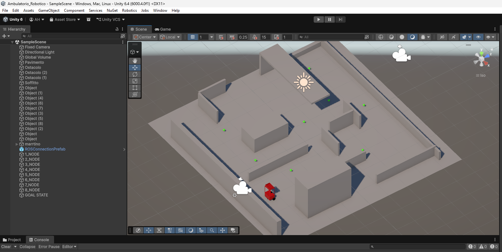
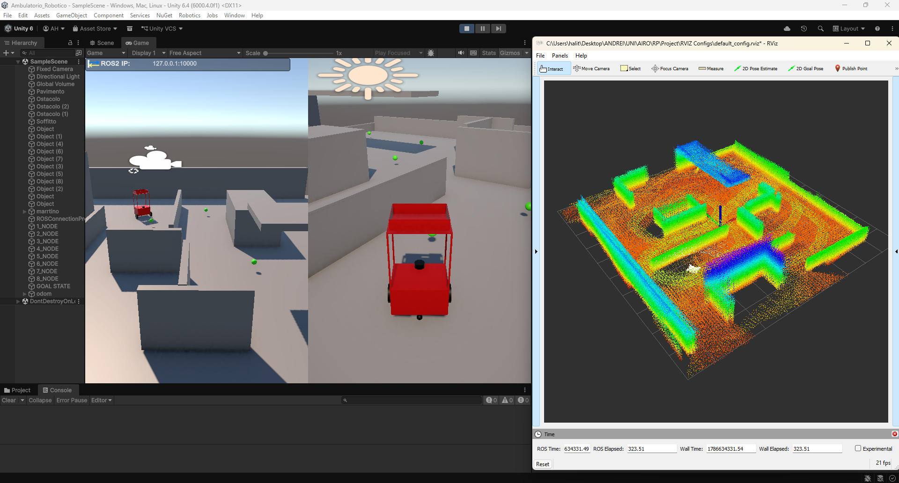
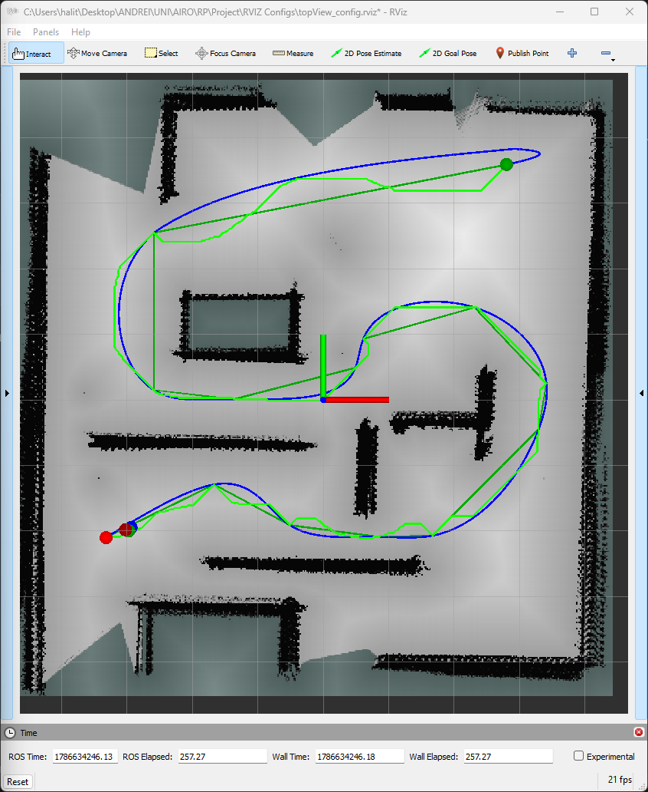
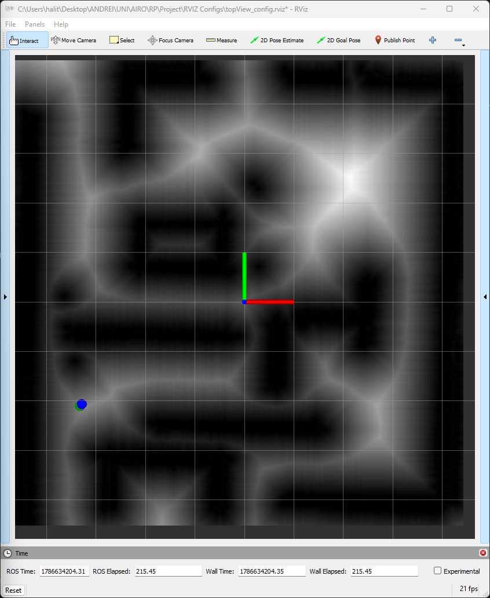
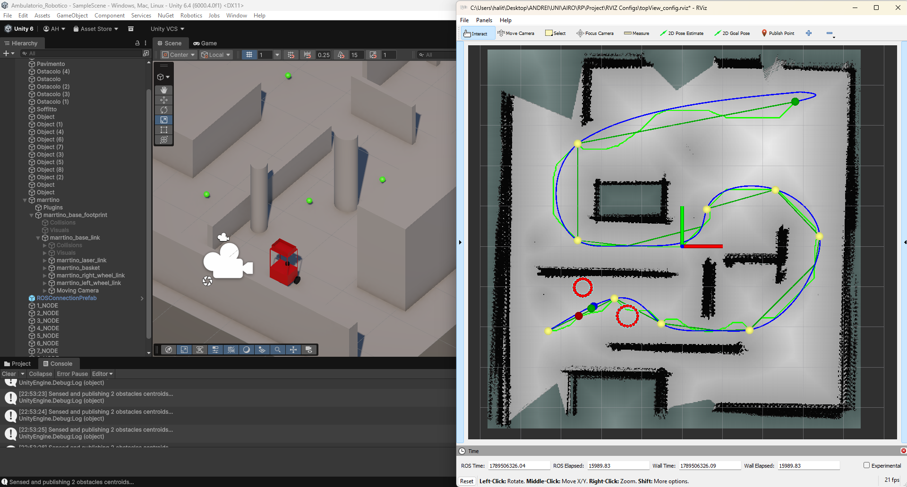

# Robotic Outpatient Clinic — SLAM & Autonomous Navigation Stack

**Course:** Robot Programming (Sapienza, AIRO) — *Phase 2: Human-Robot Interaction*
**Simulator:** Unity (Windows) · **Middleware:** ROS 2 Humble (via ROS-TCP-Connector) · **Visualization:** RViz2
**Robot model:** MARRtino (differential drive, URDF-imported, `ArticulationBody` physics)

---

## 1. Overview

This repository contains a **from-scratch implementation** of a complete mobile-robot autonomy stack, written entirely
in C# inside Unity. No off-the-shelf robotics library is used for the algorithmic core: KD-trees, ICP, pose-graph
optimization, occupancy mapping, distance transforms, graph search, spline interpolation and trajectory-tracking
control are all hand-implemented in this codebase. ROS 2 is used only as a *transport and visualization* layer
(topics are published so that everything can be inspected live in RViz2).

The robot operates in a simulated outpatient clinic (corridors, rooms, static obstacles) and performs two distinct
missions, selected by the `calculateAndOverrideOccupancyMapFlag` switch on the `Orchestrator` component:

| Mode | Flag | What happens |
| :--- | :--- | :--- |
| **Mapping** | `true` | The robot is teleoperated; every LiDAR scan feeds ICP → Graph-SLAM → occupancy grid. The final map (`.pgm` + `.yaml`) and the global point cloud (`.bin`) are written to disk. |
| **Navigation** | `false` | The saved map is loaded, the distance map is computed, a global path is planned to the goal, and the robot drives itself while localizing against the map with scan-to-map ICP. |

### 1.1 Data flow

```
                       ┌──────────────── MAPPING MODE ────────────────┐
 LiDAR 3D scan ──► Voxel downsample ──► KD-tree ──► ICP (scan-to-scan) ──► Pose Graph (SE(3))
      │                                                     │                    │
      │                                                     │            Loop Closure detection
      │                                                     │                    │
      │                                                     │            Robust Gauss-Newton + CG
      │                                                     ▼                    ▼
      └────────────────────────────────► Occupancy Grid (log-odds + Bresenham) ──► map.pgm / map.yaml / cloud.bin

                       ┌────────────── NAVIGATION MODE ───────────────┐
 map.pgm ──► Occupancy Grid ──► Distance Map (EDT, brushfire) ──► Cost map  k/(d+ε)
                                                 │
 waypoints ─────────────────────────────────────►│
                                                 ▼
                                    A* (8-connected, Euclidean heuristic)
                                                 ▼
                                    Line-of-Sight Path Smoothing (string pulling)
                                                 ▼
                                    Cubic spline interpolation (tridiagonal / Thomas)
                                                 ▼
                                    Velocity profiling (forward–backward, TOPP-lite)
                                                 ▼
                                    Nonlinear trajectory-tracking controller
                                                 ▼
                                    Differential-drive inverse kinematics ──► wheel drives

 Wheel encoders ──► Odometry (exact / Runge-Kutta) ──┬──► TF, /odometry
                                                     └──► predict step of scan-to-map localization (ICP + gate)

 LiDAR 3D scan ──► Voxel downsample ──► localized pose ──► "explained by the map?" test on the static EDT
                                                                          │ (unexplained points)
                                                                          ▼
                                                  Grid-hash clustering ──► obstacle circles (cx, cy, r)
                                                                          ▼
                                                  Obstacle tracker (association, velocity, persistence)
```

### 1.2 Screenshot — system overview

This is the simulated environment in Unity:



Here we can see one of the two RViz scenes during the simulation:



---

## 2. Implemented algorithms

Every entry below is implemented in this repository. File links point at the relevant source.

### 2.1 Perception — 3D LiDAR simulation

**File:** [LiDAR3D.cs](LiDAR3D/LiDAR3D.cs)

* **Spherical raycasting sensor model.** A 32-channel × 720-points-per-revolution LiDAR is simulated by sweeping
  horizontal angle `θ ∈ [0°, 360°)` and vertical angle `ψ ∈ [ψ_min, ψ_max]`, casting one `Physics.Raycast` per
  beam and keeping the hit point. Direction from spherical angles:
  `d = (cos ψ sin θ, sin ψ, cos ψ cos θ)`.
* **Gaussian range noise via Box–Muller transform.** Uniform pairs `(u₁, u₂)` are mapped to a normal sample
  `z₀ = σ √(−2 ln u₁) cos(2π u₂) + μ`, added to the measured range. This makes ICP and mapping face a realistic
  noisy input rather than exact geometry.
* Scans are emitted at a fixed rate (`scanFrequenzy`, default 10 Hz) through the `OnScanComplete` event, which is
  the trigger for the whole SLAM pipeline.

### 2.2 Point-cloud preprocessing

* **Voxel-grid downsampling** — [VoxelGrid.cs](VoxelGrid/VoxelGrid.cs).
  Points are hashed into integer voxel keys `⌊p / voxelSize⌋`, and each occupied voxel is replaced by the
  **centroid** of the points inside it. This bounds the ICP problem size and equalizes point density
  (dense near the sensor, sparse far away), which otherwise biases the least-squares solution.
* **KD-tree (3-dimensional)** — [KDTree.cs](Core/Math/KDTree.cs).
  Balanced construction by recursive **median split on the cycling axis** (`axis = depth mod 3`), preserving the
  original index of each point. Three queries are implemented:
  * `NearestNeighbor` — branch-and-bound descent with the standard *hypersphere-vs-splitting-plane* pruning test
    (`δ² < bestDist²` before visiting the far subtree);
  * `KNearestNeighbor(k = 7)` — same descent maintaining a sorted k-best list, pruning against the current k-th
    distance (needed for the plane fit of point-to-plane ICP);
  * `FindCorrespondences` — batched nearest-neighbour association of a whole query cloud with a distance gate,
    used to score the localization fitness.

### 2.3 Wheel odometry

**Files:** [OdometryModel.cs](Odometry/OdometryModel.cs), [OdometryService.cs](Odometry/OdometryService.cs),
[UnicycleModelUtilities.cs](MARRTINOModel/UnicycleModelUtilities.cs)

* **Differential-drive direct kinematics.** From the wheel joint velocities `ω_L, ω_R` read off the
  `ArticulationBody` drives: `v = r/2 (ω_L + ω_R)`, `ω = r/d (ω_L − ω_R)`.
* **Exact integration of the unicycle model** (used when `|ω| > ω_threshold`, i.e. the robot is turning):

  ```
  θ_{k+1} = θ_k + ω Δt
  x_{k+1} = x_k + (v/ω)(sin θ_{k+1} − sin θ_k)
  y_{k+1} = y_k − (v/ω)(cos θ_{k+1} − cos θ_k)
  ```

* **Second-order Runge–Kutta integration** (used on quasi-straight motion, where the exact form degenerates as
  `ω → 0`): `x_{k+1} = x_k + v Δt cos(θ_k + ½ ω Δt)`, and analogously for `y`.
* Integration uses the **real elapsed time** between odometry ticks (the service runs at its own
  `odometryFrequency`, decoupled from the Unity frame rate), clamped against frame hitches.
* **Motion gating** (`isRobotMoving`): a wheel-velocity threshold that tells the rest of the stack whether the
  robot is actually moving — used to stop SLAM from accumulating ICP drift while standing still.

### 2.4 ICP — Iterative Closest Point in SE(3)

**Files:** [ICPSolver.cs](Core/ICP/ICPSolver.cs), [ICPService.cs](Core/ICP/ICPService.cs)

Least-squares registration of two point clouds, solved by **Gauss–Newton on the SE(3) manifold** with a right
perturbation `T ← T · Exp(Δp)`. Two error metrics are implemented and selectable at runtime (`ICPMode`):

* **Point-to-Point (P2P).** Residual `e = T p_i − q_i ∈ ℝ³` against the nearest neighbour `q_i`.
  Analytic 3×6 Jacobian `J = [ I₃ | −[p]ₓ ]` (written out explicitly), with a distance-based weight
  `w = 1/(1 + d²)` and a `maxDistance` rejection gate.
* **Point-to-Cloud / Point-to-Plane (P2C, default).** For each transformed point the *k*=7 nearest target points
  are fetched from the KD-tree, their **3×3 covariance matrix** is built, and its **eigenvector of smallest
  eigenvalue** gives the local surface normal `n` (PCA plane fit). The residual is the scalar projection
  `e = nᵀ(p_new − centroid)`, with 1×6 Jacobian `J = [ nᵀ | (p × n)ᵀ ]`. This converges far faster than P2P on
  planar environments such as corridors.
* **Huber robust kernel** on the P2C residual: `w = 1` if `|e| ≤ δ`, else `w = δ/|e|` — outliers (moving objects,
  spurious returns) contribute linearly instead of quadratically.
* **Normal equations** `H Δp = −b` with `H = Σ w JᵀJ`, `b = Σ w Jᵀe`, Levenberg-style diagonal damping
  `H += λI`, solved by a hand-written unrolled **Gauss–Jordan elimination** on the augmented 6×7 system
  ([`Solve6x6`](Core/Math/MatrixVectorUtilities.cs)).
* **Lie-group utilities** — [PoseMatrix4x4.cs](Core/Math/PoseMatrix4x4.cs): closed-form **`ExpMap`**
  (Rodrigues formula for `R`, plus the `V` matrix for the translation part) and **`LogMap`**
  (trace-based angle recovery, `V⁻¹` by explicit 3×3 inversion), used both by ICP and by Graph-SLAM.
* **Planar constraint.** Since the robot is a ground vehicle, poses are optionally projected onto the horizontal
  plane (`projectPoseToPlane`): vertical translation zeroed and rotation levelled to yaw-only. This is applied
  consistently to odometry *and* loop-closure measurements so that all graph constraints live in the same
  (SE(2)-embedded) space.


### 2.5 Graph-SLAM — pose-graph optimization

**Files:** [GraphSlamService.cs](Core/GraphSLAM/GraphSlamService.cs),
[GraphSlamOptimizer.cs](Core/GraphSLAM/GraphSlamOptimizer.cs),
[LoopClosureFinderService.cs](Core/GraphSLAM/LoopClosureFinderService.cs),
[PoseGraph.cs](Core/GraphSLAM/PoseGraph.cs), [PoseNode.cs](Core/GraphSLAM/PoseNode.cs),
[PoseEdge.cs](Core/GraphSLAM/PoseEdge.cs)

* **Graph construction with keyframe selection.** A new node (pose + its scan + its KD-tree) is created only when
  the **accumulated** relative motion since the last node exceeds a translation or rotation threshold — measured
  in the Lie algebra via `‖LogMap(ΔT)‖`. The odometry edge carries the *accumulated* `T_i⁻¹ T_j`, not the last ICP
  step, so the chain is not artificially contracted.
* **Loop-closure detection.** Two interchangeable strategies:
  * *K-node-gap based* — candidates are older nodes at least `k` IDs back, within a spatial radius;
  * *Time-and-cone based* (default) — a periodic trigger selects older nodes that fall inside a **2D frontal cone**
    (half-angle + max radius) around the live robot heading. The 2D projection makes candidate selection robust to
    vertical drift.
* **Loop-closure verification.** Each candidate is validated by running an **inverse ICP problem**
  (current scan against the candidate's stored KD-tree) initialized with `T_cand⁻¹ T_new`; the closure is accepted
  only if `‖LogMap(ΔT)‖` falls below a threshold. Duplicate node pairs are rejected with a hash set.
* **Global optimization: robust Gauss–Newton on SE(3).** Residual of edge `(i, j)`:
  `e_ij = Log( z_ij⁻¹ · T_i⁻¹ · T_j )`. **Analytic Jacobians** derived with right perturbation:

  ```
  J_j =  J_r⁻¹(e)                ≈ I + ½ ad_e
  J_i = −J_l⁻¹(e) · Adj(z_ij⁻¹)  ≈ −(I − ½ ad_e) · Adj(z_ij⁻¹)
  ```

  where the **adjoint** `Adj(T)` is exact and `J_r⁻¹ / J_l⁻¹` are truncated at first order.
* **Sparse block-structured linear system.** `H = Σ Jᵀ Ω J` is stored as a dictionary/list of **6×6 blocks**
  (only the blocks that actually exist), and `H Δx = −b` is solved with a hand-written
  **Conjugate Gradient** method whose only expensive operation is a sparse block matrix-vector product.
* **Gauge fixing.** Node 0 is anchored by overwriting its diagonal block with the identity, zeroing its
  off-diagonal blocks and its gradient — this removes the 6-DOF null space that would otherwise make `H` singular.
* **Huber robust weighting on loop-closure edges only** (`w = δ/χ` when `χ > δ`), so a wrong closure cannot drag
  the whole trajectory; plus a small Levenberg damping `λ = 10⁻⁴` on the diagonal blocks to keep `H` positive
  definite for CG.
* **Post-optimization re-anchoring.** The ICP accumulator is re-anchored to the optimized pose of the most recent
  node, multiplied by the motion accumulated since that node — so the robot's current pose survives the graph
  correction. The global point cloud and the occupancy grid are then rebuilt from the optimized poses.


### 2.6 Occupancy grid mapping

**File:** [OccupancyGridService.cs](Core/Occupancy%20Grid/OccupancyGridService.cs)

* **3D → 2D projection by height filtering.** Only points whose height falls inside the band `[zMin, zMax]` are
  kept, discarding floor and ceiling returns and retaining walls and obstacles.
* **Inverse sensor model in log-odds.** Cells are stored in a sparse hash map `(cx, cy) → l`, updated additively
  with `l_occ = log(p_occ/(1−p_occ))` for endpoints and `l_free = log(p_free/(1−p_free))` for free space, and
  **clamped** to `[l_min, l_max]` so the map stays responsive instead of saturating. Publication converts back
  with the logistic function `p = 1/(1 + e^{−l})`.
* **Bresenham ray-casting** between sensor cell and endpoint cell marks the traversed cells as free, using the
  classic integer error-accumulation formulation (no floating-point division per step). Two refinements:
  * the ray stops early when it meets a cell already strongly believed occupied (`occBlockThreshold`), preventing
    the beam from "erasing" walls it should not see through;
  * free-space marking is applied **only to near-horizontal beams** (elevation `atan2(Δz, Δh)` below a threshold),
    so tilted beams hitting the floor do not carve fake corridors.
* **Dynamic extent tracking** — the map bounding box grows with the explored area, and the publishable
  `nav_msgs/OccupancyGrid` (0..100, −1 unknown) is generated on demand from the sparse map.
* **Persistence** — [IOFileOperationService.cs](IO%20Operations/IOFileOperationService.cs) writes and reads the
  standard ROS `map_server` pair: binary **PGM (P5)** + **YAML** metadata, handling the vertical row flip between
  the PGM convention (origin top-left) and the ROS OccupancyGrid convention (origin bottom-left). The global point
  cloud is serialized alongside as a compact binary `.bin`.



### 2.7 Distance map (Euclidean Distance Transform)

**File:** [DistanceMapService.cs](Core/DistanceMap/DistanceMapService.cs)

* **Brushfire / wavefront EDT**: a multi-source **Dijkstra expansion seeded from every occupied cell**
  simultaneously, on the 8-connected grid with metric costs `1` (orthogonal) and `√2` (diagonal). The result is,
  for each free cell, the distance to the nearest obstacle. Ridges of the field are the Generalized Voronoi
  Diagram of the environment.
* Implemented on a **binary min-heap priority queue** written from scratch
  ([SimplePriorityQueue.cs](Core/DistanceMap/SimplePriorityQueue.cs)) with the standard lazy-deletion check
  (`if currDist > dist[u] → skip`), giving `O(N log N)` behaviour without a decrease-key operation.
* Publishes a normalized visualization of the field as an `OccupancyGrid` on `/distanceMap`, and exposes an
  immutable `DistanceMap` object (grid ↔ world conversions, neighbours, heuristic, path reconstruction) to the
  planner.



### 2.8 Global path planning — A*

**File:** [MotionPlannerService.cs](Core/MotionPlanner/MotionPlannerService.cs)

* **A\* search on the 8-connected grid** with the standard `f(n) = g(n) + h(n)` expansion over the min-heap
  priority queue.
* **Cost map derived from the distance transform.** The transition cost of stepping into cell `v` is

  ```
  c(u → v) = dist(u, v) + k / (EDT(v) + ε)
  ```

  i.e. a metric term (1 or √2) plus a **repulsive term that grows hyperbolically near obstacles**. The gains `k`
  and `ε` trade off path length against clearance: the resulting path is short *and* safe, staying away from walls
  instead of hugging them. Cells with `EDT = 0` (obstacles) are hard-rejected.
* **Heuristic**: Euclidean distance to the goal in cell units — admissible with respect to the metric part of the
  cost.
* **Multi-waypoint planning** (`DetermineGeometricTrajectoryFromWaypoints`). The mission is expressed as an ordered
  list `[start, 1_NODE, 2_NODE, …, GOAL STATE]` read directly from the Unity scene hierarchy; A* runs on every
  consecutive pair and the segments are concatenated without duplicating shared nodes. Intermediate waypoint
  indices are recorded so that the smoothing stage cannot cut them away.

### 2.9 Path smoothing — Line-of-Sight Path Smoothing (string pulling)

**File:** [MotionPlannerService.cs](Core/MotionPlanner/MotionPlannerService.cs) — `smoothGeometricTrajectoryWithLOSPS`

Raw A* output is a staircase with one vertex per cell. LOS-PS keeps only the minimal set of vertices such that
consecutive kept vertices **see each other in straight line inside a safety tunnel**:

* the candidate segment is sampled at **half-cell steps** (Nyquist criterion on the grid, so no occupied cell can
  be skipped);
* each sample must have clearance `EDT · resolution ≥ ε`, where `ε` is derived from the robot footprint
  (URDF base 0.28 × 0.37 m → circumscribed radius ≈ 0.23 m, `ε = 0.25 m` adds margin);
* when visibility from the current anchor breaks, the last visible vertex becomes a real "elbow" and the new
  anchor.

This removes zig-zag along straight corridors while preserving the corners genuinely imposed by obstacles, and it
gives the spline stage far fewer, far more meaningful knots.


### 2.10 Trajectory generation — cubic splines with assigned boundary conditions

**Files:** [MotionPlannerService.cs](Core/MotionPlanner/MotionPlannerService.cs),
[TridiagonalSolver.cs](Core/Math/TridiagonalSolver.cs)

* **Time-law assignment.** Knots are time-stamped by chord length divided by the mean cruise velocity,
  `t_{i+1} = t_i + ‖p_{i+1} − p_i‖ / v_mean`.
* **Interpolating cubic splines with assigned initial/final velocity and acceleration.** The classical trick of
  **two virtual knots** (`q₂` and `q_{N+1}`, inserted at the midpoints of the first and last intervals) is used to
  absorb the four extra boundary conditions; their positions are given in closed form from the desired
  `(v_i, a_i)` and `(v_f, a_f)`, and later completed with the acceleration terms.
* The continuity conditions produce a **tridiagonal linear system in the knot accelerations**, assembled as the
  `(a, b, c)` diagonals with the modified first/last rows accounting for the virtual knots, and solved by the
  **Thomas algorithm** (forward sweep + back substitution, `O(N)`) with pivot-degeneracy checks.
* Per-interval polynomial coefficients follow:
  `d_k = q_k`, `b_k = q̈_k/2`, `a_k = Δq̈_k /(6Δt_k)`, `c_k = Δq_k/Δt_k − (Δt_k/6)(Δq̈_k + 3q̈_k)`.
  `x(τ)` and `y(τ)` are splined independently and sub-sampled to produce the smooth geometric path.

### 2.11 Velocity profiling — forward–backward pass (TOPP-lite)

**File:** [MotionPlannerService.cs](Core/MotionPlanner/MotionPlannerService.cs) —
`DetermineGeometricTrajectoryTableForController`
**Companion write-up:** [`TrajectoryProfiling_Math.md`](../../../../TrajectoryProfiling_Math.md) (project root)

The key idea is to **decouple geometry from timing**: a trajectory is a path `p(s)` plus a time law `s(t)`.

1. **Geometry extraction.** The spline is densely sampled and, for each sample, three reparametrization-invariant
   quantities are computed: cumulative **arc length** `s`, **heading** `θ = atan2(y′, x′)`, and **curvature**

   ```
   κ = (x′ y″ − y′ x″) / (x′² + y′²)^{3/2}
   ```

2. **Velocity profile.** A static cap `v(s) = min(v_cruise, ω_max/|κ(s)|)` slows the robot inside curves
   (since `ω = κv`), followed by a **forward pass** `v_i ≤ √(v_{i−1}² + 2a_max Δs)` (acceleration from rest) and a
   **backward pass** `v_i ≤ √(v_{i+1}² + 2a_max Δs)`. The backward pass is what gives genuine **pre-braking before
   a tight curve** and a guaranteed stop at the goal, not only a deceleration ramp at the end. A floor `v_min`
   prevents the arc-length stepping from stalling at the endpoints.
3. **Resampling at the control step.** The arc is advanced with `s_{n+1} = s_n + v(s_n)Δt`, positions are
   interpolated **by arc length**, and the time derivatives are reconstructed from `(θ, κ, v)`:

   ```
   ẋ = v cos θ,   ẏ = v sin θ,   ẍ ≈ −v²κ sin θ,   ÿ ≈ v²κ cos θ
   ```

   Under this reconstruction the controller's feed-forward evaluates *exactly* to `ω_des = κv` (the `v̇` term
   cancels analytically), which is why the tracking controller needs no modification. Reference position and
   reference time advance at the same rate `Δs/Δt = v`, structurally eliminating the "reference running away from
   the robot" failure mode.

### 2.12 Trajectory tracking control

**File:** [ControllerService.cs](Core/Controller/ControllerService.cs)

* **Cartesian error in the robot frame** (the standard rotation of the tracking error):

  ```
  e₁ =  cos θ · e_x + sin θ · e_y      (longitudinal)
  e₂ = −sin θ · e_x + cos θ · e_y      (lateral)
  e₃ = wrapToPi(θ_des − θ)             (heading, wrapped to (−π, π])
  ```

* **Nonlinear (Lyapunov-based) feedback control law** for the unicycle:

  ```
  u₁ = −k₁ e₁
  u₂ = −k₂ v_des · sinc(e₃) · e₂ − k₃ e₃
  v  = v_des cos e₃ − u₁
  ω  = ω_des − u₂
  ```

  with the standard time-varying gain assignment `k₁ = k₃ = 2ζ√(b v_des² + ω_des²)`, `k₂ = b`, which makes the
  closed loop behave like a critically-damped second-order system independently of the reference speed.
  `sinc(e₃) = sin(e₃)/e₃` is evaluated with the `e₃ → 0` limit handled explicitly.
* **Feed-forward terms** are read from the profiled reference table: `v_des = √(ẋ² + ẏ²)`,
  `θ_des = atan2(ẏ, ẋ)`, `ω_des = (ẋÿ − ẏẍ)/(ẋ² + ẏ²)` (with a guard against `0/0` on the final at-rest row).
* **Safety layer**: saturation `v ∈ [−v_max, v_max]`, `ω ∈ [−ω_max, ω_max]`, plus a NaN/Inf rejection filter
  (NaN silently passes `Math.Clamp`, and would otherwise reach the physics drives).
* **Differential-drive inverse kinematics** `ω_L = (v + ωd/2)/r`, `ω_R = (v − ωd/2)/r`, applied to the
  `ArticulationDrive` targets — with the rad/s → deg/s conversion Unity's velocity drives require.
* The architecture leaves room for two further strategies declared in the `ControlStrategy` enum
  (`ApproximateLinearization`, `IOLinearization`), currently not implemented.


### 2.13 Localization in a known map — scan-to-map ICP with predict/correct/gate

**File:** [LocalizationService.cs](Core/Localization/LocalizationService.cs)

A three-stage filter that fuses wheel odometry with LiDAR registration against the stored map:

* **Predict** — the previous pose estimate is composed with the *relative* motion of the wheel odometry,
  `guess = T_map_laser · ΔT_odom` (dead reckoning). The guess therefore tracks the robot between corrections,
  and ICP always starts close to the truth.
* **Correct** — ICP of the live scan against the **downsampled global map cloud** (a KD-tree built once at
  startup), initialized with the predicted pose, followed by planar projection.
* **Gate** — the correction is accepted only if all three tests pass:
  * **inlier ratio** `= |correspondences| / |scan points|` above `minInlierRatio` (fraction of the scan explained
    by the map);
  * **mean residual** below `maxResidual` (metres);
  * **jump magnitude** `‖t_corrected − t_guess‖` below `maxJump` — a large jump signals a wrong ICP basin.

  On rejection the filter falls back on the *predicted* pose, not the stale one, so the estimate keeps moving with
  the robot and the guess never goes stale.
* Correction runs at its own rate (`localizationPeriod`, ≈ 3 Hz) since ICP is expensive, while the prediction runs
  at full odometry rate (55 Hz). The localized pose is what the trajectory controller closes the loop on
  (selectable between odometry-only, ICP-localized, or ground truth for debugging).


### 2.14 Dynamic obstacle manager — detection and tracking

**Files:** [DynamicObstacleService.cs](Core/ObstaclesManager/DynamicObstacleService.cs),
[ObstacleTrackerService.cs](Core/ObstaclesManager/ObstacleTrackerService.cs)

In navigation mode the saved map is static, so anything the LiDAR sees that the map does not explain is, by
definition, a **new obstacle** (a person, a cart, a door that was closed during mapping). The obstacle manager runs
on every scan (`OnScanComplete`, 10 Hz) and turns the raw cloud into a small list of tracked circles that the
downstream safety layer (CBF, see §6) and the replanning logic can consume.

**Detection** (`getROSObstacleCentroids`) — a per-scan pipeline designed to be cheap on ~23k points:

1. **Voxel downsampling** first (`voxelSize`), so every later step works on ~1–2k points.
2. **Re-projection through the localized pose.** Points are brought back to the laser frame and re-projected with
   `T_map_laser` from the localization filter (§2.13) — *not* with the Unity ground-truth transform — so the
   detector sees the world exactly as the rest of the stack estimates it. The result is expressed in the 2D ROS map
   frame, the same frame used by the planner and the controller.
3. **Geometric filters:** height band `[zMin, zMax]` (as in mapping), self-hit rejection within `bodyRadius` of the
   laser, and a **maximum detection range** `maxDetectionRange` — far returns are both unreliable and useless for
   local avoidance.
4. **"Explained by the map" test on the distance transform.** Instead of comparing against the single occupied
   cell, each point is looked up in the static EDT: it is *unexplained* when

   ```
   EDT(p) · resolution  >  tol(d) = obsTol + obsTolPerMeter · d
   ```

   with `d` the range from the laser. Using the EDT makes the test tolerant to localization error and range noise
   (a wall seen 5 cm off still has near-zero clearance), and the **range-dependent tolerance** accounts for the
   fact that a heading error of 1° displaces a point by 1.7 cm per metre of range, on top of the sensor noise and
   the chamfer overestimate of the 8-connected EDT. Unknown cells (`−1`) are free for the EDT, so returns from
   never-mapped regions are legitimately flagged.
5. **Grid-hash Euclidean clustering.** Unexplained points are bucketed in cells of side `clusteringRadius` and
   connected components over the 8-neighbourhood are extracted by BFS — `O(n)` without a KD-tree. Clusters with
   fewer than `minClusterPoints` points are discarded as noise; each surviving cluster becomes a bounding circle
   `(centroid, max distance from centroid + clusterMargin)`.



*Known sensor limit:* the LiDAR has a ±15° vertical field of view, so an obstacle lower than the laser mount
disappears when closer than `d_blind ≈ (h_laser − h_obstacle) / tan 15°`. This is physical, not algorithmic, and it
is exactly the gap the tracker is meant to bridge.

**Tracking** (`ObstacleTrackerService`) — per-scan detections have no identity and flicker; the tracker turns them
into persistent `ObstacleTrack` objects (`id, cx, cy, r, vx, vy, firstSeen, lastSeen, hits`):

* **Association**: greedy nearest-neighbour between live tracks and detections with a distance gate (`trackGate`),
  oldest tracks choosing first. Unassigned detections spawn new tracks.
* **Velocity estimate** by finite differences over the *actual* elapsed time since the last association (so a
  missed scan does not corrupt it), smoothed with a first-order low-pass (`trackAlphaLowpass`) and zeroed inside a
  dead-zone (`trackVDeadzone`) so centroid jitter is not mistaken for motion. This is the `ṗ_obs` term the CBF
  needs for moving obstacles.
* **Radius with slow decay** `r ← max(r_det, 0.9 r)`: a partial view (obstacle seen from one side) must not
  collapse the safety circle on a single frame.
* **Confirmation and forgetting**: a track is exposed to consumers only after `trackMinHits` associations
  (single-frame noise never reaches the controller) and is dropped after `trackForgetTime` without detections
  (covers occlusions and the vertical blind cone). Track age is what the replanning trigger will use to decide that
  an obstacle is *persistent* rather than transient.

Both stages are visualized in RViz as sampled circles on `/debug/dynamic_obstacles` (instantaneous detections) and
`/debug/tracked_obstacles` (confirmed tracks only); an empty list explicitly clears the display so that the
visualization reflects the true per-scan state.

### 2.15 Supporting numerical library

**File:** [MatrixVectorUtilities.cs](Core/Math/MatrixVectorUtilities.cs) (~1200 lines, hand-written)

Fixed-size linear algebra used throughout: 3×3/4×4/6×6 products and sums, transposes, skew-symmetric matrix,
SE(3) **adjoint** `Adj(T)` and se(3) **little adjoint** `ad_ξ`, `T` compose/decompose/inverse, covariance matrix
and minimum-eigenvector extraction (via Math.NET EVD), plane projection of a pose, unrolled 6×6 Gauss–Jordan
solve, and block-accumulation helpers for the sparse Hessian.

---

## 3. ROS 2 interface

All state is published for inspection in RViz2 ([`RVIZ Configs/`](../../../../RVIZ%20Configs) contains ready-made
configurations). Publishing is centralized in [PublishingService.cs](Publishers/PublishingService.cs), with
throttled republication rates per topic to avoid saturating the TCP queue.

| Topic | Type | Content |
| :--- | :--- | :--- |
| `/icp/map` | `PointCloud2` | Live scan registered by ICP |
| `/icp/map_global` | `PointCloud2` | Optimized global point cloud (Graph-SLAM) |
| `/icp/path` | `Path` | Trajectory estimated by scan-to-scan ICP |
| `/odometry`, `/odometry/path` | `Odometry`, `Path` | Wheel odometry pose and history |
| `/tf` | `TFMessage` | Frame tree |
| `/graph_slam/nodes` | `PointCloud2` | Pose-graph nodes |
| `/graph_slam/loop_closure_edges` | `PointCloud2` | Accepted loop closures |
| `/graph_slam/loop_closure_radius`, `/graph_slam/cone_fan` | `PointCloud2` | Loop-closure search region |
| `/occupancy_grid` | `OccupancyGrid` | Occupancy map |
| `/distanceMap` | `OccupancyGrid` | Distance transform (normalized) |
| `/planned_path` | `Path` | Raw A* path |
| `/smoothed_path` | `Path` | Path after LOS-PS |
| `/splined_path` | `Path` | Final splined geometric trajectory |
| `/debug/start_pose`, `/debug/waypoints`, `/debug/goal_pose` | `PointCloud2` | Mission definition |
| `/debug/current_pose`, `/debug/true_pose`, `/debug/localization/icp_pose` | `PointCloud2` | Odometric, ground-truth and localized poses |
| `/debug/dynamic_obstacles`, `/debug/tracked_obstacles` | `PointCloud2` | Per-scan obstacle detections and confirmed tracks (sampled circles) |
| `/cmd_vel` *(subscribed)* | `Twist` | External teleoperation input |

---

## 4. Code map

```
Assets/Scripts/
├── Orchestration/
│   └── Orchestrator.cs              Central MonoBehaviour: parameters, service wiring, main loop
├── Core/
│   ├── ICP/                         ICPSolver (GN on SE(3), P2P/P2C, Huber), ICPService
│   ├── GraphSLAM/                   PoseGraph/Node/Edge, GraphSlamService, GraphSlamOptimizer (GN + CG),
│   │                                LoopClosureFinderService
│   ├── Occupancy Grid/              OccupancyGridService (log-odds + Bresenham)
│   ├── DistanceMap/                 DistanceMapService (brushfire EDT), SimplePriorityQueue (binary heap)
│   ├── MotionPlanner/               MotionPlannerService (A*, LOS-PS, splines, velocity profiling)
│   ├── Controller/                  ControllerService (nonlinear tracking control)
│   ├── Localization/                LocalizationService (predict / correct / gate)
│   ├── ObstaclesManager/            DynamicObstacleService (EDT-based detection + clustering),
│   │                                ObstacleTrackerService (association, velocity, persistence)
│   └── Math/                        MatrixVectorUtilities, PoseMatrix4x4 (Exp/Log), KDTree,
│                                    TridiagonalSolver, ICPUtils
├── LiDAR3D/                         LiDAR3D sensor simulation + publisher
├── VoxelGrid/                       Voxel downsampling + publisher
├── Odometry/                        OdometryModel (exact / RK2), OdometryService
├── MARRTINOModel/                   DifferentialDriveController, UnicycleModelUtilities
├── Publishers/                      PublishingService (all ROS message construction)
├── IO Operations/                   IOFileOperationService (PGM/YAML/BIN persistence)
└── KDTree/                          KD-tree debug visualization
```

---

## 5. Configuration

All tunable parameters are exposed as public fields on the `Orchestrator` component in the Unity Inspector,
grouped by subsystem (ICP, ROS topics, Graph-SLAM, odometry, occupancy grid, distance map, motion planning,
control). The most relevant ones:

| Parameter | Default | Meaning |
| :--- | :--- | :--- |
| `calculateAndOverrideOccupancyMapFlag` | `false` | `true` = mapping mission, `false` = navigation mission |
| `icpMode` | `P2C` | Point-to-plane vs point-to-point ICP |
| `voxelSize` | `0.1 m` | Downsampling resolution |
| `resolution` | `0.02 m` | Occupancy grid cell size |
| `zMin` / `zMax` | `0.2` / `1.0 m` | Height band kept for 2D projection |
| `k` / `eps` | `50` / `0.01` | Obstacle-repulsion gain and regularizer in the A* cost map |
| `epsilonTunnelLoSPS` | `0.25 m` | Safety half-width of the line-of-sight tunnel |
| `linearMeanVelocity` / `vMax` | `0.3` / `0.5 m/s` | Cruise and maximum linear velocity |
| `wMax` / `wMaxClamp` | `2.0` / `4.0 rad/s` | Curvature cap in the profile / controller saturation |
| `aMax` | `0.2 m/s²` | Tangential acceleration for the velocity profile |
| `b` / `zeta` | `10.0` / `0.8` | Nonlinear controller gain parameters |
| `useICPLocalization` | `true` | Close the control loop on the localized pose instead of raw odometry |
| `minInlierRatio` / `maxResidual` / `maxLocalizationJump` | `0.6` / `0.25 m` / `0.4 m` | Localization acceptance gates |
| `obsTol` / `obsTolPerMeter` | `0.2 m` / `0.03 m/m` | "Explained by the map" clearance tolerance at zero range and its growth with range |
| `maxDetectionRange` / `bodyRadius` | `3.5` / `0.45 m` | Detection range window (far cut-off / self-hit rejection) |
| `clusteringRadius` / `minClusterPoints` / `clusterMargin` | `0.3 m` / `4` / `0.05 m` | Grid-hash clustering cell, noise threshold, safety margin on the circle radius |
| `trackGate` / `trackAlphaLowpass` / `trackVDeadzone` | `0.5 m` / `0.3` / `0.05 m/s` | Track association gate, velocity low-pass, velocity dead-zone |
| `trackMinHits` / `trackForgetTime` | `3` / `1.0 s` | Confirmations needed to expose a track / time without detections before dropping it |

---

## 6. Current status and next steps

**Completed:** LiDAR simulation, voxel/KD-tree preprocessing, wheel odometry, ICP (P2P and P2C) with robust
kernels and planar constraint, Graph-SLAM with loop closure and robust Gauss–Newton + CG optimization, occupancy
grid mapping with persistence, Euclidean distance transform, A* global planning over the EDT cost map, LOS-PS
smoothing, cubic-spline trajectory generation, forward–backward velocity profiling, nonlinear trajectory tracking,
scan-to-map localization, and per-scan **dynamic obstacle detection and tracking** (§2.14).

**In progress — from a static to a dynamic planner.** The global planner currently runs **once**, at startup, on
the static map. The obstacle manager above is the perception front-end of the dynamic behaviour; the remaining
work closes the loop:

1. **Control Barrier Functions (CBF) as a safety filter on the tracking controller.** A small QP (solved with the
   Goldfarb–Idnani dual method from `Accord.Math`) minimally corrects the nominal control `(v, ω)` subject to:
   one barrier constraint per tracked obstacle `h = ‖p_b − p_obs‖² − R²` (with the obstacle velocity from the
   tracker), one barrier from the static EDT `h = EDT(p_b)·res − r_safe`, and a relaxed Lyapunov (CLF) constraint
   on the tracking error. Constraints are written on the look-ahead point `p_b = p + b[cos θ, sin θ]ᵀ` so that
   both `v` and `ω` enter with relative degree one.
2. **Replanning triggers**: an obstacle track persistent on the remaining reference, an excessive deviation from
   the reference, or a CBF active for too long.
3. **Replanning pipeline**: paint the persistent tracks into a copy of the static occupancy grid, recompute the
   EDT, re-run A* → LOS-PS → spline → velocity profile from the current localized pose to the remaining waypoints,
   and re-arm the controller. Re-starting from the *pristine* map plus the *currently* tracked obstacles is what
   lets the original path be recovered once an obstacle leaves.
4. Replace the Euclidean A* heuristic with the **exact cost-to-go from a Dijkstra expansion on an empty map**
   (tighter, still admissible and consistent → fewer expanded nodes).
5. Full **ROS navigation-stack integration** (subscribe `/scan`, pose from TF `map → base_link`, standard
   `nav_msgs/Path` output).

**Phase 2 (Human-Robot Interaction):** human tracking, proxemics-aware social navigation (repulsive field shaped
by personal-space models), and a 2D operator interface.

