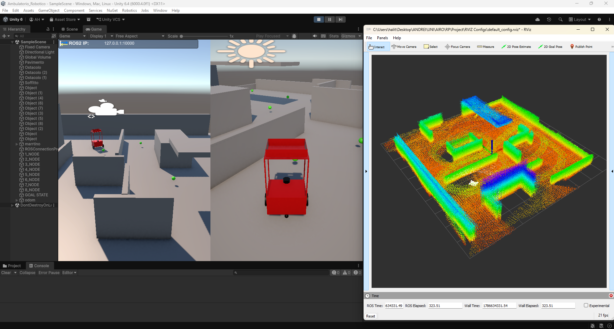
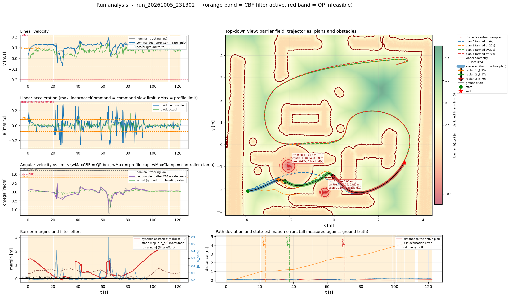

# Robotic Outpatient Clinic — SLAM & Autonomous Navigation Stack

**Course:** Robot Programming (Sapienza, AIRO) — *Phase 2: Human-Robot Interaction*
**Simulator:** Unity (Windows) · **Middleware:** ROS 2 Humble (via ROS-TCP-Connector) · **Visualization:** RViz2
**Robot model:** MARRtino (differential drive, URDF-imported, `ArticulationBody` physics)

---

## 1. Overview

This repository contains a **from-scratch implementation** of a complete mobile-robot autonomy stack, written entirely
in C# inside Unity. No off-the-shelf robotics library is used for the algorithmic core: KD-trees, ICP, pose-graph
optimization, occupancy mapping, distance transforms, graph search, spline interpolation and trajectory-tracking
control are all hand-implemented in this codebase. ROS 2 is used only as a *transport and visualization* layer
(topics are published so that everything can be inspected live in RViz2).

> **Full derivation.** This README is a map of the system. The complete mathematical treatment — every algorithm
> derived, every symbol bound to its C# identifier, with the stability and invariance proofs written out — is in
> [Documentation/Autonomy_Stack_Lecture_Notes.md](Documentation/Autonomy_Stack_Lecture_Notes.md) (39 chapters).

The robot operates in a simulated outpatient clinic (corridors, rooms, static obstacles) and performs two distinct
missions, selected by the `calculateAndOverrideOccupancyMapFlag` switch on the `Orchestrator` component:

| Mode | Flag | What happens |
| :--- | :--- | :--- |
| **Mapping** | `true` | The robot is teleoperated; every LiDAR scan feeds ICP → Graph-SLAM → occupancy grid. The final map (`.pgm` + `.yaml`) and the global point cloud (`.bin`) are written to disk. |
| **Navigation** | `false` | The saved map is loaded, the distance map is computed, a global path is planned to the goal, and the robot drives itself while localizing against the map with scan-to-map ICP. |

### 1.1 Data flow

```
                       ┌──────────────── MAPPING MODE ────────────────┐
 LiDAR 3D scan ──► Voxel downsample ──► KD-tree ──► ICP (scan-to-scan) ──► Pose Graph (SE(3))
      │                                                     │                    │
      │                                                     │            Loop Closure detection
      │                                                     │                    │
      │                                                     │            Robust Gauss-Newton + CG
      │                                                     ▼                    ▼
      └────────────────────────────────► Occupancy Grid (log-odds + Bresenham) ──► map.pgm / map.yaml / cloud.bin

                       ┌────────────── NAVIGATION MODE ───────────────┐
 map.pgm ──► Occupancy Grid ──► Distance Map (EDT, brushfire) ──► Cost map  k/(d+ε)
                                                 │
 waypoints ─────────────────────────────────────►│
                                                 ▼
                                    A* (8-connected, Euclidean heuristic)
                                                 ▼
                                    Line-of-Sight Path Smoothing (string pulling)
                                                 ▼
                                    Cubic spline interpolation (tridiagonal / Thomas)
                                                 ▼
                                    Velocity profiling (forward–backward, TOPP-lite)
                                                 ▼
                                    Nonlinear trajectory-tracking controller
                                                 ▼
                                    CBF safety filter (QP: barriers + CLF) ◄── tracked obstacles + EDT
                                                 ▼
                                    Command slew-rate limit
                                                 ▼
                                    Differential-drive inverse kinematics ──► wheel drives

 Wheel encoders ──► Odometry (exact / Runge-Kutta) ──┬──► TF, /odometry
                                                     └──► predict step of scan-to-map localization (ICP + gate)

 LiDAR 3D scan ──► Voxel downsample ──► localized pose ──► "explained by the map?" test on the static EDT
                                                                          │ (unexplained points)
                                                                          ▼
                                                  Grid-hash clustering ──► obstacle circles (cx, cy, r)
                                                                          ▼
                                                  Obstacle tracker (association, velocity, persistence)
                                                                          │
                                                                          ├──► CBF safety filter (above)
                                                                          ▼
                                                  Replanning FSM (Following / Replanning / Blocked)
                                                   triggers: persistent obstacle, stall, deviation, infeasible
                                                                          ▼
                                   persistent tracks painted onto a COPY of the pristine occupancy grid
                                                                          ▼
                                   EDT ──► A* ──► LOS-PS ──► spline ──► profile  (from the current pose,
                                                                          ▼        through the REMAINING waypoints)
                                                              controller re-armed
```

### 1.2 Screenshot — system overview

This is the simulated environment in Unity:


Here we can see one of the two RViz scenes during the simulation:



---

## 2. Implemented algorithms

Every entry below is implemented in this repository. File links point at the relevant source.

### 2.1 Perception — 3D LiDAR simulation

**File:** [LiDAR3D.cs](LiDAR3D/LiDAR3D.cs)

* **Spherical raycasting sensor model.** A 32-channel × 720-points-per-revolution LiDAR is simulated by sweeping
  horizontal angle `θ ∈ [0°, 360°)` and vertical angle `ψ ∈ [ψ_min, ψ_max]`, casting one `Physics.Raycast` per
  beam and keeping the hit point. Direction from spherical angles:
  `d = (cos ψ sin θ, sin ψ, cos ψ cos θ)`.
* **Gaussian range noise via Box–Muller transform.** Uniform pairs `(u₁, u₂)` are mapped to a normal sample
  `z₀ = σ √(−2 ln u₁) cos(2π u₂) + μ`, added to the measured range. This makes ICP and mapping face a realistic
  noisy input rather than exact geometry.
* Scans are emitted at a fixed rate (`scanFrequenzy`, default 10 Hz) through the `OnScanComplete` event, which is
  the trigger for the whole SLAM pipeline.

### 2.2 Point-cloud preprocessing

* **Voxel-grid downsampling** — [VoxelGrid.cs](VoxelGrid/VoxelGrid.cs).
  Points are hashed into integer voxel keys `⌊p / voxelSize⌋`, and each occupied voxel is replaced by the
  **centroid** of the points inside it. This bounds the ICP problem size and equalizes point density
  (dense near the sensor, sparse far away), which otherwise biases the least-squares solution.
* **KD-tree (3-dimensional)** — [KDTree.cs](Core/Math/KDTree.cs).
  Balanced construction by recursive **median split on the cycling axis** (`axis = depth mod 3`), preserving the
  original index of each point. Three queries are implemented:
  * `NearestNeighbor` — branch-and-bound descent with the standard *hypersphere-vs-splitting-plane* pruning test
    (`δ² < bestDist²` before visiting the far subtree);
  * `KNearestNeighbor(k = 7)` — same descent maintaining a sorted k-best list, pruning against the current k-th
    distance (needed for the plane fit of point-to-plane ICP);
  * `FindCorrespondences` — batched nearest-neighbour association of a whole query cloud with a distance gate,
    used to score the localization fitness.

### 2.3 Wheel odometry

**Files:** [OdometryModel.cs](Odometry/OdometryModel.cs), [OdometryService.cs](Odometry/OdometryService.cs),
[UnicycleModelUtilities.cs](MARRTINOModel/UnicycleModelUtilities.cs)

* **Differential-drive direct kinematics.** From the wheel joint velocities `ω_L, ω_R` read off the
  `ArticulationBody` drives: `v = r/2 (ω_L + ω_R)`, `ω = r/d (ω_L − ω_R)`.
* **Exact integration of the unicycle model** (used when `|ω| > ω_threshold`, i.e. the robot is turning):

  ```
  θ_{k+1} = θ_k + ω Δt
  x_{k+1} = x_k + (v/ω)(sin θ_{k+1} − sin θ_k)
  y_{k+1} = y_k − (v/ω)(cos θ_{k+1} − cos θ_k)
  ```

* **Second-order Runge–Kutta integration** (used on quasi-straight motion, where the exact form degenerates as
  `ω → 0`): `x_{k+1} = x_k + v Δt cos(θ_k + ½ ω Δt)`, and analogously for `y`.
* Integration uses the **real elapsed time** between odometry ticks (the service runs at its own
  `odometryFrequency`, decoupled from the Unity frame rate), clamped against frame hitches.
* **Motion gating** (`isRobotMoving`): a wheel-velocity threshold that tells the rest of the stack whether the
  robot is actually moving — used to stop SLAM from accumulating ICP drift while standing still.

### 2.4 ICP — Iterative Closest Point in SE(3)

**Files:** [ICPSolver.cs](Core/ICP/ICPSolver.cs), [ICPService.cs](Core/ICP/ICPService.cs)

Least-squares registration of two point clouds, solved by **Gauss–Newton on the SE(3) manifold** with a right
perturbation `T ← T · Exp(Δp)`. Two error metrics are implemented and selectable at runtime (`ICPMode`):

* **Point-to-Point (P2P).** Residual `e = T p_i − q_i ∈ ℝ³` against the nearest neighbour `q_i`.
  Analytic 3×6 Jacobian `J = [ I₃ | −[p]ₓ ]` (written out explicitly), with a distance-based weight
  `w = 1/(1 + d²)` and a `maxDistance` rejection gate.
* **Point-to-Cloud / Point-to-Plane (P2C, default).** For each transformed point the *k*=7 nearest target points
  are fetched from the KD-tree, their **3×3 covariance matrix** is built, and its **eigenvector of smallest
  eigenvalue** gives the local surface normal `n` (PCA plane fit). The residual is the scalar projection
  `e = nᵀ(p_new − centroid)`, with 1×6 Jacobian `J = [ nᵀ | (p × n)ᵀ ]`. This converges far faster than P2P on
  planar environments such as corridors.
* **Huber robust kernel** on the P2C residual: `w = 1` if `|e| ≤ δ`, else `w = δ/|e|` — outliers (moving objects,
  spurious returns) contribute linearly instead of quadratically.
* **Normal equations** `H Δp = −b` with `H = Σ w JᵀJ`, `b = Σ w Jᵀe`, Levenberg-style diagonal damping
  `H += λI`, solved by a hand-written unrolled **Gauss–Jordan elimination** on the augmented 6×7 system
  ([`Solve6x6`](Core/Math/MatrixVectorUtilities.cs)).
* **Lie-group utilities** — [PoseMatrix4x4.cs](Core/Math/PoseMatrix4x4.cs): closed-form **`ExpMap`**
  (Rodrigues formula for `R`, plus the `V` matrix for the translation part) and **`LogMap`**
  (trace-based angle recovery, `V⁻¹` by explicit 3×3 inversion), used both by ICP and by Graph-SLAM.
* **Planar constraint.** Since the robot is a ground vehicle, poses are optionally projected onto the horizontal
  plane (`projectPoseToPlane`): vertical translation zeroed and rotation levelled to yaw-only. This is applied
  consistently to odometry *and* loop-closure measurements so that all graph constraints live in the same
  (SE(2)-embedded) space.


### 2.5 Graph-SLAM — pose-graph optimization

**Files:** [GraphSlamService.cs](Core/GraphSLAM/GraphSlamService.cs),
[GraphSlamOptimizer.cs](Core/GraphSLAM/GraphSlamOptimizer.cs),
[LoopClosureFinderService.cs](Core/GraphSLAM/LoopClosureFinderService.cs),
[PoseGraph.cs](Core/GraphSLAM/PoseGraph.cs), [PoseNode.cs](Core/GraphSLAM/PoseNode.cs),
[PoseEdge.cs](Core/GraphSLAM/PoseEdge.cs)

* **Graph construction with keyframe selection.** A new node (pose + its scan + its KD-tree) is created only when
  the **accumulated** relative motion since the last node exceeds a translation or rotation threshold — measured
  in the Lie algebra via `‖LogMap(ΔT)‖`. The odometry edge carries the *accumulated* `T_i⁻¹ T_j`, not the last ICP
  step, so the chain is not artificially contracted.
* **Loop-closure detection.** Two interchangeable strategies:
  * *K-node-gap based* — candidates are older nodes at least `k` IDs back, within a spatial radius;
  * *Time-and-cone based* (default) — a periodic trigger selects older nodes that fall inside a **2D frontal cone**
    (half-angle + max radius) around the live robot heading. The 2D projection makes candidate selection robust to
    vertical drift.
* **Loop-closure verification.** Each candidate is validated by running an **inverse ICP problem**
  (current scan against the candidate's stored KD-tree) initialized with `T_cand⁻¹ T_new`; the closure is accepted
  only if `‖LogMap(ΔT)‖` falls below a threshold. Duplicate node pairs are rejected with a hash set.
* **Global optimization: robust Gauss–Newton on SE(3).** Residual of edge `(i, j)`:
  `e_ij = Log( z_ij⁻¹ · T_i⁻¹ · T_j )`. **Analytic Jacobians** derived with right perturbation:

  ```
  J_j =  J_r⁻¹(e)                ≈ I + ½ ad_e
  J_i = −J_l⁻¹(e) · Adj(z_ij⁻¹)  ≈ −(I − ½ ad_e) · Adj(z_ij⁻¹)
  ```

  where the **adjoint** `Adj(T)` is exact and `J_r⁻¹ / J_l⁻¹` are truncated at first order.
* **Sparse block-structured linear system.** `H = Σ Jᵀ Ω J` is stored as a dictionary/list of **6×6 blocks**
  (only the blocks that actually exist), and `H Δx = −b` is solved with a hand-written
  **Conjugate Gradient** method whose only expensive operation is a sparse block matrix-vector product.
* **Gauge fixing.** Node 0 is anchored by overwriting its diagonal block with the identity, zeroing its
  off-diagonal blocks and its gradient — this removes the 6-DOF null space that would otherwise make `H` singular.
* **Huber robust weighting on loop-closure edges only** (`w = δ/χ` when `χ > δ`), so a wrong closure cannot drag
  the whole trajectory; plus a small Levenberg damping `λ = 10⁻⁴` on the diagonal blocks to keep `H` positive
  definite for CG.
* **Post-optimization re-anchoring.** The ICP accumulator is re-anchored to the optimized pose of the most recent
  node, multiplied by the motion accumulated since that node — so the robot's current pose survives the graph
  correction. The global point cloud and the occupancy grid are then rebuilt from the optimized poses.


### 2.6 Occupancy grid mapping

**File:** [OccupancyGridService.cs](Core/Occupancy%20Grid/OccupancyGridService.cs)

* **3D → 2D projection by height filtering.** Only points whose height falls inside the band `[zMin, zMax]` are
  kept, discarding floor and ceiling returns and retaining walls and obstacles.
* **Inverse sensor model in log-odds.** Cells are stored in a sparse hash map `(cx, cy) → l`, updated additively
  with `l_occ = log(p_occ/(1−p_occ))` for endpoints and `l_free = log(p_free/(1−p_free))` for free space, and
  **clamped** to `[l_min, l_max]` so the map stays responsive instead of saturating. Publication converts back
  with the logistic function `p = 1/(1 + e^{−l})`.
* **Bresenham ray-casting** between sensor cell and endpoint cell marks the traversed cells as free, using the
  classic integer error-accumulation formulation (no floating-point division per step). Two refinements:
  * the ray stops early when it meets a cell already strongly believed occupied (`occBlockThreshold`), preventing
    the beam from "erasing" walls it should not see through;
  * free-space marking is applied **only to near-horizontal beams** (elevation `atan2(Δz, Δh)` below a threshold),
    so tilted beams hitting the floor do not carve fake corridors.
* **Dynamic extent tracking** — the map bounding box grows with the explored area, and the publishable
  `nav_msgs/OccupancyGrid` (0..100, −1 unknown) is generated on demand from the sparse map.
* **Persistence** — [IOFileOperationService.cs](IO%20Operations/IOFileOperationService.cs) writes and reads the
  standard ROS `map_server` pair: binary **PGM (P5)** + **YAML** metadata, handling the vertical row flip between
  the PGM convention (origin top-left) and the ROS OccupancyGrid convention (origin bottom-left). The global point
  cloud is serialized alongside as a compact binary `.bin`.


### 2.7 Distance map (Euclidean Distance Transform)

**File:** [DistanceMapService.cs](Core/DistanceMap/DistanceMapService.cs)

* **Brushfire / wavefront EDT**: a multi-source **Dijkstra expansion seeded from every occupied cell**
  simultaneously, on the 8-connected grid with metric costs `1` (orthogonal) and `√2` (diagonal). The result is,
  for each free cell, the distance to the nearest obstacle. Ridges of the field are the Generalized Voronoi
  Diagram of the environment.
* Implemented on a **binary min-heap priority queue** written from scratch
  ([SimplePriorityQueue.cs](Core/DistanceMap/SimplePriorityQueue.cs)) with the standard lazy-deletion check
  (`if currDist > dist[u] → skip`), giving `O(N log N)` behaviour without a decrease-key operation.
* Publishes a normalized visualization of the field as an `OccupancyGrid` on `/distanceMap`, and exposes an
  immutable `DistanceMap` object (grid ↔ world conversions, neighbours, heuristic, path reconstruction) to the
  planner.


### 2.8 Global path planning — A*

**File:** [MotionPlannerService.cs](Core/MotionPlanner/MotionPlannerService.cs)

* **A\* search on the 8-connected grid** with the standard `f(n) = g(n) + h(n)` expansion over the min-heap
  priority queue.
* **Cost map derived from the distance transform.** The transition cost of stepping into cell `v` is

  ```
  c(u → v) = dist(u, v) + k / (EDT(v) + ε)
  ```

  i.e. a metric term (1 or √2) plus a **repulsive term that grows hyperbolically near obstacles**. The gains `k`
  and `ε` trade off path length against clearance: the resulting path is short *and* safe, staying away from walls
  instead of hugging them. Cells with `EDT = 0` (obstacles) are hard-rejected.
* **Heuristic**: Euclidean distance to the goal in cell units — admissible with respect to the metric part of the
  cost.
* **Multi-waypoint planning** (`DetermineGeometricTrajectoryFromWaypoints`). The mission is expressed as an ordered
  list `[start, 1_NODE, 2_NODE, …, GOAL STATE]` read directly from the Unity scene hierarchy; A* runs on every
  consecutive pair and the segments are concatenated without duplicating shared nodes. Intermediate waypoint
  indices are recorded so that the smoothing stage cannot cut them away.

### 2.9 Path smoothing — Line-of-Sight Path Smoothing (string pulling)

**File:** [MotionPlannerService.cs](Core/MotionPlanner/MotionPlannerService.cs) — `smoothGeometricTrajectoryWithLOSPS`

Raw A* output is a staircase with one vertex per cell. LOS-PS keeps only the minimal set of vertices such that
consecutive kept vertices **see each other in straight line inside a safety tunnel**:

* the candidate segment is sampled at **half-cell steps** (Nyquist criterion on the grid, so no occupied cell can
  be skipped);
* each sample must have clearance `EDT · resolution ≥ ε`, where `ε` is derived from the robot footprint
  (URDF base 0.28 × 0.37 m → circumscribed radius ≈ 0.23 m, `ε = 0.25 m` adds margin);
* when visibility from the current anchor breaks, the last visible vertex becomes a real "elbow" and the new
  anchor.

This removes zig-zag along straight corridors while preserving the corners genuinely imposed by obstacles, and it
gives the spline stage far fewer, far more meaningful knots.


### 2.10 Trajectory generation — cubic splines with assigned boundary conditions

**Files:** [MotionPlannerService.cs](Core/MotionPlanner/MotionPlannerService.cs),
[TridiagonalSolver.cs](Core/Math/TridiagonalSolver.cs)

* **Time-law assignment.** Knots are time-stamped by chord length divided by the mean cruise velocity,
  `t_{i+1} = t_i + ‖p_{i+1} − p_i‖ / v_mean`.
* **Interpolating cubic splines with assigned initial/final velocity and acceleration.** The classical trick of
  **two virtual knots** (`q₂` and `q_{N+1}`, inserted at the midpoints of the first and last intervals) is used to
  absorb the four extra boundary conditions; their positions are given in closed form from the desired
  `(v_i, a_i)` and `(v_f, a_f)`, and later completed with the acceleration terms.
* The continuity conditions produce a **tridiagonal linear system in the knot accelerations**, assembled as the
  `(a, b, c)` diagonals with the modified first/last rows accounting for the virtual knots, and solved by the
  **Thomas algorithm** (forward sweep + back substitution, `O(N)`) with pivot-degeneracy checks.
* Per-interval polynomial coefficients follow:
  `d_k = q_k`, `b_k = q̈_k/2`, `a_k = Δq̈_k /(6Δt_k)`, `c_k = Δq_k/Δt_k − (Δt_k/6)(Δq̈_k + 3q̈_k)`.
  `x(τ)` and `y(τ)` are splined independently and sub-sampled to produce the smooth geometric path.

### 2.11 Velocity profiling — forward–backward pass (TOPP-lite)

**File:** [MotionPlannerService.cs](Core/MotionPlanner/MotionPlannerService.cs) —
`DetermineGeometricTrajectoryTableForController`
**Companion write-up:** [`TrajectoryProfiling_Math.md`](../../../../TrajectoryProfiling_Math.md) (project root)

The key idea is to **decouple geometry from timing**: a trajectory is a path `p(s)` plus a time law `s(t)`.

1. **Geometry extraction.** The spline is densely sampled and, for each sample, three reparametrization-invariant
   quantities are computed: cumulative **arc length** `s`, **heading** `θ = atan2(y′, x′)`, and **curvature**

   ```
   κ = (x′ y″ − y′ x″) / (x′² + y′²)^{3/2}
   ```

2. **Velocity profile.** A static cap `v(s) = min(v_cruise, ω_max/|κ(s)|)` slows the robot inside curves
   (since `ω = κv`), followed by a **forward pass** `v_i ≤ √(v_{i−1}² + 2a_max Δs)` (acceleration from rest) and a
   **backward pass** `v_i ≤ √(v_{i+1}² + 2a_max Δs)`. The backward pass is what gives genuine **pre-braking before
   a tight curve** and a guaranteed stop at the goal, not only a deceleration ramp at the end. A floor `v_min`
   prevents the arc-length stepping from stalling at the endpoints.
3. **Resampling at the control step.** The arc is advanced with `s_{n+1} = s_n + v(s_n)Δt`, positions are
   interpolated **by arc length**, and the time derivatives are reconstructed from `(θ, κ, v)`:

   ```
   ẋ = v cos θ,   ẏ = v sin θ,   ẍ ≈ −v²κ sin θ,   ÿ ≈ v²κ cos θ
   ```

   Under this reconstruction the controller's feed-forward evaluates *exactly* to `ω_des = κv` (the `v̇` term
   cancels analytically), which is why the tracking controller needs no modification. Reference position and
   reference time advance at the same rate `Δs/Δt = v`, structurally eliminating the "reference running away from
   the robot" failure mode.

### 2.12 Trajectory tracking control

**File:** [ControllerService.cs](Core/Controller/ControllerService.cs)

* **Cartesian error in the robot frame** (the standard rotation of the tracking error):

  ```
  e₁ =  cos θ · e_x + sin θ · e_y      (longitudinal)
  e₂ = −sin θ · e_x + cos θ · e_y      (lateral)
  e₃ = wrapToPi(θ_des − θ)             (heading, wrapped to (−π, π])
  ```

* **Nonlinear (Lyapunov-based) feedback control law** for the unicycle:

  ```
  u₁ = −k₁ e₁
  u₂ = −k₂ v_des · sinc(e₃) · e₂ − k₃ e₃
  v  = v_des cos e₃ − u₁
  ω  = ω_des − u₂
  ```

  with the standard time-varying gain assignment `k₁ = k₃ = 2ζ√(b v_des² + ω_des²)`, `k₂ = b`, which places the
  closed-loop poles at `−2ζa` and `−ζa ± ja√(1−ζ²)` with `a = √(b v_des² + ω_des²)` — the same damping ratio at
  every reference speed. The configured `ζ = 0.9` is **near-critical but still underdamped** (critical is `ζ = 1`),
  so a small overshoot is expected by design.
  `sinc(e₃) = sin(e₃)/e₃` is evaluated with the `e₃ → 0` limit handled explicitly.
* **Feed-forward terms** are read from the profiled reference table: `v_des = √(ẋ² + ẏ²)`,
  `θ_des = atan2(ẏ, ẋ)`, `ω_des = (ẋÿ − ẏẍ)/(ẋ² + ẏ²)` (with a guard against `0/0` on the final at-rest row).
* **Safety layer**: saturation `v ∈ [−v_max, v_max]`, `ω ∈ [−ω_max, ω_max]`, plus a NaN/Inf rejection filter
  (NaN silently passes `Math.Clamp`, and would otherwise reach the physics drives).
* **Differential-drive inverse kinematics** `ω_L = (v + ωd/2)/r`, `ω_R = (v − ωd/2)/r`, applied to the
  `ArticulationDrive` targets — with the rad/s → deg/s conversion Unity's velocity drives require.
* The architecture leaves room for two further strategies declared in the `ControlStrategy` enum
  (`ApproximateLinearization`, `IOLinearization`), currently not implemented.


### 2.13 Localization in a known map — scan-to-map ICP with predict/correct/gate

**File:** [LocalizationService.cs](Core/Localization/LocalizationService.cs)

A three-stage filter that fuses wheel odometry with LiDAR registration against the stored map:

* **Predict** — the previous pose estimate is composed with the *relative* motion of the wheel odometry,
  `guess = T_map_laser · ΔT_odom` (dead reckoning). The guess therefore tracks the robot between corrections,
  and ICP always starts close to the truth.
* **Correct** — ICP of the live scan against the **downsampled global map cloud** (a KD-tree built once at
  startup), initialized with the predicted pose, followed by planar projection.
* **Gate** — the correction is accepted only if all three tests pass:
  * **inlier ratio** `= |correspondences| / |scan points|` above `minInlierRatio` (fraction of the scan explained
    by the map);
  * **mean residual** below `maxResidual` (metres);
  * **jump magnitude** `‖t_corrected − t_guess‖` below `maxJump` — a large jump signals a wrong ICP basin.

  On rejection the filter falls back on the *predicted* pose, not the stale one, so the estimate keeps moving with
  the robot and the guess never goes stale.
* Correction runs at its own rate (`localizationPeriod`, ≈ 3 Hz) since ICP is expensive, while the prediction runs
  at full odometry rate (55 Hz). The localized pose is what the trajectory controller closes the loop on
  (selectable between odometry-only, ICP-localized, or ground truth for debugging).


### 2.14 Dynamic obstacle manager — detection and tracking

**Files:** [DynamicObstacleService.cs](Core/ObstaclesManager/DynamicObstacleService.cs),
[ObstacleTrackerService.cs](Core/ObstaclesManager/ObstacleTrackerService.cs)

In navigation mode the saved map is static, so anything the LiDAR sees that the map does not explain is, by
definition, a **new obstacle** (a person, a cart, a door that was closed during mapping). The obstacle manager runs
on every scan (`OnScanComplete`, 10 Hz) and turns the raw cloud into a small list of tracked circles that the
downstream safety layer (CBF, see §6) and the replanning logic can consume.

**Detection** (`getROSObstacleCentroids`) — a per-scan pipeline designed to be cheap on ~23k points:

1. **Voxel downsampling** first (`voxelSize`), so every later step works on ~1–2k points.
2. **Re-projection through the localized pose.** Points are brought back to the laser frame and re-projected with
   `T_map_laser` from the localization filter (§2.13) — *not* with the Unity ground-truth transform — so the
   detector sees the world exactly as the rest of the stack estimates it. The result is expressed in the 2D ROS map
   frame, the same frame used by the planner and the controller.
3. **Geometric filters:** height band `[zMin, zMax]` (as in mapping), self-hit rejection within `bodyRadius` of the
   laser, and a **maximum detection range** `maxDetectionRange` — far returns are both unreliable and useless for
   local avoidance.
4. **"Explained by the map" test on the distance transform.** Instead of comparing against the single occupied
   cell, each point is looked up in the static EDT: it is *unexplained* when

   ```
   EDT(p) · resolution  >  tol(d) = obsTol + obsTolPerMeter · d
   ```

   with `d` the range from the laser. Using the EDT makes the test tolerant to localization error and range noise
   (a wall seen 5 cm off still has near-zero clearance), and the **range-dependent tolerance** accounts for the
   fact that a heading error of 1° displaces a point by 1.7 cm per metre of range, on top of the sensor noise and
   the chamfer overestimate of the 8-connected EDT. Unknown cells (`−1`) are free for the EDT, so returns from
   never-mapped regions are legitimately flagged.
5. **Grid-hash Euclidean clustering.** Unexplained points are bucketed in cells of side `clusteringRadius` and
   connected components over the 8-neighbourhood are extracted by BFS — `O(n)` without a KD-tree. Clusters with
   fewer than `minClusterPoints` points are discarded as noise; each surviving cluster becomes a bounding circle
   `(centroid, max distance from centroid + clusterMargin)`.


*Known sensor limit:* the LiDAR has a ±15° vertical field of view, so an obstacle lower than the laser mount
disappears when closer than `d_blind ≈ (h_laser − h_obstacle) / tan 15°`. This is physical, not algorithmic, and it
is exactly the gap the tracker is meant to bridge.

**Tracking** (`ObstacleTrackerService`) — per-scan detections have no identity and flicker; the tracker turns them
into persistent `ObstacleTrack` objects (`id, cx, cy, r, vx, vy, firstSeen, lastSeen, hits`):

* **Association**: greedy nearest-neighbour between live tracks and detections with a distance gate (`trackGate`),
  oldest tracks choosing first. Unassigned detections spawn new tracks.
* **Velocity estimate** by finite differences over the *actual* elapsed time since the last association (so a
  missed scan does not corrupt it), smoothed with a first-order low-pass (`trackAlphaLowpass`) and zeroed inside a
  dead-zone (`trackVDeadzone`) so centroid jitter is not mistaken for motion. This is the `ṗ_obs` term the CBF
  needs for moving obstacles.
* **Radius with slow decay** `r ← max(r_det, 0.9 r)`: a partial view (obstacle seen from one side) must not
  collapse the safety circle on a single frame.
* **Confirmation and forgetting**: a track is exposed to consumers only after `trackMinHits` associations
  (single-frame noise never reaches the controller) and is dropped after `trackForgetTime` without detections
  (covers occlusions and the vertical blind cone). Track age is what the replanning trigger will use to decide that
  an obstacle is *persistent* rather than transient.

Both stages are visualized in RViz as sampled circles on `/debug/dynamic_obstacles` (instantaneous detections) and
`/debug/tracked_obstacles` (confirmed tracks only); an empty list explicitly clears the display so that the
visualization reflects the true per-scan state.

### 2.15 Safety filter — Control Barrier Functions as a QP

**Files:** [CBFService.cs](Core/Controller/CBFService.cs), [ControllerService.cs](Core/Controller/ControllerService.cs)

The tracking controller of §2.12 follows the pre-computed trajectory but knows nothing about obstacles that were
not on the map when the path was planned. Rather than replacing it, a **safety filter** sits between the
controller and the wheels: at every control step it takes the nominal command `u_nom = (v, ω)` and returns the
**closest admissible command**, where admissibility is expressed as linear inequalities derived from Control
Barrier Functions. If nothing is in the way the filter is the identity; it acts only when safety requires it.

**Relative degree and the look-ahead point.** For the unicycle, a barrier written on the body centre
`h = ‖p − p_obs‖² − R²` has derivative `ḣ = 2(p − p_obs)ᵀ[cos θ, sin θ]ᵀ v`, which does **not contain `ω`**: the
filter could only brake, never steer around. The constraints are therefore written on the look-ahead point

```
p_b = p + b_la [cos θ, sin θ]ᵀ        ṗ_b = G(θ) u,     G(θ) = [ cos θ   −b_la sin θ ]
                                                               [ sin θ    b_la cos θ ]
```

whose Jacobian with respect to `θ` is non-zero, so both `v` and `ω` enter every constraint with relative degree
one and `G(θ)` is invertible for `b_la > 0`. The price is that the barrier protects `p_b` while the body is at
`p`: since the clearance field is 1-Lipschitz, the guarantee on the body is `r_safe − b_la`.

**The three constraint families**, all in the form `a_v v + a_ω ω ≥ rhs`:

* **Dynamic obstacles** (one row per confirmed track within an activation range):
  `h = ‖p_b − p_o‖² − R²` with `R = r_track + r_safe`, and
  `ḣ = 2(p_b − p_o)ᵀ G(θ) u − 2(p_b − p_o)ᵀ ṗ_o ≥ −α h`. The second term uses the obstacle velocity estimated by
  the tracker (§2.14), so a receding obstacle relaxes the constraint and an approaching one tightens it.
* **Static map**: `h = d(p_b) − r_safe`, with `d` read from the EDT (§2.7) and `∇d` by central differences over a
  two-cell stencil — one cell is too noisy on the chamfer staircase, and `‖∇d‖ ≈ 1` (eikonal property) is a
  convenient sanity check. The row is added only close to walls: on the ridges of the field `d` is not
  differentiable, and there the constraint is both useless and ill-conditioned. `r_safe` is kept **below** the
  LOS-PS tunnel half-width `epsilonTunnelLoSPS`, otherwise the barrier would be violated along the nominal path
  itself and the filter would fight the planner in every corridor.
* **Lyapunov (CLF), relaxed.** Using `V = k₂/2 (e₁² + e₂²) + e₃²/2` — which is the Lyapunov function of the
  controller already implemented, since substituting the nominal law gives exactly `V̇ = −k₁k₂e₁² − k₃e₃²` — the
  contraction along the dynamics collapses to `∇Vᵀ q̇ = −k₂ e₁ v − e₃ ω`, and adding the feed-forward term of the
  moving reference `a₀ = k₂ v_d (e₁ cos e₃ + e₂ sin e₃) + e₃ ω_d` gives `V̇ = a₀ − k₂ e₁ v − e₃ ω ≤ −γV + δ`.
  The slack `δ` enters with coefficient `+1` and is penalised in the cost, so the CLF row can always be satisfied
  and **can never make the problem infeasible**: safety is hard, convergence is soft.

A detail that matters in practice: the right-hand side of the CLF row is the *less demanding* of the classical
`γV + a₀` and the decay the nominal controller already delivers. Without that, plain `V̇ ≤ −γV` asks for more
contraction than the nominal law provides (its `V̇` has no `e₂` term), and the filter would perturb the command
even with no obstacles in sight. With it, the solution is **exactly `u_nom`** whenever the barriers are inactive.

**The QP.** Variables `x = (v, ω, δ)`, solved with the Goldfarb–Idnani dual method from `Accord.Math`
(`min ½xᵀQx + dᵀx` subject to `Ax ≥ b`):

```
min  ½ w_v (v − v_nom)² + ½ w_ω (ω − ω_nom)² + ½ p δ²
s.t. box limits on v and ω (ω bounded by its own wMaxCBF, well below the controller clamp)
     δ ≥ 0
     one CLF row,  one static row,  one row per nearby tracked obstacle
```

`w_ω < w_v` makes steering cheaper than braking, so the filter prefers to go around rather than stop. If the
problem is infeasible — two obstacles forming a gate narrower than `2R`, for instance — the command falls back to
zero and the event is logged; that situation is precisely what the replanning layer is meant to resolve.

**Two safeguards outside the QP.** The solution of a QP is discontinuous when the active set changes, and a
discontinuous `ω` is enough to break the scan-to-map ICP: the command is therefore **slew-rate limited**
(`maxLinearAccelCommand`, `maxAngularAccelCommand`), with limits far looser than the trajectory's own `aMax`, so
that normal control and emergency braking are untouched and only genuine jumps get clipped. Independently, the
reference index advances only while the robot keeps up with it (`referenceMaxLag`), which stops the reference
from running away during an avoidance manoeuvre without ever freezing it permanently.

### 2.16 Run analysis — data logging and plotting

**Files:** [PlotDataService.cs](Core/Plotting/PlotDataService.cs),
[IOFileOperationService.cs](IO%20Operations/IOFileOperationService.cs), [plot_run.py](../../../../tools/plot_run.py)

Recording and rendering are deliberately separated: Unity writes plain CSV (plus the raw EDT as a binary blob)
into `persistentDataPath/plots/run_<timestamp>/`, and a standalone matplotlib script renders the figure. This
avoids pulling a plotting library with `System.Drawing` dependencies into Unity and keeps the logs reusable.
Seven time series are recorded — `control` (commanded and nominal `v`/`ω`, filter flags, barrier margins,
tracking errors), `poses` (ground truth / ICP / odometry), `plans` (one block per controller `Arm`, so successive
plans stay separate), `obstacles` (one row per confirmed track per scan), `detection` (per-scan counters of the
filter cascade), `replans` (one row per trigger, with its outcome) and `wheels` — alongside `limits.csv`, a dump
of every tunable parameter as it actually ran, and the raw EDT as `distancemap.bin`. The dump happens
automatically when the trajectory ends and on application quit.



The figure above is a real 122 s run with obstacles that were not in the map, recorded **after** the replanning
layer of §2.17 was in place: four successive plans are visible, colour-coded, with the executed trajectory
haloed in the colour of whichever plan was active at the time. Reading it:

* **Left column.** Linear velocity and acceleration; angular velocity against its three different ceilings
  (`wMaxCBF` is the QP box, `wMax` the curvature cap used when building the velocity profile, `wMaxClamp` the
  nominal controller clamp); and the **barrier margins in metres** — `dist − R` for the dynamic obstacles and
  `d(p_b) − r_safe` for the static map — with the filter effort `‖u − u_nom‖` on the right axis. Orange bands
  mark the steps where the filter altered the command.
* **Right column.** A top-down view whose background is the barrier field
  `h(x,y) = min(static clearance, dynamic clearance)`, with the **`h = 0` contour in dark red**: the boundary of
  the safe set the robot had to stay inside. Over it, the desired path, the three pose estimates, and each
  obstacle with its mean radius, the ±σ ring on the radius and error bars on the centroid. Below, the deviation
  from the active plan and the state-estimation errors.

What this run shows, in numbers (122 s, 8.2 m travelled, 594 logged poses, 590 control steps):

| Quantity | Value |
| :--- | :--- |
| Replans triggered | **3**, all successful — `PersistentObstacle` @23 s, `Stall` @37 s, `Stall` @70 s |
| Deviation from the *active* plan | **0.040 m** mean, 0.113 m at the 95th percentile, **0.123 m** worst |
| ICP localization error vs ground truth | **0.096 m** mean, 0.189 m worst |
| Raw wheel-odometry drift | **2.28 m** mean, **4.90 m** final — a **24× mean reduction** by ICP |
| QP infeasible | **never** (0 of 590 steps) |
| CBF filter altering the command | 95.6 % of steps (the flag trips at a deviation of 1e−3; the *effort* `‖u − u_nom‖` on the right axis is the quantity to read) |
| Minimum dynamic margin | **−0.106 m** |
| Minimum static margin | −0.000 m |

Two honest observations. First, the dynamic margin still dips **below zero**, by 0.106 m at worst. This is not a
filter defect but a structural property: a CBF can only keep you inside a set you are already in, so when an
obstacle is first *confirmed* closer than `R` (three scans after first detection, `trackMinHits = 3`), `h` is
already negative and the filter can merely drive it back up — `ḣ ≥ −αh > 0` when `h < 0` — not undo the incursion.
Note also that `R = r_track + rSafeDynamic` already contains the safety radius, so a margin of −0.106 m with
`rSafeDynamic = 0.30` still leaves ≈0.19 m of true clearance to the estimated obstacle footprint. Shortening the
confirmation delay trades this against false positives.

Second, compare this with the pre-replanning behaviour that motivated §2.17: that earlier run covered 5 m of a
25 m plan in 70 s, safe but pinned against a persistent obstacle with the margin hovering at zero. Here the robot
keeps making progress across three successive plans, and the tracking error against each new plan stays at the
centimetre level — the replanner hands the controller a trajectory it can actually follow.

### 2.17 Replanning — closing the dynamic loop

**Files:** [ReplanningService.cs](Core/Replanning/ReplanningService.cs),
[Orchestrator.cs](Orchestration/Orchestrator.cs), [MotionPlannerService.cs](Core/MotionPlanner/MotionPlannerService.cs)

The safety filter of §2.15 keeps the robot alive but cannot make progress around a *persistent* obstacle: the
global plan still goes through it, so the filter fights the reference indefinitely. Replanning is the layer that
notices this and produces a new global plan.

**A three-state machine.** `Following` → `Replanning` → `Following`, with `Blocked` as the absorbing-but-
recoverable state entered when no path exists at all. Four triggers are evaluated in priority order:

| Trigger | Condition |
| :--- | :--- |
| `PersistentObstacle` | the filter has been *engaged* for longer than `minCBFEngagement`, **and** the reference itself is blocked. Engagement requires **both** a real correction (`‖u − u_nom‖ > engagementDeviationThreshold`) **and** a nearby dynamic obstacle (`margin < engagementMarginThreshold`) — the conjunction is what stops the static barrier, or ordinary tracking noise, from counting |
| `Stall` | the robot is commanded to move but is not advancing along the reference |
| `Deviation` | the tracking error exceeds a threshold over a window |
| `Infeasible` | the QP failed for `maxInfeasibleSteps` consecutive steps |

**The pipeline.** Disarm the controller; clone the **pristine** occupancy grid and paint the currently persistent
tracks onto the copy as occupied discs; recompute the EDT; then run the *same* A* → LOS-PS → spline → velocity
profile chain used at startup, from the current localized pose through the **remaining** waypoints; re-arm. Two
design points matter here:

* **Always from the pristine map, never cumulatively.** Painting onto a copy means an obstacle that has left is
  simply no longer painted, so the original short path is recovered automatically. A cell-wise `min` fusion into
  the live grid, which the course notes suggest, can only ever *add* obstacles.
* **The detector keeps reading the pristine EDT too.** Reading the inflated grid would make the painted discs
  "explained by the map", and the robot would go permanently blind to the very obstacle it just replanned around.

**Waypoint relaxation.** A mission waypoint can fall *inside* an inflated disc, in which case A* can never expand
it and reports "no path" even though the corridor is passable. `findNearestReachableIndex` projects such a
waypoint onto the nearest cell with at least `waypointRelaxClearance` of clearance, by an expanding ring search —
the reachable point closest to the nominal one. The following segment then starts from where the previous one
actually ended, not from the nominal waypoint, or the polyline would jump.

**Retry ladder and hysteresis.** A failed replan is retried with the inflation margin halved, then with no margin
at all, before the state machine gives up and declares `Blocked`; from `Blocked` it keeps retrying on a longer
period, so a corridor that clears is picked up again. A minimum interval `minReplanInterval` between successive
plans is enforced on top of the per-trigger cooldown: replanning every few seconds destabilises tracking more
than the obstacle being avoided, so the system prefers to hold the current plan, or even stop, over churning.

**Waypoint ordering is preserved.** The index of the next waypoint advances on proximity *or* on a half-plane
test, but the half-plane test is only consulted within `waypointPassedRadius` of the waypoint — without that
guard, on a path that loops back on itself a distant waypoint reads as "already passed" and gets skipped.

### 2.18 Supporting numerical library

**File:** [MatrixVectorUtilities.cs](Core/Math/MatrixVectorUtilities.cs) (~1200 lines, hand-written)

Fixed-size linear algebra used throughout: 3×3/4×4/6×6 products and sums, transposes, skew-symmetric matrix,
SE(3) **adjoint** `Adj(T)` and se(3) **little adjoint** `ad_ξ`, `T` compose/decompose/inverse, covariance matrix
and minimum-eigenvector extraction (via Math.NET EVD), plane projection of a pose, unrolled 6×6 Gauss–Jordan
solve, and block-accumulation helpers for the sparse Hessian.

---

## 3. ROS 2 interface

All state is published for inspection in RViz2 ([`RVIZ Configs/`](../../../../RVIZ%20Configs) contains ready-made
configurations). Publishing is centralized in [PublishingService.cs](Publishers/PublishingService.cs), with
throttled republication rates per topic to avoid saturating the TCP queue.

| Topic | Type | Content |
| :--- | :--- | :--- |
| `/icp/map` | `PointCloud2` | Live scan registered by ICP |
| `/icp/map_global` | `PointCloud2` | Optimized global point cloud (Graph-SLAM) |
| `/icp/path` | `Path` | Trajectory estimated by scan-to-scan ICP |
| `/odometry`, `/odometry/path` | `Odometry`, `Path` | Wheel odometry pose and history |
| `/tf` | `TFMessage` | Frame tree |
| `/graph_slam/nodes` | `PointCloud2` | Pose-graph nodes |
| `/graph_slam/loop_closure_edges` | `PointCloud2` | Accepted loop closures |
| `/graph_slam/loop_closure_radius`, `/graph_slam/cone_fan` | `PointCloud2` | Loop-closure search region |
| `/occupancy_grid` | `OccupancyGrid` | Occupancy map |
| `/distanceMap` | `OccupancyGrid` | Distance transform (normalized) |
| `/planned_path` | `Path` | Raw A* path |
| `/smoothed_path` | `Path` | Path after LOS-PS |
| `/splined_path` | `Path` | Final splined geometric trajectory |
| `/debug/start_pose`, `/debug/waypoints`, `/debug/goal_pose` | `PointCloud2` | Mission definition |
| `/debug/current_pose`, `/debug/true_pose`, `/debug/localization/icp_pose` | `PointCloud2` | Odometric, ground-truth and localized poses |
| `/debug/dynamic_obstacles`, `/debug/tracked_obstacles` | `PointCloud2` | Per-scan obstacle detections and confirmed tracks (sampled circles) |
| `/cmd_vel` *(subscribed)* | `Twist` | External teleoperation input |

---

## 4. Code map

```
Assets/Scripts/
├── Orchestration/
│   └── Orchestrator.cs              Central MonoBehaviour: parameters, service wiring, main loop
├── Core/
│   ├── ICP/                         ICPSolver (GN on SE(3), P2P/P2C, Huber), ICPService
│   ├── GraphSLAM/                   PoseGraph/Node/Edge, GraphSlamService, GraphSlamOptimizer (GN + CG),
│   │                                LoopClosureFinderService
│   ├── Occupancy Grid/              OccupancyGridService (log-odds + Bresenham)
│   ├── DistanceMap/                 DistanceMapService (brushfire EDT), SimplePriorityQueue (binary heap)
│   ├── MotionPlanner/               MotionPlannerService (A*, LOS-PS, splines, velocity profiling)
│   ├── Controller/                  ControllerService (nonlinear tracking control + safety filter hook),
│   │                                CBFService (CBF/CLF quadratic program, Goldfarb-Idnani)
│   ├── Localization/                LocalizationService (predict / correct / gate)
│   ├── Replanning/                  ReplanningService (trigger FSM, grid inflation, retry ladder)
│   ├── ObstaclesManager/            DynamicObstacleService (EDT-based detection + clustering),
│   │                                ObstacleTrackerService (association, velocity, persistence)
│   ├── Plotting/                    PlotDataService (time-series logging for the run analysis)
│   └── Math/                        MatrixVectorUtilities, PoseMatrix4x4 (Exp/Log), KDTree,
│                                    TridiagonalSolver, ICPUtils
├── LiDAR3D/                         LiDAR3D sensor simulation + publisher
├── VoxelGrid/                       Voxel downsampling + publisher
├── Odometry/                        OdometryModel (exact / RK2), OdometryService
├── MARRTINOModel/                   DifferentialDriveController, UnicycleModelUtilities
├── Publishers/                      PublishingService (all ROS message construction)
├── IO Operations/                   IOFileOperationService (PGM/YAML/BIN persistence)
└── KDTree/                          KD-tree debug visualization

tools/
└── plot_run.py                      Renders the run-analysis figure from the exported CSV

Assets/Scripts/Documentation/
└── Autonomy_Stack_Lecture_Notes.md  Full mathematical derivation of the whole stack (39 chapters)
```

---

## 5. Configuration

All tunable parameters are exposed as public fields on the `Orchestrator` component in the Unity Inspector,
grouped by subsystem (ICP, ROS topics, Graph-SLAM, odometry, occupancy grid, distance map, motion planning,
control, obstacle manager, safety filter, replanning).

> **Read this before trusting a default.** Unity **serialises public fields into the scene**, and the serialised
> value *overrides the initialiser in the C# source*. Editing a default in `Orchestrator.cs` therefore has **no
> effect** on `SampleScene.unity`, which already carries its own copy. The table below lists the **effective**
> values — what the scene actually runs. Two of them currently differ from the source initialiser, and the
> effective value is the one that wins:
>
> | Field | `Orchestrator.cs` | `SampleScene.unity` (effective) |
> | :--- | :--- | :--- |
> | `rSafeDynamic` | `0.20` | **`0.30`** |
> | `clusterMargin` | `0.03` | **`0.05`** |

The most relevant parameters:

| Parameter | Default | Meaning |
| :--- | :--- | :--- |
| `calculateAndOverrideOccupancyMapFlag` | `false` | `true` = mapping mission, `false` = navigation mission |
| `icpMode` | `P2C` | Point-to-plane vs point-to-point ICP |
| `voxelSize` | `0.1 m` | Downsampling resolution |
| `resolution` | `0.02 m` | Occupancy grid cell size |
| `zMin` / `zMax` | `0.2` / `1.0 m` | Height band kept for 2D projection |
| `k` / `eps` | `50` / `0.01` | Obstacle-repulsion gain and regularizer in the A* cost map |
| `epsilonTunnelLoSPS` | `0.25 m` | Safety half-width of the line-of-sight tunnel |
| `linearMeanVelocity` / `vMax` | `0.08` / `0.2 m/s` | Cruise and maximum linear velocity |
| `wMax` / `wMaxClamp` | `0.8` / `1.2 rad/s` | Curvature cap in the profile / controller saturation |
| `aMax` | `0.08 m/s²` | Tangential acceleration for the velocity profile |
| `b` / `zeta` | `4.0` / `0.9` | Nonlinear controller gains; `ζ = 0.9` is near-critical, not critical |
| `wheelRadius` / `wheelSeparation` | `0.03` / `0.42 m` | From the URDF — the radius, **not** the `<cylinder>` length |
| `useICPLocalization` | `true` | Close the control loop on the localized pose instead of raw odometry |
| `minInlierRatio` / `maxResidual` / `maxLocalizationJump` | `0.6` / `0.25 m` / `0.4 m` | Localization acceptance gates |
| `obsTol` / `obsTolPerMeter` | `0.12 m` / `0.02 m/m` | "Explained by the map" clearance tolerance at zero range and its growth with range |
| `maxDetectionRange` / `bodyRadius` | `3.5` / `0.45 m` | Detection range window (far cut-off / self-hit rejection) |
| `detectionVoxelSize` | `0.05 m` | Downsampling used **for detection only**, finer than the SLAM `voxelSize` |
| `obstacleZMin` / `obstacleZMax` / `maxElevationDeg` | `0.15` / `1.0 m` / `12°` | Height band and elevation gate of the detection cascade |
| `selfHitRadius` / `useChassisFootprint` | `0.28 m` / `true` | Self-hit rejection; the footprint test replaces the circular radius, which left a blind ring in front of the forward-mounted laser |
| `minClusterPointsNear` / `nearClusterRange` | `2` / `1.5 m` | Relaxed cluster threshold up close, where a tall obstacle returns few points |
| `clusteringRadius` / `minClusterPoints` / `clusterMargin` | `0.3 m` / `4` / `0.05 m` | Grid-hash clustering cell, noise threshold, safety margin on the circle radius |
| `trackGate` / `trackAlphaLowpass` / `trackVDeadzone` | `0.5 m` / `0.3` / `0.05 m/s` | Track association gate, velocity low-pass, velocity dead-zone |
| `trackMinHits` / `trackForgetTime` | `3` / `1.0 s` | Confirmations needed to expose a track / time without detections before dropping it |
| `blindZoneRadius` / `blindZoneGrowthRate` / `maxBlindGrowth` | `0.7 m` / `0.05 m/s` / `0.2 m` | Inside the blind zone a track's radius coasts outward — bounded, and only there |
| `radiusDecayPerUpdate` / `minPointsForUpdate` | `0.98` / `4` | Radius high-water decay; a cluster poorer than this cannot shrink a track |
| `cbfEnabled` | `true` | Enables the CBF safety filter between the controller and the wheels |
| `bLookAhead` | `0.15 m` | Look-ahead distance of the barrier point; scales the steering authority of the filter |
| `rSafeDynamic` / `rSafeStatic` | `0.30` / `0.18 m` | Safety radii added to the tracked obstacle radius / to the static clearance |
| `alphaDynamic` / `alphaStatic` | `0.8` / `0.8` | Class-K gains of the barriers; higher = less conservative |
| `robotBodyRadius` | `0.23 m` | Radius of the **second barrier, on the body centre** — this is what guarantees no contact |
| `gammaCLF` / `slackPenalty` / `cbfSlackPenalty` | `0.5` / `100` / `10000` | Lyapunov contraction rate, penalty on its slack, penalty on the barrier slack |
| `commandSmoothingWeight` | `0.5` | Penalty on deviating from the previous QP solution; applied only when a barrier is active |
| `vDeviationWeight` / `wDeviationWeight` | `1.0` / `0.2` | Cost of deviating from the nominal `v` / `ω`; lower `w` makes the filter steer rather than brake |
| `wMaxCBF` | `0.9 rad/s` | Angular-velocity box **of the QP**, deliberately well below `wMaxClamp` |
| `maxLinearAccelCommand` / `maxAngularAccelCommand` | `0.3 m/s²` / `1.5 rad/s²` | Slew-rate limits on the issued command |
| `referenceMaxLag` | `0.20 m` | The reference index stops advancing beyond this tracking lag |
| `minCBFEngagement` / `engagementDeviationThreshold` / `engagementMarginThreshold` | `1.5 s` / `0.04` / `0.4 m` | A replan needs the filter engaged this long, correcting at least this much, with an obstacle this close |
| `replanCooldown` / `minReplanInterval` | `4` / `10 s` | Per-trigger cooldown and the guaranteed floor between two successive plans |
| `waypointRelaxClearance` / `waypointRelaxRadius` | `0.20` / `1.2 m` | Clearance demanded of a relaxed waypoint, and how far the ring search looks |
| `waypointReachedRadius` / `waypointPassedRadius` | `0.4` / `1.5 m` | Proximity test, and the radius within which the half-plane "passed" test may be consulted |
| `startEscapeRadius` | `0.5 m` | Lets A* leave a cell the robot is itself inside, so it is never trapped by its own inflation |
| `collinearToleranceDeg` / `minVertexSpacing` | `10°` / `0.12 m` | Second smoothing pass: drop near-collinear and near-coincident vertices |
| `recordPlotData` / `plotSamplePeriod` | `true` / `0.05 s` | Run logging for the analysis figure |

---

## 6. Current status and next steps

**Completed:** LiDAR simulation, voxel/KD-tree preprocessing, wheel odometry, ICP (P2P and P2C) with robust
kernels and planar constraint, Graph-SLAM with loop closure and robust Gauss–Newton + CG optimization, occupancy
grid mapping with persistence, Euclidean distance transform, A* global planning over the EDT cost map, LOS-PS
smoothing, cubic-spline trajectory generation, forward–backward velocity profiling, nonlinear trajectory tracking,
scan-to-map localization, per-scan **dynamic obstacle detection and tracking** (§2.14), the **CBF safety filter**
(§2.15), the **run-analysis tooling** (§2.16) and the **replanning layer** (§2.17) — the global planner is now
dynamic: it reacts to obstacles that were not in the map and recovers the short path once they leave.

The whole stack is derived in full in
[Documentation/Autonomy_Stack_Lecture_Notes.md](Documentation/Autonomy_Stack_Lecture_Notes.md).

**Remaining.**

1. **Systematic validation.** The numbers in §2.16 come from a *single* run. Still missing: repeated runs with
   the same seed, a blocked-corridor test that must reach `Blocked` without crashing, an obstacle-removal test
   that must recover the short path, and a sweep over `rSafeDynamic` / `trackMinHits` to chart the trade-off
   between margin excursions and false positives.
2. **Log the barrier slack.** `s_cbf` is computed by the QP and then discarded. Until it is recorded, a run
   cannot be audited for *silent* barrier relaxation — and the forward-invariance guarantee holds only on steps
   where that slack is zero.
3. **Close the safety-radius gap.** The design relation is `rSafeDynamic ≥ robotBodyRadius + bLookAhead` = 0.38 m;
   the effective value is 0.30 m. The body barrier (§2.15) covers dynamic obstacles, but **nothing compensates
   for the static one**, where `rSafeStatic = 0.18 m` against the same 0.38 m requirement.
4. **Make replanning asynchronous.** The pipeline runs inside a single `Update()`: up to three EDT recomputations
   plus three A* searches freeze the whole application — perception included — for as long as it takes.
5. Replace the Euclidean A* heuristic with the **exact cost-to-go from a Dijkstra expansion on an empty map**
   (tighter, still admissible and consistent → fewer expanded nodes).
6. Full **ROS navigation-stack integration** (subscribe `/scan`, pose from TF `map → base_link`, standard
   `nav_msgs/Path` output).

**Known defects**, found while writing the lecture notes and verified in review; documented rather than silently
patched, because they change behaviour and deserve their own test:

* `OdometryService.publishLastNOdometryPoses` — the constructor parameter shadows the field, which is never
  assigned, so `/odometry/path` is permanently empty.
* `elevThrehsold = 6` is compared against a value in **radians** (6 rad ≈ 344°), so the elevation gate in the
  Bresenham free-space carving never rejects anything.
* The spline's final virtual-knot completion uses `dt[N-3]` where the matching position term uses `dt[N-2]`.
* `LiDAR3D` builds the ray direction from the scan angles without composing the sensor's world rotation, so the
  beam pattern is world-aligned instead of body-fixed.
* `UnityToRosRotation` permutes the quaternion's vector components, which is **not** a correct re-expression of a
  rotation across a handedness change in general; it is safe only for the current roll-free, pitch-free mount.
* `ControlStrategy.ApproximateLinearization` / `IOLinearization`, `Planner.Dijkstra`, `ReplanState.Replanning` and
  `ReplanTrigger.Retry` are declared and never implemented.

**Phase 2 (Human-Robot Interaction):** human tracking, proxemics-aware social navigation (repulsive field shaped
by personal-space models), and a 2D operator interface.

